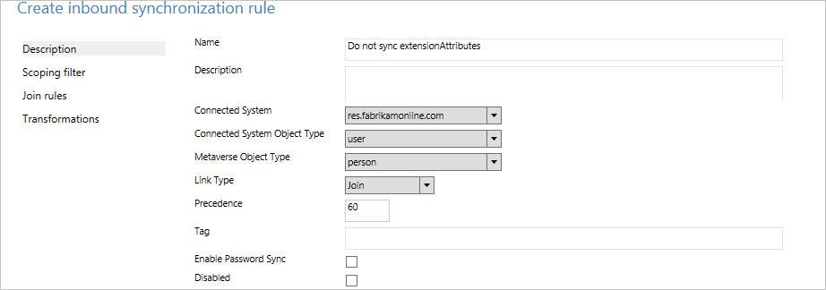
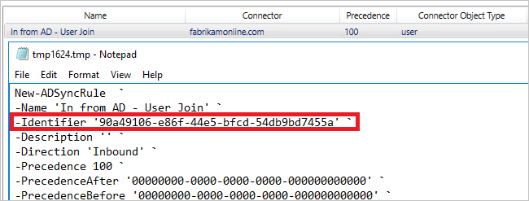
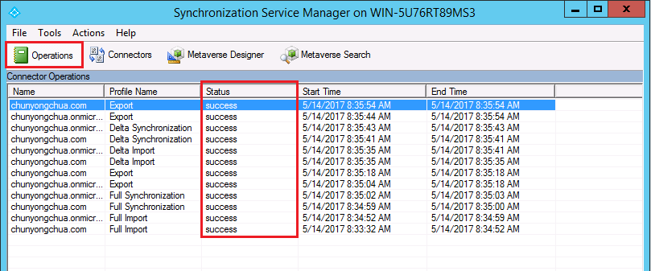
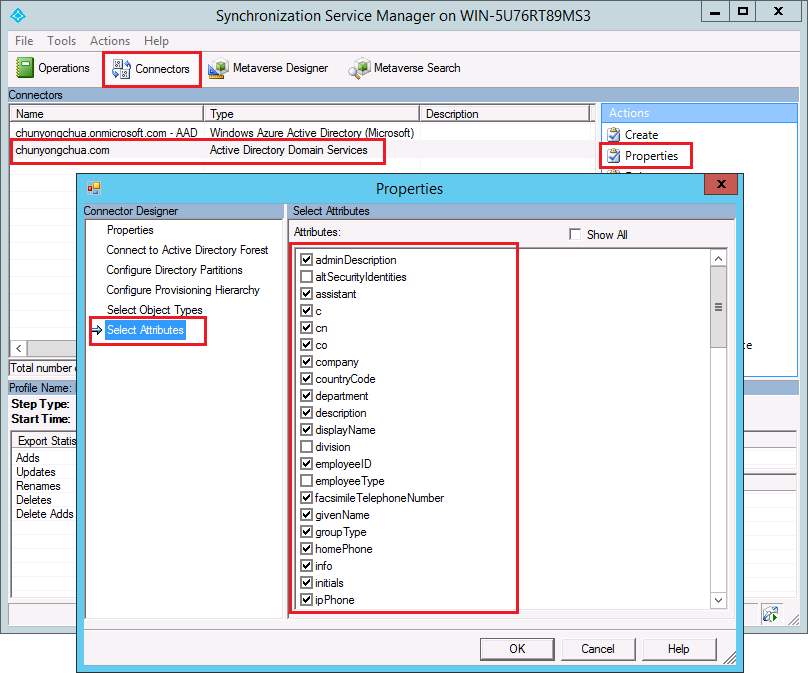
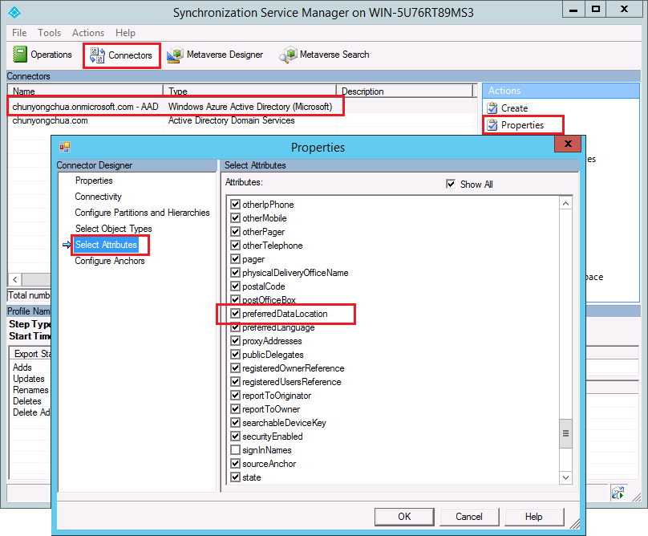
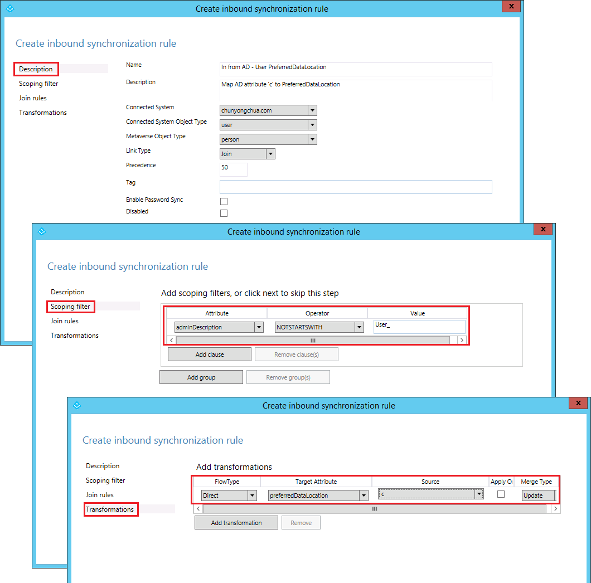
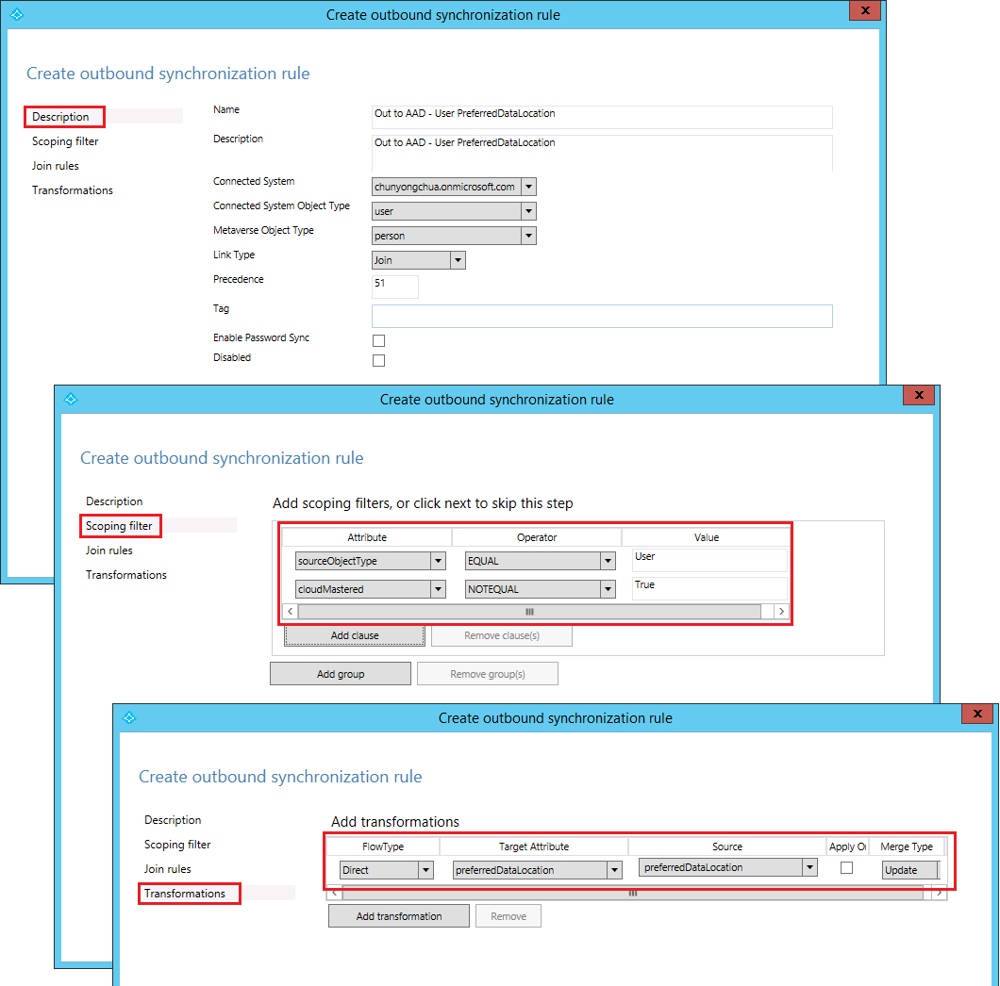

# Azure AD Connect sync: How to make a change to the default configuration
The purpose of this topic is to walk you through how to make changes to the default configuration in Azure AD Connect sync. It provides steps for some common scenarios. With this knowledge, you should be able to make some simple changes to your own configuration based on your own business rules.

## Synchronization Rules Editor
The Synchronization Rules Editor is used to see and change the default configuration. You can find it in the Start Menu under the **Azure AD Connect** group.  

When you open it, you see the default out-of-box rules.

### Navigating in the editor
The drop-downs at the top of the editor allow you to quickly find a particular rule. For example, if you want to see the rules where the attribute proxyAddresses is included, you would change the drop-downs to the following:  
  
To reset filtering and load a fresh configuration, press **F5** on the keyboard.

To the top right, you have a button **Add new rule**. This button is used to create your own custom rule.

At the bottom, you have buttons for acting on a selected sync rule. **Edit** and **Delete** do what you expect them to. **Export** produces a PowerShell script for recreating the sync rule. This procedure allows you to move a sync rule from one server to another.

## Create your first custom rule
The most common change is changes to the attribute flows. The data in your source directory might not be as in Azure AD. In the example in this section, you want to make sure the given name of a user is always in **Proper case**.

### Disable the scheduler
The [scheduler](active-directory-aadconnectsync-feature-scheduler.md) runs every 30 minutes by default. You want to make sure it is not starting while you are making changes and troubleshoot your new rules. To temporarily disable the scheduler, start PowerShell, and run `Set-ADSyncScheduler -SyncCycleEnabled $false`

  

### Create the rule
1. Click **Add new rule**.
2. On the **Description** page enter the following:  
     
   * Name: Give the rule a descriptive name.
   * Description: Some clarification so someone else can understand what the rule is for.
   * Connected system: The system the object can be found in. In this case, select the Active Directory Connector.
   * Connected System/Metaverse Object Type: Select **User** and **Person** respectively.
   * Link Type: Change this value to **Join**.
   * Precedence: Provide a value that is unique in the system. A lower numeric value indicates higher precedence.
   * Tag: Leave empty. Only out-of-box rules from Microsoft should have this box populated with a value.
3. On the **Scoping filter** page, enter **givenName ISNOTNULL**.  
     
   This section is used to define which objects the rule should apply to. If left empty, the rule would apply to all user objects. But that would include conference rooms, service accounts, and other non-people user objects.
4. On the **Join rules**, leave it empty.
5. On the **Transformations** page, change the FlowType to **Expression**. Select the Target Attribute **givenName**, and in Source enter `PCase([givenName])`.
     
   The sync engine is case-sensitive both on the function name and the name of the attribute. If you type something wrong, you see a warning when you add the rule. The editor allows you to save and continue, so you would have to reopen the rule and correct the rule.
6. Click **Add** to save the rule.

Your new custom rule should be visible with the other sync rules in the system.

### Verify the change
With this new change, you want to make sure it is working as expected and is not throwing any errors. Depending on the number of objects you have, there are two different ways to do this step.

1. Run a full sync on all objects
2. Run a preview and full sync on a single object

Start **Synchronization Service** from the start menu. The steps in this section are all in this tool.

1. **Full sync on all objects**  
   Select **Connectors** at the top. Identify the Connector you made a change to in the previous section, in this case the Active Directory Domain Services, and select it. Select **Run** from Actions and select **Full Synchronization** and **OK**.
     
   The objects are now updated in the metaverse. You now want to look at the object in the metaverse.
2. **Preview and full sync on a single object**  
   Select **Connectors** at the top. Identify the Connector you made a change to in the previous section, in this case the Active Directory Domain Services, and select it. Select **Search Connector Space**. Use scope to find an object you want to use to test the change. Select the object and click **Preview**. In the new screen, select **Commit Preview**.  
     
   The change is now committed to the metaverse.

**Look at the object in the metaverse**  
You now want to pick a few sample objects to make sure the value is expected and that the rule applied. Select **Metaverse Search** from the top. Add any filter you need to find the relevant objects. From the search result, open an object. Look at the attribute values and also verify in the **Sync Rules** column that the rule applied as expected.  
  

### Enable the scheduler
If everything is as expected, you can enable the scheduler again. From PowerShell, run `Set-ADSyncScheduler -SyncCycleEnabled $true`.

## Other common attribute flow changes
The previous section described how to make changes to an attribute flow. In this section, some additional examples are provided. The steps for how to create the sync rule is abbreviated, but you can find the full steps in the previous section.

### Use another attribute than the default
At Fabrikam, there is a forest where the local alphabet is used for given name, surname, and display name. The Latin character representation of these attributes can be found in the extension attributes. When building the global address list in Azure AD and Office 365, the organization wants these attributes to be used instead.

With a default configuration, an object from the local forest looks like this:  

To create a rule with other attribute flows, do the following:

* Start **Synchronization Rule Editor** from the start menu.
* With **Inbound** still selected to the left, click the button **Add new rule**.
* Give the rule a name and description. Select the on-premises Active Directory and the relevant object types. In **Link Type**, select **Join**. For precedence, pick a number that is not used by another rule. The out-of-box rules start with 100, so the value 50 can be used in this example.
  
* Leave scope empty (that is, should apply to all user objects in the forest).
* Leave join rules empty (that is, let the out-of-box rule handle any joins).
* In Transformations, create the following flows:  
  
* Click **Add** to save the rule.
* Go to **Synchronization Service Manager**. On **Connectors**, select the Connector where we added the rule. Select **Run**, and **Full Synchronization**. A Full Synchronization recalculates all objects using the current rules.

This is the result for the same object with this custom rule:  

### Length of attributes
String attributes are by default set to be indexable and the maximum length is 448 characters. If you are working with string attributes that might contain more, then make sure to include the following in the attribute flow:  
`attributeName` <- `Left([attributeName],448)`

### Changing the userPrincipalSuffix
The userPrincipalName attribute in Active Directory is not always known by the users and might not be suitable as the sign-in ID. The Azure AD Connect sync installation wizard allows picking a different attribute, for example mail. But in some cases the attribute must be calculated. For example, the company Contoso has two Azure AD directories, one for production and one for testing. They want the users in their test tenant to use another suffix in the sign-in ID.  
`userPrincipalName` <- `Word([userPrincipalName],1,"@") & "@contosotest.com"`

In this expression, take everything left of the first @-sign (Word) and concatenate with a fixed string.

### Convert a multi-value to a single-value
Some attributes in Active Directory are multi-valued in the schema even though they look single valued in Active Directory Users and Computers. An example is the description attribute.  
`description` <- `IIF(IsNullOrEmpty([description]),NULL,Left(Trim(Item([description],1)),448))`

In this expression in case the attribute has a value, take the first item (Item) in the attribute, remove leading and trailing spaces (Trim), and then keep the first 448 characters (Left) in the string.

### Do not flow an attribute
For background on the scenario for this section, see [Control the attribute flow process](active-directory-aadconnectsync-understanding-declarative-provisioning.md#control-the-attribute-flow-process).

There are two ways to not flow an attribute. The first is available in the installation wizard and allows you to [remove selected attributes](active-directory-aadconnect-get-started-custom.md#azure-ad-app-and-attribute-filtering). This option works if you have never synchronized the attribute before. However, if you have started to synchronize this attribute and later remove it with this feature, then the sync engine stops managing the attribute and the existing values are left in Azure AD.

If you want to remove the value of an attribute and make sure it does not flow in the future, you need create a custom rule instead.

At Fabrikam, we have realized that some of the attributes we synchronize to the cloud should not be there. We want to make sure these attributes are removed from Azure AD.  

* Create a new inbound Synchronization Rule and populate the description
  
* Create attribute flows of type **Expression** and with the source **AuthoritativeNull**. The literal **AuthoritativeNull** indicates that the value should be empty in the MV even if a lower precedence sync rule tries to populate the value.
  
* Save the Sync Rule. Start **Synchronization Service**, find the Connector, select **Run**, and **Full Synchronization**. This step recalculates all attribute flows.
* Verify that the intended changes are about to be exported by searching the connector space.
  

## Create rules with PowerShell
Using the sync rule editor works fine when you only have a few changes to make. If you need to make many changes, then PowerShell might be a better option. Some advanced features are only available with PowerShell.

### Get the PowerShell script for an out-of-box rule
To see the PowerShell script that created an out-of-box rule, select the rule in the sync rules editor and click **Export**. This action gives you the PowerShell script that created the rule.

### Advanced precedence
The out-of-box sync rules start with a precedence value of 100. If you have many forests and you need to make many custom changes, then 99 sync rules might not be enough.

You can instruct the Sync Engine that you want additional rules inserted before the out-of-box rules. To get this behavior, follow these steps:

1. Mark the first out-of-box sync rule (this rule is the **In from AD-User Join**) in the sync rule editor and select **Export**. Copy the SR Identifier value.  
  
2. Create the new sync rule. You can use the sync rule editor to create it. Export the rule to a PowerShell script.
3. In the property **PrecedenceBefore**, insert the identifier value from the out-of-box rule. Set the **Precedence** to **0**. Make sure the Identifier attribute is unique and you are not reusing a GUID from another rule. Also make sure that the **ImmutableTag** property is not set; this property should only be set for an out-of-box rule. Save the PowerShell script and run it. The result is that your custom rule is assigned the precedence value of 100 and all other out-of-box rules are incremented.  
  

You can have many custom sync rules using the same **PrecedenceBefore** value when needed.

## Enable synchronization of PreferredDataLocation
Azure AD Connect supports synchronization of the **PreferredDataLocation** attribute for **User** objects in version 1.1.524.0 and after. More specifically, following changes have been introduced:

* The schema of the object type **User** in the Azure AD Connector is extended to include PreferredDataLocation attribute, which is of type string and is single-valued.

* The schema of the object type **Person** in the Metaverse is extended to include PreferredDataLocation attribute, which is of type string and is single-valued.

By default, the PreferredDataLocation attribute is not enabled for synchronization because there is no corresponding PreferredDataLocation attribute in on-premises Active Directory. You must manually enable synchronization.

> [!IMPORTANT]
> Currently, Azure AD allows the PreferredDataLocation attribute on both synchronized User objects and cloud User objects to be directly configured using Azure AD PowerShell. Once you have enabled synchronization of the PreferredDataLocation attribute, you must stop using Azure AD PowerShell to configure the attribute on **synchronized User objects** as Azure AD Connect will override them based on the source attribute values in on-premises Active Directory.

> [!IMPORTANT]
> On September 1 2017, Azure AD will no longer allow the PreferredDataLocation attribute on **synchronized User objects** to be directly configured using Azure AD PowerShell. To configure PreferredLocation attribute on synchronized User objects, you must use Azure AD Connect only.

Before enabling synchronization of the PreferredDataLocation attribute, you must:

 * First, decide which on-premises Active Directory attribute to be used as the source attribute. It should be of type **string** and is **single-valued**.

 * If you have previously configured the PreferredDataLocation attribute on existing synchronized User objects in Azure AD using Azure AD PowerShell, you must **backport** the attribute values to the corresponding User objects in on-premises Active Directory.
 
    > [!IMPORTANT]
    > If you do not backport the attribute values to the corresponding User objects in on-premises Active Directory, Azure AD Connect will remove the existing attribute values in Azure AD when synchronization for the PreferredDataLocation attribute is enabled.

 * It is recommended you configure the source attribute on at least a couple of on-premises AD User objects now, which can be used for verification later.
 
The steps to enable synchronization of the PreferredDataLocation attribute can be summarized as:

1. Disable sync scheduler and verify there is no synchronization in progress

2. Add the source attribute to the on-premises AD Connector schema

3. Add PreferredDataLocation to the Azure AD Connector schema

4. Create an inbound synchronization rule to flow the attribute value from on-premises Active Directory

5. Create an outbound synchronization rule to flow the attribute value to Azure AD

6. Run Full Synchronization cycle

7. Enable sync scheduler

> [!NOTE]
> The rest of this section covers these steps in details. They are described in the context of an Azure AD deployment with single-forest topology and without custom synchronization rules. If you have multi-forest topology, custom synchronization rules configured or have a staging server, you need to adjust the steps accordingly.

### Step 1: Disable sync scheduler and verify there is no synchronization in progress
Ensure no synchronization takes place while you are in the middle of updating synchronization rules to avoid unintended changes being exported to Azure AD. To disable the built-in sync scheduler:

 1. Start PowerShell session on the Azure AD Connect server.

 2. Disable scheduled synchronization by running cmdlet: `Set-ADSyncScheduler -SyncCycleEnabled $false`
 
 3. Start the **Synchronization Service Manager** by going to START → Synchronization Service.
 
 4. Go to the **Operations** tab and confirm there is no operation whose status is *“in progress.”*

### Step 2: Add the source attribute to the on-premises AD Connector schema
Not all AD attributes are imported into the on-premises AD Connector Space. To add the source attribute to the list of the imported attributes:

 1. Go to the **Connectors** tab in the Synchronization Service Manager.
 
 2. Right-click on the **on-premises AD Connector** and select **Properties**.
 
 3. In the pop-up dialog, go to the **Select Attributes** tab.
 
 4. Make sure the source attribute is checked in the attribute list.
 
 5. Click **OK** to save.

### Step 3: Add PreferredDataLocation to the Azure AD Connector schema
By default, the PreferredDataLocation attribute is not imported into the Azure AD Connect Space. To add the PreferredDataLocation attribute to the list of imported attributes:

 1. Go to the **Connectors** tab in the Synchronization Service Manager.

 2. Right-click on the **Azure AD Connector** and select **Properties**.

 3. In the pop-up dialog, go to the **Select Attributes** tab.

 4. Make sure the PreferredDataLocation attribute is checked in the attribute list.

 5. Click **OK** to save.

### Step 4: Create an inbound synchronization rule to flow the attribute value from on-premises Active Directory
The inbound synchronization rule permits the attribute value to flow from the source attribute from on-premises Active Directory to the Metaverse:

1. Start the **Synchronization Rules Editor** by going to START → Synchronization Rules Editor.

2. Set the search filter **Direction** to be **Inbound**.

3. Click **Add new rule** button to create a new inbound rule.

4. Under the **Description** tab, provide the following configuration:
 
    | Attribute | Value | Details |
    | --- | --- | --- |
    | Name | *Provide a name* | For example, *“In from AD – User PreferredDataLocation”* |
    | Description | *Provide a description* |  |
    | Connected System | *Pick the on-premises AD connector* |  |
    | Connected System Object Type | **User** |  |
    | Metaverse Object Type | **Person** |  |
    | Link Type | **Join** |  |
    | Precedence | *Choose a number between 1 – 99* | 1 – 99 is reserved for custom sync rules. Do not pick a value that is used by another synchronization rule. |

5. Go to the **Scoping filter** tab and add a **single scoping filter group with the following clause**:
 
    | Attribute | Operator | Value |
    | --- | --- | --- |
    | adminDescription | NOTSTARTWITH | User\_ | 
 
    Scoping filter determines which on-premises AD objects this inbound synchronization rule is applied to. In this example, we use the same scoping filter used as *“In from AD – User Common”* OOB synchronization rule, which prevents the synchronization rule from being applied to User objects created through Azure AD User writeback feature. You may need to tweak the scoping filter according to your Azure AD Connect deployment.

6. Go to the **Transformation tab** and implement the following transformation rule:
 
    | Flow Type | Target Attribute | Source | Apply Once | Merge Type |
    | --- | --- | --- | --- | --- |
    | Direct | PreferredDataLocation | Pick the source attribute | Unchecked | Update |

7. Click **Add** to create the inbound rule.

### Step 5: Create an outbound synchronization rule to flow the attribute value to Azure AD
The outbound synchronization rule permits the attribute value to flow from the Metaverse to the PreferredDataLocation attribute in Azure AD:

1. Go to the **Synchronization Rules** Editor.

2. Set the search filter **Direction** to be **Outbound**.

3. Click **Add new rule** button.

4. Under the **Description** tab, provide the following configuration:

    | Attribute | Value | Details |
    | --- | --- | --- |
    | Name | *Provide a name* | For example, “Out to AAD – User PreferredDataLocation” |
    | Description | *Provide a description* |
    | Connected System | *Select the AAD connector* |
    | Connected System Object Type | User ||
    | Metaverse Object Type | **Person** ||
    | Link Type | **Join** ||
    | Precedence | *Choose a number between 1 – 99* | 1 – 99 is reserved for custom sync rules. YDo not pick a value that is used by another synchronization rule. |

5. Go to the **Scoping filter** tab and add a **single scoping filter group with two clauses**:
 
    | Attribute | Operator | Value |
    | --- | --- | --- |
    | sourceObjectType | EQUAL | User |
    | cloudMastered | NOTEQUAL | True |

    Scoping filter determines which Azure AD objects this outbound synchronization rule is applied to. In this example, we use the same scoping filter from “Out to AD – User Identity” OOB synchronization rule. It prevents the synchronization rule from being applied to User objects which are not synchronized from on-premises Active Directory. You may need to tweak the scoping filter according to your Azure AD Connect deployment.
    
6. Go to the **Transformation** tab and implement the following transformation rule:

    | Flow Type | Target Attribute | Source | Apply Once | Merge Type |
    | --- | --- | --- | --- | --- |
    | Direct | PreferredDataLocation | PreferredDataLocation | Unchecked | Update |

7. Close **Add** to create the outbound rule.

### Step 6: Run Full Synchronization cycle
In general, full synchronization cycle is required since we have added new attributes to both the AD and Azure AD Connector schema, and introduced custom synchronization rules. It is recommended that you verify the changes before exporting them to Azure AD. You can use the following steps to verify the changes while manually running the steps that make up a full synchronization cycle. 

1. Run **Full import** step on the **on-premises AD Connector**:

   1. Go to the **Operations** tab in the Synchronization Service Manager.

   2. Right-click on the **on-premises AD Connector** and select **Run...**

   3. In the pop-up dialog, select **Full Import** and click **OK**.
    
   4. Wait for operation to complete.

    > [!NOTE]
    > You can skip Full Import on the on-premises AD Connector if the source attribute is already included in the list of imported attributes. In other words, you did not have to make any change during [Step 2: Add the source attribute to the on-premises AD Connector schema](#step-2-add-the-source-attribute-to-the-on-premises-ad-connector-schema).

2. Run **Full import** step on the **Azure AD Connector**:

   1. Right-click on the **Azure AD Connector** and select **Run...**

   2. In the pop-up dialog, select **Full Import** and click **OK**.
   
   3. Wait for operation to complete.

3. Verify the synchronization rule changes on an existing User object:

The source attribute from on-premises Active Directory and PreferredDataLocation from Azure AD have been imported into the respective Connecter Space. Before proceeding with Full Synchronization step, it is recommended that you do a **Preview** on an existing User object in the on-premises AD Connector Space. The object you picked should have the source attribute populated. A successful **Preview** with the PreferredDataLocation populated in the Metaverse is a good indicator that you have configured the synchronization rules correctly. For information about how to do a **Preview**, refer to section [Verify the change](#verify-the-change).

4. Run **Full Synchronization** step on the **on-premises AD Connector**:

   1. Right-click on the **on-premises AD Connector** and select **Run...**
  
   2. In the pop-up dialog, select **Full Synchronization** and click **OK**.
   
   3. Wait for operation to complete.

5. Verify **Pending Exports** to Azure AD:

   1. Right-click on the **Azure AD Connector** and select **Search Connector Space**.

   2. In the Search Connector Space pop-up dialog:

      1. Set **Scope** to **Pending Export**.
      
      2. Check all three checkboxes, including **Add, Modify, and Delete**.
      
      3. Click the **Search** button to get the list of objects with changes to be exported. To examine the changes for a given object, double-click the object.
      
      4. Verify the changes are expected.

6. Run **Export** step on the **Azure AD Connector**
      
   1. Right-click the **Azure AD Connector** and select **Run...**
   
   2. In the Run Connector pop-up dialog, select **Export** and click **OK**.
   
   3. Wait for Export to Azure AD to complete.

> [!NOTE]
> You may notice that the steps do not include the Full Synchronization step and Export step on the Azure AD Connector. The steps are not required since the attribute values are flowing from on-premises Active Directory to Azure AD only.

### Step 7: Re-enable sync scheduler
Re-enable the built-in sync scheduler:

1. Start PowerShell session.

2. Re-enable scheduled synchronization by running cmdlet: `Set-ADSyncScheduler -SyncCycleEnabled $true`

## Next steps
* Read more about the configuration model in [Understanding Declarative Provisioning](active-directory-aadconnectsync-understanding-declarative-provisioning.md).
* Read more about the expression language in [Understanding Declarative Provisioning Expressions](active-directory-aadconnectsync-understanding-declarative-provisioning-expressions.md).

**Overview topics**

* [Azure AD Connect sync: Understand and customize synchronization](active-directory-aadconnectsync-whatis.md)
* [Integrating your on-premises identities with Azure Active Directory](active-directory-aadconnect.md)
