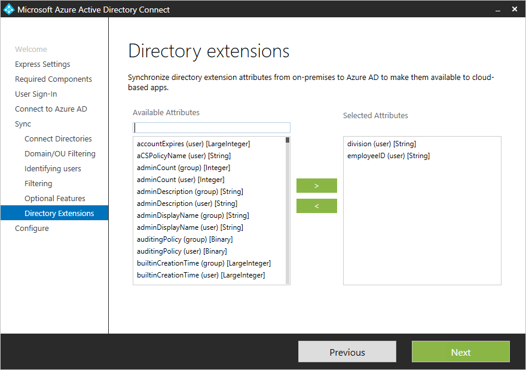

# Azure AD Connect sync: Directory extensions
Directory extensions allows you to extend the schema in Azure AD with your own attributes from on-premises Active Directory. This feature allows you to build LOB apps consuming attributes you continue to manage on-premises. These attributes can be consumed through [Azure AD Graph directory extensions](https://msdn.microsoft.com/Library/Azure/Ad/Graph/howto/azure-ad-graph-api-directory-schema-extensions) or [Microsoft Graph](https://graph.microsoft.io/). You can see the attributes available using [Azure AD Graph explorer](https://graphexplorer.azurewebsites.net/) and [Microsoft Graph explorer](https://developer.microsoft.com/en-us/graph/graph-explorer) respectively.

At present no Office 365 workload consumes these attributes.

You configure which additional attributes you want to synchronize in the custom settings path in the installation wizard.
  
The installation shows the following attributes, which are valid candidates:

* User and Group object types
* Single-valued attributes: String, Boolean, Integer, Binary
* Multi-valued attributes: String, Binary

>[!NOTE]
> While Azure AD Connect supports synchronizing multi-valued AD attributes to Azure AD as multi-valued directory extensions, there are currently no features in Azure AD that support the use of multi-valued directory extensions.

The list of attributes is read from the schema cache created during installation of Azure AD Connect. If you have extended the Active Directory schema with additional attributes, then the [schema must be refreshed](active-directory-aadconnectsync-installation-wizard.md#refresh-directory-schema) before these new attributes are visible.

An object in Azure AD can have up to 100 directory extensions attributes. The max length is 250 characters. If an attribute value is longer, then it is truncated by the sync engine.

During installation of Azure AD Connect, an application is registered where these attributes are available. You can see this application in the Azure portal.  

These attributes are now available through the **Azure AD Graph**:

We can query the Azure AD Graph through the Azure AD Graph explorer: [https://graphexplorer.azurewebsites.net/](https://graphexplorer.azurewebsites.net/)

Or through the **Microsoft Graph API**:

We can query the Microsoft Graph API through the Microsoft Graph explorer: [https://developer.microsoft.com/en-us/graph/graph-explorer#](https://developer.microsoft.com/en-us/graph/graph-explorer#)

There are some considerations when working with the Microsoft Graph explorer:
* You need to sign in with an Azure AD user that has the necessary permissions on the attributes you are trying to read
* You might need to click **modify permissions** in the left side of the explorer to ensure you have the permissions needed to read the attribute. If you change permissions you will be asked for consent. As an example if you log on using a Global Administrator you still need to check the permission **User.Read.All** so that you can read user properties for **other** accounts.
* You need to explicitely ask for the attribute to be returned. This can be done by explicitely selecting the attributes like this:
https://graph.microsoft.com/beta/users/abbie.spencer@fabrikamonline.com?$select=extension_9d98ed114c4840d298fad781915f27e4_employeeID,extension_9d98ed114c4840d298fad781915f27e4_division

The attributes are prefixed with extension\_{AppClientId}\_. The AppClientId has the same value for all attributes in your Azure AD tenant.

## Next steps
Learn more about the [Azure AD Connect sync](active-directory-aadconnectsync-whatis.md) configuration.

Learn more about [Integrating your on-premises identities with Azure Active Directory](active-directory-aadconnect.md).
