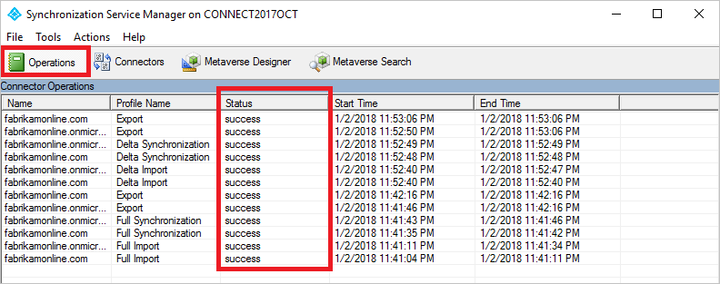

# Azure AD Connect sync: Configure preferred data location for Office 365 resources
The purpose of this topic is to walk you through how to configure PreferredDataLocation in Azure AD Connect Sync. When a customer uses Multi-Geo capabilities in Office 365, this attribute is used to designate the geo-location of the user’s Office 365 data. The terms **region** and **Geo** are used interchangeable.

> [!IMPORTANT]
> Multi-Geo is currently in preview. If you would like to join the preview program, please contact your Microsoft representative.
>
>

## Enable synchronization of PreferredDataLocation
By default, Office 365 resources for your users are located in the same geo as your Azure AD tenant. For example, if your tenant is located in North America then the users Exchange mailboxes are also located in North America. For a multi-national organization this might not be optimal. By setting the attribute preferredDataLocation the user's geo can be defined.

By settings this attribute, you can have the user's Office 365 resources, such as the mailbox and OneDrive, in the same geo as the user and still have one tenant for your entire organization.

> [!IMPORTANT]
> To be eligible for Multi-Geo, you must have at least 5000 seats in your Office 365 subscription
>
>

A list of all Geos for Office 365 can be found in [where is your data located](https://aka.ms/datamaps).

The geos in Office 365 available for Multi-Geo are:

| Geo | preferredDataLocation value |
| --- | --- |
| Asia Pacific | APC |
| Australia | AUS |
| Canada | CAN |
| European Union | EUR |
| India | IND |
| Japan | JPN |
| South Korea | KOR |
| United Kingdom | GBR |
| United States | NAM |

* If a geo is not listed in this table, for example South America, then it cannot be used for Multi-Geo.
* India and South Korea geos are only available to customers with billing addresses and licenses purchased in those geos.
* Not all Office 365 workloads supports the use of setting a user's geo.

Azure AD Connect supports synchronization of the **PreferredDataLocation** attribute for **User** objects in version 1.1.524.0 and after. More specifically, following changes have been introduced:

* The schema of the object type **User** in the Azure AD Connector is extended to include PreferredDataLocation attribute, which is of type single-valued string.
* The schema of the object type **Person** in the Metaverse is extended to include PreferredDataLocation attribute, which is of type string and is single-valued.

By default, the PreferredDataLocation attribute is not enabled for synchronization. This feature is intended for larger organizations and not everyone would benefit from it. You must also identify an attribute to hold the Office 365 geo for your users since there is no PreferredDataLocation attribute in on-premises Active Directory. This is going to be different for each organization.

> [!IMPORTANT]
> Currently, Azure AD allows the PreferredDataLocation attribute on both synchronized User objects and cloud User objects to be directly configured using Azure AD PowerShell. Once you have enabled synchronization of the PreferredDataLocation attribute, you must stop using Azure AD PowerShell to configure the attribute on **synchronized User objects** as Azure AD Connect will override them based on the source attribute values in on-premises Active Directory.

> [!IMPORTANT]
> Since September 1, 2017, Azure AD no longer allows the PreferredDataLocation attribute on **synchronized User objects** to be directly configured using Azure AD PowerShell. To configure PreferredLocation attribute on synchronized User objects, you must use Azure AD Connect.

Before enabling synchronization of the PreferredDataLocation attribute, you must:

* First, decide which on-premises Active Directory attribute to be used as the source attribute. It should be of type **single-valued string**. In the steps below one of the extensionAttributes is used.
* If you have previously configured the PreferredDataLocation attribute on existing synchronized User objects in Azure AD using Azure AD PowerShell, you must **backport** the attribute values to the corresponding User objects in on-premises Active Directory.

    > [!IMPORTANT]
    > If you do not backport the attribute values to the corresponding User objects in on-premises Active Directory, Azure AD Connect will remove the existing attribute values in Azure AD when synchronization for the PreferredDataLocation attribute is enabled.

* It is recommended you configure the source attribute on at least a couple of on-premises AD User objects now, which can be used for verification later.

The steps to enable synchronization of the PreferredDataLocation attribute can be summarized as:

1. Disable sync scheduler and verify there is no synchronization in progress
2. Add the source attribute to the on-premises ADDS connector schema
3. Add PreferredDataLocation to the Azure AD connector schema
4. Create an inbound synchronization rule to flow the attribute value from on-premises Active Directory
5. Create an outbound synchronization rule to flow the attribute value to Azure AD
6. Run Full Synchronization cycle
7. Enable sync scheduler
8. Verify the result

> [!NOTE]
> The rest of this section covers these steps in details. They are described in the context of an Azure AD deployment with single-forest topology and without custom synchronization rules. If you have a multi-forest topology, custom synchronization rules configured or have a staging server, you need to adjust the steps accordingly.

## Step 1: Disable sync scheduler and verify there is no synchronization in progress
Ensure no synchronization takes place while you are in the middle of updating synchronization rules to avoid unintended changes being exported to Azure AD. To disable the built-in sync scheduler:

1. Start a PowerShell session on the Azure AD Connect server.
2. Disable scheduled synchronization by running the cmdlet: `Set-ADSyncScheduler -SyncCycleEnabled $false`.
3. Start the **Synchronization Service Manager** by going to **START** > **Synchronization Service**.
4. Go to the **Operations** tab and confirm there is no operation with the status *in progress*.

## Step 2: Add the source attribute to the on-premises ADDS connector schema
Not all AD attributes are imported into the on-premises AD Connector Space. If you have selected to use an attribute not synchronized by default, then you need to import it. To add the source attribute to the list of the imported attributes:

1. Go to the **Connectors** tab in the Synchronization Service Manager.
2. Right-click the **on-premises AD Connector** and select **Properties**.
3. In the pop-up dialog, go to the **Select Attributes** tab.
4. Make sure the source attribute you selected to use is checked in the attribute list. If you do not see your attribute, then click the "Show All" checkbox.
5. Click **OK** to save.

## Step 3: Add PreferredDataLocation to the Azure AD connector schema
By default, the PreferredDataLocation attribute is not imported into the Azure AD connector space. To add the PreferredDataLocation attribute to the list of imported attributes:

1. Go to the **Connectors** tab in the Synchronization Service Manager.
2. Right-click the **Azure AD connector** and select **Properties**.
3. In the pop-up dialog, go to the **Select Attributes** tab.
4. Select the preferredDataLocation attribute in the attribute list.
5. Click **OK** to save.

## Step 4: Create an inbound synchronization rule to flow the attribute value from on-premises Active Directory
The inbound synchronization rule permits the attribute value to flow from the source attribute from on-premises Active Directory to the Metaverse:

1. Start the **Synchronization Rules Editor** by going to **START** > **Synchronization Rules Editor**.
2. Set the search filter **Direction** to be **Inbound**.
3. Click **Add new rule** button to create a new inbound rule.
4. Under the **Description** tab, provide the following configuration:

    | Attribute | Value | Details |
    | --- | --- | --- |
    | Name | *Provide a name* | For example, *“In from AD – User PreferredDataLocation”* |
    | Description | *Provide a custom description* |  |
    | Connected System | *Pick the on-premises AD connector* |  |
    | Connected System Object Type | **User** |  |
    | Metaverse Object Type | **Person** |  |
    | Link Type | **Join** |  |
    | Precedence | *Choose a number between 1 – 99* | 1 – 99 is reserved for custom sync rules. Do not pick a value that is used by another synchronization rule. |

5. Keep the **Scoping filter** empty to include all objects. You may need to tweak the scoping filter according to your Azure AD Connect deployment.
6. Go to the **Transformation tab** and implement the following transformation rule:

    | Flow Type | Target Attribute | Source | Apply Once | Merge Type |
    | --- | --- | --- | --- | --- |
    |Direct | PreferredDataLocation | Pick the source attribute | Unchecked | Update |

7. Click **Add** to create the inbound rule.

## Step 5: Create an outbound synchronization rule to flow the attribute value to Azure AD
The outbound synchronization rule permits the attribute value to flow from the Metaverse to the PreferredDataLocation attribute in Azure AD:

1. Go to the **Synchronization Rules** Editor.
2. Set the search filter **Direction** to be **Outbound**.
3. Click **Add new rule** button.
4. Under the **Description** tab, provide the following configuration:

    | Attribute | Value | Details |
    | ----- | ------ | --- |
    | Name | *Provide a name* | For example, “Out to AAD – User PreferredDataLocation” |
    | Description | *Provide a description* ||
    | Connected System | *Select the AAD connector* ||
    | Connected System Object Type | User ||
    | Metaverse Object Type | **Person** ||
    | Link Type | **Join** ||
    | Precedence | *Choose a number between 1 – 99* | 1 – 99 is reserved for custom sync rules. Do not pick a value that is used by another synchronization rule. |

5. Go to the **Scoping filter** tab and add a **single scoping filter group with two clauses**:

    | Attribute | Operator | Value |
    | --- | --- | --- |
    | sourceObjectType | EQUAL | User |
    | cloudMastered | NOTEQUAL | True |

    Scoping filter determines which Azure AD objects this outbound synchronization rule is applied to. In this example, we use the same scoping filter from “Out to AD – User Identity” OOB synchronization rule. It prevents the synchronization rule from being applied to User objects which are not synchronized from on-premises Active Directory. You may need to tweak the scoping filter according to your Azure AD Connect deployment.

6. Go to the **Transformation** tab and implement the following transformation rule:

    | Flow Type | Target Attribute | Source | Apply Once | Merge Type |
    | --- | --- | --- | --- | --- |
    | Direct | PreferredDataLocation | PreferredDataLocation | Unchecked | Update |

7. Close **Add** to create the outbound rule.

## Step 6: Run Full Synchronization cycle
In general, full synchronization cycle is required since we have added new attributes to both the AD and Azure AD Connector schema, and introduced custom synchronization rules. It is recommended that you verify the changes before exporting them to Azure AD. You can use the following steps to verify the changes while manually running the steps that make up a full synchronization cycle.

1. Run **Full import** step on the **on-premises AD Connector**:

   1. Go to the **Operations** tab in the Synchronization Service Manager.
   2. Right-click the **on-premises AD Connector** and select **Run...**.
   3. In the pop-up dialog, select **Full Import** and click **OK**.
   4. Wait for operation to complete.

    > [!NOTE]
    > You can skip Full Import on the on-premises AD Connector if the source attribute is already included in the list of imported attributes. In other words, you did not have to make any change during [Step 2: Add the source attribute to the on-premises AD Connector schema](#step-2-add-the-source-attribute-to-the-on-premises-adds-connector-schema).

2. Run **Full import** step on the **Azure AD Connector**:

   1. Right-click the **Azure AD Connector** and select **Run...**
   2. In the pop-up dialog, select **Full Import** and click **OK**.
   3. Wait for operation to complete.

3. Verify the synchronization rule changes on an existing User object:

The source attribute from on-premises Active Directory and PreferredDataLocation from Azure AD have been imported into the respective connector space. Before proceeding with the Full Synchronization step, it is recommended that you do a **Preview** on an existing User object in the on-premises AD connector space. The object you picked should have the source attribute populated. A successful **Preview** with the PreferredDataLocation populated in the Metaverse is a good indicator that you have configured the synchronization rules correctly. For information about how to do a **Preview**, refer to section [Verify the change](active-directory-aadconnectsync-change-the-configuration.md#verify-the-change).

4. Run **Full Synchronization** step on the **on-premises AD Connector**:

   1. Right-click the **on-premises AD Connector** and select **Run...**.
   2. In the pop-up dialog, select **Full Synchronization** and click **OK**.
   3. Wait for operation to complete.

5. Verify **Pending Exports** to Azure AD:

   1. Right-click the **Azure AD Connector** and select **Search Connector Space**.
   2. In the Search Connector Space pop-up dialog:

      1. Set **Scope** to **Pending Export**.
      2. Check all three checkboxes, including **Add, Modify, and Delete**.
      3. Click the **Search** button to get the list of objects with changes to be exported. To examine the changes for a given object, double-click the object.
      4. Verify the changes are expected.

6. Run **Export** step on the **Azure AD Connector**

   1. Right-click the **Azure AD Connector** and select **Run...**.
   2. In the Run Connector pop-up dialog, select **Export** and click **OK**.
   3. Wait for Export to Azure AD to complete.

> [!NOTE]
> You may notice that the steps do not include the Full Synchronization step on the Azure AD connector and Export on the AD connector. The steps are not required since the attribute values are flowing from on-premises Active Directory to Azure AD only.

## Step 7: Re-enable sync scheduler
Re-enable the built-in sync scheduler:

1. Start PowerShell session.
2. Re-enable scheduled synchronization by running cmdlet: `Set-ADSyncScheduler -SyncCycleEnabled $true`

## Step 8: Verify the result
It is now time to verify the configuration and enable it for your users.

1. Add the geo to the selected attribute on a user. The list of available geo can be found in [this table](#enable-synchronization-of-preferreddatalocation).  

2. Wait for the attribute to be synchronized to Azure AD.
3. Using Exchange Online PowerShell, verify that the mailbox region has been set correctly.  
  
Assuming your tenant has been marked to be able to use this feature, the mailbox is moved to the correct geo. This can be verified by looking at the server name where the mailbox is located.
4. To verify that this setting has been effective over many mailboxes, use the script in the [Technet gallery](https://gallery.technet.microsoft.com/office/PowerShell-Script-to-a6bbfc2e). This script also has a list of all Office 365 datacenters server prefixes and which geo it is located in. It can be used as a reference in the previous step to verify the location of the mailbox.

## Next steps

**Learn more about Multi-Geo in Office 365:**

* Multi-Geo sessions at Ignite: https://aka.ms/MultiGeoIgnite
* Multi-Geo in OneDrive: https://aka.ms/OneDriveMultiGeo
* Multi-Geo in SharePoint Online: https://aka.ms/SharePointMultiGeo

**Learn more about the configuration model in the sync engine:**

* Read more about the configuration model in [Understanding Declarative Provisioning](active-directory-aadconnectsync-understanding-declarative-provisioning.md).
* Read more about the expression language in [Understanding Declarative Provisioning Expressions](active-directory-aadconnectsync-understanding-declarative-provisioning-expressions.md).

**Overview topics**

* [Azure AD Connect sync: Understand and customize synchronization](active-directory-aadconnectsync-whatis.md)
* [Integrating your on-premises identities with Azure Active Directory](active-directory-aadconnect.md)
