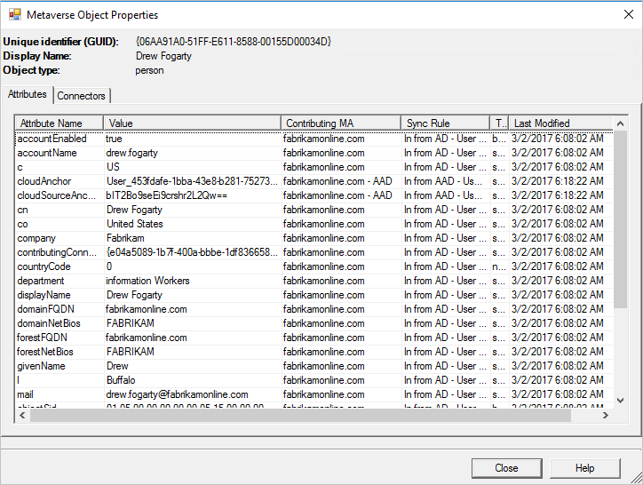
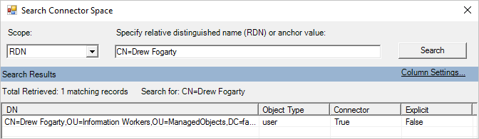
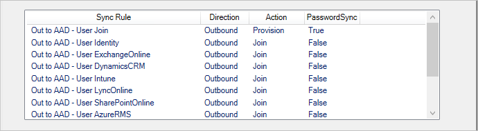
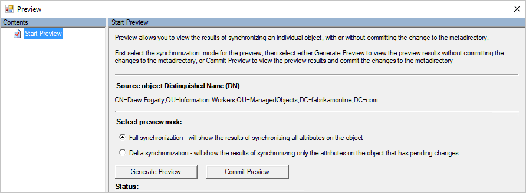
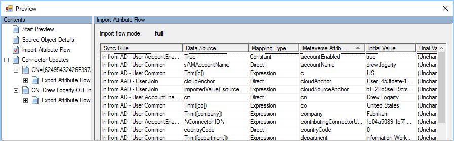

# Troubleshoot an object that is not synchronizing to Azure AD
If an object is not synchronizing as expected to Azure AD, then it can be because of an [error](active-directory-aadconnect-troubleshoot-sync-errors.md) or because of data on the object. This topic is for troubleshooting the latter when you do not have an error, but an object is still not synchronizing. These procedures can also be used when the data is not as expected.

When you are troubleshooting a problem with data, follow an object from the source connector space, to the metaverse, and to the target connector space is a key procedure to understand why data does not have the expected values.

You can start either from the [metaverse](#metaverse-object-properties) or from the [connector space](#connector-space-object-properties) when you are troubleshooting.

Start [Synchronization Service Manager](active-directory-aadconnectsync-service-manager-ui.md) before you start these steps.

## Metaverse Object Properties

### Search for an object in the MV
In **Synchronization Service Manager** click **Metaverse Search**. Create a query you know finds the user. You can search for common attributes, such as accountName (sAMAccountName) and userPrincipalName. For more information, see [Metaverse search](active-directory-aadconnectsync-service-manager-ui-mvsearch.md).
  

In the **Search Results** window, click the object.

If you did not find the object, then it has not yet reached the metaverse. Continue to search for the object in the Active Directory [connector space](#connector-space-object-properties).

### MV Attributes
On the attributes tab, you can see the values and which Connector contributed it.  
  

If an object is not synchronizing, then look at the following attributes in the metaverse:
- Is the attribute **cloudFiltered** present and set to **true**? If it is, then it has been filtered according to the steps in [attribute based filtering](active-directory-aadconnectsync-configure-filtering.md#attribute-based-filtering).
- Is the attribute **sourceAnchor** present? If not, do you have an account-resource forest topology? If an object is identified as a linked mailbox (the attribute **msExchRecipientTypeDetails** has the value 2), then the sourceAnchor can only be contributed by the forest with an enabled Active Directory account.

### MV Connectors
The Connectors tab shows all connector spaces that have a representation of the object.  
  
You should have a connector to:

- Each Active Directory forest the user is represented in. This representation can include foreignSecurityPrincipals and Contact objects.
- A connector in Azure AD.

If you are missing the connector to Azure AD, then read [MV attributes](#MV-attributes) to verify the criteria for being provisioned to Azure AD.

This tab also allows you to navigate to the [connector space object](#connector-space-object-properties). Select a row and click **Properties**.

## Connector Space Object Properties
### Search for an object in the CS

In **Synchronization Service Manager**, click **Connectors**, select the Connector, and **Search Connector Space**.

In **Scope**, select **RDN** (when you want to search on the CN attribute) or **DN or anchor** (when you want to search on the distinguishedName attribute).  
  

If you do not find the object you are looking for, then it might have been filtered with [domain-based filtering](active-directory-aadconnectsync-configure-filtering.md#domain-based-filtering) or [OU-based filtering](active-directory-aadconnectsync-configure-filtering.md#organizational-unitbased-filtering).

Another useful search is to select the Azure AD Connector, in **Scope** select **Pending Import**, and select the **Add** checkbox. This search gives you all synchronized objects in Azure AD that cannot be associated with an on-premises object.  
  
Those objects have been created by another sync engine or a sync engine with a different filtering configuration. This view is a list of **orphan** objects no longer managed. You should review this list and consider removing these objects using the [Azure AD PowerShell](http://aka.ms/aadposh) cmdlets.

### CS Import
When you open a cs object, there are several tabs at the top. The **Import** tab shows the data that is staged after an import.  
    
The **Old Value** shows what currently is stored in the system and the **New Value** what has been received from the source system and has not been applied yet. If there is an error, then changes are not processed.

**Error**  
  
The **Synchronization error** tab is only visible if there is a problem with the object. For more information, see [troubleshoot synchronization errors](active-directory-aadconnectsync-service-manager-ui-operations.md#troubleshoot-errors-in-operations-tab).

### CS Lineage
The lineage tab shows how the connector space object is related to the metaverse object. You can see when the Connector last imported a change from the connected system and which rules applied to populate data in the metaverse.  
  
In the **Action** column, you can see there is one **Inbound** sync rule with the action **Provision**. That indicates that as long as this connector space object is present, the metaverse object remains. If the list of sync rules instead shows a sync rule with direction **Outbound** and **Provision**, it indicates that this object is deleted when the metaverse object is deleted.  
  
You can also see in the **PasswordSync** column that the inbound connector space can contribute changes to the password since one sync rule has the value **True**. This password is then sent to Azure AD through the outbound rule.

From the lineage tab, you can get to the metaverse by clicking [Metaverse Object Properties](#metaverse-object-properties).

At the bottom of all tabs are two buttons: **Preview** and **Log**.

### Preview
The preview page is used to synchronize one single object. It is useful if you are troubleshooting some customer sync rules and want to see the effect of a change on a single object. You can select between **Full Sync** and **Delta sync**. You can also select between **Generate Preview**, which only keeps the change in memory, and **Commit Preview**, which stages all changes to target connector spaces.  
  
You can inspect the object and which rule applied for a particular attribute flow.  

**Log**  
The Log page is used to see the password sync status and history. For more information, see [Troubleshoot password synchronization](active-directory-aadconnectsync-troubleshoot-password-synchronization.md).

## Next steps
Learn more about the [Azure AD Connect sync](active-directory-aadconnectsync-whatis.md) configuration.

Learn more about [Integrating your on-premises identities with Azure Active Directory](active-directory-aadconnect.md).
