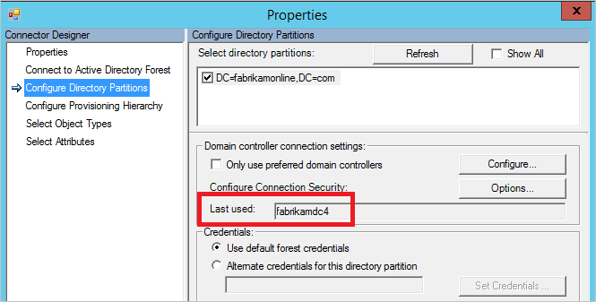

# Troubleshoot password synchronization with Azure AD Connect sync
This topic provides steps for how to troubleshoot issues with password synchronization. If passwords are not synchronizing as expected, it can either be for a subset of users or for all users.

* If you have an issue where no passwords are synchronized, see [Troubleshoot issues where no passwords are synchronized](#no-passwords-are-synchronized).
* If you have an issue with individual objects, then see [Troubleshoot one object that is not synchronizing passwords](#one-object-is-not-synchronizing-passwords).

## No passwords are synchronized
Follow these steps to figure out why no passwords are synchronized:

1. Is the Connect server in [staging mode](active-directory-aadconnectsync-operations.md#staging-mode)? A server in staging mode does not synchronize any passwords.
2. Run the script in the section [Get the status of password sync settings](#get-the-status-of-password-sync-settings). It gives you an overview of the password sync configuration.  
  
3. If the feature is not enabled in Azure AD or if the sync channel status is not enabled, then run the Connect installation wizard. Select **Customize synchronization options** and unselect password sync. This change temporarily disables the feature. Then run the wizard again and re-enable password sync. Run the script again to verify that the configuration is correct.
4. Look in the eventlog for errors. Look for the following events, which would indicate a problem:
    1. Source: "Directory synchronization" ID: 0, 611, 652, 655
    2. Source: "ADSync" ID: 6xxx
    If you see these, you have a connectivity problem. See [Connectivity problem](#connectivity problem)
5. If you see no heartbeat or if nothing else worked, then run [Trigger a full sync of all passwords](#trigger-a-full-sync-of-all-passwords of all passwords). You should only run this script once.
6. Read the section [Troubleshoot one object that is not synchronizing passwords](#one-object-is-not-synchronizing-passwords).
7. You can also enable [verbose logging](#verbose-logging) to get more information about password sync.

### Connectivity problem

1. Do you have connectivity with Azure AD.
2. Does the account have required permissions to read the password hashes in all domains? If you installed Connect using Express settings, the permissions should already be correct. If you used custom install, you need to set the permissions manually.
    1. To find the account used by the Active Directory Connector, start **Synchronization Service Manager**. Go to **Connectors** and find the on-premises Active Directory forest you are troubleshooting. Select the Connector and click **Properties**. Go to **Connect to Active Directory Forest**.  
      
    Take a note of the username and the domain the account is located in.
    2. Start **Active Directory Users and Computers**. Verify that the account you found in the previous steps have the follow permissions set at the root of all domains in your forest:
        * Replicate Directory Changes
        * Replicate Directory Changes All
3. Verify that the domain controller used by Azure AD Connect is reachable. To find which domain controller Connect is using, go back to **Synchronization Service Manager** and **Configure Directory Partition**. Find **Last used** on the page.  
      
    Make sure this Domain Controller is appropriate and is reachable. Fix any DNS or networking issues. Connect depends on Windows to find the best Domain Controller.
4. Is the checkbox **Only use preferred domain controller** selected? If it is, click **Configure** and make sure the list of Domain Controllers are appropriate. The checkbox is by default unselected, which indicates that Windows provides the best Domain Controller to use.
5. If the script shows that there is no heartbeat, then run the script in [Trigger a full sync of all passwords](#trigger-a-full-sync-of-all-passwords).

### Enable verbose logging
The following steps enable verbose debug tracing for password synchronization.

1. Start a cmd prompt. Run `NET STOP ADSync`.
2. Create a folder `C:\Temp`
3. In the file **c:\Program Files\Microsoft Azure AD Sync\bin\miiserver.exe.config** add the following to the section `<system.diagnostics>`:
```
<source name="passwordSync" switchValue="Verbose">  
    <listeners>  
        <add name="passwordSyncTraceListener"  
            type="System.Diagnostics.TextWriterTraceListener"  
            initializeData="C:\Temp\passwordSyncVerboseTrace.log"  
            traceOutputOptions="DateTime" />  
        <remove name="Default" />  
    </listeners>  
</source>
```
4. From the cmd prompt, run `NET START ADSync`.
5. Run your test, for example set a password on an object in Active Directory. Wait for 5-10 minutes (since password synchronization occurs every 120 seconds).
6. Read the created verbose trace.
7. Revert the changes you made in the previous steps.

## One object is not synchronizing passwords
You can easily troubleshoot password synchronization issues by reviewing the status of an object.

1. Start in **Active Directory Users and Computers**. Find the user and verify that **User must change password at next logon** is unselected.  
  
If it is selected, then ask the user to sign in and change the password. Temporary passwords are not synchronized to Azure AD.
2. If it looks correct in Active Directory, then the next step is to follow the user in the sync engine. By following the user from on-premises Active Directory to Azure AD, you can see if there is a descriptive error on the object.
    1. Start the **[Synchronization Service Manager](active-directory-aadconnectsync-service-manager-ui.md)**.
    2. Click **Connectors**.
    3. Select the **Active Directory Connector** the user is located in.
    4. Select **Search Connector Space**.
    5. Locate the user you are looking for and click **Properties** to see all attributes. If the user is not in the search result, then verify your [filtering rules](active-directory-aadconnectsync-configure-filtering.md) and make sure you run [Apply and verify changes](active-directory-aadconnectsync-configure-filtering.md#apply-and-verify-changes) for the user to appear in Connect.
    6. To see the password sync details of the object for the past week, click **Log...**.  
      
    If the object log is empty, then Azure AD Connect has not been able to read the password hash from Active Directory. Continue your troubleshooting with [Connectivity Errors](#connectivity-errors). If you see any other value than **success**, then refer to the table in [Password sync log](#password-sync-log).
    7. Select the **lineage** tab and make sure that at least one Sync Rule shows **Password Sync** as **True**. In the default configuration, the name of the Sync Rule is **In from AD - User AccountEnabled**.  
      
    8. Click **Metaverse Object Properties**. You see a list of attributes in the user.  
      
    Verify that there is no attribute **cloudFiltered** present. Make sure that the domain attributes (domainFQDN and domainNetBios) have the expected values.
    9. Click the tab **Connectors**. Make sure you see connectors to both your on-premises AD and to Azure AD.
      
    10. Select the row representing Azure AD and click **Properties**. Click the tab **Lineage**. The connector space object should have an outbound rule with **Password Sync** set to **True**. In the default configuration, the name of the sync rule is **Out to AAD - User Join**.  
      

### Password sync log
The status column can have the following values:

| Status | Description |
| --- | --- |
| Success |Password has been successfully synchronized. |
| FilteredByTarget |Password is set to **User must change password at next logon**. Password has not been synchronized. |
| NoTargetConnection |No object in the metaverse or in the Azure AD connector space. |
| SourceConnectorNotPresent |No object found in the on-premises Active Directory connector space. |
| TargetNotExportedToDirectory |The object in the Azure AD connector space has not yet been exported. |
| MigratedCheckDetailsForMoreInfo |Log entry was created before build 1.0.9125.0 and is shown in its legacy state. |

## Scripts to help troubleshooting

### Get the status of password sync settings
```
Import-Module ADSync
$connectors = Get-ADSyncConnector
$aadConnectors = $connectors | Where-Object {$_.SubType -eq "Windows Azure Active Directory (Microsoft)"}
$adConnectors = $connectors | Where-Object {$_.ConnectorTypeName -eq "AD"}
if ($aadConnectors -ne $null -and $adConnectors -ne $null)
{
    if ($aadConnectors.Count -eq 1)
    {
        $features = Get-ADSyncAADCompanyFeature -ConnectorName $aadConnectors[0].Name
        Write-Host
        Write-Host "Password sync feature enabled in your Azure AD directory: "  $features.PasswordHashSync
        foreach ($adConnector in $adConnectors)
        {
            Write-Host
            Write-Host "Password sync channel status BEGIN ------------------------------------------------------- "
            Write-Host
            Get-ADSyncAADPasswordSyncConfiguration -SourceConnector $adConnector.Name
            Write-Host
            $pingEvents =
                Get-EventLog -LogName "Application" -Source "Directory Synchronization" -InstanceId 654  -After (Get-Date).AddHours(-3) |
                    Where-Object { $_.Message.ToUpperInvariant().Contains($adConnector.Identifier.ToString("D").ToUpperInvariant()) } |
                    Sort-Object { $_.Time } -Descending
            if ($pingEvents -ne $null)
            {
                Write-Host "Latest heart beat event (within last 3 hours). Time " $pingEvents[0].TimeWritten
            }
            else
            {
                Write-Warning "No ping event found within last 3 hours."
            }
            Write-Host
            Write-Host "Password sync channel status END ------------------------------------------------------- "
            Write-Host
        }
    }
    else
    {
        Write-Warning "More than one Azure AD Connectors found. Please update the script to use the appropriate Connector."
    }
}
Write-Host
if ($aadConnectors -eq $null)
{
    Write-Warning "No Azure AD Connector was found."
}
if ($adConnectors -eq $null)
{
    Write-Warning "No AD DS Connector was found."
}
Write-Host
```

#### Trigger a full sync of all passwords
You can trigger a full sync of all passwords using the following script:

```
$adConnector = "<CASE SENSITIVE AD CONNECTOR NAME>"
$aadConnector = "<CASE SENSITIVE AAD CONNECTOR NAME>"
Import-Module adsync
$c = Get-ADSyncConnector -Name $adConnector
$p = New-Object Microsoft.IdentityManagement.PowerShell.ObjectModel.ConfigurationParameter "Microsoft.Synchronize.ForceFullPasswordSync", String, ConnectorGlobal, $null, $null, $null
$p.Value = 1
$c.GlobalParameters.Remove($p.Name)
$c.GlobalParameters.Add($p)
$c = Add-ADSyncConnector -Connector $c
Set-ADSyncAADPasswordSyncConfiguration -SourceConnector $adConnector -TargetConnector $aadConnector -Enable $false
Set-ADSyncAADPasswordSyncConfiguration -SourceConnector $adConnector -TargetConnector $aadConnector -Enable $true
```
You should only run this script once. If you need to run it more than once, then something else is the problem.

## Next steps
* [Implementing password synchronization with Azure AD Connect sync](active-directory-aadconnectsync-implement-password-synchronization.md)
* [Azure AD Connect Sync: Customizing Synchronization options](active-directory-aadconnectsync-whatis.md)
* [Integrating your on-premises identities with Azure Active Directory](active-directory-aadconnect.md)
