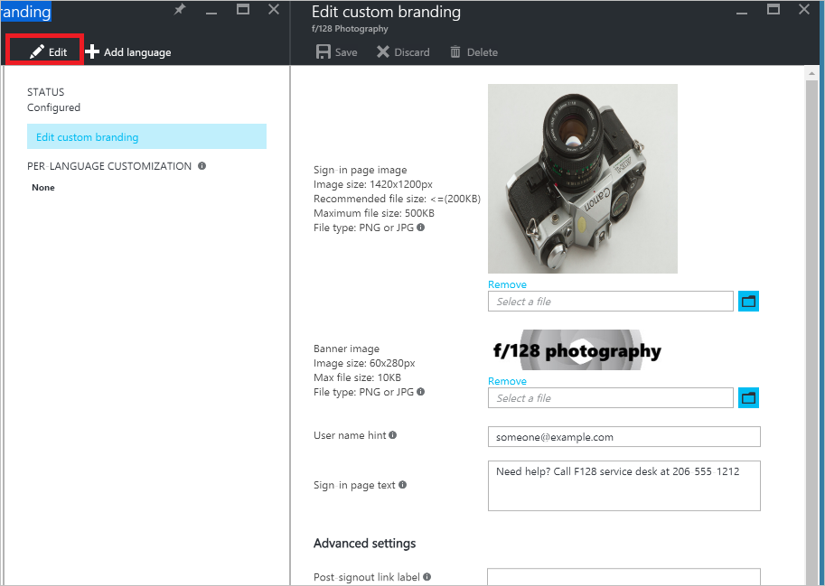

# Quickstart: Add company branding to your sign-in page in Azure AD
To avoid confusion, many companies want to apply a consistent look and feel across all the websites and services they manage. Azure Active Directory (Azure AD) provides this capability by allowing you to customize the appearance of the sign-in page with your company logo and custom color schemes. The sign-in page is the page that appears when you sign in to Office 365 or other web-based applications that are using Azure AD as your identity provider. You interact with this page to enter your credentials.

> [!NOTE]
> * Company branding is available only if you upgraded to the Premium or Basic edition of Azure AD, or have an Office 365 license. To learn if a feature is supported by your license type, check the [Azure Active Directory pricing information page](https://azure.microsoft.com/pricing/details/active-directory/).
> 
> * Azure Active Directory Premium and Basic editions are available for customers in China using the worldwide instance of Azure Active Directory. Azure Active Directory Premium and Basic editions are not currently supported in the Microsoft Azure service operated by 21Vianet in China. For more information, contact us at the [Azure Active Directory Forum](https://feedback.azure.com/forums/169401-azure-active-directory/).

## Customizing the sign-in page

<!--You can customize the following elements on the sign-in page: <attach image>-->

Company branding customizations appear on the Azure AD sign-in page when users access a tenant-specific URL such as
[*https://outlook.com/contoso.com*](https://outlook.com/contoso.com).

When users visit a generic URL such as www.office.com, the sign-in page
does not contain company branding customizations because the system
doesn’t know who the user is. Company branding will show after users
enter their user ID or select a user tile.

> [!NOTE]
> * Your domain name must appear as “Active" in the **Domains** portion of the Azure portal in which you have configured branding. For more information, see [Add a custom domain name](add-custom-domain.md).
> * Sign-in page branding doesn’t carry over to the sign-in page for personal Microsoft accounts. If your employees or business guests sign in with a personal Microsoft account, their sign-in page does not reflect the branding of your organization.

### Banner logo	

Description | Constraints | Recommendations
------- | ------- | ----------
The banner logo is displayed on the sign-in and the Access panel pages. On the sign-in page, this shows once the user’s organization is determined, usually after the username is entered.  | Transparent JPG or PNG Max height: 36 px Max width: 245 px | Use your organization’s logo here. Use a transparent image. Don’t assume that the background will be white. Do not add padding around your logo in the image or your logo will look disproportionately small.

### Username hint	
Description | Constraints | Recommendations
------- | ------- | ----------
This customizes the hint text in the username field. | Unicode text up to 64 characters Plain text only | We recommend that you do not set this if you expect guest users outside your organization to sign in to your app.
		 	
### Sign-in page text	
Description | Constraints | Recommendations
------- | ------- | ----------
This appears at the bottom of the sign-in form and can be used to communicate additional information such as the phone number to your help desk, or a legal statement. | Unicode text up to 256 characters Plain text only (no links or HTML tags)	

### Sign-in page image	
Description | Constraints | Recommendations
------- | ------- | ----------
This appears in the background of the sign-in page, is anchored to the center of the viewable space, and will scale and crop to fill the browser window.	 On narrow screens such as mobile phones, this image is not shown. A black mask with 0.55 opacity will be applied over this image by our code when the page is loaded. | JPG or PNG Image dimensions: 1920x1080 px File size: &lt; 300 KB |  Use images where there isn't a strong subject focus. The opaque sign-in form appears over the center of this image and can cover any part of the image depending on the size of the browser window. Keep the file size as small as possible to ensure quick load times. 

### Background Color
Description | Constraints | Recommendations
------- | ------- | ----------
This color is used in place of the background image on low-bandwidth connections. |	RGB color in hexadecimal (example: #FFFFFF | We suggest using the primary color of the banner logo or your organization color.

### Show option to remain signed in
Description | Constraints | Recommendations
------- | ------- | ----------
Azure AD sign in gives the user the option to remain signed in when they close and re-open their browser. Use this to hide that option. Set this to “No” to hide this option from your users. | &nbsp; | This does not affect session lifetime. Some features of SharePoint Online and Office 2010 depend on users being able to choose to remain signed in. If you set this to be hidden, your users may see additional and unexpected prompts to sign-in.

> [!NOTE]
> All elements are optional. For example, if you specify a banner logo with no background image, the sign-in page will show your logo and the background image for the destination site (for example, Office 365).

## Add company branding to your directory

1. Sign in to [the Azure portal](https://portal.azure.com) with an account that's a global admin for the directory.
2. Select **More services**, enter **Users and groups** in the text box, and then select **Enter**.

   
3. On the **Users and groups** blade, select **Company branding**.
4. On the **Users and groups - Company branding** blade, select the **Edit** command.

    
5. Modify the elements you want to customize. All elements are optional.
6. Click **Save**.

It can take up to an hour for any changes you made to the sign-in page branding to appear.

## Add language-specific company branding to your directory

1. Sign in to the [Azure AD admin center](https://aad.portal.azure.com) with an account that's a global admin for the directory.
2. Select **Users and groups** in the text box, and then select **Enter**.

   
3. On the **Users and groups** blade, select **Company branding**.
4. On the **Users and groups - Company branding** blade, select the **Add language** command.

    
5. Modify the elements you want to customize. All elements are optional.
6. Click **Save**.

It can take up to an hour for any changes you made to the sign-in page branding to appear.

## Next steps
In this quickstart, you’ve learned how to add company branding to your Azure AD directory. 

You can use the following link to configure your company branding in Azure AD from the Azure portal.

> [!div class="nextstepaction"]
> [Configure company branding](https://aad.portal.azure.com/#blade/Microsoft_AAD_IAM/LoginTenantBrandingBlade) 