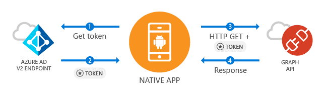

# Call the Microsoft Graph API from an Android app

This guide demonstrates how a native Android application can get an access token and call Microsoft Graph API or other APIs that require access tokens from Azure Active Directory v2 endpoint.

At the end of this guide, your application will be able to call a protected API using personal accounts (including outlook.com, live.com, and others) as well as work and school accounts from any company or organization that has Azure Active Directory.  

### How this sample works

The sample created by this guide is based on a scenario where an Android application is used to query a Web API that accepts tokens from Azure Active Directory v2 endpoint – in this case, Microsoft Graph API. For this scenario, a token is added to HTTP requests via the Authorization header. Token acquisition and renewal is handled by the Microsoft Authentication Library (MSAL).

### Pre-requisites
* This guided setup is focused on Android Studio, but any other Android application development environment is also acceptable. 
* Android SDK 21 or newer is required (SDK 25 is recommended).
* Google Chrome or a web browser using Custom Tabs is required for this release of Microsoft Authentication Library (MSAL) for Android.

> Note: Google Chrome is not included on Visual Studio Emulator for Android. We recommend you to test this code on an Emulator with API 25 or an image with API 21 or newer that has with Google Chrome installed.

### How to handle token acquisition to access a protected Web API

After the user authenticates, the sample application receives a token that can be used to query Microsoft Graph API or a Web API secured by Microsoft Azure Active Directory v2.

APIs such as Microsoft Graph require an access token to allow accessing specific resources – for example, to read a user’s profile, access user’s calendar or send an email. Your application can request an access token using MSAL to access these resources by specifying API scopes. This access token is then added to the HTTP Authorization header for every call made against the protected resource. 

MSAL manages caching and refreshing access tokens for you, so your application doesn't need to.

### Libraries

This guide uses the following libraries:

|Library|Description|
|---|---|
|[com.microsoft.identity.client](http://javadoc.io/doc/com.microsoft.identity.client/msal)|Microsoft Authentication Library (MSAL)|
