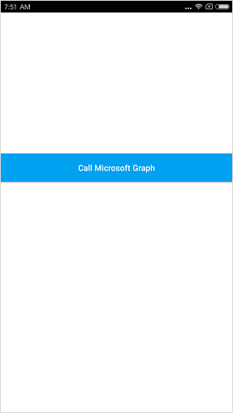
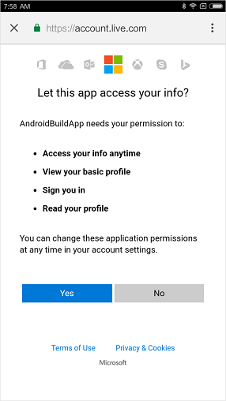

## Test your code

1. Deploy your code to your device/emulator.
2. When you're ready to test, use a Microsoft Azure Active Directory (organizational account) or a Microsoft Account (live.com, outlook.com) account to sign in. 

  

### Consent
The first time a user signs in to your application, they will be presented with a consent screen similar to the below, where they need to explicitly accept: 

### Expected results
You should see the results of a call to Microsoft Graph API ‘me’ endpoint used to to obtain the user profile - https://graph.microsoft.com/v1.0/me. For a list of common Microsoft Graph endpoints, please see this [article](https://developer.microsoft.com/graph/docs#common-microsoft-graph-queries).

<!--start-collapse-->
### More information about scopes and delegated permissions

The Microsoft Graph API requires the `user.read` scope to read the user's profile. This scope is automatically added by default in every application being registered on our registration portal. Some other APIs for Microsoft Graph as well as custom APIs for your backend server may require additional scopes. For example, for Microsoft Graph, the scope `Calendars.Read` is required to list the user’s calendars. In order to access the user’s calendar in a context of an application, you need to add the `Calendars.Read` delegated permission to the application registration’s information and then add the `Calendars.Read` scope to the `acquireTokenSilentAsync` call. The user may be prompted for additional consents as you increase the number of scopes.

<!--end-collapse-->
