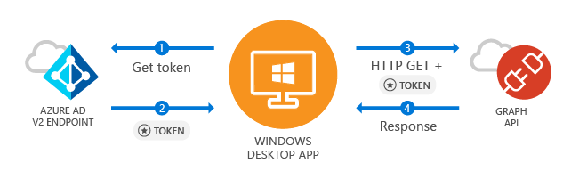

# Call the Microsoft Graph API from a Windows Desktop app

This guide demonstrates how a native Windows Desktop .NET (XAML) application can get an access token and call Microsoft Graph API or other APIs that require access tokens from Azure Active Directory v2 endpoint.

At the end of this guide, your application will be able to call a protected API using personal accounts (including outlook.com, live.com, and others) as well as work and school accounts from any company or organization that has Azure Active Directory.  

> This guide requires Visual Studio 2015 Update 3 or Visual Studio 2017.  Don’t have it? [Download Visual Studio 2017 for free](https://www.visualstudio.com/downloads/)

### How this guide works

The sample application created by this guide enables a Windows Desktop Application to query Microsoft Graph API or a Web API that accepts tokens from Azure Active Directory v2 endpoint. For this scenario, a token is added to HTTP requests via the Authorization header. Token acquisition and renewal is handled by the Microsoft Authentication Library (MSAL).

### Handling token acquisition for accessing protected Web APIs

After the user authenticates, the sample application receives a token that can be used to query Microsoft Graph API or a Web API secured by Microsoft Azure Active Directory v2.

APIs such as Microsoft Graph require an access token to allow accessing specific resources – for example, to read a user’s profile, access user’s calendar or send an email. Your application can request an access token using MSAL to access these resources by specifying API scopes. This access token is then added to the HTTP Authorization header for every call made against the protected resource. 

MSAL manages caching and refreshing access tokens for you, so your application doesn't need to.

### NuGet Packages

This guide uses the following NuGet packages:

|Library|Description|
|---|---|
|[Microsoft.Identity.Client](https://www.nuget.org/packages/Microsoft.Identity.Client)|Microsoft Authentication Library (MSAL)|

