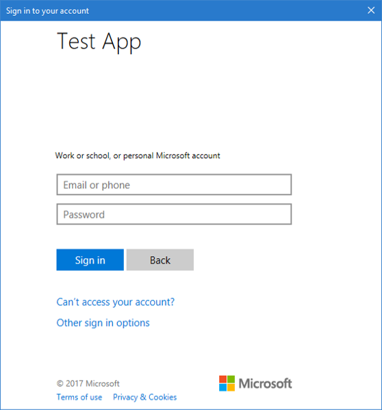

## Test your code

In order to test your application, press `F5` to run your project in Visual Studio. Your Main Window should appear:

When you're ready to test, click *Call Microsoft Graph API* and use a Microsoft Azure Active Directory (organizational account) or a Microsoft Account (live.com, outlook.com) account to sign in. It it is the first time, you will see a window asking user to sign in:

### Consent
The first time you sign in to your application, you will be presented with a consent screen similar to the below, where you need to explicitly accept:

### Expected results
You should see user profile information returned by the Microsoft Graph API call on the API Call Results screen.

You  should also see basic information about the token acquired via `AcquireTokenAsync` or `AcquireTokenSilentAsync` in the Token Info box:

|Property  |Format  |Description |
|---------|---------|---------|
|Name | {User Full name} |The user’s first and last name|
|Username |user@domain.com |The username used to identify the user|
|Token Expires |{DateTime}         |The time on which the token expires. MSAL will extend the expiration date for you by renewing the token when necessary|
|Access token |{String}         |The token string sent that will be sent to HTTP requests that require an authorization header|

<!--start-collapse-->
### More information about scopes and delegated permissions
Graph API requires the `user.read` scope to read user profile. This scope is automatically added by default in every application being registered on our registration portal. Some other Graph APIs as well as custom APIs for your backend server require additional scopes. For example, for Graph, `Calendars.Read` is required to list user’s calendars. In order to access the user’s calendar in a context of an application, you need to add `Calendars.Read` delegated application registration’s information and then add `Calendars.Read` to the `AcquireTokenAsync` call. User may be prompted for additional consents as you increase the number of scopes.

If a backend API does not require a scope (not recommended), you can use the `ClientId` as the scope in the `AcquireTokenAsync` call.
<!--end-collapse-->

