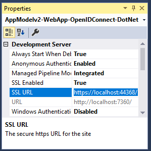

## Add the application’s registration information to your App

In this step, you need to configure the Redirect URL of your application registration information and then add the Application Id to your JavaScript SPA application.

### Configure Redirect URL

Configure the `Redirect URL` field above with the URL for your index.html page based on your web server, then click *Update*.

> #### Visual Studio Instructions for Redirect URL
> If you are using Visual Studio, configure your project to use SSL, and then use the SSL URL to configure your application’s registration information using below instructions:
> 1.	In Solution Explorer, select the project and look at the `Properties` window (if you don’t see a Properties window, press F4)
> 2.	Change `SSL Enabled` to `True`:<br/>
<br />
> 3.	Copy the value from `SSL URL` above, go `Project` menu and select `{Project} Properties...` (where *{Project}* is the name of your project)
> 4.	Also paste the value in the `Redirect URL` field on the top of this page, then click *Update*:


### Configure your JavaScript SPA application

1.	Create a `msalconfig.js` file containing the application registration information. If you are using Visual Studio, follow the steps below to create config.js:
a.	Select the project (project root folder), right click and select: `Add` > `New Item` > `JavaScript File`. Name it `msalconfig.js`.
2.	Add the following code to your `msalconfig.js` file:

```javascript
var msalconfig = {
    clientID: "[Enter the application Id here]",
    redirectUri: location.origin
};
``` 
