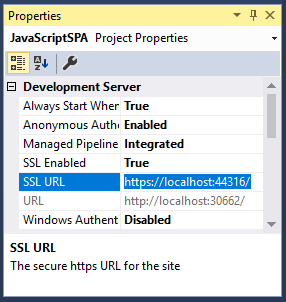

### Create an application (Express)
Now you need to register your application in Microsoft Application Registration Portal:

1.	Register your application via the [Microsoft Application Registration Portal](https://apps.dev.microsoft.com/portal/register-app?appType=singlePageApp&appTech=javascriptSpa&step=configure)
2.	Enter a name for your application and your email
3.	Make sure the option for *Guided Setup* is checked
4.	Follow the instructions to obtain the application ID and paste it into your code

### Add your application registration information to your solution (Advanced)

1. Go to the [Microsoft Application Registration Portal](https://apps.dev.microsoft.com/portal/register-app) to register an application
2. Enter a name for your application and your email 
3. Make sure the option for *Guided Setup* is unchecked
4.	Click `Add Platforms`, then select `Web`
5. Add a redirect URL to your application. A redirect URL is the URL for your `index.html` page based on your web server
6. Click *Save*

> #### Visual Studio instructions for obtaining redirect URL using SSL
> If you are using Visual Studio, configure your project to use SSL, and then use the SSL URL to configure your application’s registration information using the instructions below:
> 1.	In Solution Explorer, select the project and look at the `Properties` window (if you don’t see a Properties window, press F4)
> 2.	Change `SSL Enabled` to `True`
> 3.	Copy the value from `SSL URL` to the clipboard:<br/> <br />
> 4.	Select the `Project` menu and then select `{Project} Properties...` (where {Project} is the name of your project)
> 5.	Open the `Web` tab
> 6.	Paste the value of `SSL URL` in the `Project Url` field
> 7.	Switch back to the Application Registration Portal and paste the value in the `Redirect URL` as redirect URL, then click *Save*


#### Configure your JavaScript SPA application

1.	Create a file named `msalconfig.js` containing the application registration information. If you are using Visual Studio, select the project (project root folder), right click and select: `Add` > `New Item` > `JavaScript File`. Name it `msalconfig.js`
2.	Add the following code to your `msalconfig.js` file:

```javascript
var msalconfig = {
    clientID: "Enter_the_Application_Id_here",
    redirectUri: location.origin
};
```
<ol start="3">
<li>
Replace <code>Enter_the_Application_Id_here</code> with the Application Id you just registered 
</li>
</ol>