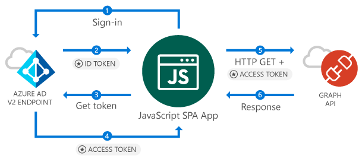

# Call the Microsoft Graph API from a JavaScript Single Page Application (SPA)

This guide demonstrates how a JavaScript Single Page Application (SPA) can sign in personal and work accounts, get an access token and call the Microsoft Graph API or other APIs that require access tokens from Azure Active Directory v2 endpoint.

### How this guide works

<!--start-collapse-->
### More Information

The sample application created by this guide enables a JavaScript SPA to query the Microsoft Graph API or a Web API that accepts tokens from Azure Active Directory v2 endpoint. For this scenario, after a user signs-in, a token is added to HTTP requests via the authorization header. Token acquisition and renewal is handled by the Microsoft Authentication Library (MSAL).
<!--end-collapse-->

<!--start-collapse-->
### Libraries

This guide uses the following library:

|Library|Description|
|---|---|
|[msal.js](https://github.com/AzureAD/microsoft-authentication-library-for-js)|Microsoft Authentication Library for JavaScript Preview|
<!--end-collapse-->
