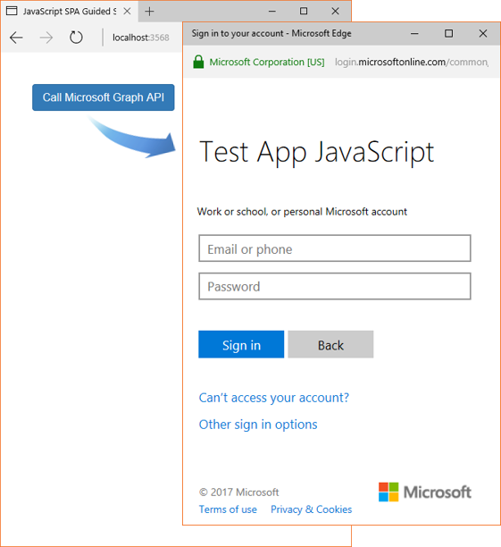
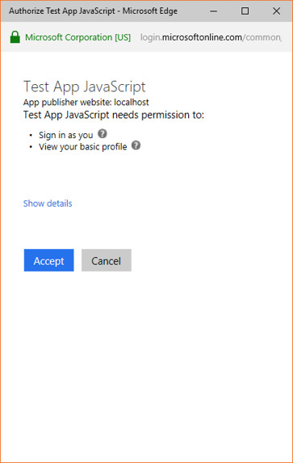
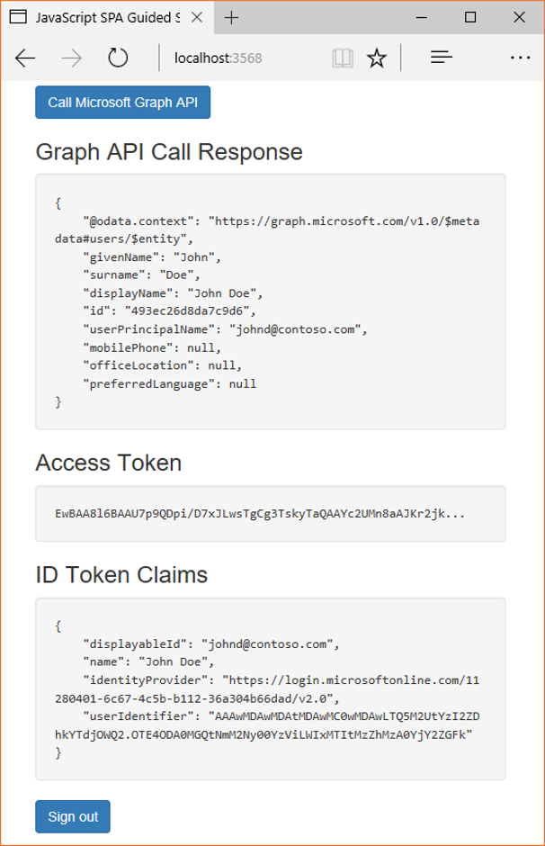

## Test your code

If you are using Visual Studio, press `F5` to run your project. The browser will open and direct you to *http://localhost:{port}* where you’ll see the *Call Microsoft Graph API* button.

If you are not using Visual Studio, make sure your web server is started and that the folder containing your JavaScript web application is configured in your web server. Open the browser and type *http://localhost:{port}/path* - where the *port* corresponds to the port that your Web Server is listening to and *path* is the path for your index.html.

Click the *Call Microsoft Graph API* button. If this is the first time, a popup window will show up prompting user to sign in.
 

### Consent
The first time you sign in to your application, you will be presented with a consent screen similar to below, where you need to explicitly accept:

 

Because you are querying the Microsoft Graph API, you may see another consent page. This happens due to the *dynamic consent* - where a consent is required for each scope requested by the application. For the sample application generated by this guide, the *user.read* scope is provided, and therefore, you need to give the consent for this application to read the user’s profile.

> [!IMPORTANT]
> Currently, due to a known issue with *msal* javascript, you need to disable the pop-up blocker in browsers like Chrome and Firefox so the *dynamic consent* screen can work properly. Disabling the pop-up blocker is required for the first time a user calls the Microsoft Graph API using `acquireTokenPopup`.

### Expected results
You should see user profile information returned by the Microsoft Graph API call response.
 
 

You will also see basic information about the token acquired in the *Access Token* and *ID Token Claims* boxes.

<!--start-collapse-->
### More information about scopes and delegated permissions

The Microsoft Graph API requires the `user.read` scope to read the user's profile. This scope is automatically added by default in every application being registered on our registration portal. Some other APIs for Microsoft Graph as well as custom APIs for your backend server may require additional scopes. For example, for Microsoft Graph, the scope `Calendars.Read` is required to list the user’s calendars. In order to access the user’s calendar in a context of an application, you need to add the `Calendars.Read` delegated permission to the application registration’s information and then add the `Calendars.Read` scope to the `acquireTokenSilent` call. The user may be prompted for additional consents as you increase the number of scopes.

If a backend API does not require a scope (not recommended), you can use the `clientId` as the scope in the `acquireTokenSilent` and/or `acquireTokenPopup` calls.

<!--end-collapse-->
