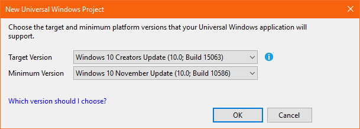
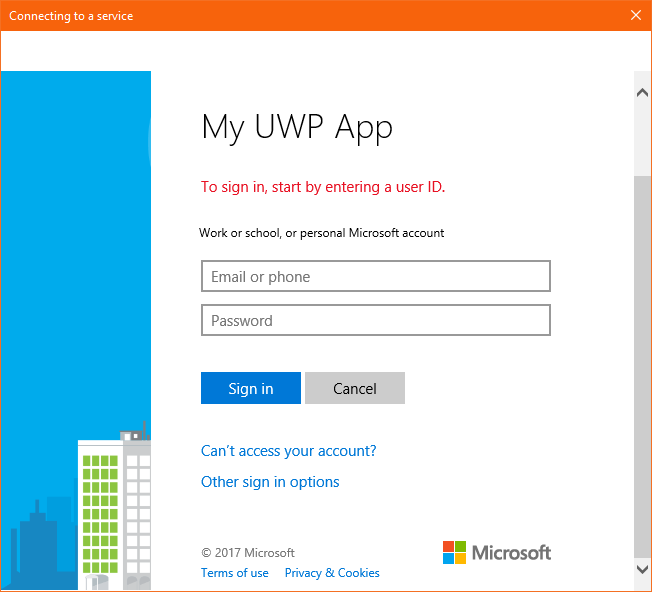

# Call the Microsoft Graph API from a Universal Windows Platform (UWP) application

This guide demonstrates how a native Universal Windows Platform (XAML) application can get an access token and then use this access toke to call Microsoft Graph API, or other APIs that require access tokens from Azure Active Directory v2 endpoint.

At the end of this guide, your application will be able to call a protected API using personal accounts (including outlook.com, live.com, and others) as well as work and school accounts from any company or organization that has Azure Active Directory.  

> This guide requires Visual Studio 2017 with Universal Windows Platform development installed. Check this [article](https://docs.microsoft.com/windows/uwp/get-started/get-set-up "Set up Visual Studio for UWP") for instructions on how to download and configure Visual Studio to develop Universal Windows Platform Apps.

### How this guide works


The sample application created by this guide enables a UWP app to query Microsoft Graph API or a Web API that accepts tokens from Azure Active Directory v2 endpoint. For this scenario, a token is added to HTTP requests via the Authorization header. Token acquisitions and renewals are handled by the Microsoft Authentication Library (MSAL).

### NuGet Packages

This guide uses the following NuGet packages:

|Library|Description|
|---|---|
|[Microsoft.Identity.Client](https://www.nuget.org/packages/Microsoft.Identity.Client)|Microsoft Authentication Library (MSAL)|


## Set up your project

This section provides step-by-step instructions for how to integrate a Windows Desktop .NET application (XAML) with *Sign-In with Microsoft* so it can query Web APIs that require a token, such as Microsoft Graph API.

The application created by this guide display a button to query Graph API, a sign-out button, and text boxes that display the results of the calls.

> Prefer to download this sample's Visual Studio project instead? [Download a project](https://github.com/Azure-Samples/active-directory-dotnet-native-uwp-v2/archive/master.zip) and skip to the [application registration](#register-your-application "application registration step") step to configure the code sample before executing.


### Create your application
1. In Visual Studio: **File** > **New** > **Project**<br/>
2. Under *Templates*, select **Visual C#**
3. Select **Blank App (Universal Windows)**
4. Give it a name and click 'Ok'.
5. If prompted, fell free to select any version for *Target* and *Minimum* version and click 'Ok':<br/><br/>

## Add the Microsoft Authentication Library (MSAL) to your project
1. In Visual Studio: **Tools** > **NuGet Package Manager** > **Package Manager Console**
2. Copy/paste the following command in the Package Manager Console window:

    ```powershell
    Install-Package Microsoft.Identity.Client -Pre
    ```

> [!NOTE]
> The package above installs the [Microsoft Authentication Library (MSAL)](https://github.com/AzureAD/microsoft-authentication-library-for-dotnet). MSAL handles acquiring, caching, and refreshing user tokens used to access APIs protected by Azure Active Directory v2.

## Initialize MSAL
This step helps you create a class to handle interaction with MSAL Library, such as handling of tokens.

1. Open the **App.xaml.cs** file and add the reference for MSAL library to the class:

    ```csharp
    using Microsoft.Identity.Client;
    ```

2. Add the following two lines to the App's class (inside <code>sealed partial class App : Application</code> block):

    ```csharp
    // Below is the clientId of your app registration. 
    // You have to replace the below with the Application Id for your app registration
    private static string ClientId = "your_client_id_here";
    
    public static PublicClientApplication PublicClientApp = new PublicClientApplication(ClientId);
    ```

## Create your application’s UI

A **MainPage.xaml** file should automatically be created as a part of your project template. Open this file and then follow the instructions:

1.	Replace your application’s **<Grid>** node with:

    ```xml
    <Grid>
        <StackPanel Background="Azure">
            <StackPanel Orientation="Horizontal" HorizontalAlignment="Right">
                <Button x:Name="CallGraphButton" Content="Call Microsoft Graph API" HorizontalAlignment="Right" Padding="5" Click="CallGraphButton_Click" Margin="5" FontFamily="Segoe Ui"/>
                <Button x:Name="SignOutButton" Content="Sign-Out" HorizontalAlignment="Right" Padding="5" Click="SignOutButton_Click" Margin="5" Visibility="Collapsed" FontFamily="Segoe Ui"/>
            </StackPanel>
            <TextBlock Text="API Call Results" Margin="2,0,0,-5" FontFamily="Segoe Ui" />
            <TextBox x:Name="ResultText" TextWrapping="Wrap" MinHeight="120" Margin="5" FontFamily="Segoe Ui"/>
            <TextBlock Text="Token Info" Margin="2,0,0,-5" FontFamily="Segoe Ui" />
            <TextBox x:Name="TokenInfoText" TextWrapping="Wrap" MinHeight="70" Margin="5" FontFamily="Segoe Ui"/>
        </StackPanel>
    </Grid>
    ```
    
## Use the Microsoft Authentication Library (MSAL) to get a token for the Microsoft Graph API

This section shows how to use MSAL to get a token for the Microsoft Graph API.

1.	In **MainPage.xaml.cs**, add the reference for MSAL library to the class:

    ```csharp
    using Microsoft.Identity.Client;
    ```
2. Replace the code of your <code>MainPage</code> class with:

    ```csharp
    public sealed partial class MainPage : Page
    {
        // Set the API Endpoint to Graph 'me' endpoint
        string graphAPIEndpoint = "https://graph.microsoft.com/v1.0/me";
    
        // Set the scope for API call to user.read
        string[] scopes = new string[] { "user.read" };
    
        public MainPage()
        {
            this.InitializeComponent();
        }
    
        /// <summary>
        /// Call AcquireTokenAsync - to acquire a token requiring user to sign-in
        /// </summary>
        private async void CallGraphButton_Click(object sender, RoutedEventArgs e)
        {
            AuthenticationResult authResult = null;
            ResultText.Text = string.Empty;
            TokenInfoText.Text = string.Empty;
    
            try
            {
                authResult = await App.PublicClientApp.AcquireTokenSilentAsync(scopes, App.PublicClientApp.Users.FirstOrDefault());
            }
            catch (MsalUiRequiredException ex)
            {
                // A MsalUiRequiredException happened on AcquireTokenSilentAsync. This indicates you need to call AcquireTokenAsync to acquire a token
                System.Diagnostics.Debug.WriteLine($"MsalUiRequiredException: {ex.Message}");
    
                try
                {
                    authResult = await App.PublicClientApp.AcquireTokenAsync(scopes);
                }
                catch (MsalException msalex)
                {
                    ResultText.Text = $"Error Acquiring Token:{System.Environment.NewLine}{msalex}";
                }
            }
            catch (Exception ex)
            {
                ResultText.Text = $"Error Acquiring Token Silently:{System.Environment.NewLine}{ex}";
                return;
            }
    
            if (authResult != null)
            {
                ResultText.Text = await GetHttpContentWithToken(graphAPIEndpoint, authResult.AccessToken);
                DisplayBasicTokenInfo(authResult);
                this.SignOutButton.Visibility = Visibility.Visible;
            }
        }
    }
    ```

### More Information
#### Get a user token interactively
Calling the `AcquireTokenAsync` method results in a window that prompts  users to sign in. Applications usually require users to sign in interactively the first time they need to access a protected resource. They might also need to sign in when a silent operation to acquire a token fails (for example, when a user’s password is expired).

#### Get a user token silently
The `AcquireTokenSilentAsync` method handles token acquisitions and renewals without any user interaction. After `AcquireTokenAsync` is executed for the first time, `AcquireTokenSilentAsync` is the usual method to use to obtain tokens that access protected resources for subsequent calls, because calls to request or renew tokens are made silently.

Eventually, the `AcquireTokenSilentAsync` method will fail. Reasons for failure might be that the user has either signed out or changed their password on another device. When MSAL detects that the issue can be resolved by requiring an interactive action, it fires an `MsalUiRequiredException` exception. Your application can handle this exception in two ways:

* It can make a call against `AcquireTokenAsync` immediately. This call results in prompting the user to sign in. This pattern is normally used in online applications where there is no available offline content for the user. The sample generated by this guided setup follows this pattern, which you can see in action the first time you execute the sample. 
    * Because no user has used the application, `PublicClientApp.Users.FirstOrDefault()` contains a null value, and an `MsalUiRequiredException` exception is thrown. 
    * The code in the sample then handles the exception by calling `AcquireTokenAsync`, which results in prompting the user to sign in.

* It can instead present a visual indication to users that an interactive sign-in is required, so that they can select the right time to sign in. Or the application can retry `AcquireTokenSilentAsync` later. This pattern is frequently used when users can use other application functionality without disruption--for example, when offline content is available in the application. In this case, users can decide when they want to sign in to either access the protected resource or refresh the outdated information. Alternatively, the application can decide to retry `AcquireTokenSilentAsync` when the network is restored after having been temporarily unavailable.

## Call the Microsoft Graph API using the token you just obtained

1. Add the following new method to your **MainPage.xaml.cs**. The method is used to make a `GET` request against Graph API using an Authorize header:

    ```csharp
    /// <summary>
    /// Perform an HTTP GET request to a URL using an HTTP Authorization header
    /// </summary>
    /// <param name="url">The URL</param>
    /// <param name="token">The token</param>
    /// <returns>String containing the results of the GET operation</returns>
    public async Task<string> GetHttpContentWithToken(string url, string token)
    {
        var httpClient = new System.Net.Http.HttpClient();
        System.Net.Http.HttpResponseMessage response;
        try
        {
            var request = new System.Net.Http.HttpRequestMessage(System.Net.Http.HttpMethod.Get, url);
            // Add the token in Authorization header
            request.Headers.Authorization = new System.Net.Http.Headers.AuthenticationHeaderValue("Bearer", token);
            response = await httpClient.SendAsync(request);
            var content = await response.Content.ReadAsStringAsync();
            return content;
        }
        catch (Exception ex)
        {
            return ex.ToString();
        }
    }
    ```

### More information on making a REST call against a protected API

In this sample application, the `GetHttpContentWithToken` method is used to make an HTTP `GET` request against a protected resource that requires a token and then return the content to the caller. This method adds the acquired token in the *HTTP Authorization header*. For this sample, the resource is the Microsoft Graph API *me* endpoint – which displays the user's profile information.
<!--end-collapse-->

## Add a method to sign out the user

1. To sign out the user, add the following method to **MainPage.xaml.cs**:

    ```csharp
    /// <summary>
    /// Sign out the current user
    /// </summary>
    private void SignOutButton_Click(object sender, RoutedEventArgs e)
    {
        if (App.PublicClientApp.Users.Any())
        {
            try
            {
                App.PublicClientApp.Remove(App.PublicClientApp.Users.FirstOrDefault());
                this.ResultText.Text = "User has signed-out";
                this.CallGraphButton.Visibility = Visibility.Visible;
                this.SignOutButton.Visibility = Visibility.Collapsed;
            }
            catch (MsalException ex)
            {
                ResultText.Text = $"Error signing-out user: {ex.Message}";
            }
        }
    }
    ```

### More info on Sign-Out

The method `SignOutButton_Click` removes the user from MSAL user cache – this effectively tells MSAL to forget the current user so a future request to acquire a token can only succeed if it is made to be interactive.
Although the application in this sample supports a single user, MSAL supports scenarios where multiple accounts can be signed-in at the same time – an example is an email application where a user has multiple accounts.

## Display Basic Token Information

1. Add the following method to your **MainPage.xaml.cs** to display basic information about the token:

    ```csharp
    /// <summary>
    /// Display basic information contained in the token
    /// </summary>
    private void DisplayBasicTokenInfo(AuthenticationResult authResult)
    {
        TokenInfoText.Text = "";
        if (authResult != null)
        {
            TokenInfoText.Text += $"Name: {authResult.User.Name}" + Environment.NewLine;
            TokenInfoText.Text += $"Username: {authResult.User.DisplayableId}" + Environment.NewLine;
            TokenInfoText.Text += $"Token Expires: {authResult.ExpiresOn.ToLocalTime()}" + Environment.NewLine;
            TokenInfoText.Text += $"Access Token: {authResult.AccessToken}" + Environment.NewLine;
        }
    }
    ```

### More Information

ID tokens acquired via *OpenID Connect* also contain a small subset of information pertinent to the user. `DisplayBasicTokenInfo` displays basic information contained in the token: for example, the user's display name and ID, as well as the token expiration date and the string representing the access token itself. This information is displayed for you to see. You can hit the **Call Microsoft Graph API** button multiple times and see that the same token was reused for subsequent requests. You can also see the expiration date being extended when MSAL decides it is time to renew the token.

## Register your application

Now you need to register your application in the *Microsoft Application Registration Portal*:
1. Go to the [Microsoft Application Registration Portal](https://apps.dev.microsoft.com/portal/register-app) to register an application
2. Enter a name for your application 
3. Make sure the option for Guided Setup is unchecked
4. Click **Add Platforms**, then select **Native Application** and hit Save
5. Copy the GUID in Application ID, go back to Visual Studio, open **App.xaml.cs** and replace `your_client_id_here` with the Application ID you just registered:

    ```csharp
    private static string ClientId = "your_application_id_here";
    ```

## Enable integrated authentication on federated domains (optional)

To enable Windows Integrated Authentication when used with a federated Azure Active Directory domain, the application manifest must enable additional capabilities:

1. Double-click **Package.appxmanifest**
2. Select **Capabilities** tab and make sure that the following settings are enabled:

    - Enterprise Authentication
    - Private Networks (Client & Server)
    - Shared User Certificates 

3. Then, open **App.xaml.cs**, and add the following line in the App constructor:

    ```csharp
    App.PublicClientApp.UseCorporateNetwork = true;
    ```

> [!IMPORTANT]
> Windows Integrated Authentication is not configured by default for this sample because applications requesting the *Enterprise Authentication* or *Shared User Certificates* capabilities require a higher level of verification by the Windows Store and not all developers wish to perform the higher level of verification. Please enable this setting only if you need Windows Integrated Authentication with a federated Azure Active Directory domain.


## Test your code

To test your application, press `F5` to run your project in Visual Studio. Your Main Window should appear:


When you're ready to test, click *Call Microsoft Graph API* and use a Microsoft Azure Active Directory (organizational account) or a Microsoft Account (live.com, outlook.com) account to sign in. If it is your first time, you will see a window asking user to sign in:



### Consent
The first time you sign in to your application, you are presented with a consent screen similar to the following, where you need to explicitly accept:


### Expected results
You should see user profile information returned by the Microsoft Graph API call on the API Call Results screen:


You  should also see basic information about the token acquired via `AcquireTokenAsync` or `AcquireTokenSilentAsync` in the Token Info box:

|Property  |Format  |Description |
|---------|---------|---------|
|**Name** |User's full name |The user’s first and last name.|
|**Username** |<span>user@domain.com</span> |The username that is used to identify the user.|
|**Token Expires** |DateTime |The time at which the token expires. MSAL extends the expiration date by renewing the token as necessary.|
|**Access Token** |String |The token string that is sent to HTTP requests that require an *Authorization header*.|

#### See what is in the access token (optional)
Optionally, you can copy the value in 'Access Token' and paste it in https://jwt.ms to decode it and see the list of claims.

### More information about scopes and delegated permissions

The Microsoft Graph API requires the *user.read* scope to read a user's profile. This scope is automatically added by default in every application that's registered in the Application Registration Portal. Other APIs for Microsoft Graph, as well as custom APIs for your back-end server, might require additional scopes. The Microsoft Graph API requires the *Calendars.Read* scope to list the user’s calendars.

To access the user’s calendars in the context of an application, add the *Calendars.Read* delegated permission to the application registration information. Then, add the *Calendars.Read* scope to the `acquireTokenSilent` call. 

> [!NOTE]
> User might be prompted for additional consents as you increase the number of scopes.

## Known issues

### Issue 1:
You may receive one of the following errors when sign-in on your application on a federated Azure Active Directory Domain:
 - 'No valid client certificate found in the request.
 - No valid certificates found in the user's certificate store.
 - Try again choosing a different authentication method.'

**Cause:** Enterprise and certificates capabilities are not enabled

**Solution:** follow the steps in [integrated authentication on federated domains](#enable-integrated-authentication-on-federated-domains-optional)

### Issue 2:
Ater you enable [integrated authentication on federated domains](#enable-integrated-authentication-on-federated-domains-optional) and try to use Windows Hello on a Windows 10 computer to sign in on an environment with Multi-factor-authentication configured, the list of certificates is presented, however if you choose to use your PIN, the PIN window is never presented.

**Cause:** Known limitation with Web authentication broker in UWP applications running on Windows 10 desktop (works fine on Windows 10 Mobile)

**Workaround:** Users need to select to sign in with other options, and then choose *Sign-in with a username and password* instead, select provide your password and then go through the phone authentication.

