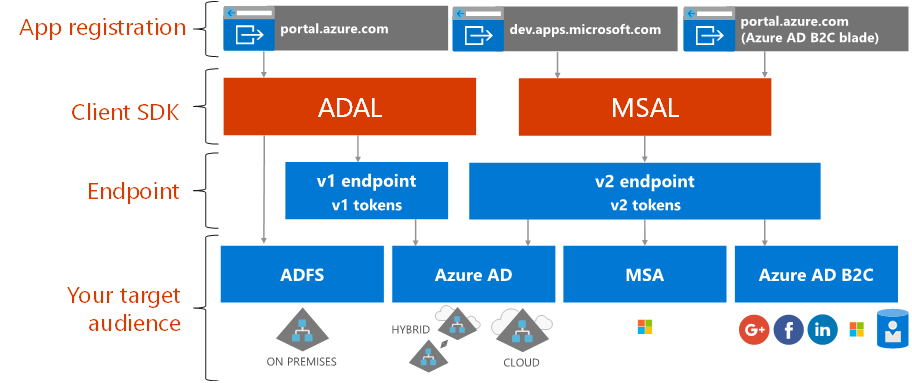

# About Microsoft identity platform

Microsoft identity platform is an evolution of the Azure Active Directory (Azure AD) identity service and developer platform. It allows developers to build applications that sign in all Microsoft identities, get tokens to call Microsoft Graph, other Microsoft APIs, or APIs that developers have built. It’s a full-featured platform that consists of an authentication service, open-source libraries, application registration and configuration (through a developer portal and application API), full developer documentation, code samples, and other developer content. The Microsoft identity platform supports industry standard protocols such as OAuth 2.0 and OpenID Connect.

Up until now, most developers have worked with Azure AD v1.0 platform to authenticate Azure AD identities (work and school accounts) by requesting tokens from the Azure AD v1.0 endpoint, using Azure AD Authentication Library (ADAL), Azure portal for application registration and configuration, and Azure AD Graph API for programmatic application configuration. The Azure AD v1.0 platform is a mature platform offering that will continue to work for enterprise applications.

To expand and evolve the capabilities of the Microsoft identity platform, you can now authenticate a broader set of Microsoft identities (Azure AD identities, Microsoft accounts (such as outlook.com and hotmail.com), and social and local accounts through Azure AD B2C) through what has been known as the Azure AD v2.0 endpoint. Here, you’ll be using the Microsoft Authentication Library (MSAL) or any open-source OAuth2.0 or OpenID Connect library, the Azure portal for application registration and configuration, and the Microsoft Graph API for programmatic application configuration. The updated Microsoft identity platform (in particular, the MSAL libraries and latest Azure portal app registration experience) has evolved significantly over the last year. To finalize this release, we encourage developers to develop and test their applications using the latest Microsoft identity platform.

Applications using the latest ADAL and the latest MSAL will SSO with each other. Applications updated from ADAL to MSAL will maintain user sign-in state. Developers can choose to update their applications to MSAL as they see fit, as applications built with ADAL will continue to work and be supported.

## Microsoft identity platform experience

The following diagram shows the Microsoft identity experience at a high level, including the app registration experience, SDKs, endpoints, and supported identities.

The Microsoft identity platform has two endpoints (v1.0 and v2.0) and two sets of client libraries to handle these endpoints. When developing a new application, consider the advantages and the current state of the endpoints and the authentication libraries. Also consider these:

* Supported platforms

    * [ADAL](active-directory-authentication-libraries.md) supports .NET, JavaScript, iOS, Android, Java, and Python
    * [MSAL Preview](reference-v2-libraries.md) supports .NET, JavaScript, iOS, and Android
    * Both endpoints support .NET and Node.js server-middleware for protecting APIs and Sign in. 

* The bulk of innovation, such as dynamic consent and incremental consent, is happening on the v2.0 endpoint and MSAL while we continue to support v1.0 and ADAL.

    In the Azure portal, you previously had to statically identify all the scopes your app needed. With the v2.0 endpoint and the portals associated with this endpoint, you can statically define the scopes just like before or can request them dynamically as your app needs the permission. Dynamic provides one more optional capability, incremental consent. Incremental consent allows you to ask for a subset of scopes that you require when a user first authenticates and ask for additional scopes as they are required. 
    
    For example, when using a camera app on a mobile device, the user is asked to allow the app to access the camera, and only after the user has consented will the app be allowed to access the camera and take a photo.  When the app is ready to save the new photo, it may ask for photo read/write permission. 

* Possible breaking changes

    MSAL is suitable for use in a production environment. We provide the same production level support for MSAL as we do our current production libraries. During the preview, we may make changes to the API, internal cache format, and other mechanisms of this library, which you will be required to take along with bug fixes or feature improvements. This may impact your application. For instance, a change to the cache format may impact your users, such as requiring them to sign in again. An API change may require you to update your code. When we provide the general availability (GA) release, we will require you to update to the GA version within six months, as applications written using a preview version of the library may no longer work.

## Next steps

Learn more about v1.0 and v2.0.

* [About v1.0](azure-ad-developers-guide.md)
* [About v2.0](azure-ad-developers-guide.md)
