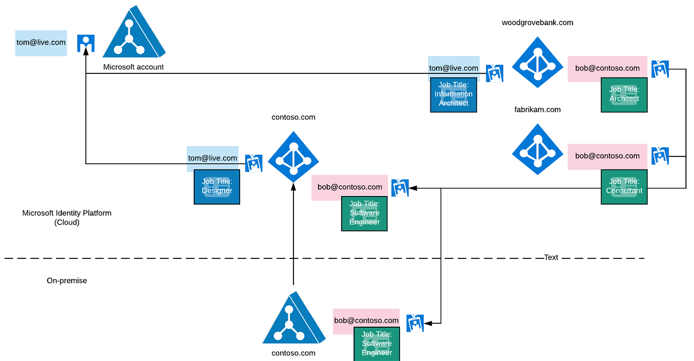

# Accounts & tenant profiles

## Introduction

The Microsoft Authentication Library (MSAL) API replaces the term *user* with the term *account*. One reason is that a user (human or software agent) may have, or be able to use, multiple accounts. Those accounts may be in their own organization, as well as those issued by other organizations that the user is a member of.

An account in the Microsoft identity platform consists of:

  - A unique identifier.
  - One or more credentials used to demonstrate ownership/control of the account.
  - One or more profiles consisting of attributes including:
    - Picture, Given Name, Family Name, Title, Office Location, and more.
- An account has a source of authority or system of record. This is the system where the account is created and where the credentials associated with the account are stored. In multi-tenant systems like the Microsoft identity platform, the system of record is the tenant where the account was created.
- Accounts in the Microsoft identity platform have the following systems of record:
  - Azure Active Directory, including Azure Active Directory B2C.
  - Microsoft account (Live).
- Accounts from systems of record outside of the Microsoft identity platform are represented within the Microsoft identity platform including:
  - identities from connected on-premises directories (Windows Server Active Directory)
  - external identities from LinkedIn, Github, and so on.
  - In these cases an account has both an origin system of record and a system of record within the Microsoft identity platform.
- The Microsoft identity platform allows one account to be used to access resources belonging to multiple organizations (Azure Active Directory tenants).
  - To record that an account from one system of record (AAD Tenant A) has access to a resource in another system of record (AAD Tenant B), the account must be represented in the tenant where the resource is defined. This is done by creating a local record of the account from system A in system B.
  - The local record is bound to the original account.
  - This local record can have different attributes that are appropriate to the local context, such as Local Job Title, Office Location, Contact Information.
  - MSAL exposes a local record as a Tenant Profile.
- Because an account may be present in one or more tenants, an account may have have more than one profiles.

> [!NOTE]
> MSAL treats the Microsoft account system (Live, MSA) as another tenant within the Microsoft identity platform. The tenant id of the Microsoft account tenant is: `9188040d-6c67-4c5b-b112-36a304b66dad`

## Account overview diagram



Regarding this diagram:

- The account bob@contoso.com is created in the on-premise Windows Server Active Directory (origin on-premise system of record).
- The account tom@live.com is created in the Microsoft account tenant.
- bob@contoso.com has access to at least one resource in the following Azure Active Directory tenants:
  - contoso.com (cloud system of record - linked to on-premise system of record)
  - fabrikam.com
  - woodgrovebank.com
  - A tenant profile for bob@contoso.com exists in each of these tenants.
- tom@live.com has access to resources in the following Microsoft tenants:
  - contoso.com
  - fabrikam.com
  - a tenant profile for tom@live.com exists in each of these tenants.
- Information about Tom and Bob in other tenants may differ from that in the system of record. They may differ by attributes such as Job title, Office Location, and so on. They may be members of groups and/or roles within each organization (Azure Active Directory Tenant). We refer to this information as bob@contoso.com tenant profile.

In the diagram, bob@contoso.com and tom@live.com have access to resources in different Azure Active Directory tenants. See [Add Azure Active Directory B2B collaboration users in the Azure portal](https://docs.microsoft.com/azure/active-directory/b2b/add-users-administrator) for more information.

## Accounts and single sign on (SSO)

The MSAL token cache stores a single refresh token per account. That refresh token can be used to silently request access tokens from multiple Microsoft identity platform tenants. When a broker is installed on a device, the account is managed by the broker, and device-wide single sign on becomes possible.

> [!IMPORTANT]
> Business to Consumer (B2C) account and refresh token behavior differs from the rest of the Microsoft identity platform. See [B2C Policies & Accounts](#b2c-policies-&-accounts) below for more details.

## Account identifiers

The MSAL account ID is not an account object ID. It is not meant to be parsed and/or relied upon to convey anything other than uniqueness within the Microsoft identity platform.

For compatibility with the Azure AD Authentication Library (ADAL), and to ease Migration from ADAL to MSAL, MSAL can look up accounts using any valid identifier for the account available in the MSAL cache.  For example, the following will always retrieve the same account object for tom@live.com because each of the identifiers is valid:

```java
// The following would always retrieve the same account object for tom@live.com because each identifier is valid

IAccount account = app.getAccount("tome@live.com msal account id">);
IAccount account = app.getAccount("tom@live.com contoso user object id");
IAccount account = app.getAccount("tom@live.com woodgrovebank user object id");
```

## Accessing claims about an account

In addition to requesting an access token, MSAL always requests an ID token from each tenant. It does this by always requesting the following scopes:

- openid
- profile

The ID token contains a list of claims. claims are name/value pairs about the account, and are used to make the request.

As mentioned previously, each tenant where an account exists may store different information about the account, including but not limited to attributes such as: job title, office location, and s on.

While an account may be a member or guest in multiple organizations, MSAL doesn't query a service to get a list of the tenants the account is a member of. Instead, MSAL builds up a list of tenants that the account is present in, as a result of token requests that have been made.

The claims exposed on the account object are always the claims from the home tenant/"source of authority" for an account. If that account has not been used to request a token for their home tenant, that MSAL will not claims available via the account object.  For example:

```java
// Psuedo Code
IAccount account = getAccount("accountid");

String username = account.getClaims().get("preferred_username");
String tenantId = account.getClaims().get("tid"); // tenant id
String objectId = account.getClaims().get("oid"); // object id 
String issuer = account.getClaims().get("iss"); // The tenant specific authority that issued the id_token
```

> [!TIP]
> To see a list of claims available from the account object, refer to [claims in an id_token](https://docs.microsoft.com/azure/active-directory/develop/id-tokens#claims-in-an-id_token)

> [!TIP]
> To include additional claims in your id_token, refer to the optional claims documentation in [How to: Provide optional claims to your Azure AD app](https://docs.microsoft.com/azure/active-directory/develop/active-directory-optional-claims)

### Access tenant profile claims

To access claims about an account as they appear in other tenants, you first need to cast your account object to `IMultiTenantAccount`. All accounts may be multi-tenant, but the number of tenant profiles available via MSAL is based on which tenants you have requested tokens from using the current account.  For example:

```java
IAcount account = getAccount("accountid");
IMultiTenantAccount multiTenantAccount = (IMultiTenantAccount)account;

multiTenantAccount.getTenantProfiles().get("tenantid for fabrikam").getClaims().get("family_name");
multiTenantAccount.getTenantProfiles().get("tenantid for contoso").getClaims().get("family_name");
```

## B2C policies & accounts

Refresh tokens for an account are not shared across B2C policies. As a result, single sign on using tokens is not possible. This doesn't mean that single sign on is not possible. It means that single sign on has to leverage an interactive experience in which a cookie is available to enable single sign on.

This also means that in the case of MSAL, if you acquire tokens using different B2C policies, then these are treated as separate accounts--each with their own identifier. If you want to use an account to request a token using `acquireTokenSilent`, then you will need to select the account from the list of accounts that matches the policy that you are using with the token request. For example:

```java
// Get Account For Policy

String policyId = "SignIn";
IAccount signInPolicyAccount = getAccountForPolicyId(app, policyId);

private IAccount getAccountForPolicy(IPublicClientApplication app, String policyId)
{
    List<IAccount> accounts = app.getAccounts();

    foreach(IAccount account : accounts)
   {
        if (account.getClaims().get("tfp").equals(policyId))
        {
            return account;
        }
    }

    return null;
}
```
