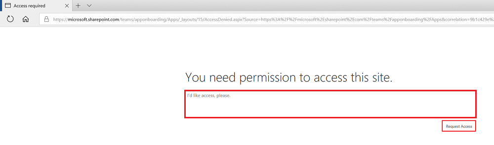

# Listing your application in the Azure Active Directory application gallery

##	What is Azure AD app gallery?

Azure AD is a cloud-based Identity service. [Azure AD app gallery](https://azure.microsoft.com/marketplace/active-directory/all/) is a common store where all the application connectors are published for single sign-on and user provisioning. Our mutual customers who are using Azure AD as Identity provider look for different SaaS application connectors, which are published here. IT administrator adds connector from the app gallery and configures and use it for Single sign-on and provisioning. Azure AD supports all major federation protocols like SAML 2.0, OpenID Connect, OAuth and WS-Fed for single sign-on. 

## What are the benefits of listing the application in the gallery?

*  Provide best possible single sign-on experience to the customers.

*  Simple and minimum configuration of the application.

*  Customers can search the application and find it in the gallery. 

*  Any customer can use this integration irrespective of Azure AD SKU Free, Basic or Premium.

*  Step by step configuration tutorial for the mutual customers.

*  Enable the user provisioning for the same app if you are using SCIM.

##	What are the pre-requisites?

To list an application in the Azure AD gallery, the application first needs to implement one of the federation protocols supported by Azure AD. Read the terms and conditions of the Azure AD application gallery from here. If you are using: 

*   **OpenID Connect** - Create the multi-tenant application in Azure AD and implement [Azure AD consent framework](active-directory-integrating-applications.md#overview-of-the-consent-framework) for your application. Send the login request to common endpoint so that any customer can provide consent to the application. You can control the customer user access based on the tenant ID and user's UPN received in the token. To integrate your application with Azure AD, you can follow the [developer instructions](active-directory-authentication-scenarios.md).

*   **SAML 2.0 or WS-Fed** – Your application should have a capability to do the SAML/WS-Fed SSO integration in SP or IDP mode. Any app that supports SAML 2.0, can be integrated directly with an Azure AD tenant using the [instructions to add a custom application](../active-directory-saas-custom-apps.md).

*   **Password SSO** – Create a web application that has an HTML sign-in page to configure [password-based single sign-on](../active-directory-appssoaccess-whatis.md). Password-based SSO, also referred to as password vaulting, enables you to manage user access and passwords to web applications that don't support identity federation. It is also useful for scenarios where several users need to share a single account, such as to your organization's social media app accounts. 

## Process for submitting the request in the portal

Once you have tested that your application integration works with Azure AD, you need to submit your request for access on our [Application Network Portal](https://microsoft.sharepoint.com/teams/apponboarding/Apps). If you have an Office 365 account, you can use that to login to this portal otherwise, use your Microsoft ID (Live ID, Outlook, Hotmail etc.) to login. You see following page to request your access. Provide a business justification in the textbox and click on **Request Access**. Our team will review all the details and give you the access accordingly. After that, you can log on to the portal and submit your detailed request for the application.

If you face any issue regarding the access, contact [Azure AD SSO Integration Team](<mailto:SaaSApplicationIntegrations@service.microsoft.com>).

## Timelines
    
*   Process of listing SAML 2.0 or WS-Fed application into the gallery - **7-10 Business Days**

   

*   Process of listing OpenID Connect application into the gallery - **2-5 Business Days**

   

## Escalations

For any escalations, drop an email to [Azure AD SSO Integration Team](<mailto:SaaSApplicationIntegrations@service.microsoft.com>) and we get back to you ASAP.

