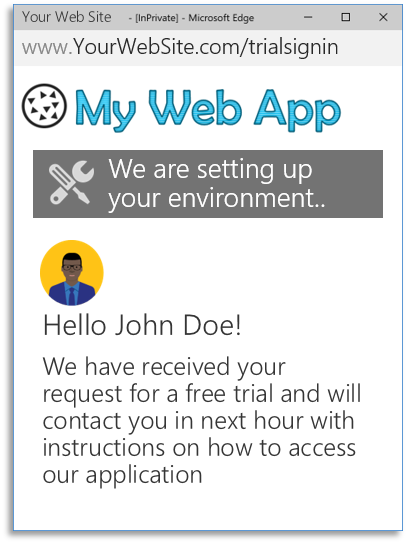

# How to get AppSource Certified for Azure Active Directory (AD)
[AppSource](https://appsource.microsoft.com/) is the premier destination to market and distribute your apps, content packs, and add-ins — all backed by a brand that billions of customers already know and trust.

To receive AppSource certification for Azure Active Directory, your application must accept single sign-on from work accounts from any company or organization that has Azure Active Directory. The sign-in process must use the OpenID Connect or OAuth 2.0 protocols.

## Guides and code samples
Gor code samples and guides for your platform, see [this document](active-directory-developers-guide#get-started "Get Started with Azure AD for developers")

## Multi-tenant applications
An application that accepts sign-ins from users from any company or organization that have Azure Active Directory without requiring a separate instance, configuration, or deployment is known as a multi-tenant application. AppSource recommends that applications implement multi-tenancy to enable the single-click customer-led trial experience.

For more information about multi-tenancy, see: [How to sign in any Azure Active Directory (AD) user using the multi-tenant application pattern](active-directory-devhowto-multi-tenant-overview).

### Customer-led trial experience
The *customer-led trial* is the experience that AppSource recommends as it offers a single-click access to your application. Below an illustration of how this experience looks like:
<!--Reference style links -->
[AAD-Auth-Scenarios]: ./active-directory-authentication-scenarios.md
[AAD-Auth-Scenarios-Browser-To-WebApp]: ./active-directory-authentication-scenarios.md#web-browser-to-web-application
[AAD-Dev-Guide]: ./active-directory-developers-guide.md
[AAD-Howto-Multitenant-Overview]: ./active-directory-devhowto-multi-tenant-overview.md
[AAD-QuickStart-Web-Apps]: ./active-directory-developers-guide.md#get-started
<table >
<tr>
    <td><ul><li>User finds your application in AppSource Web Site</li><li>Selects ‘Free trial’ option</li></ul></td>
    <td><ul><li>AppSource redirects user to a URL in your Web Site.</li><li>Your web site starts the single-sign-on process</li></ul></td>
    <td><ul><li>User is redirected to Microsoft Sign-in page</li><li>User provided credentials to sign in</li></ul></td>
</tr>
<tr>
    <td><ul><li>User gives consent for your application</li></ul></td>
    <td><ul><li>Sign-in completes and user is redirected back to your web site</li><li>User starts the free trial</li></ul></td>
    <td></td>
</tr>
</table>

### Partner-led trial experience
The partner trial experience can be used when some manual or long-term operation need to happen to provision the user/ company by your application: for example, when your application need to provision virtual machines, database instances or operations that take much time to complete. In this case, your application receives the user information from the authentication request, provision the environment, and then, after setup is completed, user receives information on how to access the trial experience.

<table valign="top">
<tr>
    <td valign="top"><ul><li>User finds your application in AppSource Web Site</li><li>Selects ‘Request trial’ option</li></ul></td>
    <td valign="top"><ul><li>AppSource redirects user to a URL in your Web Site.</li><li>Your web site starts the single-sign-on process</li></ul></td>
    <td valign="top"><ul><li>User is redirected to Microsoft Sign-in page</li><li>User provided credentials to sign in</li></ul></td>
</tr>
<tr>
    <td valign="top"><ul><li>User gives consent for your application</li></ul></td>
    <td valign="top"><ul><li>Sign-in completes and user is redirected back to your web site</li><li>Your application start provision user</li></ul></td>
    <td valign="top">Then:  
        <table bgcolor="#f7f7f7">
        <tr>
            <td></td>
            <td>Receive User Information</td>
        </tr>
        <tr>
            <td></td>
            <td>Setup Environment</td>
        </tr>
        <tr>
            <td></td>
            <td>Contact user with trial info</td>
        </tr>
        </table>  
        <ul><li>Setup Trial and contact user</li></ul>
    </td>
</tr>
</table>

 
## Next Steps
- For more information on building applications that support Azure Active Directory sign-ins, see [Authentication Scenarios for Azure AD](https://docs.microsoft.com/azure/active-directory/develop/active-directory-authentication-scenarios) 

- For information on how to list your SaaS application in AppSource, go see [AppSource Partner Information](https://appsource.microsoft.com/partners)

## Get Support
For Azure Active Directory integration, we use [Stack Overflow](http://stackoverflow.com/questions/tagged/azure-active-directory) with the community to provide support. 

We highly recommend you ask your questions on Stack Overflow first and browse existing issues to see if someone has asked your question before. Make sure that your questions or comments are tagged with `[azure-active-directory]`.

Use the following comments section to provide feedback and help us refine and shape our content.
