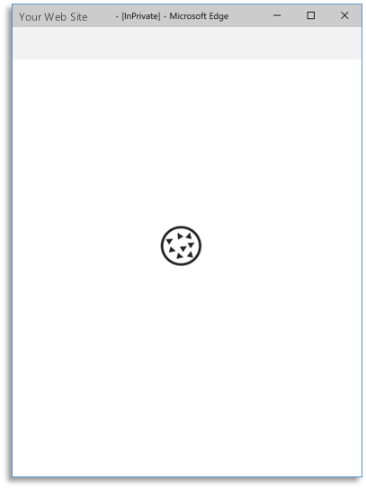
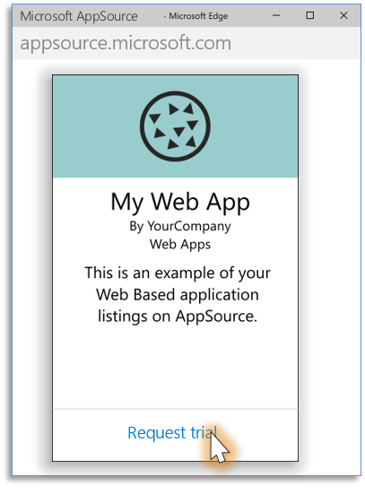

# How to get AppSource Certified for Azure Active Directory
[Microsoft AppSource](https://appsource.microsoft.com/) is a destination for business users to discover, try, and manage line-of-business SaaS applications (standalone SaaS and add-on to existing Microsoft SaaS products).

To list a standalone SaaS application on AppSource, your application must accept single sign-on from work accounts from any company or organization that has Azure Active Directory. The sign-in process must use the [OpenID Connect](./active-directory-protocols-openid-connect-code.md) or [OAuth 2.0](./active-directory-protocols-oauth-code.md) protocols. SAML protocol is not accepted.

## Guides and code samples
For code samples and guides for your platform that uses Open ID Connect protocol, see the [Azure Active Directory developer's guide](./active-directory-developers-guide.md#get-started "Get Started with Azure AD for developers").

## Multi-tenant applications
An application that accepts sign-ins from users from any company or organization that have Azure Active Directory without requiring a separate instance, configuration, or deployment is known as a *multi-tenant application*. AppSource recommends that applications implement multi-tenancy to enable the *single-click* free trial experience.

For more information about multi-tenancy, see: [How to sign in any Azure Active Directory (AD) user using the multi-tenant application pattern](./active-directory-devhowto-multi-tenant-overview.md).

## AppSource trial experiences

### Free Trial (Customer-led trial experience) 
The *customer-led trial* is the experience that AppSource recommends as it offers a single-click access to your application. Below an illustration of how this experience looks like:  

<table >
<tr>
    <td valign="top" width="33%">1. <ul><li>User finds your application in AppSource Web Site</li><li>Selects ‘Free trial’ option</li></ul></td>
    <td valign="top" width="33%">2. <ul><li>AppSource redirects user to a URL in your web site</li><li>Your web site starts the <i>single-sign-on</i> process automatically (on page load)</li></ul></td>
    <td valign="top" width="33%">3. <ul><li>User is redirected to Microsoft Sign-in page</li><li>User provides credentials to sign in</li></ul></td>
</tr>
<tr>
    <td valign="top" width="33%">4. <ul><li>User gives consent for your application</li></ul></td>
    <td valign="top" width="33%">5. <ul><li>Sign-in completes and user is redirected back to your web site</li><li>User starts the free trial</li></ul></td>
    <td></td>
</tr>
</table>

### Request Trial (Partner-led trial experience)
The *partner trial experience* can be used when a manual or a long-term operation needs to happen to provision the user/ company: for example, your application needs to provision virtual machines, database instances, or operations that take much time to complete. In this case, after user selects the *'Request Trial'* button and fills out a form, AppSource sends you the user's contact information. After receiving this information, you provision the environment and send the instructions to the user on how to access the trial experience:  

<table valign="top">
<tr>
    <td valign="top" width="33%">1. <ul><li>User finds your application in AppSource web site</li><li>Selects ‘Request trial’ or ‘Contact Me’ option</li></ul></td>
    <td valign="top" width="33%">2. <ul><li>Fills out a form with contact information</li></ul></td>
     <td valign="top" width="33%">3.  
        <table bgcolor="#f7f7f7">
        <tr>
            <td></td>
            <td>You receive user information</td>
        </tr>
        <tr>
            <td></td>
            <td>Setup environment</td>
        </tr>
        <tr>
            <td></td>
            <td>Contact user with trial info</td>
        </tr>
        </table>  
        <ul><li>You receive user's information and setup trial instance</li><li>You send the hyperlink to access your application to the user</li></ul>
    </td>
</tr>
<tr>
    <td valign="top" width="33%">4. <ul><li>User accesses your application and complete the single-sign-on process</li></ul></td>
    <td valign="top" width="33%">5. <ul><li>User gives consent for your application</li></ul></td>
    <td valign="top" width="33%">6. <ul><li>Sign-in completes and user is redirected back to your web site</li><li>User starts the free trial</li></ul></td>
   
</tr>
</table>

### More information
For more information about the AppSource trial experience, see [this video](https://aka.ms/trialexperienceforwebapps). 
 
## Next Steps

- For more information on building applications that support Azure Active Directory sign-ins, see [Authentication Scenarios for Azure AD](https://docs.microsoft.com/azure/active-directory/develop/active-directory-authentication-scenarios) 

- For information on how to list your SaaS application in AppSource, go see [AppSource Partner Information](https://appsource.microsoft.com/partners)

## Get Support
For Azure Active Directory integration, we use [Stack Overflow](http://stackoverflow.com/questions/tagged/azure-active-directory) with the community to provide support. 

We highly recommend you ask your questions on Stack Overflow first and browse existing issues to see if someone has asked your question before. Make sure that your questions or comments are tagged with `[azure-active-directory]`.

Use the following comments section to provide feedback and help us refine and shape our content.

<!--Reference style links -->
[AAD-Auth-Scenarios]: ./active-directory-authentication-scenarios.md
[AAD-Auth-Scenarios-Browser-To-WebApp]: ./active-directory-authentication-scenarios.md#web-browser-to-web-application
[AAD-Dev-Guide]: ./active-directory-developers-guide.md
[AAD-Howto-Multitenant-Overview]: ./active-directory-devhowto-multi-tenant-overview.md
[AAD-QuickStart-Web-Apps]: ./active-directory-developers-guide.md#get-started

<!--Image references-->