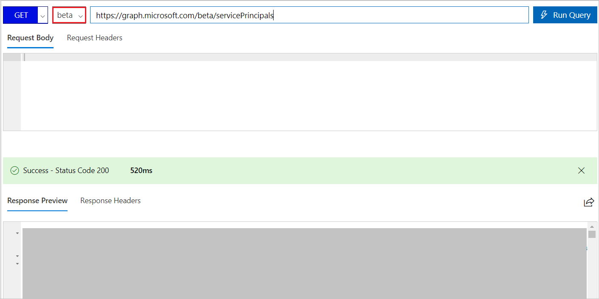
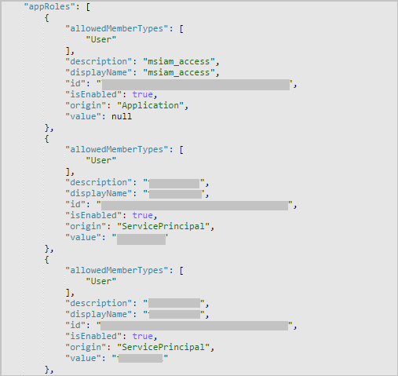
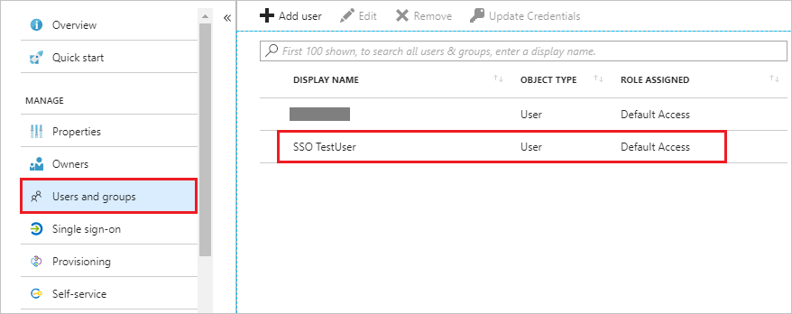
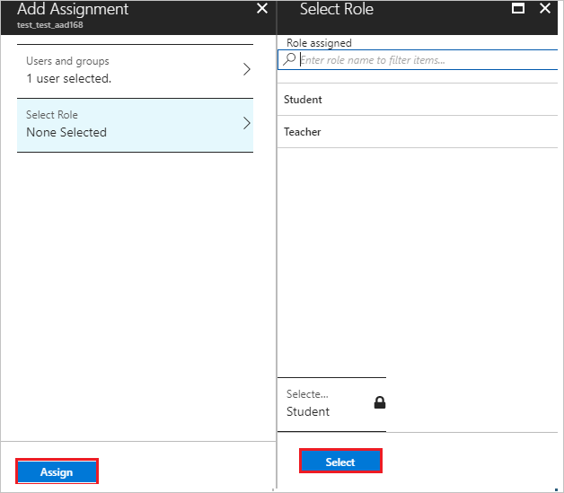

# Configuring Role claim issued in the SAML token for enterprise applications in Azure Active Directory

This feature allows users to customize the claim type for ‘roles’ claim in the response token received upon authorizing an app using Azure AD.

## Prerequisites
- An Azure AD subscription with directory setup
- A single sign-on enabled subscription
- You must configure SSO with your application

## When to use this feature

If your application expects custom roles to be passed in SAML response, you need to use this feature. This feature allows you to create as many roles as you need to be passed back from Azure AD to your application.

## Steps to use this feature

1. In the **[Azure portal](https://portal.azure.com)**, on the left navigation panel, click **Azure Active Directory** icon. 

	![The Azure Active Directory button][1]

2. Navigate to **Enterprise applications**. Then go to **All applications**.

	![The Enterprise applications blade][2]
	
3. To add new application, click **New application** button on the top of dialog.

	![The New application button][3]

4. In the search box, type the name of your application, select your application from result panel then click **Add** button to add the application.

	

5. Once the application is added, go to **Properties** page and copy the **Object ID**

	

6. Open [Azure AD Graph Explorer](https://developer.microsoft.com/graph/graph-explorer) in another window.

	a. Sign in to the Graph Explorer site using the global Admin/Co-admin credentials for your tenant.

	b. Change the version to **beta** and fetch the list of service Principals from your tenant using following query:
	
	 `https://graph.microsoft.com/beta/servicePrincipals`
		
	If you are using multiple directories, then you should follow this pattern `https://graph.microsoft.com/beta/contoso.com/servicePrincipals`
	
	
	
	c. From the list of service Principals fetched, get the one you need to modify. You can also use the Ctrl+F to search the application from all the listed ServicePrincipals. Search for the **Object id**, which you have copied from Properties page and use following query to get to the respective Service Principal.
	
	`https://graph.microsoft.com/beta/servicePrincipals/<objectID>`.

	d. Extract the appRoles property from the service principal object.

	

	e. You need to generate new roles for your application now. You can download Azure AD role Generator from [here](https://app.box.com/s/jw6m9p9ehmf4ut5jx8xhcw87cu09ml3y).

	f. Open the Azure AD Generator and perform following steps -

	
	
	Enter **Role Name**, **Role Description**, and **Role Value**. Click **Add** to add the role
	
	After you have added all the required roles, click **Generate**
	
	Copy the content by clicking **Copy Content**

	> [!NOTE] 
	> Please make sure that you have **msiam_access** user role and the id is matching in the generated role.

	g. Go back to your Graph Explorer. Change the method from **GET** to **PATCH**. Patch the service principal object to have desired appRoles by updating appRoles property with the copied values. Click **Run Query**.

	

	> [!NOTE]
	> Following is an example of appRoles object. 
	> 
	>	```
	> {
	> "appRoles": [
	> {
	>	"allowedMemberTypes": [
	>	"User"
	>	],
	>	"description": "msiam_access",
	>	"displayName": "msiam_access",
	>	"id": "7dfd756e-8c27-4472-b2b7-38c17fc5de5e",
	>	"isEnabled": true,
	>	"origin": "Application",
	>	"value": null
	> },
	> {
	>	"allowedMemberTypes": [
	>	"User"
	>	],
	>	"description": "teacher",
	>	"displayName": "teacher",
	>	"id": "6478ffd2-5dbd-4584-b2ce-137390b09b60",
	>	"isEnabled": ,
	>	"origin": "ServicePrincipal",
	>	"value": "teacher"
	> }
	> ] 
	> }
	>
	>	```

7. After the service principal is patched with more roles, we can assign users to the respective roles. This can be done by going to Portal and navigating to the respective app. Then, clicking on the **Users and Groups** tab on top. This process will list all the users or groups.

	

	a. To assign a role to any user, just select the particular user/group and click on **Assign** button in the bottom part of the page.

	

	b. Clicking that brings a pop-up to select a role from different roles that are defined for the respective service principal.

	c. Choose the required role and click on submit.

8. After assigning roles to the users, we need to update **Attributes** table to define customized mapping of **role** claim.

9. In the **User Attributes** section on the **Single sign-on** dialog, configure SAML token attribute as shown in the image and perform the following steps:
	
	| Attribute Name | Attribute Value |
	| -------------- | ----------------|    
	| Role Name 	 | user.assignedrole |

	a. Click **Add attribute** to open the **Add Attribute** dialog.

	

	

	b. In the **Name** textbox, type the attribute name shown for that row.

	c. From the **Value** list, type the attribute value shown for that row.

	d. Leave the **Namespace** blank.
	
	e. Click **Ok**.

10. To test your application in IDP initiated Single Sign on, log into the Access Panel (https://myapps.microsoft.com) and click on your application tile. In the SAML token you should see all the assigned roles for the user with the claim name you have given.

## Update existing role

1. To update an existing role, perform following steps -

	a. Open [Azure AD Graph Explorer](https://developer.microsoft.com/graph/graph-explorer) in another window.

	b. Sign in to the Graph Explorer site using the global Admin/Co-admin credentials for your tenant.
	
	c. Change the version to **beta** and fetch the list of service Principals from your tenant using following query:
	
	`https://graph.microsoft.com/beta/servicePrincipals`
		
	If you are using multiple directories, then you should follow this pattern `https://graph.microsoft.com/beta/contoso.com/servicePrincipals`
	
	
	
	d. From the list of service Principals fetched, get the one you need to modify. You can also use the Ctrl+F to search the application from all the listed ServicePrincipals. Search for the **Object id**, which you have copied from Properties page and use following query to get to the respective Service Principal.
	
	`https://graph.microsoft.com/beta/servicePrincipals/<objectID>`.
	
	e. Extract the appRoles property from the service principal object.
	
	
	
	f. To update the existing role, please follow below steps:

	
	
	* Change the method from **GET** to **PATCH**.

	* Copy the existing roles from the application and paste them in to the **Request Body**.
	
	* Update the value of role by replacing the **Role description**, **Role value**, and **Role displayname** as per your organization requirement.
	
	* After you have updated all the required roles, click **Run Query**.
		
## Delete existing role

1. To delete an  existing role, perform following steps -

	a. Open [Azure AD Graph Explorer](https://developer.microsoft.com/graph/graph-explorer) in another window.

	b. Sign in to the Graph Explorer site using the global Admin/Co-admin credentials for your tenant.

	c. Change the version to **beta** and fetch the list of service Principals from your tenant using following query:
	
	`https://graph.microsoft.com/beta/servicePrincipals`
	
	If you are using multiple directories, then you should follow this pattern `https://graph.microsoft.com/beta/contoso.com/servicePrincipals`
	
	
	
	d. From the list of service Principals fetched, get the one you need to modify. You can also use the Ctrl+F to search the application from all the listed ServicePrincipals. Search for the **Object id**, which you have copied from Properties page and use following query to get to the respective Service Principal.
	 
	`https://graph.microsoft.com/beta/servicePrincipals/<objectID>`.
	
	e. Extract the appRoles property from the service principal object.
	
	

	f. To delete the existing role, please follow below steps:

	

	Change the method from **GET** to **PATCH**.

	Copy the existing roles from the application and paste them in the **Request Body**.
	
	Set the **IsEnabled** value to **false** for the role which you want to delete

	Click **Run Query**.
	
	> [!NOTE] 
	> Please make sure that you have **msiam_access** user role and the id is matching in the generated role.
	
	g. After doing the above process, keep the method as **PATCH** and paste the remianing role content in the **Request Body** and click **Run Query**.
	
	

	h. After running the query the role will be deleted.
	
	> [!NOTE]
	> The role needs to be disabled first before it can be removed. 

## Next Steps

Refer [App documentation ](https://docs.microsoft.com/en-us/azure/active-directory/active-directory-saas-tutorial-list) for the additional steps.

<!--Image references-->
<!--Image references-->

[1]: ./media/active-directory-enterprise-app-role-management/tutorial_general_01.png
[2]: ./media/active-directory-enterprise-app-role-management/tutorial_general_02.png
[3]: ./media/active-directory-enterprise-app-role-management/tutorial_general_03.png
[4]: ./media/active-directory-enterprise-app-role-management/tutorial_general_04.png
