# How to: Configure the role claim issued in the SAML token for enterprise applications

By using Azure Active Directory (Azure AD), you can customize the claim type for the role claim in the response token that you receive after you authorize an app.

## Prerequisites

- An Azure AD subscription with directory setup.
- A subscription that has single sign-on (SSO) enabled. You must configure SSO with your application.

## When to use this feature

If your application expects custom roles to be passed in a SAML response, you need to use this feature. You can create as many roles as you need to be passed back from Azure AD to your application.

## Create roles for an application

1. In the [Azure portal](https://portal.azure.com), in the left pane, select the **Azure Active Directory** icon.

    ![Azure Active Directory icon][1]

2. Select **Enterprise applications**. Then select **All applications**.

    ![Enterprise applications pane][2]

3. To add a new application, select the **New application** button on the top of the dialog box.

    !["New application" button][3]

4. In the search box, type the name of your application, and then select your application from the result panel. Select the **Add** button to add the application.

    

5. After the application is added, go to the **Properties** page and copy the object ID.

    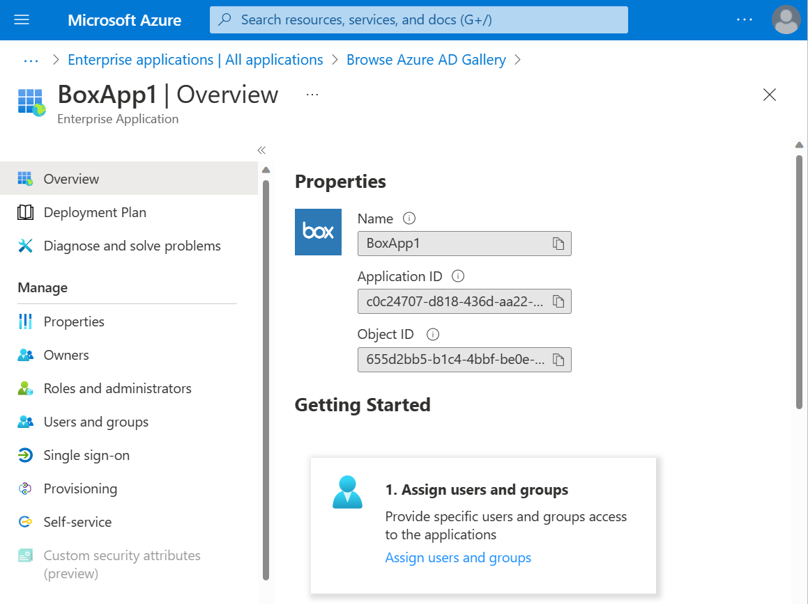

6. Open [Azure AD Graph Explorer](https://developer.microsoft.com/graph/graph-explorer) in another window and take the following steps:

    a. Sign in to the Graph Explorer site by using the global admin or coadmin credentials for your tenant.

    b. You need sufficient permissions to create the roles. Select **modify permissions** to get the permissions.

      

    c. Select the following permissions from the list (if you don't have these already) and select **Modify Permissions**.

	  

	> [!Note]
	> Cloud App Administrator and App Administrator role will not work in this scenario as we need the Global Admin permissions for Directory Read and Write.

    d. Accept the consent. You're logged in to the system again.

    e. Change the version to **beta**, and fetch the list of service principals from your tenant by using the following query:

	 `https://graph.microsoft.com/beta/servicePrincipals`

	  If you're using multiple directories, follow this pattern: `https://graph.microsoft.com/beta/contoso.com/servicePrincipals`

	  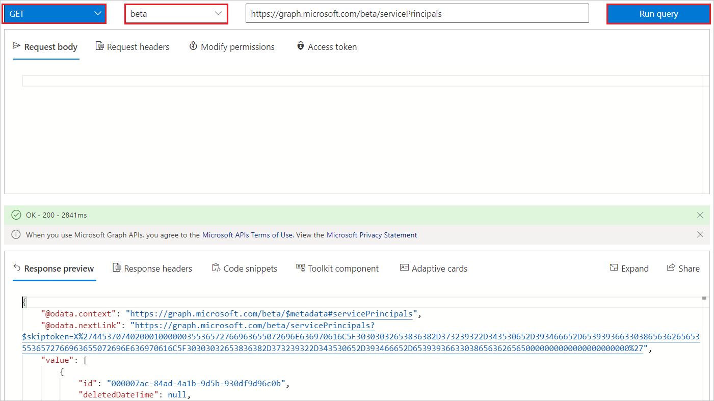

      > [!Note]
      > We are already in the process of upgrading the APIs so customers might see some disruption in the service.

    f. From the list of fetched service principals, get the one that you need to modify. You can also use Ctrl+F to search the application from all the listed service principals. Search for the object ID that you copied from the **Properties** page, and use the following query to get to the service principal:

	  `https://graph.microsoft.com/beta/servicePrincipals/<objectID>`

	  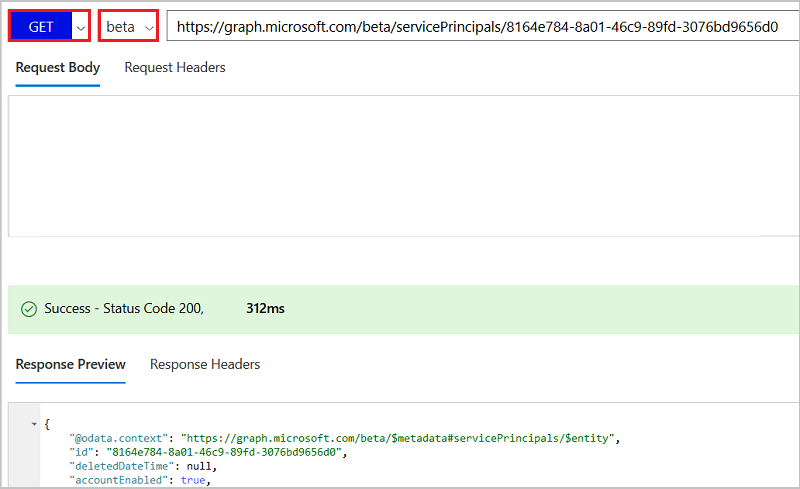

    g. Extract the **appRoles** property from the service principal object.

	  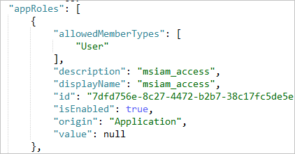

	  > [!Note]
	  > If you're using the custom app (not the Azure Marketplace app), you see two default roles: user and msiam_access. For the Marketplace app, msiam_access is the only default role. You don't need to make any changes in the default roles.

    h. Generate new roles for your application.

      The following JSON is an example of the **appRoles** object. Create a similar object to add the roles that you want for your application.

	  ```
	  {
	     "appRoles": [
          {
              "allowedMemberTypes": [
                  "User"
              ],
              "description": "msiam_access",
              "displayName": "msiam_access",
              "id": "b9632174-c057-4f7e-951b-be3adc52bfe6",
              "isEnabled": true,
              "origin": "Application",
              "value": null
          },
          {
              "allowedMemberTypes": [
                  "User"
              ],
              "description": "Administrators Only",
              "displayName": "Admin",
              "id": "4f8f8640-f081-492d-97a0-caf24e9bc134",
              "isEnabled": true,
              "origin": "ServicePrincipal",
              "value": "Administrator"
          }
      ]
	  }
	  ```

	  > [!Note]
      > You can only add new roles after msiam_access for the patch operation. Also, you can add as many roles as your organization needs. Azure AD will send the value of these roles as the claim value in the SAML response. To generate the GUID values for the ID of new roles use the web tools like [this](https://www.guidgenerator.com/)

	i. Go back to Graph Explorer and change the method from **GET** to **PATCH**. Patch the service principal object to have the desired roles by updating the **appRoles** property like the one shown in the preceding example. Select **Run Query** to execute the patch operation. A success message confirms the creation of the role.

      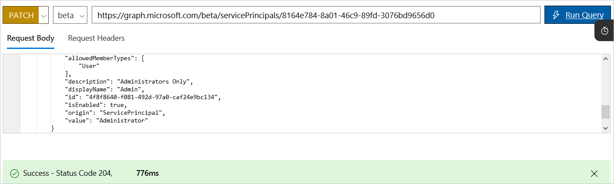

7. After the service principal is patched with more roles, you can assign users to the respective roles. You can assign the users by going to portal and browsing to the application. Select the **Users and groups** tab. This tab lists all the users and groups that are already assigned to the app. You can add new users on the new roles. You can also select an existing user and select **Edit** to change the role.

    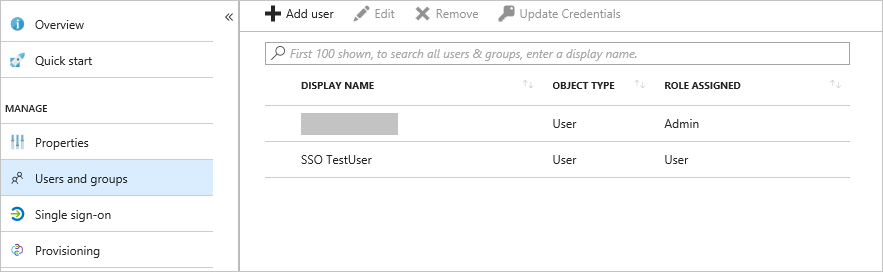

    To assign the role to any user, select the new role and select the **Assign** button on the bottom of the page.

    

    > [!Note]
    > You need to refresh your session in the Azure portal to see new roles.

8. Update the **Attributes** table to define a customized mapping of the role claim.

9. In the **User Attributes** section of the **Single sign-on** dialog box, configure the SAML token attribute as shown in the image and perform the following steps.

    | Attribute name | Attribute value |
    | -------------- | ----------------|
    | Role name  | user.assignedroles |

    a. Select **Add attribute** to open the **Add Attribute** pane.

      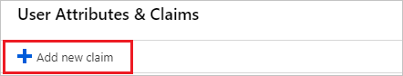

      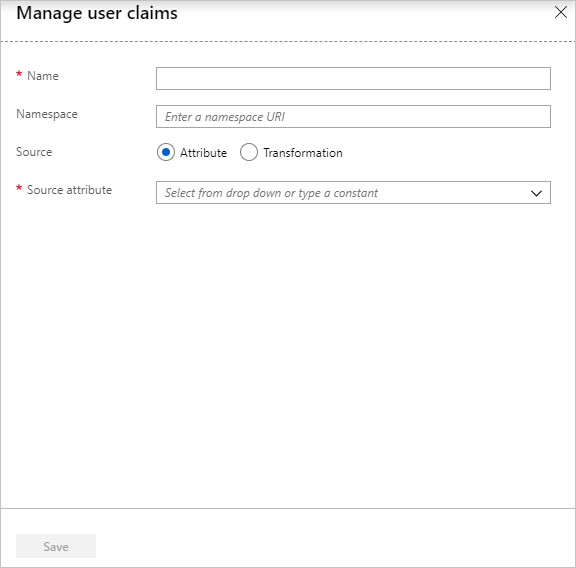

    b. In the **Name** box, type the attribute name as needed. This example uses **Role Name** as the claim name.

    c. From the **Value** list, type the attribute value shown for that row.

    d. Leave the **Namespace** box blank.

    e. Select **Ok**.

10. To test your application in a single sign-on that's initiated by an identity provider, sign in to the [Access Panel](https://myapps.microsoft.com) and select your application tile. In the SAML token, you should see all the assigned roles for the user with the claim name that you have given.

## Update an existing role

To update an existing role, perform the following steps:

1. Open [Azure AD Graph Explorer](https://developer.microsoft.com/graph/graph-explorer).

2. Sign in to the Graph Explorer site by using the global admin or coadmin credentials for your tenant.

3. Change the version to **beta**, and fetch the list of service principals from your tenant by using the following query:

    `https://graph.microsoft.com/beta/servicePrincipals`

    If you're using multiple directories, follow this pattern: `https://graph.microsoft.com/beta/contoso.com/servicePrincipals`

    

4. From the list of fetched service principals, get the one that you need to modify. You can also use Ctrl+F to search the application from all the listed service principals. Search for the object ID that you copied from the **Properties** page, and use the following query to get to the service principal:

    `https://graph.microsoft.com/beta/servicePrincipals/<objectID>`

    

5. Extract the **appRoles** property from the service principal object.

    

6. To update the existing role, use the following steps.

    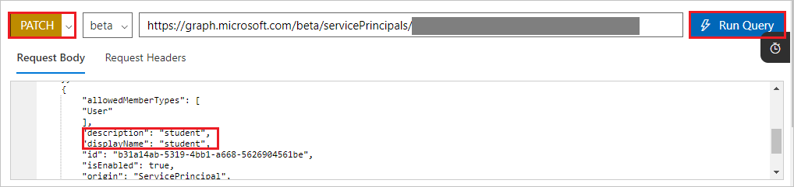

    a. Change the method from **GET** to **PATCH**.

    b. Copy the existing roles and paste them under **Request Body**.

    c. Update the value of a role by updating the role description, role value, or role display name as needed.

    d. After you update all the required roles, select **Run Query**.

## Delete an existing role

To delete an  existing role, perform the following steps:

1. Open [Azure AD Graph Explorer](https://developer.microsoft.com/graph/graph-explorer) in another window.

2. Sign in to the Graph Explorer site by using the global admin or coadmin credentials for your tenant.

3. Change the version to **beta**, and fetch the list of service principals from your tenant by using the following query:

    `https://graph.microsoft.com/beta/servicePrincipals`

	If you're using multiple directories, follow this pattern: `https://graph.microsoft.com/beta/contoso.com/servicePrincipals`

    

4. From the list of fetched service principals, get the one that you need to modify. You can also use Ctrl+F to search the application from all the listed service principals. Search for the object ID that you copied from the **Properties** page, and use the following query to get to the service principal:

    `https://graph.microsoft.com/beta/servicePrincipals/<objectID>`

    

5. Extract the **appRoles** property from the service principal object.

    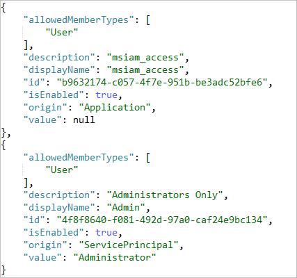

6. To delete the existing role, use the following steps.

    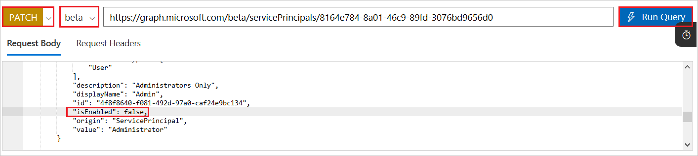

    a. Change the method from **GET** to **PATCH**.

    b. Copy the existing roles from the application and paste them under **Request Body**.

    c. Set the **IsEnabled** value to **false** for the role that you want to  delete.

    d. Select **Run Query**.

    > [!NOTE]
    > Make sure that you have the msiam_access role, and the ID is matching in the generated role.

7. After the role is disabled, delete that role block from the **appRoles** section. Keep the method as **PATCH**, and select **Run Query**.

8. After you run the query, the role is deleted.

    > [!NOTE]
    > The role needs to be disabled before it can be removed.

## Next steps

For additional steps, see the [app documentation](https://docs.microsoft.com/azure/active-directory/active-directory-saas-tutorial-list).

<!--Image references-->
<!--Image references-->

[1]: ./media/active-directory-enterprise-app-role-management/tutorial_general_01.png
[2]: ./media/active-directory-enterprise-app-role-management/tutorial_general_02.png
[3]: ./media/active-directory-enterprise-app-role-management/tutorial_general_03.png
[4]: ./media/active-directory-enterprise-app-role-management/tutorial_general_04.png