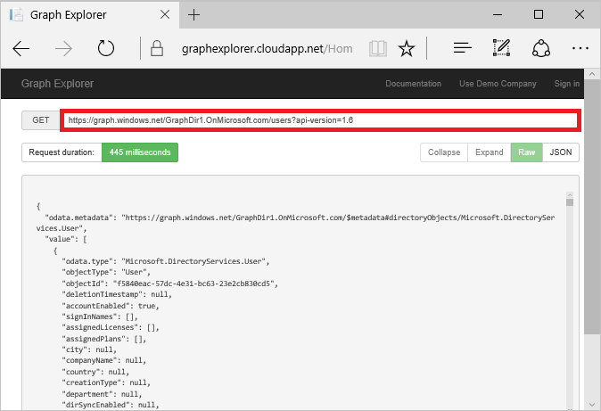

# How to: Use the Azure AD Graph API

> [!IMPORTANT]
> We strongly recommend that you use [Microsoft Graph](https://developer.microsoft.com/graph) instead of Azure AD Graph API to access Azure Active Directory (Azure AD) resources. Our development efforts are now concentrated on Microsoft Graph and no further enhancements are planned for Azure AD Graph API. There are a very limited number of scenarios for which Azure AD Graph API might still be appropriate; for more information, see the [Microsoft Graph or the Azure AD Graph](https://dev.office.com/blogs/microsoft-graph-or-azure-ad-graph) blog post and [Migrate Azure AD Graph apps to Microsoft Graph](https://docs.microsoft.com/graph/migrate-azure-ad-graph-overview).

The Azure AD Graph API provides programmatic access to Azure AD through OData REST API endpoints. Applications can use Azure AD Graph API to perform create, read, update, and delete (CRUD) operations on directory data and objects. For example, you can use Azure AD Graph API to create a new user, view or update user’s properties, change user’s password, check group membership for role-based access, disable, or delete the user. For more information on Azure AD Graph API features and application scenarios, see [Azure AD Graph API](https://msdn.microsoft.com/Library/Azure/Ad/Graph/api/api-catalog) and [Azure AD Graph API prerequisites](https://msdn.microsoft.com/library/hh974476.aspx). Azure AD Graph API only works with work or school/organization accounts.

This article applies to Azure AD Graph API. For similar info related to Microsoft Graph API, see [Use the Microsoft Graph API](https://developer.microsoft.com/graph/docs/concepts/use_the_api).

## How to construct a Graph API URL

In Graph API, to access directory data and objects (in other words, resources or entities) against which you want to perform CRUD operations, you can use URLs based on the Open Data (OData) Protocol. The URLs used in Graph API consist of four main parts: service root, tenant identifier, resource path, and query string options: `https://graph.windows.net/{tenant-identifier}/{resource-path}?[query-parameters]`. Take the example of the following URL: `https://graph.windows.net/contoso.com/groups?api-version=1.6`.

* **Service Root**: In Azure AD Graph API, the service root is always https://graph.windows.net.
* **Tenant identifier**: This section can be a verified (registered) domain name, in the preceding example, contoso.com. It can also be a tenant object ID or the “myorganization” or “me” alias. For more information, see [Addressing entities and operations in Azure AD Graph API](https://msdn.microsoft.com/Library/Azure/Ad/Graph/howto/azure-ad-graph-api-operations-overview).
* **Resource path**: This section of a URL identifies the resource to be interacted with (users, groups, a particular user, or a particular group, etc.) In the example above, it is the top level “groups” to address that resource set. You can also address a specific entity, for example “users/{objectId}” or “users/userPrincipalName”.
* **Query parameters**: A question mark (?) separates the resource path section from the query parameters section. The “api-version” query parameter is required on all requests in Azure AD Graph API. Azure AD Graph API also supports the following OData query options: **$filter**, **$orderby**, **$expand**, **$top**, and **$format**. The following query options are not currently supported: **$count**, **$inlinecount**, and **$skip**. For more information, see [Supported Queries, Filters, and Paging Options in Azure AD Graph API](https://msdn.microsoft.com/Library/Azure/Ad/Graph/howto/azure-ad-graph-api-supported-queries-filters-and-paging-options).

## Graph API versions

You specify the version for a Graph API request in the “api-version” query parameter. For version 1.5 and later, you use a numerical version value; api-version=1.6. For earlier versions, you use a date string that adheres to the format YYYY-MM-DD; for example, api-version=2013-11-08. For preview features, use the string “beta”; for example, api-version=beta. For more information about differences between Graph API versions, see [Azure AD Graph API versioning](https://msdn.microsoft.com/Library/Azure/Ad/Graph/howto/azure-ad-graph-api-versioning).

## Graph API metadata

To return the Azure AD Graph API metadata file, add the “$metadata” segment after the tenant-identifier in the URL For example, the following URL returns metadata for a demo company: `https://graph.windows.net/GraphDir1.OnMicrosoft.com/$metadata?api-version=1.6`. You can enter this URL in the address bar of a web browser to see the metadata. The CSDL metadata document returned describes the entities and complex types, their properties, and the functions and actions exposed by the version of Graph API you requested. Omitting the api-version parameter returns metadata for the most recent version.

## Common queries

[Azure AD Graph API common queries](https://msdn.microsoft.com/Library/Azure/Ad/Graph/howto/azure-ad-graph-api-supported-queries-filters-and-paging-options#CommonQueries) lists common queries that can be used with the Azure AD Graph, including queries that can be used to access top-level resources in your directory and queries to perform operations in your directory.

For example, `https://graph.windows.net/contoso.com/tenantDetails?api-version=1.6` returns company information for directory contoso.com.

Or `https://graph.windows.net/contoso.com/users?api-version=1.6` lists all user objects in the directory contoso.com.

## Using the Azure AD Graph Explorer
You can use the Azure AD Graph Explorer for the Azure AD Graph API to query the directory data as you build your application.

The following screenshot is the output you would see if you were to navigate to the Azure AD Graph Explorer, sign in, and enter `https://graph.windows.net/GraphDir1.OnMicrosoft.com/users?api-version=1.6` to display all the users in the signed-in user's directory:



**Load the Azure AD Graph Explorer**: To load the tool, navigate to [https://graphexplorer.azurewebsites.net/](https://graphexplorer.azurewebsites.net/). Click **Login** and sign-in with your Azure AD account credentials to run the Azure AD Graph Explorer against your tenant. If you run Azure AD Graph Explorer against your own tenant, either you or your administrator needs to consent during sign-in. If you have an Office 365 subscription, you automatically have an Azure AD tenant. The credentials you use to sign in to Office 365 are, in fact, Azure AD accounts, and you can use these credentials with Azure AD Graph Explorer.

**Run a query**: To run a query, type your query in the request text box and click **GET** or click the **enter** key. The results are displayed in the response box. For example, `https://graph.windows.net/myorganization/groups?api-version=1.6` lists all group objects in the signed-in user's directory.

Note the following features and limitations of the Azure AD Graph Explorer:

* Autocomplete capability on resource sets. To see this functionality, click on the request text box (where the company URL appears). You can select a resource set from the dropdown list.
* Request history.
* Supports the “me” and “myorganization” addressing aliases. For example, you can use `https://graph.windows.net/me?api-version=1.6` to return the user object of the signed-in user or `https://graph.windows.net/myorganization/users?api-version=1.6` to return all users in the signed-in user's directory.
* Supports full CRUD operations against your own directory using `POST`, `GET`, `PATCH` and `DELETE`.
* A response headers section. This section can be used to help troubleshoot issues that occur when running queries.
* A JSON viewer for the response with expand and collapse capabilities.
* No support for displaying or uploading a thumbnail photo.

## Using Fiddler to write to the directory

For the purposes of this Quickstart guide, you can use the Fiddler Web Debugger to practice performing ‘write’ operations against your Azure AD directory. For example, you can get and upload a user's profile photo (which is not possible with Azure AD Graph Explorer). For more information and to install Fiddler, see [https://www.telerik.com/fiddler](https://www.telerik.com/fiddler).

In the example below, you use Fiddler Web Debugger to create a new security group ‘MyTestGroup’ in your Azure AD directory.

**Obtain an access token**: To access Azure AD Graph, clients are required to successfully authenticate to Azure AD first. For more information, see [Authentication scenarios for Azure AD](v1-authentication-scenarios.md).

**Compose and run a query**: Complete the following steps:

1. Open Fiddler Web Debugger and switch to the **Composer** tab.
2. Since you want to create a new security group, select **Post** as the HTTP method from the pull-down menu. For more information about operations and permissions on a group object, see [Group](https://msdn.microsoft.com/Library/Azure/Ad/Graph/api/entity-and-complex-type-reference#group-entity) within the [Azure AD Graph REST API reference](https://msdn.microsoft.com/Library/Azure/Ad/Graph/api/api-catalog).
3. In the field next to **Post**, type in the following request URL: `https://graph.windows.net/{mytenantdomain}/groups?api-version=1.6`.
   
   > [!NOTE]
   > You must substitute {mytenantdomain} with the domain name of your own Azure AD directory.

4. In the field directly below Post pull-down, type the following HTTP header:
   
    ```
   Host: graph.windows.net
   Authorization: Bearer <your access token>
   Content-Type: application/json
   ```
   
   > [!NOTE]
   > Substitute your &lt;your access token&gt; with the access token for your Azure AD directory.

5. In the **Request body** field, type the following JSON:
   
    ```
        {
            "displayName":"MyTestGroup",
            "mailNickname":"MyTestGroup",
            "mailEnabled":"false",
            "securityEnabled": true
        }
   ```
   
    For more information about creating groups, see [Create Group](https://msdn.microsoft.com/Library/Azure/Ad/Graph/api/groups-operations#CreateGroup).

For more information on Azure AD entities and types that are exposed by Graph and information about the operations that can be performed on them with Graph, see [Azure AD Graph REST API reference](https://msdn.microsoft.com/Library/Azure/Ad/Graph/api/api-catalog).

## Next steps

* Learn more about the [Azure AD Graph API](https://msdn.microsoft.com/Library/Azure/Ad/Graph/api/api-catalog)
* Learn more about [Azure AD Graph API permission scopes](https://msdn.microsoft.com/Library/Azure/Ad/Graph/howto/azure-ad-graph-api-permission-scopes)
