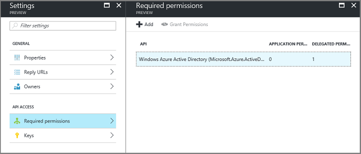
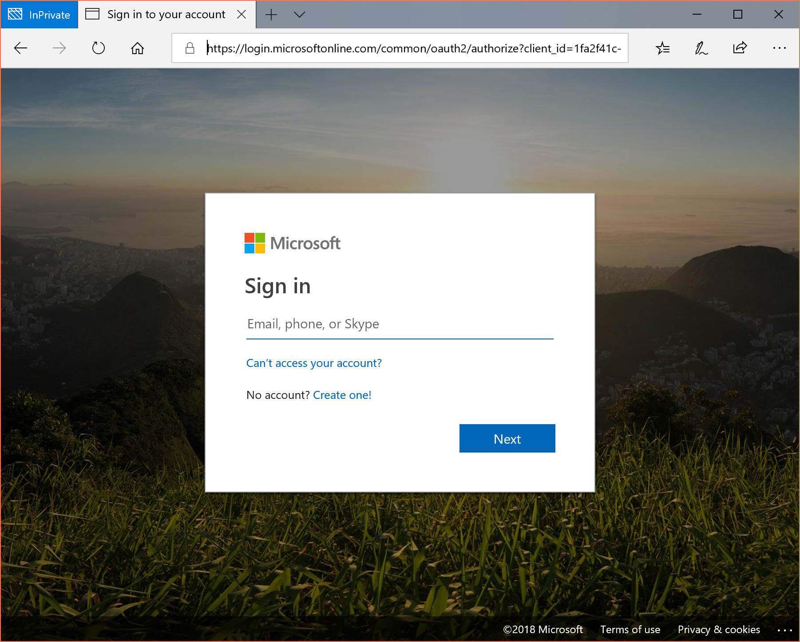
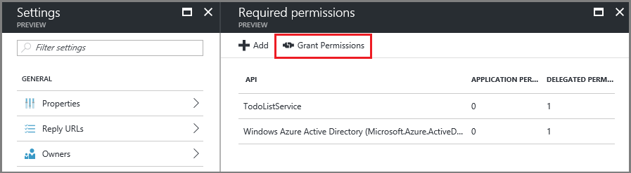
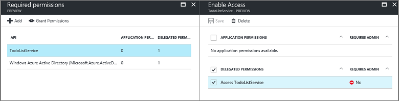

# Integrating applications with Azure Active Directory
[!INCLUDE [active-directory-devguide](../../../includes/active-directory-devguide.md)]

Enterprise developers and software-as-a-service (SaaS) providers can develop commercial cloud services or line of business applications that can be integrated with Azure Active Directory (Azure AD) to provide secure sign in and authorization for their services. To integrate an application or service with Azure AD, a developer must first register the details about their application with Azure AD through the Azure classic portal.

This article shows you how to add, update, or remove an application in Azure AD. You will learn about the different types of applications that can be integrated with Azure AD, how to configure your applications to access other resources such as web APIs, and more.

To learn more about the two Azure AD objects that represent a registered application and the relationship between them, see [Application Objects and Service Principal Objects](active-directory-application-objects.md); to learn more about the branding guidelines you should use when developing applications with Azure Active Directory, see [Branding Guidelines for Integrated Apps](active-directory-branding-guidelines.md).

## Adding an application
Any application that wants to use the capabilities of Azure AD must first be registered in an Azure AD tenant. This registration process involves giving Azure AD details about your application, such as the URL where it’s located, the URL to send replies after a user is authenticated, the URI that identifies the app, and so on.

If you’re building a web application that just needs to support sign-in for users in Azure AD, you can simply follow the instructions below. If your application needs credentials or permissions to access to a web API, or needs to allow users from other Azure AD tenants to access it, see [Updating an Application](#updating-an-application) section to continue configuring your application.

### To register a new application in the Azure portal
1. Sign in to the [Azure portal](https://portal.azure.com).
2. Choose your Azure AD tenant by selecting your account in the top right corner of the page.
3. In the left-hand navigation pane, choose **More Services**, click **App Registrations**, and click **Add**.
4. Follow the prompts and create a new application. If you'd like specific examples for web applications or native applications, check out our [quickstarts](active-directory-developers-guide.md).
  * For Web Applications, provide the **Sign-On URL**, which is the base URL of your app, where users can sign in e.g `http://localhost:12345`.
<!--TODO: add once App ID URI is configurable: The **App ID URI** is a unique identifier for your application. The convention is to use `https://<tenant-domain>/<app-name>`, e.g. `https://contoso.onmicrosoft.com/my-first-aad-app`-->
  * For Native Applications, provide a **Redirect URI**, which Azure AD uses to return token responses. Enter a value specific to your application, .e.g `http://MyFirstAADApp`
5. Once you've completed registration, Azure AD assigns your application a unique client identifier, the Application ID. Your application has been added, and you will be taken to the Quick Start page for your application. Depending on whether your application is a web or native application, you will see different options on how to add additional capabilities to your application. Once your application has been added, you can begin updating your application to enable users to sign in, access web APIs in other applications, or configure multi-tenant application (which allows other organizations to access your application).

> [!NOTE]
> By default, the newly created application registration is configured to allow users from your directory to sign in to your application.
> 
> 

## Updating an application
Once your application has been registered with Azure AD, it may need to be updated to provide access to web APIs, be made available in other organizations, and more. This section describes various ways in which you may need to configure your application further. First we will start with an overview of the Consent Framework, which is important to understand if you are building resource/API applications that will be consumed by client applications built by developers in your organization or another organization.

For more information on the way authentication works in Azure AD, see [Authentication Scenarios for Azure AD](active-directory-authentication-scenarios.md).

### Overview of the consent framework
Azure AD’s consent framework makes it easy to develop multi-tenant web and native client applications that need to access web APIs secured by an Azure AD tenant, different from the one where the client application is registered. These web APIs include the Microsoft Graph API (to access Azure Active Directory, Intune, and services in Office 365) and other Microsoft services APIs, in addition to your own web APIs. The framework is based on a user or an administrator giving consent to an application that asks to be registered in their directory, which may involve accessing directory data.

For example, if a web client application needs to read calendar information about the user from Office 365, that user will be required to consent to the client application. After consent is given, the client application will be able to call the Microsoft Graph API on behalf of the user, and use the calendar information as needed. The [Microsoft Graph API](https://graph.microsoft.io) provides access to data in Office 365 (like calendars and messages from Exchange, sites and lists from SharePoint, documents from OneDrive, notebooks from OneNote, tasks from Planner, workbooks from Excel, etc.), as well as users and groups from Azure AD and other data objects from more Microsoft cloud services. 

The consent framework is built on OAuth 2.0 and its various flows, such as authorization code grant and client credentials grant, using public or confidential clients. By using OAuth 2.0, Azure AD makes it possible to build many different types of client applications, such as on a phone, tablet, server, or a web application, and gain access to the required resources.

For more detailed information about the consent framework, see [OAuth 2.0 in Azure AD](https://msdn.microsoft.com/library/azure/dn645545.aspx), [Authentication Scenarios for Azure AD](active-directory-authentication-scenarios.md), and for infomation about getting authorized access to Office 365 via Microsoft Graph, see [App authentication with Microsoft Graph](https://graph.microsoft.io/docs/authorization/auth_overview).

#### Example of the consent experience
The following steps will show you how the consent experience works for both the application developer and user.

1. On your web client application’s configuration page in the Azure portal, set the permissions your application requires by using the menus in the Required Permissions section.
   
    
2. Consider that your application’s permissions have been updated, the application is running, and a user is about to use it for the first time. If the application has not already acquired an access or refresh token, the application needs to go to Azure AD’s authorization endpoint to obtain an authorization code that can be used to acquire a new access and refresh token.
3. If the user is not already authenticated, they’ll be asked to sign in to Azure AD.
   
    
4. After the user has signed in, Azure AD will determine if the user needs to be shown a consent page. This determination is based on whether the user (or their organization’s administrator) has already granted the application consent. If consent has not already been granted, Azure AD will prompt the user for consent and will display the required permissions it needs to function. The set of permissions that is displayed in the consent dialog are the same as what was selected in the Delegated Permissions in the Azure portal.
   
    
5. After the user grants consent, an authorization code is returned to your application, which can be redeemed to acquire an access token and refresh token. For more information about this flow, see the [web Application to web API section](active-directory-authentication-scenarios.md#web-application-to-web-api) section in [Authentication Scenarios for Azure AD](active-directory-authentication-scenarios.md).

6. As an administrator, you can also consent to an application's delegated permissions on behalf of all the users in your tenant. This will prevent the consent dialog from appearing for every user in the tenant. You can do this from the [Azure portal](https://portal.azure.com) from your application page. From the **Settings** blade for your application, click **Required Permissions** and click on the **Grant Permissions** button. 

    
    
> [!NOTE]
> Granting explicit consent using the **Grant Permissions** button is currently required for single page applications (SPA) using ADAL.js, as the access token is 
> requested without a consent prompt, which will fail if consent is not already granted.   

### Configuring a client application to access web APIs
In order for a web/confidential client application to be able to participate in an authorization grant flow that requires authentication (and obtain an access token), it must establish secure credentials. The default authentication method supported by the Azure portal is Client ID + symmetric key. This section will cover the configuration steps required to provide the secret key your client's credentials.

Additionally, before a client can access a web API exposed by a resource application (ie: Microsoft Graph API), the consent framework will ensure the client obtains the permission grant required, based on the permissions requested. By default, all applications can choose permissions from Azure Active Directory (Graph API) and Azure Service Management API, with the Azure AD “Enable sign on and read user’s profile” permission already selected by default. If your client application is being registered in an Office 365 Azure AD tenant, web APIs and permissions for SharePoint and Exchange Online will also be available for selection. You can select from [two types of permissions](active-directory-dev-glossary.md#permissions) in the drop-down menus next to the desired web API:

* Application Permissions: Your client application needs to access the web API directly as itself (no user context). This type of permission requires administrator consent and is also not available for native client applications.
* Delegated Permissions: Your client application needs to access the web API as the signed-in user, but with access limited by the selected permission. This type of permission can be granted by a user unless the permission is configured as requiring administrator consent. 

> [!NOTE]
> Adding a delegated permission to an application does not automatically grant consent to the users within the tenant, as it did in the Azure Classic Portal. The users must still manually consent for the added delegated permissions at runtime, unless the administrator clicks the **Grant Permissions** button from the **Required Permissions** section of the application page in the Azure portal. 

#### To add credentials, or permissions to access web APIs
1. Sign in to the [Azure portal](https://portal.azure.com).
2. Choose your Azure AD tenant by selecting your account in the top right corner of the page.
3. On the top menu, choose **Azure Active Directory**, click **App Registrations**, and then click the application you want to configure. This will take you to the application's QuickStart page, as well as open up the Settings blade for the application.
4. To add a secret key for your web application's credentials, click the "Keys" section from the Settings blade.  
   
   * Add a description for your key and select either a 1 or 2 year duration. 
   * The right-most column will contain the key value, after you save the configuration changes. Be sure to come back to this section and copy it after you hit save, so you will have it for use in your client application during authentication at run-time.
5. To add permission(s) to access resource APIs from your client, click the "Required Permissions" section from the Settings blade. 
   
   * First, click the "Add" button.
   * Click "Select an API" to select the type of resources you want to pick from.
   * Browse through the list of available APIs or use the search box to select from the available resource applications in your directory that expose a web API. Click the resource you are interested in, then click **Select**.
   * Once selected, you can move to the **Select Permissions** menu, where you can select the "Application Permissions" and "Delegated Permissions" for your application.
   
6. When finished, click the **Done** button.

> [!NOTE]
> Clicking the **Done** button also automatically sets the permissions for your application in your directory based on the permissions to other applications that you configured.  You can view these application permissions by looking at the application **Settings** blade.
> 
> 

### Configuring a resource application to expose web APIs
You can develop a web API and make it available to client applications by exposing access [scopes](active-directory-dev-glossary.md#scopes) and [roles](active-directory-dev-glossary.md#roles). A correctly configured web API is made available just like the other Microsoft web APIs, including the Graph API and the Office 365 APIs. Access scopes and roles are exposed through your [application's manifest](active-directory-dev-glossary.md#application-manifest), which is a JSON file that represents your application’s identity configuration.  

The following section will show you how to expose access scopes, by modifying the resource application's manifest.

#### Adding access scopes to your resource application
1. Sign in to the [Azure portal](https://portal.azure.com).
2. Choose your Azure AD tenant by selecting your account in the top right corner of the page.
3. On the top menu, choose **Azure Active Directory**, click **App Registrations**, and then click the application you want to configure. This will take you to the application's QuickStart page, as well as open up the Settings blade for the application.
4. Click **Manifest** from the application page to open the inline manifest editor. 
5. Replace “oauth2Permissions” node with the following JSON snippet. This snippet is an example of how to expose a scope known as "user impersonation", which allows a resource owner to give a client application a type of delegated access to a resource. Make sure that you change the text and values for your own application:
   
        "oauth2Permissions": [
        {
            "adminConsentDescription": "Allow the application full access to the Todo List service on behalf of the signed-in     user",
            "adminConsentDisplayName": "Have full access to the Todo List service",
            "id": "b69ee3c9-c40d-4f2a-ac80-961cd1534e40",
            "isEnabled": true,
            "type": "User",
            "userConsentDescription": "Allow the application full access to the todo service on your behalf",
            "userConsentDisplayName": "Have full access to the todo service",
            "value": "user_impersonation"
            }
        ],
   
    The id value must be a new generated GUID that you create by using a [GUID generation tool](https://msdn.microsoft.com/library/ms241442%28v=vs.80%29.aspx) or programmatically. It represents a unique identifier for the permission that is exposed by the web API. Once your client is appropriately configured to request access to your web API and calls the web API, it will present an OAuth 2.0 JWT token that has the scope (scp) claim set to the value above, which in this case is user_impersonation.
   
   > [!NOTE]
   > You can expose additional scopes later as necessary. Consider that your web API might expose multiple scopes associated with a variety of different functions. Now you can control access to the web API by using the scope (scp) claim in the received OAuth 2.0 JWT token.
   > 
   > 
6. Click **Save** to save the manifest. Your web API is now configured to be used by other applications in your directory.

#### To verify the web API is exposed to other applications in your directory
1. On the top menu, click **App Registrations**, select the desired client application you want to configure access to the web API and navigate to the Settings blade.
2. From the **Required Permissions** section, select the web API that you just exposed a permission for. From the Delegated Permissions drop-down menu, select the new permission.

#### More on the application manifest
The application manifest actually serves as a mechanism for updating the Application entity, which defines all attributes of an Azure AD application's identity configuration, including the API access scopes we discussed. For more information on the Application entity, please see the [Graph API Application entity documentation](https://msdn.microsoft.com/Library/Azure/Ad/Graph/api/entity-and-complex-type-reference#application-entity). In it, you will find complete reference information on the Application entity members used to specify permissions for your API:  

* the appRoles member, which is a collection of [AppRole](https://msdn.microsoft.com/Library/Azure/Ad/Graph/api/entity-and-complex-type-reference#approle-type) entities that can be used to define the **Application Permissions** for a web API  
* the oauth2Permissions member, which is a collection of  [OAuth2Permission](https://msdn.microsoft.com/Library/Azure/Ad/Graph/api/entity-and-complex-type-reference#oauth2permission-type) entities that can be used to define the **Delegated Permissions** for a web API

For more information on application manifest concepts in general, please refer to [Understanding the Azure Active Directory application manifest](active-directory-application-manifest.md).

### Accessing the Azure AD Graph and Office 365 via Microsoft Graph APIs  
As mentioned earlier, in addition to exposing/accessing APIs on your own resource applications, you can also update your client application to access APIs exposed by Microsoft resources.  The Microsoft Graph API, which is called “Microsoft Graph” in the list of Permissions to other applications, is available or all applications that are registered with Azure AD. If you are registering your client application in an Azure AD tenant that was provisioned by Office 365, you can also access all of the permissions exposed by the Microsoft Graph API to various Office 365 resources.

For a complete discussion on access scopes exposed by Microsoft Graph API, please see the [Permission scopes | Microsoft Graph API concepts](https://graph.microsoft.io/docs/authorization/permission_scopes) article.

> [!NOTE]
> Due to a current limitation, native client applications can only call into the Azure AD Graph API if they use the “Access your organization's directory” permission.  This restriction does not apply for web applications.
> 
> 

### Configuring multi-tenant applications
When adding an application to Azure AD, you may want your application to be accessed only by users in your organization. Alternatively, you may want your application to be accessed by users in external organizations. These two application types are called single tenant and multi-tenant applications. You can modify the configuration of a single tenant application to make it a multi-tenant application, which this section discusses below.

It’s important to note the differences between a single tenant and multi-tenant application:  

* A single tenant application is intended for use in one organization. They are typically a line-of-business (LoB) application written by an enterprise developer. A single tenant application only needs to be accessed by users in one directory, and as a result, it only needs to be provisioned in one directory.
* A multi-tenant application intended for use in many organizations. They are a software-as-a-service (SaaS) web application typically written by an independent software vendor (ISV). Multi-tenant applications need to be provisioned in each directory where they will be used, which requires user or administrator consent to register them, supported via the Azure AD consent framework. Note that all native client applications are multi-tenant by default as they are installed on the resource owner's device. See the Overview of the Consent Framework section above for more details on the consent framework.

#### Enabling external users to grant your application access to their resources
If you are writing an application that you want to make available to your customers or partners outside of your organization, you will need to update the application definition in the Azure portal.

> [!NOTE]
> When enabling multi-tenant, you must ensure that your application’s App ID URI belongs in a verified domain. Additionally, the Return URL must begin with https://. For more information, see [Application Objects and Service Principal Objects](active-directory-application-objects.md).
> 
> 

To enable access to your app for external users: 

1. Sign in to the [Azure portal](https://portal.azure.com).
2. Choose your Azure AD tenant by selecting your account in the top right corner of the page.
3. On the top menu, choose **Azure Active Directory**, click **App Registrations**, and then click the application you want to configure. This will take you to the application's QuickStart page, as well as open up the Settings blade for the application.
4. From the Settings blade, click **Properties** and flip the **Multi-tenanted** switch to **Yes**.

Once you have made the change above, users and administrators in other organizations will be able to grant your application access to their directory and other data.

#### Triggering the Azure AD consent framework at runtime
To use the consent framework, multi-tenant client applications must request authorization using OAuth 2.0. [Code samples](https://azure.microsoft.com/documentation/samples/?service=active-directory&term=multi-tenant) are available to show you how a web application, native application, or server/daemon application requests authorization codes and access tokens to call web APIs.

Your web application may also offer a sign-up experience for users. If you do offer a sign-up experience, it is expected that the user will click on a sign up button that will redirect the browser to the Azure AD OAuth2.0 authorize endpoint or an OpenID Connect userinfo endpoint. These endpoints allow the application to get information about the new user by inspecting the id_token. Following the sign-up phase the user will be presented with a consent prompt similar to the one shown above in the Overview of the Consent Framework section.

Alternatively, your web application may also offer an experience that allows administrators to “sign up my company”. This experience would also redirect the user to the Azure AD OAuth 2.0 authorize endpoint. In this case though, you pass a prompt=admin_consent parameter to the authorize endpoint to force the administrator consent experience, where the administrator will grant consent on behalf of their organization. Only a user that authenticates with an account that belongs to the Global Admin role can provide consent; others will receive an error. On successful consent, the response will contain admin_consent=true. When redeeming an access token, you’ll also receive an id_token that will provide information on the organization and the administrator that signed up for your application.

### Enabling OAuth 2.0 implicit grant for Single Page Applications
Single Page Application’s (SPAs) are typically structured with a JavaScript-heavy front end that runs in the browser, which calls the application’s web API back end to perform its business logic. For SPAs hosted in Azure AD, you use OAuth 2.0 Implicit Grant to authenticate the user with Azure AD and obtain a token that you can use to secure calls from the application's JavaScript client to its back end web API. After the user has granted consent, this same authentication protocol can be used to obtain tokens to secure calls between the client and other web API resources configured for the application. To learn more about the implicit authorization grant, and help you decide whether it's right for your application scenario, see [Understanding the OAuth2 implicit grant flow in Azure Active Directory ](active-directory-dev-understanding-oauth2-implicit-grant.md).

By default, OAuth 2.0 implicit Grant is disabled for applications. You can enable OAuth 2.0 Implicit Grant for your application by setting the `oauth2AllowImplicitFlow` value in its [application manifest](active-directory-application-manifest.md), which is a JSON file that represents your application's identity configuration.

#### To enable OAuth 2.0 implicit grant
1. Sign in to the [Azure portal](https://portal.azure.com).
2. Choose your Azure AD tenant by selecting your account in the top right corner of the page.
3. On the top menu, choose **Azure Active Directory**, click **App Registrations**, and then click the application you want to configure. This will take you to the application's QuickStart page, as well as open up the Settings blade for the application.
4. From the application page, click **Manifest** to open the inline manifest editor.
   Locate and set the “oauth2AllowImplicitFlow” value to “true”. By default, it is “false”.
   
    `"oauth2AllowImplicitFlow": true,`
5. Save the updated manifest. Once saved, your web API is now configured to use OAuth 2.0 Implicit Grant to authenticate users.

## Removing an application
This section describes how to remove an application from your Azure AD tenant.

### Removing an application authored by your organization
These are the applications that show under the "Applications my company owns" filter on the main "Applications" page for your Azure AD tenant. In technical terms, these are applications you registered either manually via the Azure classic portal, or programmatically via PowerShell or the Graph API. More specifically, they are represented by both an Application and Service Principal object in your tenant. See [Application Objects and Service Principal Objects](active-directory-application-objects.md) for more information.

#### To remove a single tenant application from your directory
1. Sign in to the [Azure portal](https://portal.azure.com).
2. Choose your Azure AD tenant by selecting your account in the top right corner of the page.
3. On the top menu, choose **Azure Active Directory**, click **App Registrations**, and then click the application you want to configure. This will take you to the application's QuickStart page, as well as open up the Settings blade for the application.
4. From the application page, click **Delete**.
5. Click **Yes** in the confirmation message.

#### To remove a multi-tenant application from your directory
1. Sign in to the [Azure portal](https://portal.azure.com).
2. Choose your Azure AD tenant by selecting your account in the top right corner of the page.
3. On the top menu, choose **Azure Active Directory**, click **App Registrations**, and then click the application you want to configure. This will take you to the application's QuickStart page, as well as open up the Settings blade for the application.
4. From the Settings blade, choose **Properties** and flip the **Multi-tenanted** switch to **No**. This converts your application to be single tenant, but the application will still remain in an organization who has already consented to it.
5. Click on the **Delete** button from the application page.
6. Click **Yes** in the confirmation message.

### Removing a multi-tenant application authorized by another organization
These are a subset of the applications that show under the "Applications my company uses" filter on the main "Applications" page for your Azure AD tenant, specifically the ones that are not listed under the "Applications my company owns" list. In technical terms, these are multi-tenant applications registered during the consent process. More specifically, they are represented by only a Service Principal object in your tenant. See [Application Objects and Service Principal Objects](active-directory-application-objects.md) for more information.

In order to remove a multi-tenant application’s access to your directory (after having granted consent), the company administrator must have an Azure subscription to remove access through the Azure portal. Alternatively, the company administrator can use the [Azure AD PowerShell Cmdlets](http://go.microsoft.com/fwlink/?LinkId=294151) to remove access.

## Next steps
* See the [Branding Guidelines for Integrated Apps](active-directory-branding-guidelines.md) for tips on visual guidance for your app.
* For more details on the relationship between an application's Application and Service Principal object(s), see [Application Objects and Service Principal Objects](active-directory-application-objects.md).
* To learn more about the role the app manifest plays, see [Understanding the Azure Active Directory application manifest](active-directory-application-manifest.md)
* See the [Azure AD developer glossary](active-directory-dev-glossary.md) for definitions of some of the core Azure Active Directory (AD) developer concepts.
* Visit the [Active Directory developer's guide](active-directory-developers-guide.md) for an overview of all developer related content.

