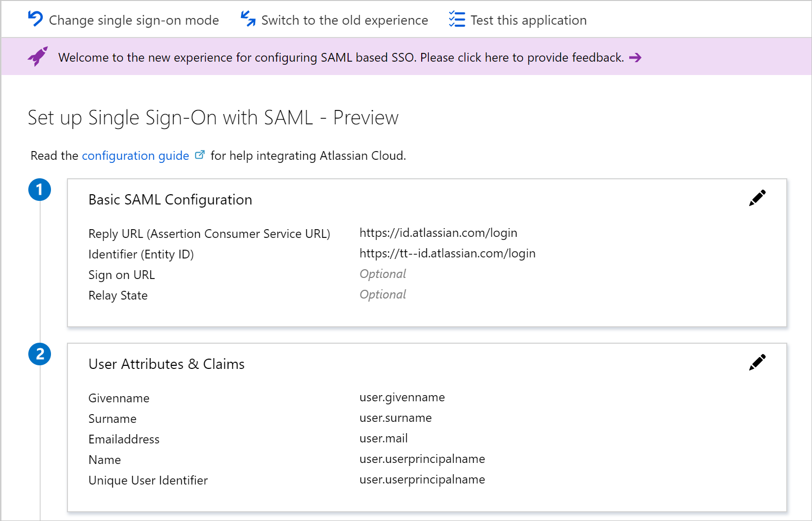
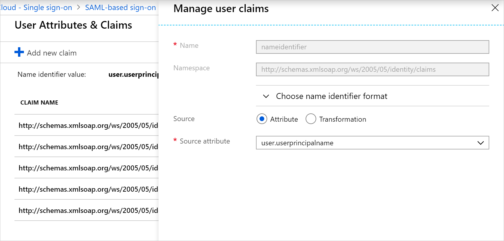
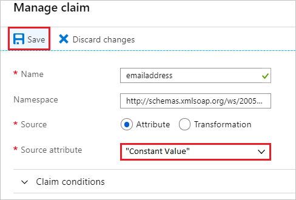
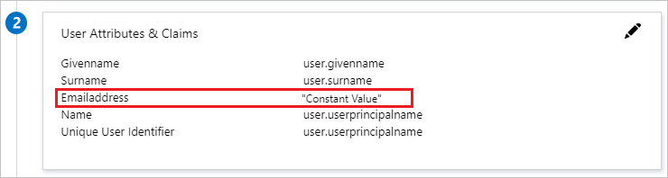

# How to: customize claims issued in the SAML token for enterprise applications

Today, the Microsoft identity platform supports single sign-on (SSO) with most enterprise applications, including both applications pre-integrated in the Azure AD app gallery as well as custom applications. When a user authenticates to an application through the Microsoft identity platform using the SAML 2.0 protocol, the Microsoft identity platform sends a token to the application (via an HTTP POST). And then, the application validates and uses the token to log the user in instead of prompting for a username and password. These SAML tokens contain pieces of information about the user known as *claims*.

A *claim* is information that an identity provider states about a user inside the token they issue for that user. In [SAML token](https://en.wikipedia.org/wiki/SAML_2.0), this data is typically contained in the SAML Attribute Statement. The user’s unique ID is typically represented in the SAML Subject also called as Name Identifier.

By default, the Microsoft identity platform issues a SAML token to your application that contains a `NameIdentifier` claim with a value of the user’s username (also known as the user principal name) in Azure AD, which can uniquely identify the user. The SAML token also contains additional claims containing the user’s email address, first name, and last name.

To view or edit the claims issued in the SAML token to the application, open the application in Azure portal. Then open the **User Attributes & Claims** section.

There are two possible reasons why you might need to edit the claims issued in the SAML token:

* The application requires the `NameIdentifier` or NameID claim to be something other than the username (or user principal name) stored in Azure AD.
* The application has been written to require a different set of claim URIs or claim values.

## Editing nameID

To edit the NameID (name identifier value):

1. Open the **Name identifier value** page.
1. Select the attribute or transformation you want to apply to the attribute. Optionally, you can specify the format you want the NameID claim to have.

   

### NameID format

If the SAML request contains the element NameIDPolicy with a specific format, then the Microsoft identity platform will honor the format in the request.

If the SAML request doesn't contain an element for NameIDPolicy, then the Microsoft identity platform will issue the NameID with the  format you specify. If no format is specified, the Microsoft identity platform will use the default source format associated with the claim source selected.

From the **Choose name identifier format** dropdown, you can select one of the following options.

| NameID format | Description |
|---------------|-------------|
| **Default** | Microsoft identity platform will use the default source format. |
| **Persistent** | Microsoft identity platform will use Persistent as the NameID format. |
| **EmailAddress** | Microsoft identity platform will use EmailAddress as the NameID format. |
| **Unspecified** | Microsoft identity platform will use Unspecified as the NameID format. |

Transient NameID is also supported, but is not available in the dropdown and cannot be configured on Azure's side. To learn more about the NameIDPolicy attribute, see [Single Sign-On SAML protocol](single-sign-on-saml-protocol.md).

### Attributes

Select the desired source for the `NameIdentifier` (or NameID) claim. You can select from the following options.

| Name | Description |
|------|-------------|
| Email | Email address of the user |
| userprincipalName | User principal name (UPN) of the user |
| onpremisessamaccountname | SAM account name that has been synced from on-premises Azure AD |
| objectid | Objectid of the user in Azure AD |
| employeeid | Employee ID of the user |
| Directory extensions | Directory extensions [synced from on-premises Active Directory using Azure AD Connect Sync](../hybrid/how-to-connect-sync-feature-directory-extensions.md) |
| Extension Attributes 1-15 | On-premises extension attributes used to extend the Azure AD schema |

For more info, see [Table 3: Valid ID values per source](reference-claims-mapping-policy-type.md#table-3-valid-id-values-per-source).

You can also assign any constant (static) value to any claims which you define in Azure AD. Please follow the below steps to assign a constant value:

1. In the <a href="https://portal.azure.com/" target="_blank">Azure portal</a>, on the **User Attributes & Claims** section, click on the **Edit** icon to edit the claims.
1. Click on the required claim which you want to modify.
1. Enter the constant value without quotes in the **Source attribute** as per your organization and click **Save**.

    

1. The constant value will be displayed as below.

    

### Special claims - transformations

You can also use the claims transformations functions.

| Function | Description |
|----------|-------------|
| **ExtractMailPrefix()** | Removes the domain suffix from either the email address or the user principal name. This extracts only the first part of the user name being passed through (for example, "joe_smith" instead of joe_smith@contoso.com). |
| **Join()** | Joins an attribute with a verified domain. If the selected user identifier value has a domain, it will extract the username to append the selected verified domain. For example, if you select the email (joe_smith@contoso.com) as the user identifier value and select contoso.onmicrosoft.com as the verified domain, this will result in joe_smith@contoso.onmicrosoft.com. |
| **ToLower()** | Converts the characters of the selected attribute into lowercase characters. |
| **ToUpper()** | Converts the characters of the selected attribute into uppercase characters. |

## Adding application-specific claims

To add application-specific claims:

1. In **User Attributes & Claims**, select **Add new claim** to open the **Manage user claims** page.
1. Enter the **name** of the claims. The value doesn't strictly need to follow a URI pattern, per the SAML spec. If you need a URI pattern, you can put that in the **Namespace** field.
1. Select the **Source** where the claim is going to retrieve its value. You can select a user attribute from the source attribute dropdown or apply a transformation to the user attribute before emitting it as a claim.

### Claim transformations

To apply a transformation to a user attribute:

1. In **Manage claim**, select *Transformation* as the claim source to open the **Manage transformation** page.
2. Select the function from the transformation dropdown. Depending on the function selected, you will have to provide parameters and a constant value to evaluate in the transformation. Refer to the table below for more information about the available functions.
3. To apply multiple transformation, click on **Add transformation**.You can apply a maximum of two transformation to a claim. For example, you could first extract the email prefix of the `user.mail`. Then, make the string upper case.

   

You can use the following functions to transform claims.

| Function | Description |
|----------|-------------|
| **ExtractMailPrefix()** | Removes the domain suffix from either the email address or the user principal name. This extracts only the first part of the user name being passed through (for example, "joe_smith" instead of joe_smith@contoso.com). |
| **Join()** | Creates a new value by joining two attributes. Optionally, you can use a separator between the two attributes. For NameID claim transformation, the join is restricted to a verified domain. If the selected user identifier value has a domain, it will extract the username to append the selected verified domain. For example, if you select the email (joe_smith@contoso.com) as the user identifier value and select contoso.onmicrosoft.com as the verified domain, this will result in joe_smith@contoso.onmicrosoft.com. |
| **ToLowercase()** | Converts the characters of the selected attribute into lowercase characters. |
| **ToUppercase()** | Converts the characters of the selected attribute into uppercase characters. |
| **Contains()** | Outputs an attribute or constant if the input matches the specified value. Otherwise, you can specify another output if there’s no match. For example, if you want to emit a claim where the value is the user’s email address if it contains the domain “@contoso.com”, otherwise you want to output the user principal name. To do this, you would configure the following values: *Parameter 1(input)*: user.email *Value*: "@contoso.com" Parameter 2 (output): user.email Parameter 3 (output if there's no match): user.userprincipalname |
| **EndWith()** | Outputs an attribute or constant if the input ends with the specified value. Otherwise, you can specify another output if there’s no match. For example, if you want to emit a claim where the value is the user’s employee ID if the employee ID ends with “000”, otherwise you want to output an extension attribute. To do this, you would configure the following values: *Parameter 1(input)*: user.employeeid *Value*: "000" Parameter 2 (output): user.employeeid Parameter 3 (output if there's no match): user.extensionattribute1 |
| **StartWith()** | Outputs an attribute or constant if the input starts with the specified value. Otherwise, you can specify another output if there’s no match. For example, if you want to emit a claim where the value is the user’s employee ID if the country/region starts with "US", otherwise you want to output an extension attribute. To do this, you would configure the following values: *Parameter 1(input)*: user.country *Value*: "US" Parameter 2 (output): user.employeeid Parameter 3 (output if there's no match): user.extensionattribute1 |
| **Extract() - After matching** | Returns the substring after it matches the specified value. For example, if the input's value is "Finance_BSimon", the matching value is "Finance_", then the claim's output is "BSimon". |
| **Extract() - Before matching** | Returns the substring until it matches the specified value. For example, if the input's value is "BSimon_US", the matching value is "_US", then the claim's output is "BSimon". |
| **Extract() - Between matching** | Returns the substring until it matches the specified value. For example, if the input's value is "Finance_BSimon_US", the first matching value is "Finance\_", the second matching value is "\_US", then the claim's output is "BSimon". |
| **ExtractAlpha() - Prefix** | Returns the prefix alphabetical part of the string. For example, if the input's value is "BSimon_123", then it returns "BSimon". |
| **ExtractAlpha() - Suffix** | Returns the suffix alphabetical part of the string. For example, if the input's value is "123_Simon", then it returns "Simon". |
| **ExtractNumeric() - Prefix** | Returns the prefix numerical part of the string. For example, if the input's value is "123_BSimon", then it returns "123". |
| **ExtractNumeric() - Suffix** | Returns the suffix numerical part of the string. For example, if the input's value is "BSimon_123", then it returns "123". |
| **IfEmpty()** | Outputs an attribute or constant if the input is null or empty. For example, if you want to output an attribute stored in an extensionattribute if the employee ID for a given user is empty. To do this, you would configure the following values: Parameter 1(input): user.employeeid Parameter 2 (output): user.extensionattribute1 Parameter 3 (output if there's no match): user.employeeid |
| **IfNotEmpty()** | Outputs an attribute or constant if the input is not null or empty. For example, if you want to output an attribute stored in an extensionattribute if the employee ID for a given user is not empty. To do this, you would configure the following values: Parameter 1(input): user.employeeid Parameter 2 (output): user.extensionattribute1 |

If you need additional transformations, submit your idea in the [feedback forum in Azure AD](https://feedback.azure.com/forums/169401-azure-active-directory?category_id=160599) under the *SaaS application* category.

## Emitting claims based on conditions

You can specify the source of a claim based on user type and the group to which the user belongs. 

The user type can be:
- **Any**: All users are allowed to access the application.
- **Members**: Native member of the tenant
- **All guests**: User is brought over from an external organization with or without Azure AD.
- **AAD guests**: Guest user belongs to another organization using Azure AD.
- **External guests**: Guest user belongs to an external organization that doesn't have Azure AD.

One scenario where this is helpful is when the source of a claim is different for a guest and an employee accessing an application. You may want to specify that if the user is an employee the NameID is sourced from user.email, but if the user is a guest then the NameID is sourced from user.extensionattribute1.

To add a claim condition:

1. In **Manage claim**, expand the Claim conditions.
2. Select the user type.
3. Select the group(s) to which the user should belong. You can select up to 50 unique groups across all claims for a given application. 
4. Select the **Source** where the claim is going to retrieve its value. You can select a user attribute from the source attribute dropdown or apply a transformation to the user attribute before emitting it as a claim.

The order in which you add the conditions are important. Azure AD evaluates the conditions from top to bottom to decide which value to emit in the claim. The last value which matches the expression will be emitted in the claim.

For example, Britta Simon is a guest user in the Contoso tenant. She belongs to another organization that also uses Azure AD. Given the below configuration for the Fabrikam application, when Britta tries to sign in to Fabrikam, the Microsoft identity platform will evaluate the conditions as follow.

First, the Microsoft identity platform verifies if Britta's user type is `All guests`. Since, this is true then the Microsoft identity platform assigns the source for the claim to `user.extensionattribute1`. Second, the Microsoft identity platform verifies if Britta's user type is `AAD guests`, since this is also true then the Microsoft identity platform assigns the source for the claim to `user.mail`. Finally, the claim is emitted with value `user.mail` for Britta.

## Next steps

* [Application management in Azure AD](../manage-apps/what-is-application-management.md)
* [Configure single sign-on on applications that are not in the Azure AD application gallery](../manage-apps/configure-saml-single-sign-on.md)
* [Troubleshoot SAML-based single sign-on](../manage-apps/debug-saml-sso-issues.md)
