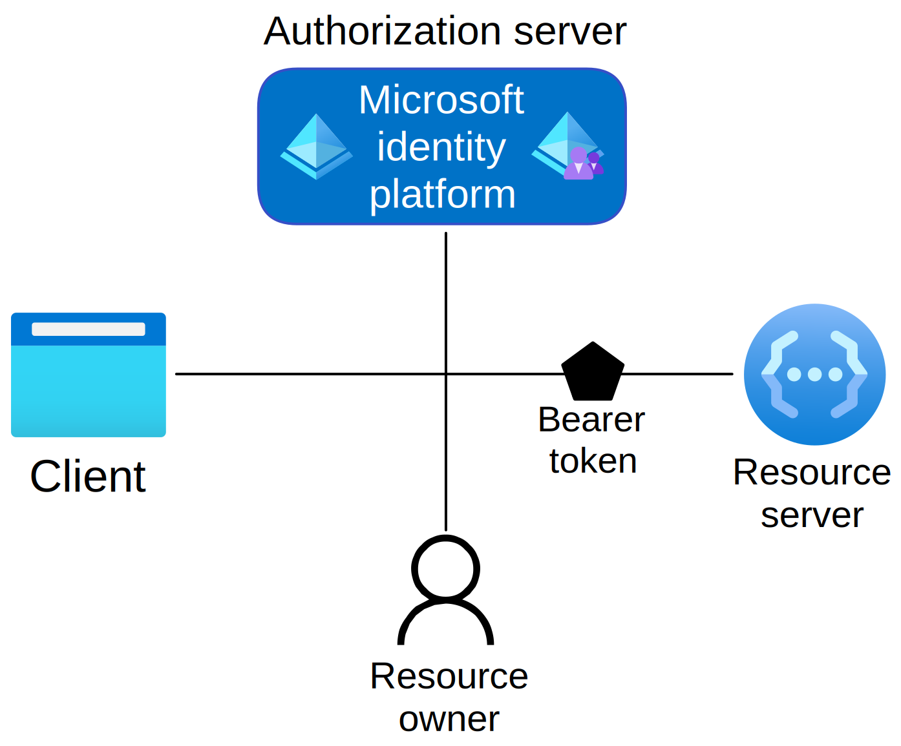

# OAuth 2.0 and OpenID Connect protocols on the Microsoft identity platform

The Microsoft identity platform endpoint for identity-as-a-service with industry standard protocols, OpenID Connect and OAuth 2.0. While the service is standards-compliant, there can be subtle differences between any two implementations of these protocols. The information here will be useful if you choose to write your code by directly sending and handling HTTP requests or use a third party open-source library, rather than using one of our [open-source libraries](reference-v2-libraries.md).

> [!NOTE]
> Not all Azure AD scenarios and features are supported by the Microsoft identity platform endpoint. To determine if you should use the Microsoft identity platform endpoint, read about [Microsoft identity platform limitations](active-directory-v2-limitations.md).

## The basics

In nearly all OAuth 2.0 and OpenID Connect flows, there are four parties involved in the exchange:



* The **Authorization Server** is the Microsoft identity platform endpoint and responsible for ensuring the user's identity, granting and revoking access to resources, and issuing tokens. The authorization server also known as the identity provider - it securely handles anything to do with the user's information, their access, and the trust relationships between parties in a flow.
* The **Resource Owner** is typically the end user. It's the party that owns the data and has the power to allow third parties to access that data or resource.
* The **OAuth Client** is your app, identified by its application ID. The OAuth client is usually the party that the end user interacts with, and it requests tokens from the authorization server. The client must be granted permission to access the resource by the resource owner.
* The **Resource Server** is where the resource or data resides. It trusts the Authorization Server to securely authenticate and authorize the OAuth Client, and uses Bearer access tokens to ensure that access to a resource can be granted.

## App registration

Every app that wants to accept both personal and work or school accounts must be registered through the **App registrations** experience in the [Azure portal](https://aka.ms/appregistrations) before it can sign these users in using OAuth 2.0 or OpenID Connect. The app registration process will collect and assign a few values to your app:

* An **Application ID** that uniquely identifies your app
* A **Redirect URI** (optional) that can be used to direct responses back to your app
* A few other scenario-specific values.

For more details, learn how to [register an app](quickstart-register-app.md).

## Endpoints

Once registered, the app communicates with Microsoft identity platform by sending requests to the endpoint:

```
https://login.microsoftonline.com/{tenant}/oauth2/v2.0/authorize
https://login.microsoftonline.com/{tenant}/oauth2/v2.0/token
```

Where the `{tenant}` can take one of four different values:

| Value | Description |
| --- | --- |
| `common` | Allows users with both personal Microsoft accounts and work/school accounts from Azure AD to sign into the application. |
| `organizations` | Allows only users with work/school accounts from Azure AD to sign into the application. |
| `consumers` | Allows only users with personal Microsoft accounts (MSA) to sign into the application. |
| `8eaef023-2b34-4da1-9baa-8bc8c9d6a490` or `contoso.onmicrosoft.com` | Allows only users with work/school accounts from a particular Azure AD tenant to sign into the application. Either the friendly domain name of the Azure AD tenant or the tenant's GUID identifier can be used. |

To learn how to interact with these endpoints, choose a particular app type in the [Protocols](#protocols) section and follow the links for more info.

> [!TIP]
> Any app registered in Azure AD can use the Microsoft identity platform endpoint, even if they don't sign in personal accounts.  This way, you can migrate existing applications to Microsoft identity platform and [MSAL](reference-v2-libraries.md) without re-creating your application.  

## Tokens

The Microsoft identity platform implementation of OAuth 2.0 and OpenID Connect make extensive use of bearer tokens, including bearer tokens represented as JWTs. A bearer token is a lightweight security token that grants the “bearer” access to a protected resource. In this sense, the “bearer” is any party that can present the token. Though a party must first authenticate with Microsoft identity platform to receive the bearer token, if the required steps are not taken to secure the token in transmission and storage, it can be intercepted and used by an unintended party. While some security tokens have a built-in mechanism for preventing unauthorized parties from using them, bearer tokens do not have this mechanism and must be transported in a secure channel such as transport layer security (HTTPS). If a bearer token is transmitted in the clear, a malicious party can use a man-in-the-middle attack to acquire the token and use it for unauthorized access to a protected resource. The same security principles apply when storing or caching bearer tokens for later use. Always ensure that your app transmits and stores bearer tokens in a secure manner. For more security considerations on bearer tokens, see [RFC 6750 Section 5](https://tools.ietf.org/html/rfc6750).

Further details of different types of tokens used in the Microsoft identity platform endpoint is available in [the Microsoft identity platform endpoint token reference](v2-id-and-access-tokens.md).

## Protocols

If you're ready to see some example requests, get started with one of the below tutorials. Each one corresponds to a particular authentication scenario. If you need help determining which is the right flow for you,
check out [the types of apps you can build with Microsoft identity platform](v2-app-types.md).

* [Build mobile and native application with OAuth 2.0](v2-oauth2-auth-code-flow.md)
* [Build web apps with OpenID Connect](v2-protocols-oidc.md)
* [Build single-page apps with the OAuth 2.0 Implicit Flow](v2-oauth2-implicit-grant-flow.md)
* [Build daemons or server-side processes with the OAuth 2.0 client credentials flow](v2-oauth2-client-creds-grant-flow.md)
* [Get tokens in a web API with the OAuth 2.0 on-behalf-of Flow](v2-oauth2-on-behalf-of-flow.md)
