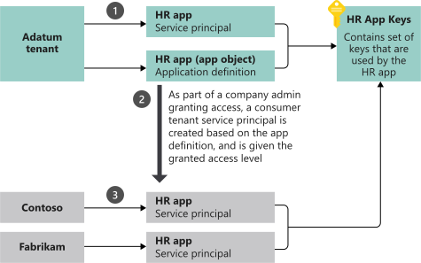

# Application and service principal objects in Azure Active Directory

Sometimes, the meaning of the term "application" can be misunderstood when used in the context of Azure Active Directory (Azure AD). This article clarifies the conceptual and concrete aspects of Azure AD application integration, with an illustration of registration and consent for a [multi-tenant application](developer-glossary.md#multi-tenant-application).

## Overview

An application that has been integrated with Azure AD has implications that go beyond the software aspect. "Application" is frequently used as a conceptual term, referring to not only the application software, but also its Azure AD registration and role in authentication/authorization "conversations" at runtime.

By definition, an application can function in these roles:

- [Client](developer-glossary.md#client-application) role (consuming a resource)
- [Resource server](developer-glossary.md#resource-server) role (exposing APIs to clients)
- Both client role and resource server role

An [OAuth 2.0 Authorization Grant flow](developer-glossary.md#authorization-grant) defines the conversation protocol, which allows the client/resource to access/protect a resource's data, respectively.

In the following sections, you'll see how the Azure AD application model represents an application at design-time and run-time.

## Application registration

When you register an Azure AD application in the [Azure portal][AZURE-Portal], two objects are created in your Azure AD tenant:

- An application object, and
- A service principal object

### Application object

An Azure AD application is defined by its one and only application object, which resides in the Azure AD tenant where the application was registered, known as the application's "home" tenant. The Microsoft Graph [Application entity][MS-Graph-App-Entity] defines the schema for an application object's properties.

### Service principal object

To access resources that are secured by an Azure AD tenant, the entity that requires access must be represented by a security principal. This is true for both users (user principal) and applications (service principal).

The security principal defines the access policy and permissions for the user/application in the Azure AD tenant. This enables core features such as authentication of the user/application during sign-in, and authorization during resource access.

When an application is given permission to access resources in a tenant (upon registration or [consent](developer-glossary.md#consent)), a service principal object is created. The Microsoft Graph  [ServicePrincipal entity][MS-Graph-Sp-Entity] defines the schema for a service principal object's properties.

### Application and service principal relationship

Consider the application object as the *global* representation of your application for use across all tenants, and the service principal as the *local* representation for use in a specific tenant.

The application object serves as the template from which common and default properties are *derived* for use in creating corresponding service principal objects. An application object therefore has a 1:1 relationship with the software application, and a 1:many relationships with its corresponding service principal object(s).

A service principal must be created in each tenant where the application is used, enabling it to establish an identity for sign-in and/or access to resources being secured by the tenant. A single-tenant application has only one service principal (in its home tenant), created and consented for use during application registration. A multi-tenant Web application/API also has a service principal created in each tenant where a user from that tenant has consented to its use.

> [!NOTE]
> Any changes you make to your application object, are also reflected in its service principal object in the application's home tenant only (the tenant where it was registered). For multi-tenant applications, changes to the application object are not reflected in any consumer tenants' service principal objects, until the access is removed through the [Application Access Panel](https://myapps.microsoft.com) and granted again.
>
> Also note that native applications are registered as multi-tenant by default.

## Example

The following diagram illustrates the relationship between an application's application object and corresponding service principal objects, in the context of a sample multi-tenant application called **HR app**. There are three Azure AD tenants in this example scenario:

- **Adatum** - The tenant used by the company that developed the **HR app**
- **Contoso** - The tenant used by the Contoso organization, which is a consumer of the **HR app**
- **Fabrikam** - The tenant used by the Fabrikam organization, which also consumes the **HR app**

In this example scenario:

| Step | Description |
|------|-------------|
| 1    | Is the process of creating the application and service principal objects in the application's home tenant. |
| 2    | When Contoso and Fabrikam administrators complete consent, a service principal object is created in their company's Azure AD tenant and assigned the permissions that the administrator granted. Also note that the HR app could be configured/designed to allow consent by users for individual use. |
| 3    | The consumer tenants of the HR application (Contoso and Fabrikam) each have their own service principal object. Each represents their use of an instance of the application at runtime, governed by the permissions consented by the respective administrator. |

## Next steps

- You can use the [Microsoft Graph Explorer](https://developer.microsoft.com/graph/graph-explorer) to query both the application and service principal objects.
- You can access an application's application object using the Microsoft Graph API, the [Azure portal's][AZURE-Portal] application manifest editor, or [Azure AD PowerShell cmdlets](https://docs.microsoft.com/powershell/azure/overview?view=azureadps-2.0), as represented by its OData [Application entity][MS-Graph-App-Entity].
- You can access an application's service principal object through the Microsoft Graph API or [Azure AD PowerShell cmdlets](https://docs.microsoft.com/powershell/azure/overview?view=azureadps-2.0), as represented by its OData [ServicePrincipal entity][MS-Graph-Sp-Entity].

<!--Image references-->

<!--Reference style links -->
[MS-Graph-App-Entity]: https://docs.microsoft.com/graph/api/resources/application
[MS-Graph-Sp-Entity]: https://docs.microsoft.com/graph/api/resources/serviceprincipal
[AZURE-Portal]: https://portal.azure.com
