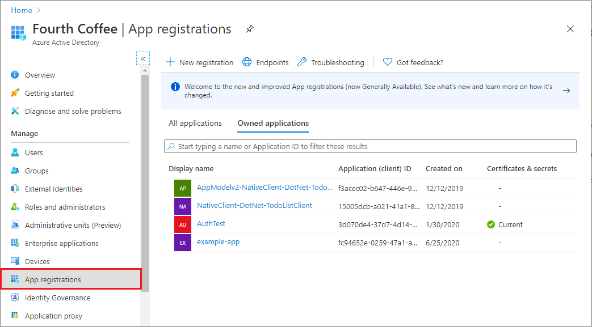
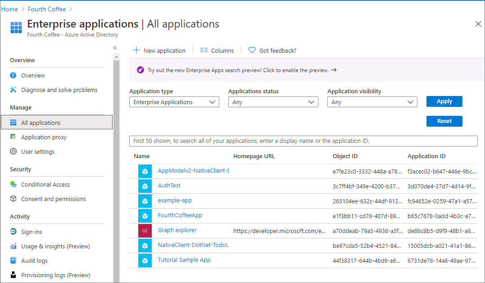

# Application and service principal objects in Microsoft Entra ID

This article describes application registration, application objects, and service principals in Microsoft Entra ID, what they are, how they're used, and how they're related to each other. A multi-tenant example scenario is also presented to illustrate the relationship between an application's application object and corresponding service principal objects.

## Application registration

To delegate identity and access management functions to Microsoft Entra ID, an application must be registered with a Microsoft Entra tenant. When you register your application with Microsoft Entra ID, you're creating an identity configuration for your application that allows it to integrate with Microsoft Entra ID. When you register an app, you choose whether it's a [single tenant](single-and-multi-tenant-apps.md#who-can-sign-in-to-your-app), or [multi-tenant](single-and-multi-tenant-apps.md#who-can-sign-in-to-your-app), and can optionally set a [redirect URI](reply-url.md). For step-by-step instructions on registering an app, see the [app registration quickstart](quickstart-register-app.md).

When you've completed the app registration, you have a globally unique instance of the app (the application object) that lives within your home tenant or directory. You also have a globally unique ID for your app (the app/client ID). You can add secrets or certificates and scopes to make your app work, customize the branding of your app in the sign-in dialog, and more.

If you register an application, an application object and a service principal object are automatically created in your home tenant. If you register/create an application using the Microsoft Graph APIs, creating the service principal object is a separate step.

## Application object

A Microsoft Entra application is defined by its one and only application object, which resides in the Microsoft Entra tenant where the application was registered (known as the application's "home" tenant). An application object is used as a template or blueprint to create one or more service principal objects. A service principal is created in every tenant where the application is used. Similar to a class in object-oriented programming, the application object has some static properties that are applied to all the created service principals (or application instances).

The application object describes three aspects of an application: 

- How the service can issue tokens in order to access the application 
- The resources that the application might need to access
- The actions that the application can take

You can use the **App registrations** page in the [Microsoft Entra admin center](https://entra.microsoft.com) to list and manage the application objects in your home tenant.



The Microsoft Graph [Application entity][ms-graph-app-entity] defines the schema for an application object's properties.

## Service principal object

To access resources that are secured by a Microsoft Entra tenant, the entity that requires access must be represented by a security principal. This requirement is true for both users (user principal) and applications (service principal). The security principal defines the access policy and permissions for the user/application in the Microsoft Entra tenant. This enables core features such as authentication of the user/application during sign-in, and authorization during resource access.

There are three types of service principal:

- **Application** - This type of service principal is the local representation, or application instance, of a global application object in a single tenant or directory. In this case, a service principal is a concrete instance created from the application object and inherits certain properties from that application object. A service principal is created in each tenant where the application is used and references the globally unique app object. The service principal object defines what the app can actually do in the specific tenant, who can access the app, and what resources the app can access.

  When an application is given permission to access resources in a tenant (upon registration or consent), a service principal object is created. When you register an application, a service principal is created automatically. You can also create service principal objects in a tenant using Azure PowerShell, Azure CLI, Microsoft Graph, and other tools.

- **Managed identity** - This type of service principal is used to represent a [managed identity](../managed-identities-azure-resources/overview.md). Managed identities eliminate the need for developers to manage credentials. Managed identities provide an identity for applications to use when connecting to resources that support Microsoft Entra authentication. When a managed identity is enabled, a service principal representing that managed identity is created in your tenant. Service principals representing managed identities can be granted access and permissions, but can't be updated or modified directly.

- **Legacy** - This type of service principal represents a legacy app, which is an app created before app registrations were introduced or an app created through legacy experiences. A legacy service principal can have credentials, service principal names, reply URLs, and other properties that an authorized user can edit, but doesn't have an associated app registration. The service principal can only be used in the tenant where it was created.

The Microsoft Graph [ServicePrincipal entity][ms-graph-sp-entity] defines the schema for a service principal object's properties.

You can use the **Enterprise applications** page in the Microsoft Entra admin center to list and manage the service principals in a tenant. You can see the service principal's permissions, user consented permissions, which users have done that consent, sign in information, and more.



## Relationship between application objects and service principals

The application object is the _global_ representation of your application for use across all tenants, and the service principal is the _local_ representation for use in a specific tenant. The application object serves as the template from which common and default properties are _derived_ for use in creating corresponding service principal objects.

An application object has:

- A one-to-one relationship with the software application, and
- A one-to-many relationship with its corresponding service principal object(s)

A service principal must be created in each tenant where the application is used, enabling it to establish an identity for sign-in and/or access to resources being secured by the tenant. A single-tenant application has only one service principal (in its home tenant), created and consented for use during application registration. A multi-tenant application also has a service principal created in each tenant where a user from that tenant has consented to its use.

### List service principals associated with an app

You can find the service principals associated with an application object.

# [Browser](#tab/browser)

In the Microsoft Entra admin center, navigate to the application registration overview.  Select **Managed application in local directory**.

:::image type="content" alt-text="Screen shot that shows the Managed application in local directory option in the overview." source="./media/app-objects-and-service-principals/find-service-principal.png" border="false":::

# [PowerShell](#tab/azure-powershell)

Using PowerShell:

```azurepowershell
Get-AzureADServicePrincipal -Filter "appId eq '{AppId}'"
```

# [Azure CLI](#tab/azure-cli)

Using Azure CLI:

```azurecli
az ad sp list --filter "appId eq '{AppId}'"
```
---

### Consequences of modifying and deleting applications

Any changes that you make to your application object are also reflected in its service principal object in the application's home tenant only (the tenant where it was registered). This means that deleting an application object will also delete its home tenant service principal object. However, restoring that application object through the app registrations UI won't restore its corresponding service principal. For more information on deletion and recovery of applications and their service principal objects, see [delete and recover applications and service principal objects](../manage-apps/delete-recover-faq.yml).

## Example

The following diagram illustrates the relationship between an application's application object and corresponding service principal objects in the context of a sample multi-tenant application called **HR app**. There are three Microsoft Entra tenants in this example scenario:

- **Adatum** - The tenant used by the company that developed the **HR app**
- **Contoso** - The tenant used by the Contoso organization, which is a consumer of the **HR app**
- **Fabrikam** - The tenant used by the Fabrikam organization, which also consumes the **HR app**


In this example scenario:

| Step | Description                                                                                                                                                                                                                                                                                           |
| ---- | ----------------------------------------------------------------------------------------------------------------------------------------------------------------------------------------------------------------------------------------------------------------------------------------------------- |
| 1    | The process of creating the application and service principal objects in the application's home tenant.                                                                                                                                                                                            |
| 2    | When Contoso and Fabrikam administrators complete consent, a service principal object is created in their company's Microsoft Entra tenant and assigned the permissions that the administrator granted. Also note that the HR app could be configured/designed to allow consent by users for individual use. |
| 3    | The consumer tenants of the HR application (Contoso and Fabrikam) each have their own service principal object. Each represents their use of an instance of the application at runtime, governed by the permissions consented by the respective administrator.                                        |

## Next steps

Learn how to create a service principal:

- [Using the Microsoft Entra admin center](howto-create-service-principal-portal.md)
- [Using Azure PowerShell](howto-authenticate-service-principal-powershell.md)
- [Using Azure CLI](/cli/azure/azure-cli-sp-tutorial-1)
- [Using Microsoft Graph](/graph/api/serviceprincipal-post-serviceprincipals) and then use [Microsoft Graph Explorer](https://developer.microsoft.com/graph/graph-explorer) to query both the application and service principal objects.

<!--Reference style links -->

[ms-graph-app-entity]: /graph/api/resources/application
[ms-graph-sp-entity]: /graph/api/resources/serviceprincipal
