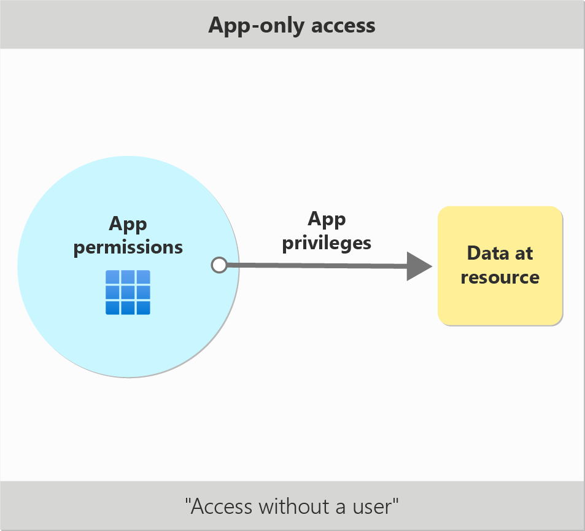

# Understanding application-only access

When an application directly accesses a resource, like Microsoft Graph, its access isn't limited to the files or operations available to any single user. The app calls APIs directly using its own identity, and a user or app with admin rights must authorize it to access the resources. This scenario is application-only access.

> [!VIDEO https://www.youtube.com/embed/6R3W9T01gdE]

## When should I use application-only access?

In most cases, application-only access is broader and more powerful than [delegated access](delegated-access-primer.md), so you should only use app-only access where needed. It’s usually the right choice if:

- The application needs to run in an automated way, without user input. For example, a daily script that checks emails from certain contacts and sends automated responses.
- The application needs to access resources belonging to multiple different users. For example, a backup or data loss prevention app might need to retrieve messages from many different chat channels, each with different participants.
- You find yourself tempted to store credentials locally and allow the app to sign in "as" the user or admin.

In contrast, you should never use application-only access where a user would normally sign in to manage their own resources. These types of scenarios must use delegated access to be least privileged.

## Authorizing an app to make application-only calls

To make app-only calls, you need to assign your client app the appropriate app roles. App roles are also referred to as application-only permissions. They're *app* roles because they grant access only in the context of the resource app that defines the role.

For example, to read a list of all teams created in an organization, you need to assign your application the Microsoft Graph `Team.ReadBasic.All` app role. This app role grants the ability to read this data when Microsoft Graph is the resource app. This assignment doesn't assign your client application to a Teams role that might allow it to view this data through other services.

As a developer, you need to configure all required app-only permissions, also referred to as app roles on your application registration. You can configure your app's requested app-only permissions through the Azure portal or Microsoft Graph. App-only access doesn't support dynamic consent, so you can't request individual permissions or sets of permissions at runtime.

Once you've configured all the permissions your app needs, it must get admin consent [admin consent](../manage-apps/grant-admin-consent.md) for it to access the resources. For example, only users with the global admin role can grant app-only permissions (app roles) for the Microsoft Graph API. Users with other admin roles, like application admin and cloud app admin, are able to grant app-only permissions for other resources. 

Admin users can grant app-only permissions by using the Azure portal or by creating grants programmatically through the Microsoft Graph API. You can also prompt for interactive consent from within your app, but this option isn't preferable since app-only access doesn't require a user.

Consumer users with Microsoft Accounts, like Outlook.com or Xbox Live accounts, can never authorize application-only access.
Always follow the principle of least privilege: you should never request app roles that your app doesn’t need. This principle helps limit the security risk if your app is compromised and makes it easier for administrators to grant your app access. For example, if your app-only needs to identify users without reading their detailed profile information, you should request the more limited Microsoft Graph `User.ReadBasic.All` app role instead of `User.Read.All`.
 
## Designing and publishing app roles for a resource service

If you're building a service on Azure AD that exposes APIs for other clients to call, you may wish to support automated access with app roles (app-only permissions). You can define the app roles for your application in the **App roles** section of your app registration in Azure AD portal. For more information on how to create app roles, see [Declare roles for an application](howto-add-app-roles-in-azure-ad-apps.md#declare-roles-for-an-application).

When exposing app roles for others to use, provide clear descriptions of the scenario to the admin who is going to assign them. App roles should generally be as narrow as possible and support specific functional scenarios, since app-only access isn't constrained by user rights. Avoid exposing a single role that grants full `read` or full `read/write` access to all APIs and resources your service contains.

> [!NOTE]
> App roles (app-only permissions) can also be configured to support assignment to users and groups. Be sure that you configure your app roles correctly for your intended access scenario. If you intend for your API’s app roles to be used for app-only access, select applications as the only allowed member types when creating the app roles.

## How does application-only access work?

The most important thing to remember about app-only access is that the calling app acts on its own behalf and as its own identity. There's no user interaction. If the app has been assigned to a given app role for a resource, then the app has fully unconstrained access to all resources and operations governed by that app role.

Once an app has been assigned to one or more app roles (app-only permissions), it can request an app-only token from Azure AD using the [client credentials flow](v2-oauth2-client-creds-grant-flow.md) or any other supported authentication flow. The assigned roles are added to the `roles` claim of the app's access token.
 
In some scenarios, the application identity may determine whether access is granted, similarly to user rights in a delegated call. For example, the `Application.ReadWrite.OwnedBy` app role grants an app the ability to manage service principals that the app itself owns. 

## Application-only access example - Automated email notification via Microsoft Graph

The following example illustrates a realistic automation scenario.

Alice wants to notify a team by email every time the division reporting folder that resides in a Windows file share registers a new document. Alice creates a scheduled task that runs a PowerShell script to examine the folder and find new files. The script then sends an email using a mailbox protected by a resource API, Microsoft Graph.

The script runs without any user interaction, therefore the authorization system only checks the application authorization. Exchange Online checks whether the client making the call has been granted the application permission (app role), `Mail.Send` by the administrator. If `Mail.Send` isn’t granted to the app, then Exchange Online fails the request.

| POST /users/{id}/{userPrincipalName}/sendMail | Client app granted Mail.Send | Client app not granted Mail.Send |
| ----- | ----- | ----- |
| The script uses Alice’s mailbox to send emails. | 200 – Access granted. Admin allowed the app to send mail as any user. |403 - Unauthorized. Admin hasn’t allowed this client to send emails. |
| The script creates a dedicated mailbox to send emails. | 200 – Access granted. Admin allowed the app to send mail as any user. | 403 - Unauthorized. Admin hasn’t allowed this client to send emails. |
 
The example given is a simple illustration of application authorization. The production Exchange Online service supports many other access scenarios, such as limiting application permissions to specific Exchange Online mailboxes. 

## Next steps

- [Learn how to create and assign app roles in Azure AD](howto-add-app-roles-in-azure-ad-apps.md)
- [Overview of permissions in Microsoft Graph](/graph/permissions-overview)
- [Microsoft Graph permissions reference](/graph/permissions-reference)