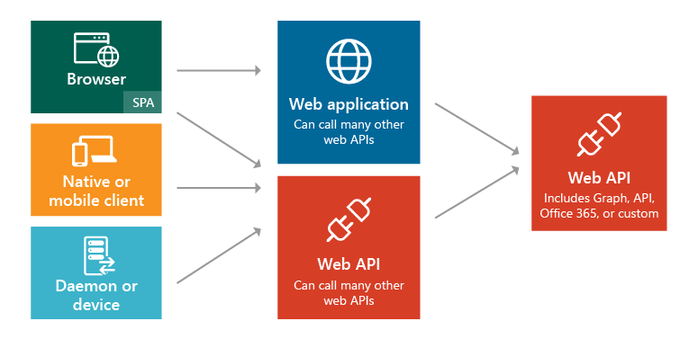

# Application types in v1.0

Azure Active Directory (Azure AD) supports authentication for a variety of modern app architectures, all of them based on industry-standard protocols OAuth 2.0 or OpenID Connect.

The following diagram illustrates the scenarios and application types, and how different components can be added:

These are the five primary application scenarios supported by Azure AD:

- **[Single-page application (SPA)](single-page-application.md)**: A user needs to sign in to a single-page application that is secured by Azure AD.
- **[Web browser to web application](web-app.md)**: A user needs to sign in to a web application that is secured by Azure AD.
- **[Native application to web API](native-app.md)**: A native application that runs on a phone, tablet, or PC needs to authenticate a user to get resources from a web API that is secured by Azure AD.
- **[Web application to web API](web-api.md)**: A web application needs to get resources from a web API secured by Azure AD.
- **[Daemon or server application to web API](service-to-service.md)**: A daemon application or a server application with no web user interface needs to get resources from a web API secured by Azure AD.

Follow the links to learn more about each type of app and understand the high-level scenarios before you start working with the code. You can also learn about the differences you need to know when writing a particular app that works with the v1.0 endpoint or v2.0 endpoint.

> [!NOTE]
> The v2.0 endpoint doesn't support all Azure AD scenarios and features. To determine whether you should use the v2.0 endpoint, read about [v2.0 limitations](active-directory-v2-limitations.md).

You can develop any of the apps and scenarios described here using various languages and platforms. They are all backed by complete code samples available in the code samples guide: [v1.0 code samples by scenario](sample-v1-code.md) and [v2.0 code samples by scenario](sample-v2-code.md). You can also download the code samples directly from the corresponding [GitHub sample repositories](https://github.com/Azure-Samples?q=active-directory).

In addition, if your application needs a specific piece or segment of an end-to-end scenario, in most cases that functionality can be added independently. For example, if you have a native application that calls a web API, you can easily add a web application that also calls the web API.

## App registration

### Registering an app that uses the Azure AD v1.0 endpoint

Any application that outsources authentication to Azure AD must be registered in a directory. This step involves telling Azure AD about your application, including the URL where it’s located, the URL to send replies after authentication, the URI to identify your application, and more. This information is required for a few key reasons:

* Azure AD needs to communicate with the application when handling sign-on or exchanging tokens. The information passed between Azure AD and the application includes the following:
  
  * **Application ID URI** - The identifier for an application. This value is sent to Azure AD during authentication to indicate which application the caller wants a token for. Additionally, this value is included in the token so that the application knows it was the intended target.
  * **Reply URL** and **Redirect URI** - For a web API or web application, the Reply URL is the location where Azure AD will send the authentication response, including a token if authentication was successful. For a native application, the Redirect URI is a unique identifier to which Azure AD will redirect the user-agent in an OAuth 2.0 request.
  * **Application ID** - The ID for an application, which is generated by Azure AD when the application is registered. When requesting an authorization code or token, the Application ID and Key are sent to Azure AD during authentication.
  * **Key** - The key that is sent along with an Application ID when authenticating to Azure AD to call a web API.
* Azure AD needs to ensure the application has the required permissions to access your directory data, other applications in your organization, and so on.

For details, learn how to [register an app](quickstart-register-app.md).

## Single-tenant and multi-tenant apps

Provisioning becomes clearer when you understand that there are two categories of applications that can be developed and integrated with Azure AD:

* **Single tenant application** - A single tenant application is intended for use in one organization. These are typically line-of-business (LoB) applications written by an enterprise developer. A single tenant application only needs to be accessed by users in one directory, and as a result, it only needs to be provisioned in one directory. These applications are typically registered by a developer in the organization.
* **Multi-tenant application** - A multi-tenant application is intended for use in many organizations, not just one organization. These are typically software-as-a-service (SaaS) applications written by an independent software vendor (ISV). Multi-tenant applications need to be provisioned in each directory where they will be used, which requires user or administrator consent to register them. This consent process starts when an application has been registered in the directory and is given access to the Graph API or perhaps another web API. When a user or administrator from a different organization signs up to use the application, they are presented with a dialog that displays the permissions the application requires. The user or administrator can then consent to the application, which gives the application access to the stated data, and finally registers the application in their directory. For more information, see [Overview of the Consent Framework](consent-framework.md).

### Additional considerations when developing single tenant or multi-tenant apps

Some additional considerations arise when developing a multi-tenant application instead of a single tenant application. For example, if you are making your application available to users in multiple directories, you need a mechanism to determine which tenant they’re in. A single tenant application only needs to look in its own directory for a user, while a multi-tenant application needs to identify a specific user from all the directories in Azure AD. To accomplish this task, Azure AD provides a common authentication endpoint where any multi-tenant application can direct sign-in requests, instead of a tenant-specific endpoint. This endpoint is https://login.microsoftonline.com/common for all directories in Azure AD, whereas a tenant-specific endpoint might be https://login.microsoftonline.com/contoso.onmicrosoft.com. The common endpoint is especially important to consider when developing your application because you’ll need the necessary logic to handle multiple tenants during sign-in, sign-out, and token validation.

If you are currently developing a single tenant application but want to make it available to many organizations, you can easily make changes to the application and its configuration in Azure AD to make it multi-tenant capable. In addition, Azure AD uses the same signing key for all tokens in all directories, whether you are providing authentication in a single tenant or multi-tenant application.

Each scenario listed in this document includes a subsection that describes its provisioning requirements. For more in-depth information about provisioning an application in Azure AD and the differences between single and multi-tenant applications, see [Integrating applications with Azure Active Directory](quickstart-v1-integrate-apps-with-azure-ad.md) for more information. Continue reading to understand the common application scenarios in Azure AD.

## Next steps

- Learn more about other Azure AD [authentication basics](authentication-scenarios.md)
