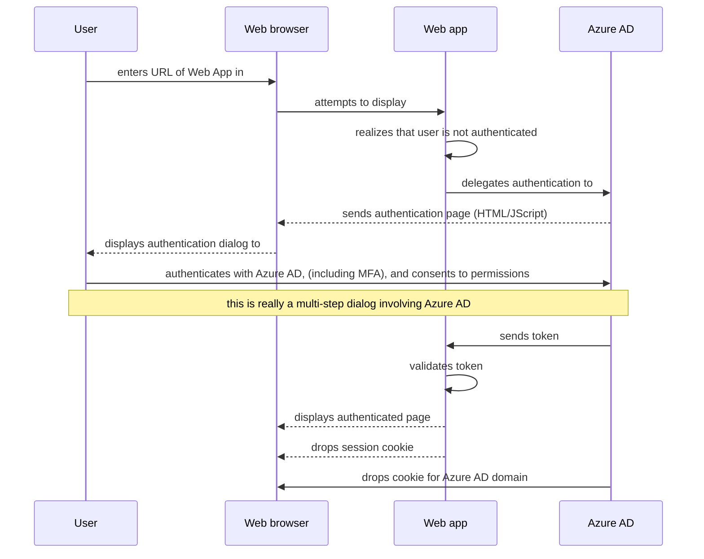
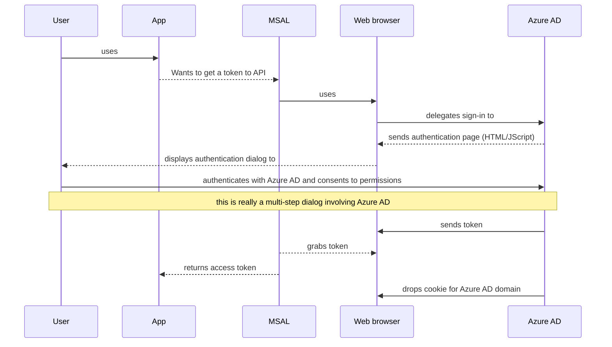

# Modern authentication basics

In this article, you will learn the basics of modern, OAuth 2 based, authentication. You'll discover:

- A [quick history of authentication](#quick-history-of-authentication), and why the industry moved to using protocols adapted to the cloud like OAuth2.0
- A number of concepts like [Azure AD tenants](#tenants), [security tokens](#security-tokens), [applications](#applications).
- How Web apps delegate sign in to Azure AD (or any OpenID connect provider)
- What really happens?
- How the way web apps work can be generalized to all kind of apps

Answering these questions will also be the opportunity to present most of the concepts you'll need to understand enough about authentication to be able to create protected Web apps, Web APIs, or apps calling protected Web APIs.

Let's start by a quick an over-simplified history of authentication, which will help you understand some of the fundamental concepts

## Quick history of authentication

1. Years ago, all the applications were running in organizational networks, and each time you built a Web app with restricted acces, the Web app would handle the authentication itself. This implementation implied that the Web app had to know the username and password for users. Some Web app provided a sign-up process, letting users decide of a login and password.

 This way of proceeding was:

- not scalable: people had to remember a long list of passwords.  
- not secure: people would use the same password)
- not reliable: when someone left the organization, administrator had to delete the entry about the user in each Web app. This required rigorous processes, and, in practice did not happen.

1. The industry, therefore, moved to a model of a centralized directory for the organization. Apps inside the Enterprise network (on-premise apps) could, now, know the identity of the user. Indeed, they were provided a  **security token** which contained information about the user and the app for which the token was generated. These tokens were generated by the directory, having function of a **Security token Server** (STS). The apps could also delegate to the directory the function of signing in users. At Microsoft, such a directory is Active Directory. Using a directory also brought the possibility for the user to sign in once on their computer and be automatically signed-in to Web apps (this process is named **Single Sign On**, or SSO).
1. Appeared also the notion of Web Services. Think of them as functions that you can call at a given URL with some parameters to get a result. These Web services (or we would now say **Web APIs**) also needed to be protected, so that they are  accessed only by authorized applications. As these appeared Web apps started consuming Web APIs. And more kind of applications needed to call Web API such as desktop applications, mobile applications, or even applications, which don't even sign in a user named daemons apps (windows services on Windows). This means that tokens contain information about the user (if any), the client app, the app for which the token was generated.
1. In parallel, organizations started moving to the Internet, and then to the clouds. This change had the advantage of letting people access the organization's apps from anywhere (not only from the enterprise network). But the same problem as 1. started to appear where different Web apps would have managed their identities. For instance, ASP.NET/ASP.NET core still has a template where a Web App maintains the users in a database.
1. To problem 3., the same solution was found as 2. by creating directories in the Cloud. At Microsoft, this is **Azure Active directory**, but others also provide identity providers, like Google, Amazon, Facebook, GitHub, Kinked, ... and more recently Apple. The industry came-up with a new standard named OAuth 2.0, and a specialization of this standard specifying the format of the tokens: Open ID Connect. The Microsoft identity platform is Open ID Connect compliant
1. Whereas an on-premise directory contained only users from a specific organization, the IDP in the cloud serves many organizations. But that does not mean that users are all mixed together. Azure AD is partitioned into **tenants** (One tenant per organization)
1. Now that authentication could be delegated to an IDP in the cloud, this triggered many innovations for instance adding conditional access policies such as the user needs to be in specific locations, needs to do multi-factor authentication (MFA), and the authentication has recently becoming password-less  ...

## Presented concepts

With this quick and oversimplified history of authentication, you might have discovered a few concepts, that will be explained in more details here.

- Tenants
- Security tokens
- Apps

### Tenants

As we've seen, Azure AD is partitioned into tenants. There is one tenant per organization. A tenant is defined by its name and verified domain names associated with the tenant. A tenant also has an identifier, which is a Guid: the **Tenant ID**. 

Tenants contain users and apps. Tenant administrators can also, in some premium subscriptions of Azure AD, enable conditional access to protect users and apps of the tenant. The Microsoft identity platform also supports users who sign in with their personal accounts. To make thinks more symmetrical, it helps thinking that personal accounts are in a special tenant - the consumer tenant. 

Azure AD also provides another offer named Azure AD B2C for organizations to sign in users (typically customers, but not only) with social identities. This offer also leverages special tenants (B2C tenants).

### Security tokens

Security tokens contain information about users (if any) and apps. They typically have information saying: "hey, I was produced by this identity provider for this application, at the request of that application, and I'm containing information about this user"

Across time, security tokens were binaries, then became XML based (SAML tokens), and then JSon based. JSon based tokens are named JWT for JSon Web Token. JWT is the standard used by Azure AD. JWT contains claims, which are key value pair providing information.

Typical claims include:

- the STS, which has generated the token. It must be trusted by the app, which will validate the token
- the date at which the token was generated
- the subject, for instance a user (except for daemons),
- the audience (app for which the token was generated),
- the app that asked for the token (the client). In the case of Web apps this can be the same as the audience.

These are named claims, because it's up to the app for which the token was generated (Web app that signs-in a user or Web API) to validate that the token is valid. For this, the token is signed by the STS with a private key, and the STS publishes some metadata including the corresponding public key. Apps that want to validate a token can verify the signature.

Tokens are also valid for a given duration and therefore an expiry date. Usually the STS provides a pair of tokens: an **access token** to access the app, and a **refresh token that will help refreshing the access token when it's closed to expiring. An app can get to the STS and say "here is an access token to renew, and here is a refresh token", and if the user access to the app was not revoked, it will get back a new access token and a new refresh token. This is, how the scenario of someone leaving the enterprise is handled. When the resource app validates the token, it will reject the user.

### Applications

Applications, are capable, or not, of signing in user, or to delegate user sign-in to an identity provider, and which can, or not, call Web APIs. You can learn more about all the kind of apps and scenarios supported by Azure AD in [Authentication flows and app scenarios](authentication-flows-app-scenarios.md). One important pre-requisites for the IDP knowing if the user still has access to apps is that, in addition to users being registered in the IDP, so need to be applications. Registering applications with Azure AD moreover enables you, as a developer, to:

- provide a name for your app,
- customize the branding of your application in the sign-in dialog. This is, after all, the first contact with your app.
- filter the audience of users that can access your application. In the case of Azure AD, you can decide if you want to let users sign in only if they belong to your organization (Single tenant application), or from any Work or School accounts (Multi-tenant application), or even with personal Microsoft accounts, or with social identities (like a Google, Facebook, Linked-In, Amazon account, ...) 
- request scope permissions to access Web APIs. Those could be Microsoft provided APIs, including MIcrosoft Graph, or your own Web APIs
- In the case where you expose a Web API, you'll need to define scopes, which are units of access to your Web API. Typically when an App will want to access you API it will need to request permissions to scopes for your Web APIs
- Finally the case the app is a confidential client application (Web App, Web API, or daemon app), you'll need to share a secret with Azure AD that will prove the app identity to Azure AD.

Once registered, the application has a **Client ID** also named **Application ID, which is a GUID that will be shared by the app with Azure AD for any request for tokens. If moreover the app is a confidential client application, it will also systematically share the secret (or the public key)

In the next section, you'll learn how an app delegates signing in users to Azure AD. This will be an  opportunity to learn more about apps characteristics. You'll start by Web Apps.

## Web App delegating user sign in to Azure AD

In this paragraph, you'll discover what seems to happen when a Web App delegates sign-in to Azure AD. Then you'll briefly discover what really happens, and how this can be generalized to other type of apps.

# How delegations seems to happen

The following diagram sequence diagram shows how things seem to happen. This does not express yet how things happen.

The user opens a browser and enters the URK of a Web app. The browser navigates to the Web App, which realizes that the user is not authenticated. The Web app delegates to Azure AD to sign in the user in a way that is compliant with the policy of the organization. Azure AD let the user authenticate with whatever way is supported, for instance entering their credentials, doing multiple factors authentications, but also not using a password at all (think of Windows Hello for instance). The user also has an opportunity to consent to the application (the client app) to access Web APIs on her behalf. This is an important security aspect that also implies that client apps need to be registered for Azure AD to allow delivering tokens for the apps they can access and for which the user consented.

When the user has successfully authenticated, Azure AD:

- sends a token to the Web App
- drops in the cookie jar for the browser associated with Azure AD's domain, a cookie containing the identity of the user. Next time an app uses the browser to navigate to Azure AD (in fact Azure AD Authorization end point), it will present the cookie, which will avoid the user to have to re-sign-in. This is the way SSO can be achieved. This cookie was produced by Azure AD and can only be understood by Azure AD.

The Web app then validates the token, and if this validation succeeds presents the protected page, and drops in the browser a session cookie. When the user navigates to another page, thanks to this session cookie, the Web app knows that the user is authenticated.

The following sequence diagram summarizes this interaction.

This asks a number of questions:

1. How does the developer of the Web App express that it needs authentication? and how does it know that it was not accessed by an authenticated user?
1. How does the Web App delegate to Azure AD?
1. How does Azure AD know where to send the token to?
1. What is the session cookie?

## How does a Web app know if it was accessed by an authenticated user?

The developer of the Web app can express, in a way that varies depending on the framework used to build the Web app, that all or certain pages, require authentication. For example, in ASP.NET / ASP.NET Core this is done by adding an attribute, `[Authorize]`, on the controller actions, which will trigger ASP.NET to:

- check the presence of a session cookie containing the identity of the user.
- redirect authentication to an Identity provider. The Identity provider (IdP) to use is configured by a specifying an ASP.NET middleware in the code for the app (ASP.NET supports several IdPs, including Azure AD). In the case of Azure AD, the Web App will go to https://login.microsofonline.com, which displays a sign-in dialog

## How does the Web app delegate the sign-in to Azure AD and how does Azure AD know where to send the token to?

The user interacts with the browser, and as far as it's concerned, it's the only components it knows. All the conversations that happen require to go through the browser. The OpenID protocol uses the standard HTTP protocol messages to achieve this. In that case, the Web App sends an HTTP 202 (redirect) to the browser to tell it to display Azure AD. In the same way when the user has done all them need in the browser to authenticate, Azure AD will send the token to the Web app by using a redirect through the browser. Now a good question is how does Azure AD know to which URI to do the redirect to send the token? The Web app, when delegating the sign-in to Azure AD, told Azure AD by providing a **redirect URI**. The redirect URI for a Web app needs to be registered in the Azure AD application. There can be several redirect URIs (as the application can be deployed at several URLs), so the Web app will also need to specify the redirect URi to use. Azure AD will check that it's among the registered redirect URIs for the app.

## Generalization to desktop and mobile apps

So far you've only learnt about Web apps. Here is how things change slightly for desktop or mobile applications.

Desktop and mobile applications can have other ways of authenticating users, some of which are not interactive. Details are provided in [Authentication flows and app scenarios](authentication-flows-app-scenarios.md). But when they involve signing in a user interactively, a Web browser is also necessarily involved. This can be an embedded Web control, or a system browser.  

The following sequence diagram shows how a Desktop or mobile apps uses one of the Microsoft authentication libraries, which are used to acquire access tokens to call web apis, in order to get a token. MSAL uses a browser and, as Web apps previously, delegate authentication to Azure AD.

Because Azure AD has dropped the same identity cookie in the browser as in the case of Web Apps, if the native or mobile app uses the system browser, it will immediately get SSO with the Web Apps. By default MSAL libraries AcquireTokenInteractive use the system browser, except on .NET Framework desktop applications where they use an embedded control so that the user experience feels more integrated.