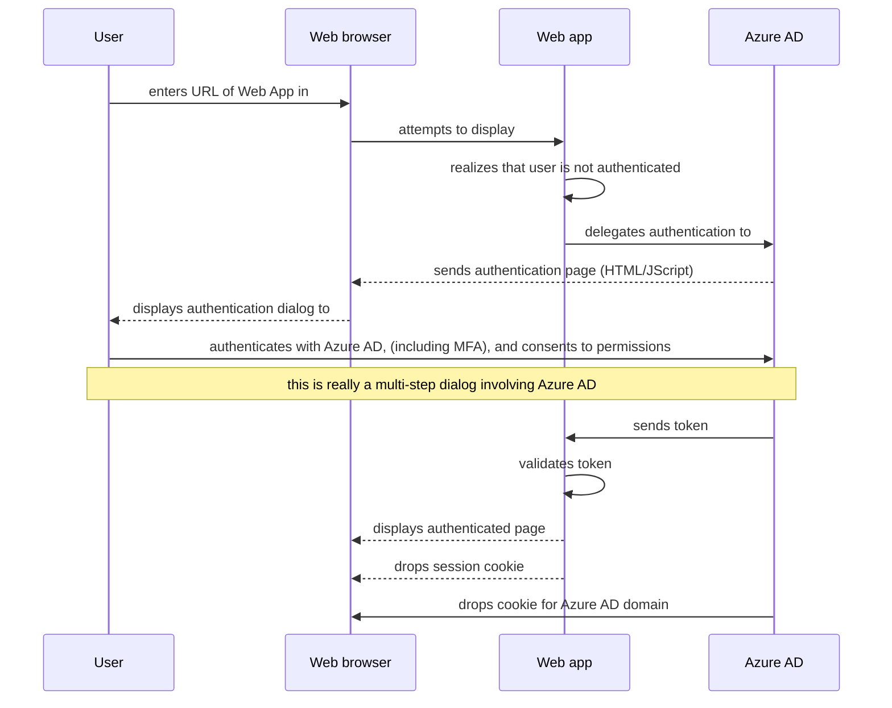
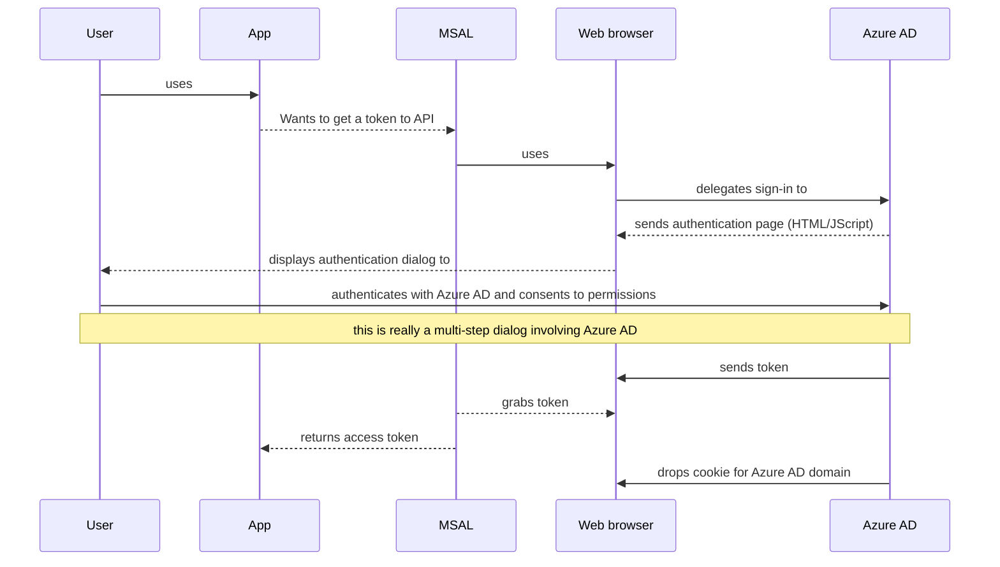

# Modern authentication basics

In this article, you will learn the basics of modern, OAuth 2 based authentication. You'll discover:

- A [quick history of authentication](#quick-history-of-authentication), and why the industry moved to using protocols adapted to the cloud like OAuth2.0.
- A number of concepts like [Azure AD tenants](#tenants), [security tokens](#security-tokens), and [applications](#applications).
- How Web apps delegate sign in to Azure AD (or any OpenID connect provider). 
- What really happens?
- How to generalize the way web apps work to all types of apps.

The answers to these questions will present most of the authentication concepts you'll need to understand to be able to create protected web apps, web APIs, or apps calling protected Web APIs.

Let's start with a quick, simplified history of authentication, which will help you understand some of the fundamental concepts.

## Quick history of authentication

1. Years ago, all applications ran in organizational networks, and each time you built a Web app with restricted access, the Web app would handle the authentication itself. This implementation meant that the Web app had to know the username and password for users. Some Web apps provided a sign-up process, letting users decide their login and password.

   This way of proceeding was:

   - Not scalable: people had to remember a long list of passwords.  
   - Not secure: people would use the same password, and the web app was responsible for protecting those passwords.
   - Not reliable: when someone left the organization, an administrator had to delete the entry about the user in each web app. This required rigorous processes, and did not happen in practice.

2. The industry, therefore, moved to a model of a centralized directory for each organization. Any app inside the Enterprise network (on-premise apps) could now know the identity of the user. Indeed, they were provided a **security token** which contained information about the user and the app for which the token was generated. By generating these tokens, the directory takes the function of a **Security Token Server** (STS). The apps could also delegate to the directory the function of signing in users. At Microsoft, such a directory is called an Active Directory. Using a directory also created the possibility for a user to sign in once on their computer and be automatically signed-in to all Web apps (this process is named **Single Sign On**, or SSO).
3. The notion of Web Services also appeared. Think of them as functions that you can call at a given URL with some parameters to get a result. These Web services (or we would now say **Web APIs**) also needed to be protected, so that they are  accessed only by authorized applications. As these appeared, Web apps started consuming Web APIs. Other kinds of applications also needed to call Web APIs, such as desktop applications, mobile applications, or even applications which don't sign in a user named daemons apps (windows services on Windows). This means that tokens contain information about the user (if any), the client app, the app for which the token was generated.
4. In parallel, organizations started moving to the Cloud. This change had the advantage of letting people access the organization's apps from anywhere (not only from the enterprise network). However, this gave rise to the same problem stated earlier of web apps managing identities themselves. For instance, ASP.NET/ASP.NET Core still has a template where a Web App maintains the users in a database.
5. To solve this problem, a similar solution was designed: creating centralized directories in the Cloud. At Microsoft, this is **Azure Active Directory**, but other companies are also Identity Providers (IDPs), such as Google, Amazon, Facebook, GitHub, Kinked, ... and more recently Apple. The industry designed a new standard named OAuth 2.0, which uses **access tokens** to allow users to access APIs. A specialization of this standard, Open ID Connect, was also designed and uses **ID tokens** to authenticate the user.  The Microsoft Identity Platform is Oauth 2.0 and Open ID Connect compliant.
6. Whereas an on-premise directory contained only users from a specific organization, the IDP in the cloud serves many organizations. To keep users from different organizations separate, Azure AD is partitioned into **tenants** (One tenant per organization).
7. Delegating authentication and authorization to an IDP in the Cloud triggered many innovations.  For example, conditional access policies can now require a user to be in a specific location, use multi-factor authentication (MFA) to protect their applications and data, move toward becoming passwordless, and much more.

## Presented concepts

This quick and simplified history of identity went over a few concepts that will be explained in more detail here.

- [Azure AD tenants](#tenants)
- [security tokens](#security-tokens)
- [applications](#applications)

### Tenants

Azure AD is partitioned into tenants, with one tenant per organization. A tenant is defined by its name and verified domain names associated with the tenant. A tenant also has an identifier, which is a Guid: the **Tenant ID**. 

Tenants contain users and apps. The Microsoft Identity Platform also supports users who sign in with their personal Microsoft accounts. To make things more symmetrical, it helps thinking that personal accounts are in a special tenant - the consumer tenant. 

Azure AD also provides another offer named Azure AD B2C for organizations to sign in users (typically customers, but not always) with social identities that may not be associated with Microsoft, like a Google account. This offer also leverages special tenants (B2C tenants).

### Security tokens

Security tokens contain information about users (if any) and apps.  Security tokens began as binary blobs years ago, then became XML based (SAML tokens), and are now JSon based. JSon based tokens are named JWTs for JSon Web Tokens, and are the standard token used by Azure AD. JWTs contains claims, which are key-value pairs providing information.

Typical claims include:

- the STS, which has generated the token. It must be trusted by the app, which will validate the token.
- the date at which the token was generated
- the subject, for instance a user (except for daemons),
- the audience (app for which the token was generated),
- the app that asked for the token (the client). In the case of Web apps this may be the same as the audience.

These are named claims, because it's up to the app for which the token was generated (Web app that signs-in a user or Web API) to validate the token. For this, the token is signed by the STS with a private key, and the STS publishes some metadata including the corresponding public key. Apps that want to validate a token can verify the signature by using the public key to check whether the signature was created using the private key.

Tokens are also valid only for a given duration and therefore have an expiry date. Usually the STS provides a pair of tokens: an **access token** to access the application or protected resource, and a **refresh token** that will help refresh the access token when it's closed to expiring. An app can provide a refresh token to the STS, and if the user access to the app was not revoked, it will get back a new access token and a new refresh token. This is how the scenario of someone leaving the enterprise is handled.  When the STS receives the refresh token, it will not issue another valid access token if the user is no longer authorized, so the resource app will reject the user. 

### Applications

Applications might sign in users themselves, delegate sign in to an IDP, call Web APIs - there are many different scenarios for what an application can do. You can learn more about all the kind of apps and scenarios supported by Azure AD in [Authentication flows and app scenarios](authentication-flows-app-scenarios.md). One important prerequisite for the IDP knowing if the user still has access to an app is that, in addition to the user being registered with the IDP, so must be the application. Moreover, registering applications with Azure AD enables you, as a developer, to:

- provide a name for your app.
- customize the branding of your application in the sign-in dialog. This is, after all, the first contact with your app.
- filter the audience of users that can access your application. In the case of Azure AD, you can decide if you want to let users sign in only if they belong to your organization (Single tenant application), or from any Work or School accounts (Multi-tenant application), or even with personal Microsoft accounts, or with social identities (like a Google, Facebook, Linked-In, Amazon account, ...) 
- request scope permissions to access Web APIs. Those could be Microsoft provided APIs, including Microsoft Graph, or your own Web APIs.  For example, the "user.read" scope grants permission to read the profile of the signed-in user.
- define scopes, which are units of access to your Web API (in the case where you are exposing a Web API). Typically when an app wants to access your API it will need to request permissions to the scopes you define here.
- share a secret with Azure AD that will prove the app identity to Azure AD.  This is relevant in the case where the app is a confidential client application (Web App, Web API, or daemon app).

Once registered, the application will be given a **Client ID**, also named **Application ID**, which is a GUID that will be shared by the app with Azure AD for any request for tokens. If the app is a confidential client application, it will also systematically share the secret (or the public key).

In the next section, you'll learn how an app delegates signing in users to Azure AD. This will be an  opportunity to learn more about app characteristics. We'll start with Web Apps.

## Web App delegating user sign in to Azure AD

In this paragraph, you'll discover what seems to happen when a Web App delegates sign-in to Azure AD. Then you'll briefly discover what really happens, and how this can be generalized to other type of apps.

### How delegations seems to happen

The following sequence demonstrates how things seem to happen. This does not express yet how things happen.

The user opens a browser and enters the URL of a Web app. The browser navigates to the Web App, which realizes that the user is not authenticated. The Web app delegates to Azure AD to sign in the user in a way that is compliant with the policy of the organization, for instance entering their credentials, doing multiple factor authentication, or even not using a password at all (for example using Windows Hello). The user will also be asked to consent to the application (the client app) to access Web APIs on his or her behalf. This is an important security aspect that implies client apps need to be registered in order for Azure AD to deliver tokens for the apps they can access and for which the user consented.

When the user has successfully authenticated, Azure AD:

- sends a token to the Web App
- drops a cookie containing the identity of the user in the 'cookie jar' for the browser associated with Azure AD's domain. The next time an app uses the browser to navigate to Azure AD (more specifically, the Azure AD Authorization end point), it will present the cookie, which will automatically generate another token and avoid the user having to re-sign-in. This is the way SSO can be achieved. This cookie was produced by Azure AD and can only be understood by Azure AD.

The Web app then validates the token, and if this validation succeeds, presents the protected page and drops in the browser a session cookie. When the user navigates to another page, the Web app knows that the user is authenticated because of this session cookie.

The following sequence diagram summarizes this interaction.

This asks a number of questions:

1. How does the developer of the Web App express that it needs authentication? And how does it know that it was not accessed by an authenticated user?
1. How does the Web App delegate to Azure AD?
1. How does Azure AD know where to send the token to?
1. What is the session cookie?

### How does a Web app know if it was accessed by an authenticated user?

The developer of the Web app can express, in a way that varies depending on the framework used to build the Web app, that all or certain pages require authentication. For example, in ASP.NET / ASP.NET Core this is done by adding an attribute, `[Authorize]`, on the controller actions, which will trigger ASP.NET to:

- check for the presence of a session cookie containing the identity of the user.
- redirect authentication to an Identity provider. The Identity provider (IdP) to use is configured by specifying an ASP.NET middleware in the code for the app (ASP.NET supports several IdPs, including Azure AD). In the case of Azure AD, the Web App will go to https://login.microsoftonline.com, which displays a sign-in dialog.

### How does the Web app delegate the sign-in to Azure AD and how does Azure AD know where to send the token to?

The user interacts with the browser, which is the only he or she knows. All the interactions that happen require going through the browser. The OpenID protocol uses the standard HTTP protocol messages to achieve this. In that case, the Web App sends an HTTP 202 (redirect) to the browser to tell it to display Azure AD. In the same way when the user has done all that is needed in the browser to authenticate, Azure AD will send the token to the Web app by using a redirect through the browser. Now a good question is how does Azure AD know to which URI to redirect the token to? The Web app, when delegating the sign-in to Azure AD, told Azure AD by providing a **redirect URI**. The redirect URI for a Web app needs to be registered in the Azure AD application. There can be several redirect URIs (as the application can be deployed at several URLs), so the Web app will also need to specify the redirect URi to use. Azure AD will check that it's among the registered redirect URIs for the app.

## Generalization to desktop and mobile apps

So far you've only learned about Web apps. Here is how things change slightly for desktop or mobile applications.

Desktop and mobile applications can have other ways of authenticating users, some of which are not interactive. Details are provided in [Authentication flows and app scenarios](authentication-flows-app-scenarios.md). But when they involve signing in a user interactively, a Web browser is also necessarily involved. This can be an embedded Web control, or a system browser.  

The following sequence diagram shows how a Desktop or mobile app uses one of the Microsoft authentication libraries, which are used to acquire access tokens to call web APIs, in order to get a token. MSAL uses a browser and, like with web apps, delegate authentication to Azure AD.

Because Azure AD has dropped the same identity cookie in the browser as in the case of Web Apps, if the native or mobile app uses the system browser, it will immediately get SSO with the Web Apps. By default MSAL libraries AcquireTokenInteractive use the system browser, except on .NET Framework desktop applications where they use an embedded control so that the user experience feels more integrated.
