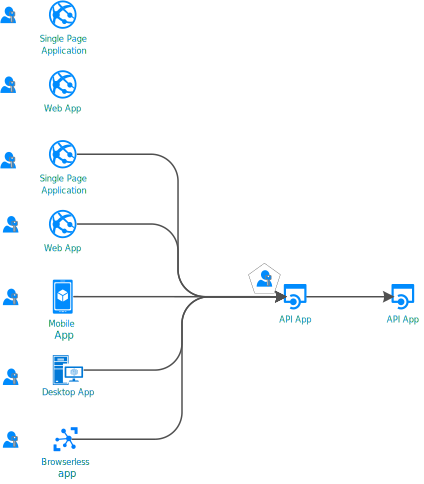
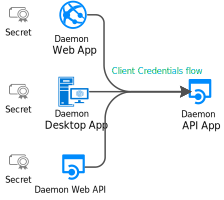
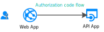

# Authentication flows and application scenarios

The Microsoft identity platform (v2.0) endpoint supports authentication for different kinds of modern application architectures. All of the architectures are based on the industry-standard protocols [OAuth 2.0 and OpenID Connect](active-directory-v2-protocols.md). By using the [authentication libraries for the Microsoft identity platform](reference-v2-libraries.md), applications authenticate identities and acquire tokens to access protected APIs.

This article describes authentication flows and the application scenarios that they're used in.

## Application categories

Tokens can be acquired from several types of applications, including:

- Web apps
- Mobile apps
- Desktop apps
- Web APIs

Tokens can also be acquired by apps running on devices that don't have a browser or are running on the Internet of Things (IoT).

The following sections describe the categories of applications.

### Protected resources vs. client applications

Authentication scenarios involve two activities:

- **Acquiring security tokens for a protected web API**: We recommend that you use [Microsoft-supported client libraries](reference-v2-libraries.md#microsoft-supported-client-libraries) to acquire tokens. In particular, we recommend the Microsoft Authentication Library (MSAL) family.
- **Protecting a web API or a web app**: One challenge of protecting these resources is validating the security token. On some platforms, Microsoft offers [middleware libraries](reference-v2-libraries.md#microsoft-supported-server-middleware-libraries).

### With users or without users

Most authentication scenarios acquire tokens on behalf of signed-in users.

However, there are also daemon apps. In these scenarios, applications acquire tokens on behalf of themselves with no user.

### Single-page, public client, and confidential client applications

Security tokens can be acquired by multiple types of applications. These applications tend to be separated into the following three categories. Each is used with different libraries and objects.

- **Single-page applications**: Also known as SPAs, these are web apps in which tokens are acquired by a JavaScript or TypeScript app running in the browser. Many modern apps have a single-page application at the front end that's primarily written in JavaScript. The application often uses a framework like Angular, React, or Vue. MSAL.js is the only Microsoft authentication library that supports single-page applications.

- **Public client applications**: Apps in this category, like the following types, always sign in users:
  - Desktop apps that call web APIs on behalf of signed-in users
  - Mobile apps
  - Apps running on devices that don't have a browser, like those running on IoT
  
- **Confidential client applications**: Apps in this category include:
  - Web apps that call a web API
  - Web APIs that call a web API
  - Daemon apps, even when implemented as a console service like a Linux daemon or a Windows service

### Sign-in audience

The available authentication flows differ depending on the sign-in audience. Some flows are available only for work or school accounts. Others are available both for work or school accounts and for personal Microsoft accounts.

For more information, see [Supported account types](v2-supported-account-types.md#account-type-support-in-authentication-flows).

## Application scenarios

The Microsoft identity platform endpoint supports authentication for these app architectures:

- Single-page apps
- Web apps
- Web APIs
- Mobile apps
- Native apps
- Daemon apps
- Server-side apps

Applications use the different authentication flows to sign in users and get tokens to call protected APIs.

### Single-page application

Many modern web apps are built as client-side single-page applications. These applications use JavaScript or a framework like Angular, Vue.js, and React.js. These applications run in a web browser.

Single-page applications differ from traditional server-side web apps in terms of authentication characteristics. By using the Microsoft identity platform, single-page applications can sign in users and get tokens to access back-end services or web APIs.

For more information, see [Single-page applications](scenario-spa-overview.md).

### Web app that signs in a user

To help protect a web app that signs in a user:

- If you develop in .NET, you use ASP.NET or ASP.NET Core with the ASP.NET OpenID Connect middleware. Protecting a resource involves validating the security token, which is done by the [IdentityModel extensions for .NET](https://github.com/AzureAD/azure-activedirectory-identitymodel-extensions-for-dotnet/wiki) and not MSAL libraries.

- If you develop in Node.js, you use Passport.js.

For more information, see [Web app that signs in users](scenario-web-app-sign-user-overview.md).

### Web app that signs in a user and calls a web API on behalf of the user

To call a web API from a web app on behalf of a user, use the authorization code flow and store the acquired tokens in the token cache. When needed, MSAL refreshes tokens and the controller silently acquires tokens from the cache.

For more information, see [Web app that calls web APIs](scenario-web-app-call-api-overview.md).

### Desktop app that calls a web API on behalf of a signed-in user

For a desktop app to call a web API that signs in users, use the interactive token-acquisition methods of MSAL. With these interactive methods, you can control the sign-in UI experience. MSAL uses a web browser for this interaction.

There's another possibility for Windows-hosted applications on computers joined either to a Windows domain or by Azure Active Directory (Azure AD). These applications can silently acquire a token by using [Integrated Windows Authentication](https://aka.ms/msal-net-iwa).

Applications running on a device without a browser can still call an API on behalf of a user. To authenticate, the user must sign in on another device that has a web browser. This scenario requires that you use the [device code flow](https://aka.ms/msal-net-device-code-flow).

Though we don't recommend that you use it, the [username/password flow](scenario-desktop-acquire-token.md#username-and-password) is available in public client applications. This flow is still needed in some scenarios like DevOps.

Using the username/password flow constrains your applications. For instance, applications can't sign in a user who needs to use multifactor authentication or the Conditional Access tool in Azure AD. Your applications also don't benefit from single sign-on. Authentication with the username/password flow goes against the principles of modern authentication and is provided only for legacy reasons.

In desktop apps, if you want the token cache to persist, you can customize the [token cache serialization](scenario-desktop-acquire-token.md#file-based-token-cache). By implementing [dual token cache serialization](scenario-desktop-acquire-token.md#dual-token-cache-serialization-msal-unified-cache--adal-v3), you can use backward-compatible and forward-compatible token caches. These tokens support previous generations of authentication libraries. Specific libraries include Azure AD Authentication Library for .NET (ADAL.NET) version 3 and version 4.

For more information, see [Desktop app that calls web APIs](scenario-desktop-overview.md).

### Mobile app that calls a web API on behalf of an interactive user

Similar to a desktop app, a mobile app calls the interactive token-acquisition methods of MSAL to acquire a token for calling a web API.

MSAL iOS and MSAL Android use the system web browser by default. However, you can direct them to use the embedded web view instead. There are specificities that depend on the mobile platform: Universal Windows Platform (UWP), iOS, or Android.

Some scenarios, like those that involve Conditional Access related to a device ID or a device enrollment, require a broker to be installed on the device. Examples of brokers are Microsoft Company Portal on Android and Microsoft Authenticator on Android and iOS. MSAL can now interact with brokers. For more information about brokers, see [Leveraging brokers on Android and iOS](https://github.com/AzureAD/azure-activedirectory-library-for-dotnet/wiki/leveraging-brokers-on-Android-and-iOS).

For more information, see [Mobile app that calls web APIs](scenario-mobile-overview.md).

> [!NOTE]
> A mobile app that uses MSAL.iOS, MSAL.Android, or MSAL.NET on Xamarin can have app protection policies applied to it. For instance, the policies might prevent a user from copying protected text. The mobile app is managed by Intune and is recognized by Intune as a managed app. For more information, see [Microsoft Intune App SDK overview](https://docs.microsoft.com/intune/app-sdk).
>
> The [Intune App SDK](https://docs.microsoft.com/intune/app-sdk-get-started) is separate from MSAL libraries and interacts with Azure AD on its own.

### Protected web API

You can use the Microsoft identity platform endpoint to secure web services like your app's RESTful web API. A protected web API is called through an access token. The token helps secure the API's data and authenticate incoming requests. The caller of a web API appends an access token in the authorization header of an HTTP request.

If you want to protect your ASP.NET or ASP.NET Core web API, you need to validate the access token. For this validation, you use the ASP.NET JWT middleware. The validation is done by the [IdentityModel extensions for .NET](https://github.com/AzureAD/azure-activedirectory-identitymodel-extensions-for-dotnet/wiki) library and not by MSAL.NET.

For more information, see [Protected web API](scenario-protected-web-api-overview.md).

### Web API that calls another web API on behalf of a user

For your protected web API to call another web API on behalf of a user, your app needs to acquire a token for the downstream web API. Such calls are sometimes referred to as *service-to-service* calls. Web APIs that call other web APIs need to provide custom cache serialization.

For more information, see [Web API that calls web APIs](scenario-web-api-call-api-overview.md).

### Daemon app that calls a web API in the daemon's name

Apps that have long-running processes or that operate without user interaction also need a way to access secure web APIs. Such an app can authenticate and get tokens by using the app's identity. The app proves its identity by using a client secret or certificate.

You can write such daemon apps that acquire a token for the calling app by using the [client credential](scenario-daemon-acquire-token.md#acquiretokenforclient-api) acquisition methods in MSAL. These methods require a client secret that you add to the app registration in Azure AD. The app then shares the secret with the called daemon. Examples of such secrets include application passwords, certificate assertion, and client assertion.

For more information, see [Daemon application that calls web APIs](scenario-daemon-overview.md).

## Scenarios and supported authentication flows

You use authentication flows to implement the application scenarios that are requesting tokens. There isn't a one-to-one mapping between application scenarios and authentication flows.

Scenarios that involve acquiring tokens also map to OAuth 2.0 authentication flows. For more information, see [OAuth 2.0 and OpenID Connect protocols on the Microsoft identity platform](active-directory-v2-protocols.md).

<table>
 <thead>
  <tr><th>Scenario</th> <th>Detailed scenario walk-through</th> <th>OAuth 2.0 flow and grant</th> <th>Audience</th></tr>
 </thead>
 <tbody>
  <tr>
   <td></td>
   <td><a href="scenario-spa-overview.md">Single-page app</a></td>
   <td><a href="v2-oauth2-implicit-grant-flow.md">Implicit</a></td>
   <td>Work or school accounts, personal accounts, and Azure Active Directory B2C (Azure AD B2C)</td>
 </tr>

  <tr>
   <td></td>
   <td><a href="scenario-web-app-sign-user-overview.md">Web app that signs in users</a></td>
   <td><a href="v2-oauth2-auth-code-flow.md">Authorization code</a></td>
   <td>Work or school accounts, personal accounts, and Azure AD B2C</td>
 </tr>

  <tr>
   <td></td>
   <td><a href="scenario-web-app-call-api-overview.md">Web app that calls web APIs</a></td>
   <td><a href="v2-oauth2-auth-code-flow.md">Authorization code</a></td>
   <td>Work or school accounts, personal accounts, and Azure AD B2C</td>
 </tr>

  <tr>
   <td rowspan="3"></td>
   <td rowspan="4"><a href="scenario-desktop-overview.md">Desktop app that calls web APIs</a></td>
   <td>Interactive by using <a href="v2-oauth2-auth-code-flow.md">authorization code</a> with PKCE</td>
   <td>Work or school accounts, personal accounts, and Azure AD B2C</td>
 </tr>

  <tr>
   <td>Integrated Windows Authentication</td>
   <td>Work or school accounts</td>
 </tr>

  <tr>
   <td><a href="v2-oauth-ropc.md">Resource owner password</a></td>
   <td>Work or school accounts and Azure AD B2C</td>
 </tr>

  <tr>
   <td></td>
   <td><a href="v2-oauth2-device-code.md">Device code</a></td>
   <td>Work or school accounts</td>
 </tr>

 <tr>
   <td rowspan="2"></td>
   <td rowspan="2"><a href="scenario-mobile-overview.md">Mobile app that calls web APIs</a></td>
   <td>Interactive by using <a href="v2-oauth2-auth-code-flow.md">authorization code</a> with PKCE</td>
   <td>Work or school accounts, personal accounts, and Azure AD B2C</td>
 </tr>

  <tr>
   <td><a href="v2-oauth-ropc.md">Resource owner password</a></td>
   <td>Work or school accounts and Azure AD B2C</td>
 </tr>

  <tr>
   <td></td>
   <td><a href="scenario-daemon-overview.md">Daemon app that calls web APIs</a></td>
   <td><a href="v2-oauth2-client-creds-grant-flow.md">Client credentials</a></td>
   <td>App-only permissions that have no user and are used only in Azure AD organizations</td>
 </tr>

  <tr>
   <td></td>
   <td><a href="scenario-web-api-call-api-overview.md">Web API that calls web APIs</a></td>
   <td><a href="v2-oauth2-on-behalf-of-flow.md">On-behalf-of</a></td>
   <td>Work or school accounts and personal accounts</td>
 </tr>

 </tbody>
</table>

## Scenarios and supported platforms and languages

Microsoft authentication libraries support multiple platforms:

- JavaScript
- .NET Framework
- .NET Core
- Windows 10/UWP
- Xamarin.iOS
- Xamarin.Android
- Native iOS
- macOS
- Native Android
- Java
- Python

You can also use various languages to build your applications.

> [!NOTE]
> Some application types aren't available on every platform.

In the Windows column of the following table, each time .NET Core is mentioned, .NET Framework is also possible. The latter is omitted to avoid cluttering the table.

|Scenario  | Windows | Linux | Mac | iOS | Android
|--|--|--|--|--|--|--|
| [Single-page app](scenario-spa-overview.md)   |  MSAL.js |  MSAL.js |  MSAL.js |  MSAL.js |  MSAL.js
| [Web app that signs in users](scenario-web-app-sign-user-overview.md)   |  ASP.NET Core |  ASP.NET Core |  ASP.NET Core
| [Web app that calls web APIs](scenario-web-app-call-api-overview.md)     |  ASP.NET Core + MSAL.NET   MSAL Java  Flask + MSAL Python|  ASP.NET Core + MSAL.NET  MSAL Java  Flask + MSAL Python|  ASP.NET Core + MSAL.NET  MSAL Java   Flask + MSAL Python
| [Desktop app that calls web APIs](scenario-desktop-overview.md)      | MSAL.NET  MSAL Java   MSAL Python| MSAL.NET  MSAL Java  MSAL Python| MSAL.NET  MSAL Java  MSAL Python    MSAL.objc |
| [Mobile app that calls web APIs](scenario-mobile-overview.md)    |  MSAL.NET  MSAL.NET | | |  MSAL.objc |  MSAL.Android
| [Daemon app](scenario-daemon-overview.md)    | MSAL.NET  MSAL Java  MSAL Python|  MSAL.NET  MSAL Java  MSAL Python| MSAL.NET  MSAL Java  MSAL Python
| [Web API that calls web APIs](scenario-web-api-call-api-overview.md)     |  ASP.NET Core + MSAL.NET  MSAL Java  MSAL Python|  ASP.NET Core + MSAL.NET  MSAL Java  MSAL Python|  ASP.NET Core + MSAL.NET  MSAL Java  MSAL Python

For more information, see [Microsoft-supported libraries by OS/language](reference-v2-libraries.md#microsoft-supported-libraries-by-os--language).

## Next steps

* Learn more about [authentication basics](authentication-scenarios.md) and [access tokens in the Microsoft identity platform](access-tokens.md).
* Learn more about [securing access to IoT apps](/azure/architecture/example-scenario/iot-aad/iot-aad).
