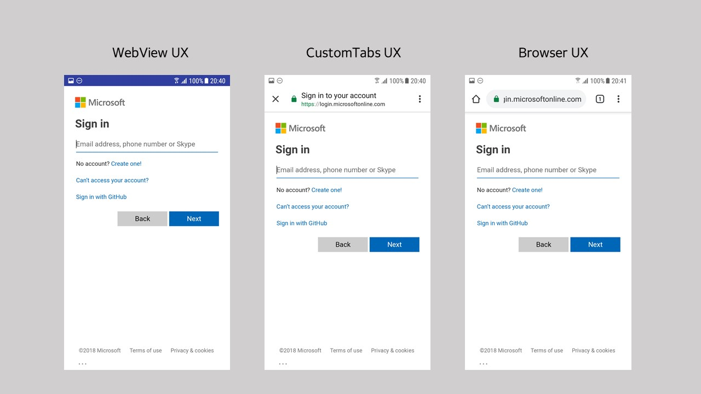

# Authorization agents (Android)

This article describes the different authorization agents that the Microsoft Authentication Library (MSAL) allows your app to use and how to enable them.

Choosing a specific strategy for authorization agents is optional and represents additional functionality apps can customize. Most apps will use the MSAL defaults (see [Understand  the Android MSAL configuration file](msal-configuration.md) to see the various defaults).

MSAL supports authorization using a `WebView`, or the system browser.  The image below shows how it looks using the `WebView`, or the system browser with CustomTabs or without CustomTabs:



## Single sign-in implications

By default, applications integrated with MSAL use the system browser's Custom Tabs to authorize. Unlike WebViews, Custom Tabs share a cookie jar with the default system browser enabling fewer sign-ins with web or other native apps that have integrated with Custom Tabs.

If the application uses a `WebView` strategy without integrating Microsoft Authenticator or Company Portal support into their app, users won't have a Single Sign On (SSO) experience across the device or between native apps and web apps.

If the application uses MSAL with Microsoft Authenticator or Company Portal support, then users can have a SSO experience across applications if the user has an active sign-in with one of the apps.

## WebView

To use the in-app WebView, put the following line in the app configuration JSON that is passed to MSAL:

```json
"authorization_user_agent" : "WEBVIEW"
```

When using the in-app `WebView`, the user signs in directly to the app. The tokens are kept inside the sandbox of the app and aren't available outside the app's cookie jar. As a result, the user can't have a SSO experience across applications unless the apps integrate with the Authenticator or Company Portal.

However, `WebView` does provide the capability to customize the look and feel for sign-in UI. See [Android WebViews](https://developer.android.com/reference/android/webkit/WebView) for more about how to do this customization.

## Default browser plus custom tabs

By default, MSAL uses the browser and a [custom tabs](https://developer.chrome.com/multidevice/android/customtabs) strategy. You can explicitly indicate this strategy to prevent changes in future releases to `DEFAULT` by using the following JSON configuration in the custom configuration file:

```json
"authorization_user_agent" : "BROWSER"
```

Use this approach to provide a SSO experience through the device's browser. MSAL uses a shared cookie jar, which allows other native apps or web apps to achieve  SSO on the device by using the persist session cookie set by MSAL.

## Browser selection heuristic

Because it's impossible for MSAL to specify the exact browser package to use on each of the broad array of Android phones, MSAL implements a browser selection heuristic that tries to provide the best cross-device SSO.

MSAL retrieves the full list of browsers installed on the device to select which browser to use. The list is in the order returned by the package manager, which indirectly reflects the user's preferences. For example, the default browser, if set, is the first entry in the list. The _first_ browser in the list will be chosen regardless of whether it supports custom tabs. If the browser supports Custom Tabs, MSAL will launch the Custom Tab. Custom Tabs have a look and feel closer to an in-app `WebView` and allow basic UI customization. See [Custom Tabs in Android](https://developer.chrome.com/multidevice/android/customtabs) to learn more.

If there are no browser packages on the device, MSAL uses the in-app `WebView`.

The order of browsers in the browser list is determined by the operating system. It is in order from most preferred to least. If the device default setting isn't changed, the same browser should be launched for each sign in to ensure a SSO experience.

> [!NOTE]
> MSAL no longer always prefers Chrome if another browser is set as default. For example, on a device which has both Chrome and another browser pre-installed, MSAL will use the browser the user has set as the default.

### Tested Browsers

The following browsers have been tested to see if they correctly redirect to the `"redirect_uri"` specified in the configuration file:

| | Built-in Browser | Chrome | Opera  | Microsoft Edge | UC Browser | Firefox |
| -- |:-------------:| -----:|-----:|-----:|-----:|-----:|
| Nexus 4 (API 17) | pass | pass |not applicable |not applicable |not applicable |not applicable |
| Samsung S7 (API 25) | pass* | pass | pass | pass | fail |pass |
| Huawei (API 26) |pass** | pass | fail | pass | pass |pass |
| Vivo (API 26) |pass|pass|pass|pass|pass|fail|
| Pixel 2 (API 26) |pass | pass | pass | pass | fail |pass |
| Oppo | pass | not applicable*** |not applicable  |not applicable |not applicable | not applicable|
| OnePlus (API 25) |pass | pass | pass | pass | fail |pass |
| Nexus (API 28) |pass | pass | pass | pass | fail |pass |
|MI | pass | pass | pass | pass | fail |pass |

*Samsung's built-in browser is Samsung Internet.  
**Huawei's built-in browser is Huawei Browser.  
***The default browser can't be changed inside the Oppo device setting.
