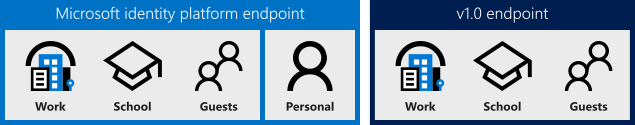
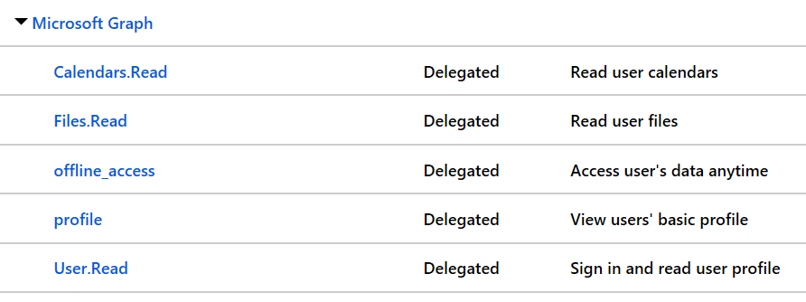

# Why update to Microsoft identity platform (v2.0)?

When developing a new application, it's important to know the differences between the Microsoft identity platform (v2.0) and Azure Active Directory (v1.0) endpoints. This article covers the main differences between the endpoints and some existing limitations for Microsoft identity platform.

> [!NOTE]
> The Microsoft identity platform endpoint doesn't support all Azure AD scenarios and features. To determine if you should use the Microsoft identity platform endpoint, read about [Microsoft identity platform limitations](#limitations).

## Who can sign in



* The v1.0 endpoint allows only work and school accounts to sign in to your application (Azure AD)
* The Microsoft identity platform endpoint allows work and school accounts from Azure AD and personal Microsoft accounts (MSA), such as hotmail.com, outlook.com, and msn.com, to sign in.
* Both endpoints also accept sign-ins of *[guest users](https://docs.microsoft.com/azure/active-directory/b2b/what-is-b2b)* of an Azure AD directory for applications configured as *[single-tenant](single-and-multi-tenant-apps.md)* or for *multi-tenant* applications configured to point to the tenant-specific endpoint (`https://login.microsoftonline.com/{TenantId_or_Name}`).

The Microsoft identity platform endpoint allows you to write apps that accept sign-ins from personal Microsoft accounts, and work and school accounts. This gives you the ability to write your app completely account-agnostic. For example, if your app calls the [Microsoft Graph](https://graph.microsoft.io), some additional functionality and data will be available to work accounts, such as their SharePoint sites or directory data. But for many actions, such as [Reading a user's mail](https://developer.microsoft.com/graph/docs/api-reference/v1.0/api/user_list_messages), the same code can access the email for both personal and work and school accounts.

For Microsoft identity platform endpoint, you can use the Microsoft Authentication Library (MSAL) to gain access to the consumer, educational, and enterprise worlds. The Azure AD v1.0 endpoint accepts sign-ins from work and school accounts only.

## Incremental and dynamic consent

Apps using the Azure AD v1.0 endpoint are required to specify their required OAuth 2.0 permissions in advance, for example:



The permissions set directly on the application registration are **static**. While static permissions of the app defined in the Azure portal keep the code nice and simple, it presents some possible issues for developers:

* The app needs to request all the permissions it would ever need upon the user's first sign-in. This can lead to a long list of permissions that discourages end users from approving the app's access on initial sign-in.

* The app needs to know all of the resources it would ever access ahead of time. It was difficult to create apps that could access an arbitrary number of resources.

With the Microsoft identity platform endpoint, you can ignore the static permissions defined in the app registration information in the Azure portal and request permissions incrementally instead, which means asking for a bare minimum set of permissions upfront and growing more over time as the customer uses additional app features. To do so, you can specify the scopes your app needs at any time by including the new scopes in the `scope` parameter when requesting an access token - without the need to pre-define them in the application registration information. If the user hasn't yet consented to new scopes added to the request, they'll be prompted to consent only to the new permissions. To learn more, see [permissions, consent, and scopes](v2-permissions-and-consent.md).

Allowing an app to request permissions dynamically through the `scope` parameter gives developers full control over your user's experience. You can also front load your consent experience and ask for all permissions in one initial authorization request. If your app requires a large number of permissions, you can gather those permissions from the user incrementally as they try to use certain features of the app over time.

Admin consent done on behalf of an organization still requires the static permissions registered for the app, so you should set those permissions for apps in the app registration portal if you need an admin to give consent on behalf of the entire organization. This reduces the cycles required by the organization admin to set up the application.

## Scopes, not resources

For apps using the v1.0 endpoint, an app can behave as a **resource**, or a recipient of tokens. A resource can define a number of **scopes** or **oAuth2Permissions** that it understands, allowing client apps to request tokens from that resource for a certain set of scopes. Consider the Azure AD Graph API as an example of a resource:

* Resource identifier, or `AppID URI`: `https://graph.windows.net/`
* Scopes, or `oAuth2Permissions`: `Directory.Read`, `Directory.Write`, and so on.

This holds true for the Microsoft identity platform endpoint. An app can still behave as a resource, define scopes, and be identified by a URI. Client apps can still request access to those scopes. However, the way that a client requests those permissions have changed.

For the v1.0 endpoint, an OAuth 2.0 authorize request to Azure AD might have looked like:

```text
GET https://login.microsoftonline.com/common/oauth2/authorize?
client_id=2d4d11a2-f814-46a7-890a-274a72a7309e
&resource=https://graph.windows.net/
...
```

Here, the **resource** parameter indicated which resource the client app is requesting authorization. Azure AD computed the permissions required by the app based on static configuration in the Azure portal, and issued tokens accordingly.

For applications using the Microsoft identity platform endpoint, the same OAuth 2.0 authorize request looks like:

```text
GET https://login.microsoftonline.com/common/oauth2/v2.0/authorize?
client_id=2d4d11a2-f814-46a7-890a-274a72a7309e
&scope=https://graph.windows.net/directory.read%20https://graph.windows.net/directory.write
...
```

Here, the **scope** parameter indicates which resource and permissions the app is requesting authorization. The desired resource is still present in the request - it's encompassed in each of the values of the scope parameter. Using the scope parameter in this manner allows the Microsoft identity platform endpoint to be more compliant with the OAuth 2.0 specification, and aligns more closely with common industry practices. It also enables apps to do [incremental consent](#incremental-and-dynamic-consent) - only requesting permissions when the application requires them as opposed to up front.

## Well-known scopes

### Offline access

Apps using the Microsoft identity platform endpoint may require the use of a new well-known permission for apps - the `offline_access` scope. All apps will need to request this permission if they need to access resources on the behalf of a user for a prolonged period of time, even when the user may not be actively using the app. The `offline_access` scope will appear to the user in consent dialogs as **Access your data anytime**, which the user must agree to. Requesting the `offline_access` permission will enable your web app to receive OAuth 2.0 refresh_tokens from the Microsoft identity platform endpoint. Refresh tokens are long-lived, and can be exchanged for new OAuth 2.0 access tokens for extended periods of access.

If your app doesn't request the `offline_access` scope, it won't receive refresh tokens. This means that when you redeem an authorization code in the OAuth 2.0 authorization code flow, you'll only receive back an access token from the `/token` endpoint. That access token remains valid for a short period of time (typically one hour), but will eventually expire. At that point in time, your app will need to redirect the user back to the `/authorize` endpoint to retrieve a new authorization code. During this redirect, the user may or may not need to enter their credentials again or reconsent to permissions, depending on the type of app.

To learn more about OAuth 2.0, `refresh_tokens`, and `access_tokens`, check out the [Microsoft identity platform protocol reference](active-directory-v2-protocols.md).

### OpenID, profile, and email

Historically, the most basic OpenID Connect sign-in flow with Microsoft identity platform would provide a lot of information about the user in the resulting *id_token*. The claims in an id_token can include the user's name, preferred username, email address, object ID, and more.

The information that the `openid` scope affords your app access to is now restricted. The `openid` scope will only allow your app to sign in the user and receive an app-specific identifier for the user. If you want to get personal data about the user in your app, your app needs to request additional permissions from the user. Two new scopes, `email` and `profile`, will allow you to request additional permissions.

* The `email` scope allows your app access to the user’s primary email address through the `email` claim in the id_token, assuming the user has an addressable email address.
* The `profile` scope affords your app access to all other basic information about the user, such as their name, preferred username, object ID, and so on, in the id_token.

These scopes allow you to code your app in a minimal-disclosure fashion so you can only ask the user for the set of information that your app needs to do its job. For more information on these scopes, see [the Microsoft identity platform scope reference](v2-permissions-and-consent.md).

## Token claims

The Microsoft identity platform endpoint issues a smaller set of claims in its tokens by default to keep payloads small. If you have apps and services that have a dependency on a particular claim in a v1.0 token that is no longer provided by default in a Microsoft identity platform token, consider using the [optional claims](active-directory-optional-claims.md) feature to include that claim.

## Limitations

There are a few restrictions to be aware of when using Microsoft identity platform.

When you build applications that integrate with the Microsoft identity platform, you need to decide whether the Microsoft identity platform endpoint and authentication protocols meet your needs. The v1.0 endpoint and platform is still fully supported and, in some respects, is more feature rich than Microsoft identity platform. However, Microsoft identity platform [introduces significant benefits](azure-ad-endpoint-comparison.md) for developers.

Here's a simplified recommendation for developers now:

* If you want or need to support personal Microsoft accounts in your application, or you're writing a new application, use Microsoft identity platform. But before you do, make sure you understand the limitations discussed in this article.
* If you're migrating or updating an application that relies on SAML, you can't use Microsoft identity platform. Instead, refer to the [Azure AD v1.0 guide](v1-overview.md).

The Microsoft identity platform endpoint will evolve to eliminate the restrictions listed here, so that you'll only ever need to use the Microsoft identity platform endpoint. In the meantime, use this article to determine whether the Microsoft identity platform endpoint is right for you. We'll continue to update this article to reflect the current state of the Microsoft identity platform endpoint. Check back to reevaluate your requirements against Microsoft identity platform capabilities.

### Restrictions on app registrations

For each app that you want to integrate with the Microsoft identity platform endpoint, you can create an app registration in the new [**App registrations** experience](https://aka.ms/appregistrations) in the Azure portal. Existing Microsoft account apps aren't compatible with the portal, but all Azure AD apps are, regardless of where or when they were registered.

App registrations that support work and school accounts and personal accounts have the following caveats:

* Only two app secrets are allowed per application ID.
* An application that wasn't registered in a tenant can only be managed by the account that registered it. It can’t be shared with other developers. This is the case for most apps that were registered using a personal Microsoft account in the App Registration Portal. If you’d like to share your app registration with multiple developers, register the application in a tenant using the new **App registrations** section of the Azure portal.
* There are several restrictions on the format of the redirect URL that is allowed. For more information about redirect URL, see the next section.

### Restrictions on redirect URLs

Apps that are registered for Microsoft identity platform are restricted to a limited set of redirect URL values. The redirect URL for web apps and services must begin with the scheme `https`, and all redirect URL values must share a single DNS domain.  The registration system compares the whole DNS name of the existing redirect URL to the DNS name of the redirect URL that you're adding. `http://localhost` is also supported as a redirect URL.  

The request to add the DNS name will fail if either of the following conditions is true:  

* The whole DNS name of the new redirect URL doesn't match the DNS name of the existing redirect URL.
* The whole DNS name of the new redirect URL isn't a subdomain of the existing redirect URL.

#### Example 1

If the app has a redirect URL of `https://login.contoso.com`, you can add a redirect URL where the DNS name matches exactly, as shown in the following example:

`https://login.contoso.com/new`

Or, you can refer to a DNS subdomain of login.contoso.com, as shown in the following example:

`https://new.login.contoso.com`

#### Example 2

If you want to have an app that has `login-east.contoso.com` and `login-west.contoso.com` as redirect URLs, you must add those redirect URLs in the following order:

`https://contoso.com`  
`https://login-east.contoso.com`  
`https://login-west.contoso.com`  

You can add the latter two because they're subdomains of the first redirect URL, contoso.com.

You can have only 20 reply URLs for a particular application - this limit applies across all app types that the registration supports (single-page application (SPA), native client, web app, and service).  

To learn how to register an app for use with Microsoft identity platform, see [Register an app using the new App registrations experience](quickstart-register-app.md).

### Restrictions on libraries and SDKs

Currently, library support for the Microsoft identity platform endpoint is limited. If you want to use the Microsoft identity platform endpoint in a production application, you have these options:

* If you're building a web application, you can safely use the generally available server-side middleware to do sign-in and token validation. These include the OWIN OpenID Connect middleware for ASP.NET and the Node.js Passport plug-in. For code samples that use Microsoft middleware, see the [Microsoft identity platform getting started](v2-overview.md#getting-started) section.
* If you're building a desktop or mobile application, you can use one of the Microsoft Authentication Libraries (MSAL). These libraries are generally available or in a production-supported preview, so it is safe to use them in production applications. You can read more about the terms of the preview and the available libraries in [authentication libraries reference](reference-v2-libraries.md).
* For platforms not covered by Microsoft libraries, you can integrate with the Microsoft identity platform endpoint by directly sending and receiving protocol messages in your application code. The OpenID Connect and OAuth protocols [are explicitly documented](active-directory-v2-protocols.md) to help you do such an integration.
* Finally, you can use open-source OpenID Connect and OAuth libraries to integrate with the Microsoft identity platform endpoint. The Microsoft identity platform endpoint should be compatible with many open-source protocol libraries without changes. The availability of these kinds of libraries varies by language and platform. The [OpenID Connect](https://openid.net/connect/) and [OAuth 2.0](https://oauth.net/2/) websites maintain a list of popular implementations. For more information, see [Microsoft identity platform and authentication libraries](reference-v2-libraries.md), and the list of open-source client libraries and samples that have been tested with the Microsoft identity platform endpoint.
* For reference, the `.well-known` endpoint for the Microsoft identity platform common endpoint is `https://login.microsoftonline.com/common/v2.0/.well-known/openid-configuration`. Replace `common` with your tenant ID to get data specific to your tenant.  

### Protocol changes

The Microsoft identity platform endpoint does not support SAML or WS-Federation; it only supports OpenID Connect and OAuth 2.0.  The notable changes to the OAuth 2.0 protocols from the v1.0 endpoint are: 

* The `email` claim is returned  if an optional claim is configured **or** scope=email was specified in the request. 
* The `scope` parameter is now supported in place of the `resource` parameter.  
* Many responses have been modified to make them more compliant with the OAuth 2.0 specification, for example, correctly returning `expires_in` as an int instead of a string.  

To better understand the scope of protocol functionality supported in the Microsoft identity platform endpoint, see [OpenID Connect and OAuth 2.0 protocol reference](active-directory-v2-protocols.md).

#### SAML restrictions

If you've used Active Directory Authentication Library (ADAL) in Windows applications, you might have taken advantage of Windows Integrated authentication, which uses the Security Assertion Markup Language (SAML) assertion grant. With this grant, users of federated Azure AD tenants can silently authenticate with their on-premises Active Directory instance without entering credentials. The SAML assertion grant isn't supported on the Microsoft identity platform endpoint.
