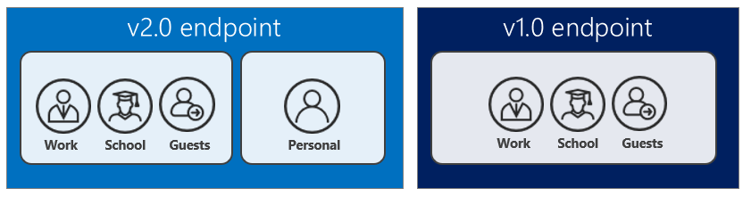

# Comparing the Azure AD v2.0 endpoint with the v1.0 endpoint

When developing a new application, it is important to know the differences between the v1.0 and v2.0 endpoints. Below are the main differences, as well as some existing limitations for the v2.0 endpoint.

> [!NOTE]
> Not all Azure Active Directory (Azure AD) scenarios and features are supported by the v2.0 endpoint. To determine if you should use the v2.0 endpoint, read about [v2.0 limitations](#limitations).

## Who can sign in



* The v1.0 endpoint allows only work and school accounts to sign in to your application (Azure AD)

* The v2.0 endpoint allows work and school accounts from Azure AD and personal accounts (MSA) (hotmail.com, outlook.com, msn.com) to sign in.

* Both v1.0 and v2.0 endpoints also accept sign-ins of *[guest users](https://docs.microsoft.com/azure/active-directory/b2b/what-is-b2b)* of an Azure AD directory for applications configured as *[single-tenant](single-and-multi-tenant-apps.md)* or for *multi-tenant* applications configured to point to the tenant-specific endpoint (`https://login.microsoftonline.com/{TenantId_or_Name}`).

The v2.0 endpoint allows you to write apps that accept sign-in from both personal and work and school accounts, giving you the ability to write your app completely account-agnostic. For instance, if your app calls the [Microsoft Graph](https://graph.microsoft.io), some additional functionality and data will be available to work accounts, such as their SharePoint sites or Directory data. But for many actions, such as [Reading a user's mail](https://graph.microsoft.io/docs/api-reference/v1.0/resources/message), the same code can access the email for both personal and work and school accounts.

For v2.0 endpoint, you can use a single library (MSAL) to gain access to both the consumer, educational and enterprise worlds.

 The Azure AD v1.0 endpoint accepts sign-ins from work and school accounts only.

## Incremental and dynamic consent

Apps using the Azure AD v1.0 endpoint are required to specify their required OAuth 2.0 permissions in advance, for example:


The permissions set directly on the application registration are **static**. While static permissions of the app defined in the Azure portal and kept the code nice and simple, it might present a few issues for developers:

* The app need know all of the permissions it would ever need at app creation time. Adding permissions over time was a difficult process.

* The app need to know all of the resources it would ever access ahead of time. It was difficult to create apps that could access an arbitrary number of resources.

* The app need to request all the permissions it would ever need upon the user's first sign-in. In some cases this led to a long list of permissions, which discouraged end users from approving the app's access on initial sign-in.

With the v2.0 endpoint, you can ignore the statically defined permissions defined in the app registration information in the Azure portal and specify the permissions your app needs **dynamically** at runtime, during regular use of your app, regardless of statically defined permissions in the application registration information.

To do so, you can specify the scopes your app needs at any given point in your application time by including the new scopes in the `scope` parameter when requesting an access token - without the need to pre-define them in the application registration information.

If the user has yet not consented to new scopes added to the request, they will be prompted to consent only to the new permissions. To learn more, you can read up on [permissions, consent, and scopes](v2-permissions-and-consent.md).

Allowing an app to request permissions dynamically through the `scope` parameter gives developers full control over your user's experience. If you wish, you can also choose to front load your consent experience and ask for all permissions in one initial authorization request. Or if your app requires a large number of permissions, you can choose to gather those permissions from the user incrementally, as they attempt to use certain features of your app over time.

Note that admin consent done on behalf of an organization still uses the static permissions registered for the app, so it is recommended that you set those permissions for apps using the v2.0 endpoint if you need an admin to give consent on behalf of the entire organization. This reduces the cycles required by the organization admin to setup the application

## Scopes, not resources

For apps using the v1.0 endpoint, an app can behave as a **resource**, or a recipient of tokens. A resource can define a number of **scopes** or **oAuth2Permissions** that it understands, allowing client apps to request tokens to that resource for a certain set of scopes. Consider the Azure AD Graph API as an example of a resource:

* Resource Identifier, or `AppID URI`: `https://graph.windows.net/`

* Scopes, or `OAuth2Permissions`: `Directory.Read`, `Directory.Write`, and so on.

All of this holds true for the v2.0 endpoint. An app can still behave as resource, define scopes, and be identified by a URI. Client apps can still request access to those scopes. However, the way that a client requests those permissions has changed. For the v1.0 endpoint, an OAuth 2.0 authorize request to Azure AD might have looked like:

```text
GET https://login.microsoftonline.com/common/oauth2/authorize?
client_id=2d4d11a2-f814-46a7-890a-274a72a7309e
&resource=https://graph.windows.net/
...
```

where the **resource** parameter indicated which resource the client app is requesting authorization for. Azure AD computed the permissions required by the app based on static configuration in the Azure portal, and issued tokens accordingly. For applications using the v2.0 endpoint, the same OAuth 2.0 authorize request looks like:

```text
GET https://login.microsoftonline.com/common/oauth2/v2.0/authorize?
client_id=2d4d11a2-f814-46a7-890a-274a72a7309e
&scope=https://graph.windows.net/directory.read%20https://graph.windows.net/directory.write
...
```

Where the **scope** parameter indicates which resource and permissions the app is requesting authorization for. The desired resource is still present in the request - it is simply encompassed in each of the values of the scope parameter. Using the scope parameter in this manner allows the v2.0 endpoint to be more compliant with the OAuth 2.0 specification, and aligns more closely with common industry practices. It also enables apps to perform [incremental consent](#incremental-and-dynamic-consent), which is described earlier.

## Well-known scopes

### Offline access

Apps using the v2.0 endpoint may require the use of a new well-known permission for apps - the `offline_access` scope. All apps will need to request this permission if they need to access resources on the behalf of a user for a prolonged period of time, even when the user may not be actively using the app. The `offline_access` scope will appear to the user in consent dialogs as **Access your data anytime**, which the user must agree to. Requesting the `offline_access` permission will enable your web app to receive OAuth 2.0 refresh_tokens from the v2.0 endpoint. Refresh tokens are long-lived, and can be exchanged for new OAuth 2.0 access tokens for extended periods of access.

If your app does not request the `offline_access` scope, it will not receive refresh tokens. This means that when you redeem an authorization code in the OAuth 2.0 authorization code flow, you will only receive back an access token from the `/token` endpoint. That access token will remain valid for a short period of time (typically one hour), but will eventually expire. At that point in time, your app will need to redirect the user back to the `/authorize` endpoint to retrieve a new authorization code. During this redirect, the user may or may not need to enter their credentials again or re-consent to permissions, depending on the type of app.

To learn more about OAuth 2.0, `refresh_tokens`, and `access_tokens`, check out the [v2.0 protocol reference](active-directory-v2-protocols.md).

### OpenID, profile, and email

Historically, the most basic OpenID Connect sign-in flow with Azure AD would provide a lot of information about the user in the resulting *id_token*. The claims in an *id_token* can include the user's name, preferred username, email address, object ID, and more.

The information that the `openid` scope affords your app access to is now restricted. The `openid` scope will only allow your app to sign in the user and receive an app-specific identifier for the user. If you want to obtain personal data about the user in your app, your app will need to request additional permissions from the user. Two new scopes – the `email` and `profile` scopes – will allow you to request additional permissions.

The `email` scope allows your app access to the user’s primary email address through the `email` claim in the id_token. The `profile` scope affords your app access to all other basic information about the user – their name, preferred username, object ID, and so on.

This allows you to code your app in a minimal-disclosure fashion – you can only ask the user for the set of information that your app requires to do its job. For more information on these scopes, see [the v2.0 scope reference](v2-permissions-and-consent.md).

## Token claims

The claims in tokens issued by the v2.0 endpoint will not be identical to tokens issued by the generally available Azure AD endpoints. Apps migrating to the new service should not assume a particular claim will exist in id_tokens or access_tokens. Further details of different types of tokens used in the v2.0 endpoint are available in the [access token](access-tokens.md) reference and [`id_token` reference](id-tokens.md)

## Limitations

There are a few restrictions to be aware of when using v2.0.

When you build applications that integrate with the Microsoft identity platform, you need to decide whether the v2.0 endpoint and authentication protocols meet your needs. The v1.0 endpoint and platform is still fully supported and, in some respects, is more feature rich than v2.0. However, v2.0 [introduces significant benefits](azure-ad-endpoint-comparison.md) for developers.

Here's a simplified recommendation for developers at this point in time:

* If you must support personal Microsoft accounts in your application, use v2.0. But before you do, be sure that you understand the limitations discussed in this article.

* If your application only needs to support Microsoft work and school accounts, don't use v2.0. Instead, refer to the [v1.0 guide](azure-ad-developers-guide.md).

The v2.0 endpoint will evolve to eliminate the restrictions listed here, so that you will only ever need to use the v2.0 endpoint. In the meantime, use this article to determine whether the v2.0 endpoint is right for you. We will continue to update this article to reflect the current state of the v2.0 endpoint. Check back to reevaluate your requirements against v2.0 capabilities.

### Restrictions on app types

Currently, the following types of apps are not supported by the v2.0 endpoint. For a description of supported app types, see [App types in v2.0](v2-app-types.md).

#### Standalone Web APIs

You can use the v2.0 endpoint to [build a Web API that is secured with OAuth 2.0](v2-app-types.md#web-apis). However, that Web API can receive tokens only from an application that has the same Application ID. You cannot access a Web API from a client that has a different Application ID. The client won't be able to request or obtain permissions to your Web API.

To see how to build a Web API that accepts tokens from a client that has the same Application ID, see the v2.0 endpoint Web API samples in the [v2.0 getting started](v2-overview.md#getting-started) section.

### Restrictions on app registrations

Currently, for each app that you want to integrate with the v2.0 endpoint, you must create an app registration in the new [Microsoft Application Registration Portal](https://apps.dev.microsoft.com/?referrer=https://azure.microsoft.com/documentation/articles&deeplink=/appList). Existing Azure AD or Microsoft account apps are not compatible with the v2.0 endpoint. Apps that are registered in any portal other than the Application Registration Portal are not compatible with the v2.0 endpoint.

In addition, app registrations that you create in the [Application Registration Portal](https://apps.dev.microsoft.com/?referrer=https://azure.microsoft.com/documentation/articles&deeplink=/appList) have the following caveats:

* Only two app secrets are allowed per Application ID.

* An app registration registered by a user with a personal Microsoft account can be viewed and managed only by a single developer account. It cannot be shared between multiple developers. If you would like to share your app registration amongst multiple developers, you can create the application by signing into the registration portal with an Azure AD account.

* There are several restrictions on the format of the redirect URL that is allowed. For more information about redirect URL, see the next section.

### Restrictions on redirect URLs

Apps that are registered in the Application Registration Portal are restricted to a limited set of redirect URL values. The redirect URL for web apps and services must begin with the scheme `https`, and all redirect URL values must share a single DNS domain. For example, you cannot register a web app that has one of these redirect URLs:

* `https://login-east.contoso.com`  
* `https://login-west.contoso.com`

The registration system compares the whole DNS name of the existing redirect URL to the DNS name of the redirect URL that you are adding. The request to add the DNS name will fail if either of the following conditions is true:  

* The whole DNS name of the new redirect URL does not match the DNS name of the existing redirect URL.

* The whole DNS name of the new redirect URL is not a subdomain of the existing redirect URL.

For example, if the app has this redirect URL:

`https://login.contoso.com`

You can add to it, like this:

`https://login.contoso.com/new`

In this case, the DNS name matches exactly. Or, you can do this:

`https://new.login.contoso.com`

In this case, you're referring to a DNS subdomain of login.contoso.com. If you want to have an app that has `login-east.contoso.com` and `login-west.contoso.com` as redirect URLs, you must add those redirect URLs in this order:

`https://contoso.com`  
`https://login-east.contoso.com`  
`https://login-west.contoso.com`  

You can add the latter two because they are subdomains of the first redirect URL, contoso.com. This limitation will be removed in an upcoming release.

Also note, you can have only 20 reply URLs for a particular application.

To learn how to register an app in the Application Registration Portal, see [How to register an app with the v2.0 endpoint](quickstart-v2-register-an-app.md).

### Restrictions on libraries and SDKs

Currently, library support for the v2.0 endpoint is limited. If you want to use the v2.0 endpoint in a production application, you have these options:

* If you are building a web application, you can safely use Microsoft generally available server-side middleware to perform sign-in and token validation. These include the OWIN Open ID Connect middleware for ASP.NET and the Node.js Passport plug-in. For code samples that use Microsoft middleware, see the [v2.0 getting started](v2-overview.md#getting-started) section.

* If you are building a desktop or mobile application, you can use one of the preview Microsoft Authentication Libraries (MSAL). These libraries are in a production-supported preview, so it is safe to use them in production applications. You can read more about the terms of the preview and the available libraries in [authentication libraries reference](reference-v2-libraries.md).

* For platforms not covered by Microsoft libraries, you can integrate with the v2.0 endpoint by directly sending and receiving protocol messages in your application code. The v2.0 OpenID Connect and OAuth protocols [are explicitly documented](active-directory-v2-protocols.md) to help you perform such an integration.

* Finally, you can use open-source Open ID Connect and OAuth libraries to integrate with the v2.0 endpoint. The v2.0 protocol should be compatible with many open-source protocol libraries without major changes. The availability of these kinds of libraries varies by language and platform. The [Open ID Connect](http://openid.net/connect/) and [OAuth 2.0](http://oauth.net/2/) websites maintain a list of popular implementations. For more information, see [Azure Active Directory v2.0 and authentication libraries](reference-v2-libraries.md), and the list of open-source client libraries and samples that have been tested with the v2.0 endpoint.

* For reference, the `.well-known` endpoint for the v2.0 common endpoint is `https://login.microsoftonline.com/common/v2.0/.well-known/openid-configuration` .  Replace `common` with your tenant ID to get data specific to your tenant.  

### Restrictions on protocols

The v2.0 endpoint does not support SAML or WS-Federation; it only supports Open ID Connect and OAuth 2.0. Not all features and capabilities of OAuth protocols have been incorporated into the v2.0 endpoint.

The following protocol features and capabilities currently are *not available* or *not supported* in the v2.0 endpoint:

* The `email` claim is returned only if an optional claim is configured and scope is scope=email was specified in the request. However, expect this behavior to change as the v2.0 endpoint is updated to further comply with the Open ID Connect and OAuth2.0 standards.

* The v2.0 endpoint does not support issuing role or group claims in ID tokens.

* The v2.0 endpoint does not support [OAuth 2.0 Resource Owner Password Credentials Grant](https://tools.ietf.org/html/rfc6749#section-4.3).

To better understand the scope of protocol functionality supported in the v2.0 endpoint, read through our [OpenID Connect and OAuth 2.0 protocol reference](active-directory-v2-protocols.md).

#### SAML restrictions

If you've used Active Directory Authentication Library (ADAL) in Windows applications, you might have taken advantage of Windows integrated authentication, which uses the Security Assertion Markup Language (SAML) assertion grant. With this grant, users of federated Azure AD tenants can silently authenticate with their on-premises Active Directory instance without entering credentials. Currently, the SAML assertion grant is not supported on the v2.0 endpoint.
