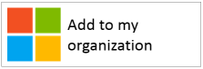
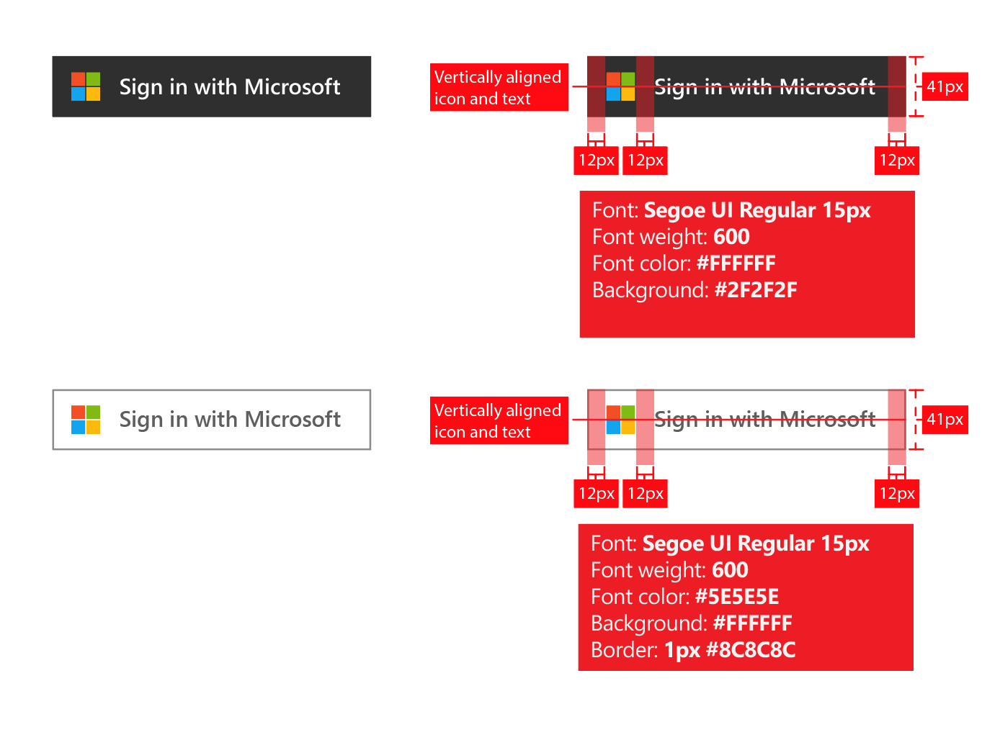

# Sign in with Microsoft: Branding guidelines for applications

When developing applications with the Microsoft identity platform, you need to direct your customers when they want to use their work or school account (managed in Microsoft Entra ID), or their personal account for sign-up and sign-in to your application.

In this article, you will:

- Learn about the two kinds of user accounts managed by Microsoft and how to refer to Microsoft Entra accounts in your application
- Learn the requirements for using the Microsoft logo in your app
- Download the official **Sign in** or **Sign in with Microsoft** images to use in your app
- Learn about the branding and navigation do's and don'ts

## Personal accounts vs. work or school accounts from Microsoft

Microsoft manages two kinds of user accounts:

- **Personal accounts** (formerly known as Windows Live ID). These accounts represent the relationship between *individual* users and Microsoft, and are used to access consumer devices and services from Microsoft. These accounts are intended for personal use.
- **Work or school accounts.** These accounts are managed by Microsoft on behalf of organizations that use Microsoft Entra ID. These accounts are used to sign in to Microsoft 365 and other business services from Microsoft.

Microsoft work or school accounts are typically assigned to end users (employees, students, federal employees) by their organizations (company, school, government agency). These accounts are mastered directly in the cloud (in Microsoft Entra ID) or synced to Microsoft Entra ID from an on-premises directory, such as Windows Server Active Directory. Microsoft is the *custodian* of the work or school accounts, but the accounts are owned and controlled by the organization.

## Referring to Microsoft Entra accounts in your application

Microsoft doesn’t expose end users to the Azure or the Active Directory brand names, and neither should you.

- Once users are signed in, use the organization’s name and logo as much as possible. This is better than using generic terms like “your organization.”
- When users aren't signed in, refer to their accounts as “Work or school accounts” and use the Microsoft logo to convey that Microsoft manages these accounts. Don’t use terms like “enterprise account,” “business account,” or “corporate account,” which create user confusion.

## User account pictogram

In an earlier version of these guidelines, we recommended using a “blue badge” pictogram. Based on user and developer feedback, we now recommend the use of the Microsoft logo instead. The Microsoft logo helps users understand that they can reuse the account they use with Microsoft 365 or other Microsoft business services to sign into your app.

## Signing up and signing in with Microsoft Entra ID

Your app may present separate paths for sign-up and sign-in and the following sections provide visual guidance for both scenarios.

**If your app supports end-user sign-up (for example, free to trial or freemium model)**: You can show a **sign-in** button that allows users to access your app with their work account or their personal account. Microsoft Entra ID shows a consent prompt the first time they access your app.

**If your app requires permissions that only admins can consent to, or if your app requires organizational licensing**: Separate admin acquisition from user sign-in. The **“get this app” button** will redirect admins to sign in then ask them to grant consent on behalf of users in their organization, which has the added benefit of suppressing end-user consent prompts to your app.

## Visual guidance for app acquisition

Your “get the app” link must redirect the user to the Microsoft Entra ID grant access (authorize) page, to allow an organization’s administrator to authorize your app to have access to their organization’s data, which is hosted by Microsoft. Details on how to request access are discussed in the [Integrating Applications with Microsoft Entra ID](./quickstart-register-app.md) article.

After admins consent to your app, they can choose to add it to their users’ Microsoft 365 app launcher experience (accessible from the waffle and from [https://www.office.com/](https://www.office.com/)). If you want to advertise this capability, you can use terms like “Add this app to your organization” and show a button like the following example:

However, we recommend that you write explanatory text instead of relying on buttons. For example:

> *If you already use Microsoft 365 or other business service from Microsoft, you can grant <your_app_name> access to your organization’s data. This will allow your users to access <your_app_name> with their existing work accounts.*

To download the official Microsoft logo for use in your app, right-click the one you want to use and then save it to your computer.

| Asset                                | PNG format | SVG format |
| ------------------------------------ | ---------- | ---------- |
| Microsoft logo  |  |  |

## Visual guidance for sign-in

Your app should display a sign-in button that redirects users to the sign-in endpoint that corresponds to the protocol you use to integrate with Microsoft Entra ID. The following section provides details on what that button should look like.

### Pictogram and “Sign in with Microsoft”

It’s the association of the Microsoft logo and the “Sign in with Microsoft” terms that uniquely represent Microsoft Entra ID amongst other identity providers your app may support. If you don’t have enough space for “Sign in with Microsoft,” it’s ok to shorten it to “Sign in.” You can use a light or dark color scheme for the buttons.

The following diagram shows the Microsoft-recommended redlines when using the assets with your app. The redlines apply to "Sign in with Microsoft" or the shorter "Sign in" version.

To download the official images for use in your app, right-click the one you want to use and then save it to your computer.

| Asset                                | PNG format | SVG format |
| ------------------------------------ | ---------- | ---------- |
| Sign in with Microsoft (dark theme)  |  |  |
| Sign in with Microsoft (light theme) |  |  |
| Sign in (dark theme)                 |  |  |
| Sign in (light theme)                |  |  |

## Localized terminology and UI strings

Microsoft Terminology can be used to ensure that terminology in your localized versions of applications match the corresponding terminology in Microsoft products.  You can query the Microsoft Terminology via the [Microsoft Terminology Search page](https://msit.powerbi.com/view?r=eyJrIjoiODJmYjU4Y2YtM2M0ZC00YzYxLWE1YTktNzFjYmYxNTAxNjQ0IiwidCI6IjcyZjk4OGJmLTg2ZjEtNDFhZi05MWFiLTJkN2NkMDExZGI0NyIsImMiOjV9).

Microsoft UI string translations can be used to ensure that translations in the localized versions of your applications match the corresponding UI strings in Microsoft products. You can query the Microsoft UI strings via the [Microsoft UI String Search page](https://msit.powerbi.com/view?r=eyJrIjoiMmE2NjJhMDMtNTY3MC00MmI2LWFmOWUtYWM5YTVjODI5MjQwIiwidCI6IjcyZjk4OGJmLTg2ZjEtNDFhZi05MWFiLTJkN2NkMDExZGI0NyIsImMiOjV9).

## Branding Do’s and Don’ts

**DO** use “work or school account” in combination with the "Sign in with Microsoft" button to provide additional explanation to help end users recognize whether they can use it. **DON’T** use other terms such as “enterprise account”, “business account” or “corporate account.”

**DON’T** use “Microsoft 365 ID” or “Azure ID.” Microsoft 365 is also the name of a consumer offering from Microsoft, which doesn’t use Microsoft Entra ID for authentication.

**DON’T** alter the Microsoft logo.

**DON’T** expose end users to the Azure or Active Directory brands. It’s ok however to use these terms with developers, IT pros, and admins.

## Navigation Do’s and Don’ts

**DO** provide a way for users to sign out and switch to another user account. While most people have a single personal account from Microsoft/Facebook/Google/Twitter, people are often associated with more than one organization. Support for multiple signed-in users is coming soon.
