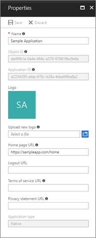

# Configure terms of service and privacy statement for an app

Developers who build and manage multi-tenant apps that integrate with Azure Active Directory (Azure AD) and Microsoft accounts should include links to the app's terms of service and privacy statement. The terms of service and privacy statement are surfaced to users through the user consent experience. They help your users know that they can trust your app. The terms of service and privacy statement are especially critical for user-facing multi-tenant apps--apps that are used by multiple directories or are available to any Microsoft account.

You are responsible for creating the terms of service and privacy statement documents for your app, and for providing the URLs to these documents. For multi-tenant apps that fail to provide these links, the user consent experience for your app will show an alert, which may discourage users from consenting to your app.

> [!NOTE]
> * The terms of service and privacy statement links are not applicable to single-tenant apps
> * If one or both of the two links are missing, your app will show an alert.

## User consent experience

The following example shows the user consent experience for a multi-tenant app when the terms of service and privacy statement are configured and when these links are not configured.


## Formatting links to the terms of service and privacy statement documents

Before you add links to your app's terms of service and privacy statement documents, make sure the URLs follow these guidelines.

| Guideline     | Description                           |
|---------------|---------------------------------------|
| Format        | Valid URL                             |
| Valid schemas | HTTP and HTTPS<br/>We recommend HTTPS |
| Max length    | 2048 characters                       |

Examples: `https://myapp.com/terms-of-service` and `https://myapp.com/privacy-statement`

## Adding links to the terms of service and privacy statement

When the terms of service and privacy statement are ready, you can add links to these documents in your app using one of these methods:

* [Through the Azure portal](#azure-portal)
* [Using the app object JSON](#app-object-json)
* [Using the Microsoft Graph API](#msgraph-rest-api)

### <a name="azure-portal"></a>Using the Azure portal

[!INCLUDE [portal updates](~/articles/active-directory/includes/portal-update.md)]

Follow these steps in the Azure portal.

1. Sign in to the <a href="https://portal.azure.com/" target="_blank">Azure portal</a> and select the correct Azure AD tenant(not B2C).
2. Navigate to the **App registrations** section and select your app.
3. Under **Manage**, select **Branding & properties**.
4. Fill out the **Terms of service URL** and **Privacy statement URL** fields.
5. Select **Save**.

    

### <a name="app-object-json"></a>Using the app object JSON

If you prefer to modify the app object JSON directly, you can use the manifest editor in the Azure portal or Application Registration Portal to include links to your app's terms of service and privacy statement.

1. Navigate to the **App Registrations** section and select your app.
2. Open the **Manifest** pane.
3. Ctrl+F, Search for "informationalUrls". Fill in the information.
4. Save your changes by downloading the app manifest, modifying it, and uploading it.

```json
    "informationalUrls": { 
        "termsOfService": "<your_terms_of_service_url>", 
        "privacy": "<your_privacy_statement_url>" 
    }
```

### <a name="msgraph-rest-api"></a>Using the Microsoft Graph API

To programmatically [update your app](/graph/api/application-update), you can use the Microsoft Graph API to update all your apps to include links to the terms of service and privacy statement documents.

```
PATCH https://graph.microsoft.com/v1.0/applications/{applicationObjectId}
{ 
    "appId": "{your application object id}", 
    "info": { 
        "termsOfServiceUrl": "<your_terms_of_service_url>", 
        "supportUrl": null, 
        "privacyStatementUrl": "<your_privacy_statement_url>", 
        "marketingUrl": null, 
        "logoUrl": null 
    }
}
```

> [!NOTE]
> * Be careful not to overwrite any pre-existing values you have assigned to any of these fields: `supportUrl`, `marketingUrl`, and `logoUrl`
> * The Microsoft Graph API only works when you sign in with an Azure AD account. Personal Microsoft accounts are not supported.
