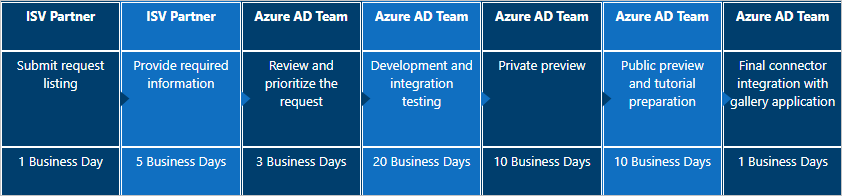

# How to: List your application in the Azure Active Directory application gallery

The [Azure Active Directory (Azure AD) application gallery](https://azure.microsoft.com/marketplace/active-directory/all/) is in the Azure Marketplace app store, where all application connectors are published for single sign-on and user provisioning. Customers who use Azure AD as an identity provider find the different SaaS application connectors published here. IT administrators add connectors from the app gallery and then configure and use the connectors for single sign-on and provisioning. Azure AD supports all major federation protocols for single sign-on, including OAuth 2.0, OpenID Connect, SAML 2.0, and WS-Federation.

Apps listed in the application gallery get the following benefits:

- Customers find the best possible single sign-on experience.
- Configuration of the application is simple and minimal.
- A quick search finds your application in the gallery.
- Free, Basic, and Premium Azure AD customers can all use this integration.
- Mutual customers get a step-by-step configuration tutorial.
- Customers who use SCIM can use provisioning for the same app.

## Prerequisites

- For Federated applications (Open ID and SAML/WS-Fed), the application must support the SaaS model for getting listed in Azure AD gallery. The enterprise gallery applications should support multiple customer configurations and not any specific customer.

- For Open ID Connect, the application should be multi-tenanted  and [Azure AD consent framework](quickstart-v1-integrate-apps-with-azure-ad.md#overview-of-the-consent-framework) should be properly implemented for the application. The user can send the login request to a common endpoint so that any customer can provide consent to the application. You can control user access based on the tenant ID and the user's UPN received in the token.

- For SAML 2.0/WS-Fed, your application needs to have the capability to do the SAML/WS-Fed SSO integration in SP or IDP mode. Please ensure this is working correctly before submitting the request.

- For password SSO, please ensure that your application supports form authentication so that password vaulting can be done to get single sign-on work as expected.

- For automatic user-provisioning requests, application should be listed in the gallery with single sign-on feature enabled using any of the federation protocol described above. You can request for SSO and User provisioning together on the portal, if it's not already listed.

## Implementing SSO using federation protocol

To list an application in the Azure AD app gallery, you first need to implement one of the following federation protocols supported by Azure AD and agree with Azure AD application Gallery terms and conditions. Read the terms and conditions of the Azure AD application gallery from [here](https://azure.microsoft.com/support/legal/active-directory-app-gallery-terms/).

- **OpenID Connect**: To integrate your application with Azure AD using the Open ID Connect protocol, follow the [developers' instructions](authentication-scenarios.md).

    

    * If you want to add your application to list in the gallery using OpenID Connect, select **OpenID Connect & OAuth 2.0** as above.
    * If you have any issues regarding access, contact the [Azure AD SSO Integration Team](<mailto:SaaSApplicationIntegrations@service.microsoft.com>). 

*   **SAML 2.0** or **WS-Fed**: If your app supports SAML 2.0, you can integrate it directly with an Azure AD tenant by using the [instructions to add a custom application](../manage-apps/configure-single-sign-on-non-gallery-applications.md).

    

    * If you want to add your application to list in the gallery using **SAML 2.0** or **WS-Fed**, select **SAMl 2.0/WS-Fed** as above.
    * If you have any issues regarding access, contact the [Azure AD SSO Integration Team](<mailto:SaaSApplicationIntegrations@service.microsoft.com>).

## Implementing SSO using password SSO

Create a web application that has an HTML sign-in page to configure [password-based single sign-on](../manage-apps/what-is-single-sign-on.md). Password-based SSO, also referred to as password vaulting, enables you to manage user access and passwords to web applications that don't support identity federation. It is also useful for scenarios in which several users need to share a single account, such as to your organization's social media app accounts.

* If you want to add your application to list in the gallery using Password SSO, select **Password SSO** as above.
* If you have any issues regarding access, contact the [Azure AD SSO Integration Team](<mailto:SaaSApplicationIntegrations@service.microsoft.com>).

## Update/Remove existing listing

To update or remove an existing application in the Azure AD app gallery, you first need to submit the request in the [Application Network Portal](https://microsoft.sharepoint.com/teams/apponboarding/Apps). If you have an Office 365 account, use that to sign in to this portal. If not, use your Microsoft account (such as Outlook or Hotmail) to sign in.

- Select the appropriate option as shown in the following image:

    

    * If you want to update an existing application, select **Update existing application listing**.
    * If you want to remove an existing application from the Azure AD gallery, select **Remove existing application listing**.
    * If you have any issues regarding access, contact the [Azure AD SSO Integration Team](<mailto:SaaSApplicationIntegrations@service.microsoft.com>). 

## Submit the request in the portal

After you've tested that your application integration works with Azure AD, submit your request for access on our [Application Network Portal](https://microsoft.sharepoint.com/teams/apponboarding/Apps). If you have an Office 365 account, use that to sign in to this portal. If not, use your Microsoft account (such as Outlook or Hotmail) to sign in.

After you sign in, the following page appears. Provide a business justification for needing access in the text box, and then select **Request Access**. Our team reviews the details and gives you access accordingly. After that, you can sign in to the portal and submit your detailed request for the application.

If you have any issues regarding access, contact the [Azure AD SSO Integration Team](<mailto:SaaSApplicationIntegrations@service.microsoft.com>).

## Timelines
    
The timeline for the process of listing a SAML 2.0 or WS-Fed application in the gallery is 7-10 business days.

   

The timeline for the process of listing an OpenID Connect application in the gallery is 2-5 business days.

   

The timeline for the process of listing the application in the gallery with user provisioning support is 40-45 business days.

   

## Escalations

For any escalations, send email to the [Azure AD SSO Integration Team](mailto:SaaSApplicationIntegrations@service.microsoft.com)  which is SaaSApplicationIntegrations@service.microsoft.com and we'll respond as soon as possible.