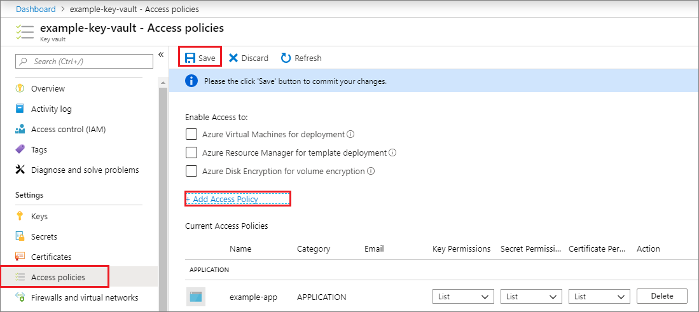

# Create a Microsoft Entra application and service principal that can access resources

In this article, you'll learn how to create a Microsoft Entra application and service principal that can be used with the role-based access control. When you register a new application in Microsoft Entra ID, a service principal is automatically created for the app registration. The service principal is the app's identity in the Microsoft Entra tenant. Access to resources is restricted by the roles assigned to the service principal, giving you control over which resources can be accessed and at which level. For security reasons, it's always recommended to use service principals with automated tools rather than allowing them to sign in with a user identity.

In this article, you'll create a single tenant application in the Azure portal. This example is applicable for line-of-business applications used within one organization. You can also [use Azure PowerShell](howto-authenticate-service-principal-powershell.md) or the [Azure CLI](/cli/azure/create-an-azure-service-principal-azure-cli) to create a service principal.

> [!IMPORTANT]
> Instead of creating a service principal, consider using managed identities for Azure resources for your application identity. If your code runs on a service that supports managed identities and accesses resources that support Microsoft Entra authentication, managed identities are a better option for you. To learn more about managed identities for Azure resources, including which services currently support it, see [What is managed identities for Azure resources?](../managed-identities-azure-resources/overview.md).

For more information on the relationship between app registration, application objects, and service principals, read [Application and service principal objects in Microsoft Entra ID](app-objects-and-service-principals.md).

## Prerequisites

To register an application in your Microsoft Entra tenant, you need:

- A Microsoft Entra user account. If you don't already have one, you can [create an account for free](https://azure.microsoft.com/free/?WT.mc_id=A261C142F).

## Permissions required for registering an app

You must have sufficient permissions to register an application with your Microsoft Entra tenant, and assign to the application a role in your Azure subscription. To complete these tasks, you require `Application.ReadWrite.All`permission.

<a name='register-an-application-with-azure-ad-and-create-a-service-principal'></a>

## Register an application with Microsoft Entra ID and create a service principal

[!INCLUDE [portal updates](~/articles/active-directory/includes/portal-update.md)]

1. Sign in to the [Microsoft Entra admin center](https://entra.microsoft.com) as at least a [Cloud Application Administrator](../roles/permissions-reference.md#cloud-application-administrator). 
1. Browse to **Identity** > **Applications** > **App registrations** then select **New registration**.
1. Name the application, for example "example-app". 
1. Select a supported account type, which determines who can use the application. 
1. Under **Redirect URI**, select **Web** for the type of application you want to create. Enter the URI where the access token is sent to.
1. Select **Register**.

   :::image type="content" source="media/howto-create-service-principal-portal/create-app.png" alt-text="Type a name for your application.":::

You've created your Microsoft Entra application and service principal.

## Assign a role to the application

To access resources in your subscription, you must assign a role to the application. Decide which role offers the right permissions for the application. To learn about the available roles, see [Azure built-in roles](/azure/role-based-access-control/built-in-roles).

You can set the scope at the level of the subscription, resource group, or resource. Permissions are inherited to lower levels of scope.

1. Sign in to the [Azure portal](https://portal.azure.com).
1. Select the level of scope you wish to assign the application to. For example, to assign a role at the subscription scope, search for and select **Subscriptions**. If you don't see the subscription you're looking for, select **global subscriptions filter**. Make sure the subscription you want is selected for the tenant.
1. Select **Access control (IAM)**.
1. Select **Add**, then select **Add role assignment**.
1. In the **Role** tab, select the role you wish to assign to the application in the list. For example, to allow the application to execute actions like reboot, start and stop instances, select the **Contributor** role.
1. Select the **Next**.
1. On the **Members** tab. Select **Assign access to**, then select **User, group, or service principal**
1. Select **Select members**. By default, Microsoft Entra applications aren't displayed in the available options. To find your application, Search for it by its name. 
1. Select the **Select** button, then select **Review + assign**.

    :::image type="content" source="media/howto-create-service-principal-portal/add-role-assignment.png" alt-text="Screenshot showing role assignment.":::
 
Your service principal is set up. You can start using it to run your scripts or apps. To manage your service principal (permissions, user consented permissions, see which users have consented, review permissions, see sign in information, and more), go to **Enterprise applications**.

The next section shows how to get values that are needed when signing in programmatically.

## Sign in to the application

When programmatically signing in, pass the tenant ID and the application ID in your authentication request. You also need a certificate or an authentication key. To obtain the directory (tenant) ID and application ID:

1. Browse to **Identity** > **Applications** > **App registrations**, then select your application.
1. On the app's overview page, copy the Directory (tenant) ID value and store it in your application code.
1. Copy the Application (client) ID value and store it in your application code.

## Set up authentication

There are two types of authentication available for service principals: password-based authentication (application secret) and certificate-based authentication. *We recommend using a trusted certificate issued by a certificate authority*, but you can also create an application secret or create a self-signed certificate for testing.

### Option 1 (recommended): Upload a trusted certificate issued by a certificate authority

To upload the certificate file:

1. Browse to **Identity** > **Applications** > **App registrations**, then select your application.
1. Select **Certificates & secrets**.
1. Select **Certificates**, then select **Upload certificate** and then select the certificate file to upload.
1. Select **Add**. Once the certificate is uploaded, the thumbprint, start date, and expiration values are displayed.

After registering the certificate with your application in the application registration portal, enable the [confidential client application](authentication-flows-app-scenarios.md#single-page-public-client-and-confidential-client-applications) code to use the certificate.

### Option 2: Testing only- create and upload a self-signed certificate

Optionally, you can create a self-signed certificate for *testing purposes only*. To create a self-signed certificate, open Windows PowerShell and run [New-SelfSignedCertificate](/powershell/module/pki/new-selfsignedcertificate) with the following parameters to create the certificate in the user certificate store on your computer:

```powershell
$cert=New-SelfSignedCertificate -Subject "CN=DaemonConsoleCert" -CertStoreLocation "Cert:\CurrentUser\My"  -KeyExportPolicy Exportable -KeySpec Signature
```

Export this certificate to a file using the [Manage User Certificate](/dotnet/framework/wcf/feature-details/how-to-view-certificates-with-the-mmc-snap-in) MMC snap-in accessible from the Windows Control Panel.

1. Select **Run** from the **Start** menu, and then enter **certmgr.msc**. The Certificate Manager tool for the current user appears.
1. To view your certificates, under **Certificates - Current User** in the left pane, expand the **Personal** directory.
1. Right-click on the certificate you created, select **All tasks->Export**.
1. Follow the Certificate Export wizard.

To upload the certificate:

1. Browse to **Identity** > **Applications** > **App registrations**, then select your application.
1. Select **Certificates & secrets**.
1. Select **Certificates**, then select **Upload certificate** and then select the certificate (an existing certificate or the self-signed certificate you exported).
1. Select **Add**.

After registering the certificate with your application in the application registration portal, enable the [confidential client application](authentication-flows-app-scenarios.md#single-page-public-client-and-confidential-client-applications) code to use the certificate.

### Option 3: Create a new client secret

If you choose not to use a certificate, you can create a new client secret.

1. Browse to **Identity** > **Applications** > **App registrations**, then select your application.
1. Select **Certificates & secrets**.
1. Select **Client secrets**, and then Select **New client secret**.
1. Provide a description of the secret, and a duration.
1. Select **Add**.

Once you've saved the client secret, the value of the client secret is displayed. This is only displayed once, so copy this value and store it where your application can retrieve it, usually where your application keeps values like `clientId`, or `authoruty` in the source code. You'll provide the secret value along with with the application's client ID to sign in as the application.

   :::image type="content" source="media/howto-create-service-principal-portal/copy-secret.png" alt-text="Screenshot showing the client secret.":::

## Configure access policies on resources

You might need to configure extra permissions on resources that your application needs to access. For example, you must also [update a key vault's access policies](/azure/key-vault/general/security-features#privileged-access) to give your application access to keys, secrets, or certificates.

To configure access policies:

1. Sign in to the [Azure portal](https://portal.azure.com).
1. Select your key vault and select **Access policies**.
1. Select **Add access policy**, then select the key, secret, and certificate permissions you want to grant your application. Select the service principal you created previously.
1. Select **Add** to add the access policy.
1. **Save**.

    

## Next steps

- Learn how to use [Azure PowerShell](howto-authenticate-service-principal-powershell.md) or [Azure CLI](/cli/azure/create-an-azure-service-principal-azure-cli) to create a service principal.
- To learn about specifying security policies, see [Azure role-based access control (Azure RBAC)](/azure/role-based-access-control/role-assignments-portal).
- For a list of available actions that can be granted or denied to users, see [Azure Resource Manager Resource Provider operations](/azure/role-based-access-control/resource-provider-operations).
- For information about working with app registrations by using **Microsoft Graph**, see the [Applications](/graph/api/resources/application) API reference.
