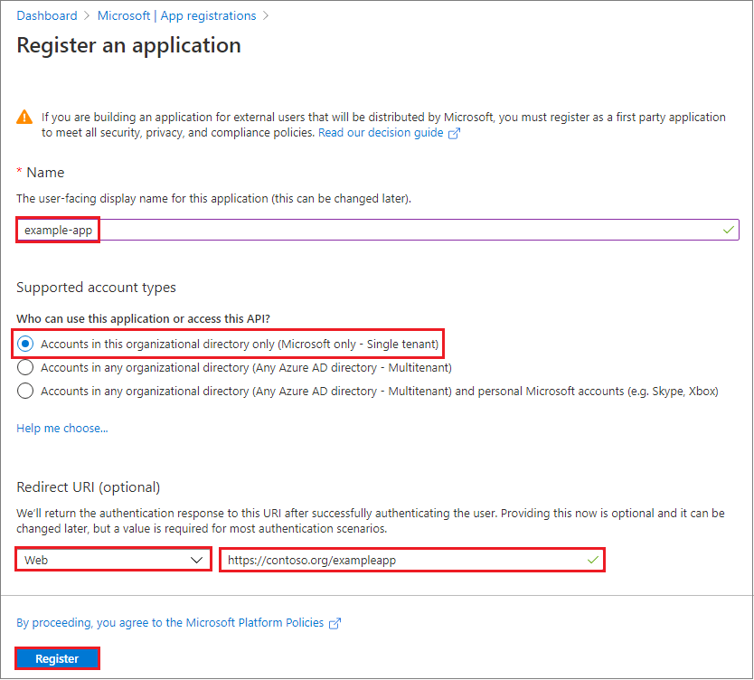
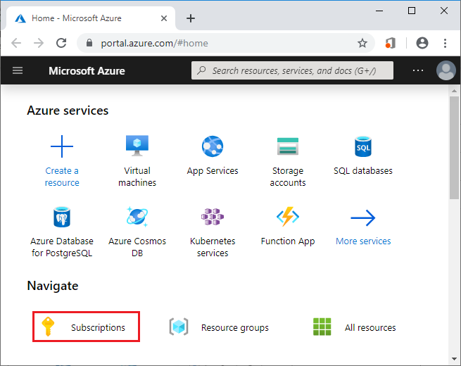
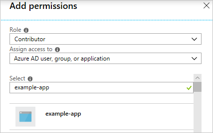
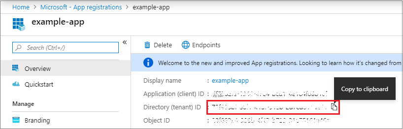
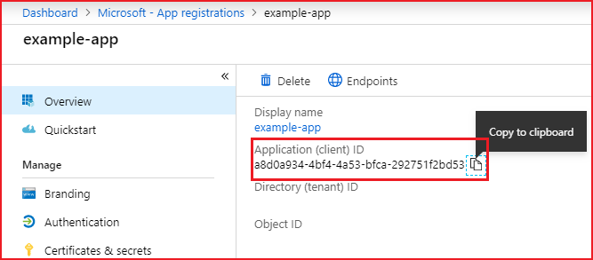
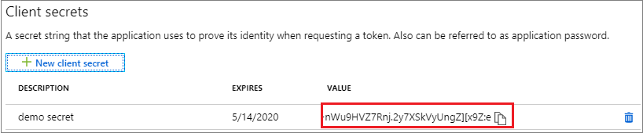
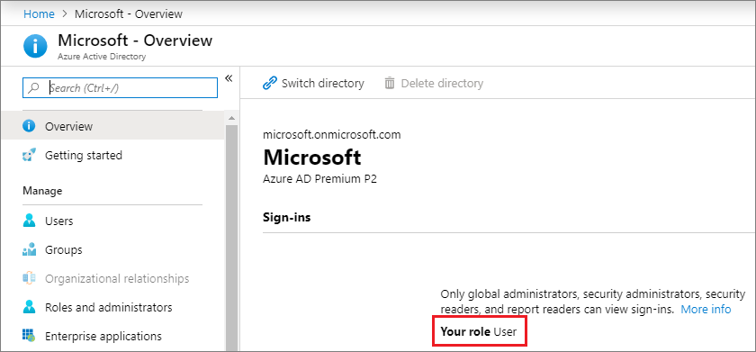
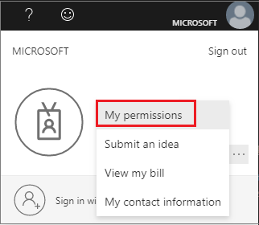
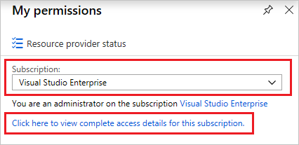
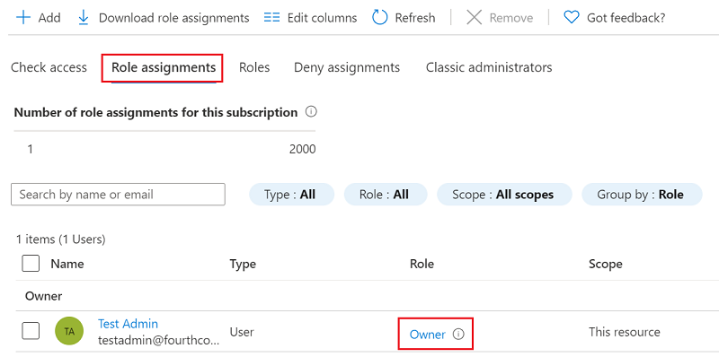

# How to: Use the portal to create an Azure AD application and service principal that can access resources

This article shows you how to create a new Azure Active Directory (Azure AD) application and service principal that can be used with the role-based access control. When you have code that needs to access or modify resources, you can create an identity for the app. This identity is known as a service principal. You can then assign the required permissions to the service principal. This article shows you how to use the portal to create the service principal. It focuses on a single-tenant application where the application is intended to run within only one organization. You typically use single-tenant applications for line-of-business applications that run within your organization.

> [!IMPORTANT]
> Instead of creating a service principal, consider using managed identities for Azure resources for your application identity. If your code runs on a service that supports managed identities and accesses resources that support Azure AD authentication, managed identities are a better option for you. To learn more about managed identities for Azure resources, including which services currently support it, see [What is managed identities for Azure resources?](../managed-identities-azure-resources/overview.md).

## Create an Azure Active Directory application

Let's jump straight into creating the identity. If you run into a problem, check the [required permissions](#required-permissions) to make sure your account can create the identity.

1. Sign in to your Azure Account through the [Azure portal](https://portal.azure.com).
1. Select **Azure Active Directory**.
1. Select **App registrations**.
1. Select **New registration**.
1. Name the application. Select a supported account type, which determines who can use the application. Under **Redirect URI**, select **Web** for the type of application you want to create. Enter the URI where the access token is sent to. You can't create credentials for a [Native application](../manage-apps/application-proxy-configure-native-client-application.md). You can't use that type for an automated application. After setting the values, select **Register**.

   

You've created your Azure AD application and service principal.

## Assign the application to a role

To access resources in your subscription, you must assign the application to a role. Decide which role offers the right permissions for the application. To learn about the available roles, see [RBAC: Built in Roles](../../role-based-access-control/built-in-roles.md).

You can set the scope at the level of the subscription, resource group, or resource. Permissions are inherited to lower levels of scope. For example, adding an application to the Reader role for a resource group means it can read the resource group and any resources it contains.

1. Navigate to the level of scope you wish to assign the application to. For example, to assign a role at the subscription scope, select **All services** and **Subscriptions**.

   

1. Select the particular subscription to assign the application to.

   

   If you don't see the subscription you're looking for, select **global subscriptions filter**. Make sure the subscription you want is selected for the portal.

1. Select **Access control (IAM)**.
1. Select **Add role assignment**.
1. Select the role you wish to assign to the application. To allow the application to execute actions like **reboot**, **start** and **stop** instances, select the **Contributor** role. By default, Azure AD applications aren't displayed in the available options. To find your application, search for the name and select it.

   

1. Select **Save** to finish assigning the role. You see your application in the list of users assigned to a role for that scope.

Your service principal is set up. You can start using it to run your scripts or apps. The next section shows how to get values that are needed when signing in programmatically.

## Get values for signing in

When programmatically signing in, you need to pass the tenant ID with your authentication request. You also need the ID for your application and an authentication key. To get those values, use the following steps:

1. Select **Azure Active Directory**.
1. From **App registrations** in Azure AD, select your application.
1. Copy the Directory (tenant) ID and store it in your application code.

    

1. Copy the **Application ID** and store it in your application code.

   

## Certificates and secrets
Daemon applications can use two forms of credentials to authenticate with Azure AD: certificates and application secrets.  We recommend using a certificate, but you can also create a new application secret.

### Upload a certificate

You can use an existing certificate if you have one.  Optionally, you can create a self-signed certificate for testing purposes. Open PowerShell and run [New-SelfSignedCertificate](/powershell/module/pkiclient/new-selfsignedcertificate) with the following parameters to create a self-signed certificate in the user certificate store on your computer: `$cert=New-SelfSignedCertificate -Subject "CN=DaemonConsoleCert" -CertStoreLocation "Cert:\CurrentUser\My"  -KeyExportPolicy Exportable -KeySpec Signature`.  Export this certificate using the [Manage User Certificate](/dotnet/framework/wcf/feature-details/how-to-view-certificates-with-the-mmc-snap-in) MMC snap-in accessible from the Windows Control Panel.

To upload the certificate:

1. Select **Certificates & secrets**.
1. Select **Upload certificate** and select the certificate (an existing certificate or the self-signed certificate you exported).

    

1. Select **Add**.

After registering the certificate with your application in the application registration portal, you need to enable the client application code to use the certificate.

### Create a new application secret

If you choose not to use a certificate, you can create a new application secret.

1. Select **Certificates & secrets**.
1. Select **Client secrets -> New client secret**.
1. Provide a description of the secret, and a duration. When done, select **Add**.

   After saving the client secret, the value of the client secret is displayed. Copy this value because you aren't able to retrieve the key later. You provide the key value with the application ID to sign in as the application. Store the key value where your application can retrieve it.

   

## Required permissions

You must have sufficient permissions to register an application with your Azure AD tenant, and assign the application to a role in your Azure subscription.

### Check Azure AD permissions

1. Select **Azure Active Directory**.
1. Note your role. If you have the **User** role, you must make sure that non-administrators can register applications.

   

1. Select **User settings**.
1. Check the **App registrations** setting. This value can only be set by an administrator. If set to **Yes**, any user in the Azure AD tenant can register an app.

If the app registrations setting is set to **No**, only users with an administrator role may register these types of applications. See [available roles](../users-groups-roles/directory-assign-admin-roles.md#available-roles) and [role permissions](../users-groups-roles/directory-assign-admin-roles.md#role-permissions) to learn about available administrator roles and the specific permissions in Azure AD that are given to each role. If your account is assigned to the User role, but the app registration setting is limited to admin users, ask your administrator to either assign you to one of the administrator roles that can create and manage all aspects of app registrations, or to enable users to register apps.

### Check Azure subscription permissions

In your Azure subscription, your account must have `Microsoft.Authorization/*/Write` access to assign an AD app to a role. This action is granted through the [Owner](../../role-based-access-control/built-in-roles.md#owner) role or [User Access Administrator](../../role-based-access-control/built-in-roles.md#user-access-administrator) role. If your account is assigned to the **Contributor** role, you don't have adequate permission. You receive an error when attempting to assign the service principal to a role.

To check your subscription permissions:

1. Select your account in the upper right corner, and select **... -> My permissions**.

   

1. From the drop-down list, select the subscription you want to create the service principal in. Then, select **Click here to view complete access details for this subscription**.

   

1. Select **Role assignments** to view your assigned roles, and determine if you have adequate permissions to assign an AD app to a role. If not, ask your subscription administrator to add you to User Access Administrator role. In the following image, the user is assigned to the Owner role, which means that user has adequate permissions.

   

## Next steps

* To set up a multi-tenant application, see [Developer's guide to authorization with the Azure Resource Manager API](../../azure-resource-manager/resource-manager-api-authentication.md).
* To learn about specifying security policies, see [Azure Role-based Access Control](../../role-based-access-control/role-assignments-portal.md).  
* For a list of available actions that can be granted or denied to users, see [Azure Resource Manager Resource Provider operations](../../role-based-access-control/resource-provider-operations.md).
