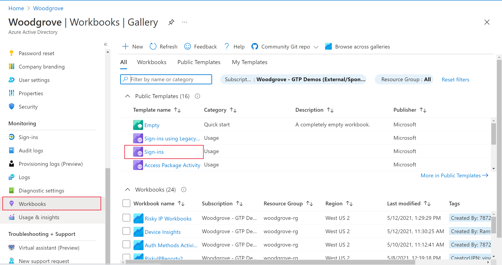
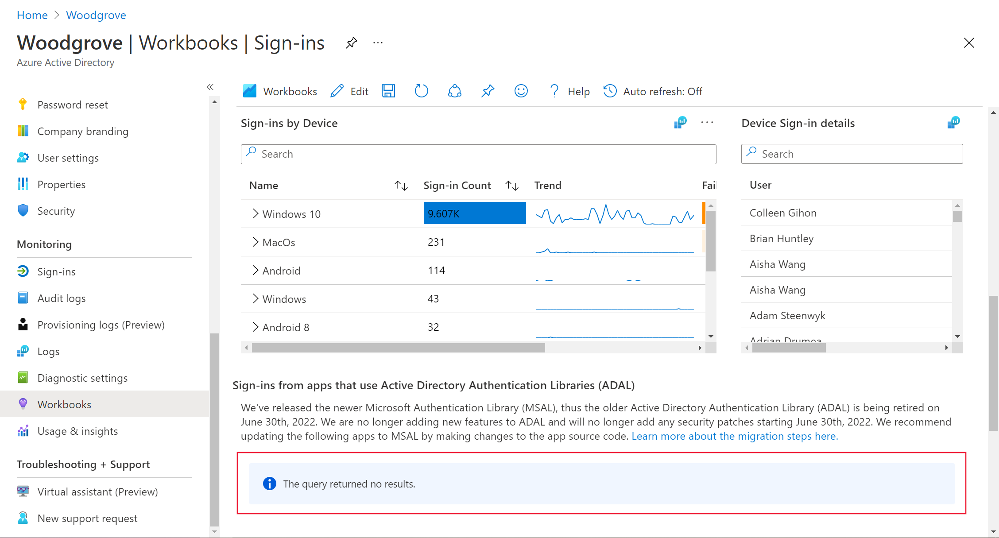

# How to: Get a complete list of apps using ADAL in your tenant

We are ending support for Active Directory Authentication Library (ADAL) on June 30th, 2022. Apps using ADAL on existing OS versions will continue to work, but we will not provide any technical support or security updates. Without continued security updates, apps using ADAL will become increasingly vulnerable to the latest security attack patterns. This article provides guidance on how to obtain a list of all apps in your tenant that are using ADAL using Azure Monitor workbooks.

## Prerequisites

The following article is recommended before going through this article:

- [MSAL overview](./msal-overview.md)

## Sign-ins workbook

Workbooks are a set of queries that collect and visualize information that is available in Azure AD logs. [Learn more about the sign-in logs schema here.](../reports-monitoring/reference-azure-monitor-sign-ins-log-schema.md) We have added a new table to the existing Sign-ins workbook in the Azure AD admin portal to assist you in determining which applications use ADAL and how often they are used. First, we’ll detail how to access the workbook before showing the visualization for the list of applications.

### Accessing the workbook

If your organization is new to Azure Monitoring workbooks, [integrate your Azure AD sign-in and audit logs with Azure Monitor](../reports-monitoring/howto-integrate-activity-logs-with-log-analytics.md) before accessing the workbook. This integration allows you to store, and query, and visualize your logs using workbooks for up to two years. Only sign-in and audit events created after Azure Monitor integration will be stored. Insights before the date of the Azure Monitor integration won't be available. You can use the workbook to assess past insights if your Azure AD sign-in and audit logs is already integrated with Azure Monitor.

To access the workbook: 

1. Sign into the Azure portal 
2. Navigate to **Azure Active Directory** > **Monitoring** > **Workbooks** 
3. In the Usage section, open the **Sign-ins** workbook 

### Identify apps running on ADAL

The Sign-ins workbook has a new table at the bottom of the page that can show you which recently used apps are using ADAL as shown below. Update these apps to use MSAL.

If there are no apps running on ADAL, the workbook will display a view as shown below. 

## Next steps

After identifying your apps, we recommend you [start migrating all ADAL apps to MSAL](msal-migration.md).
