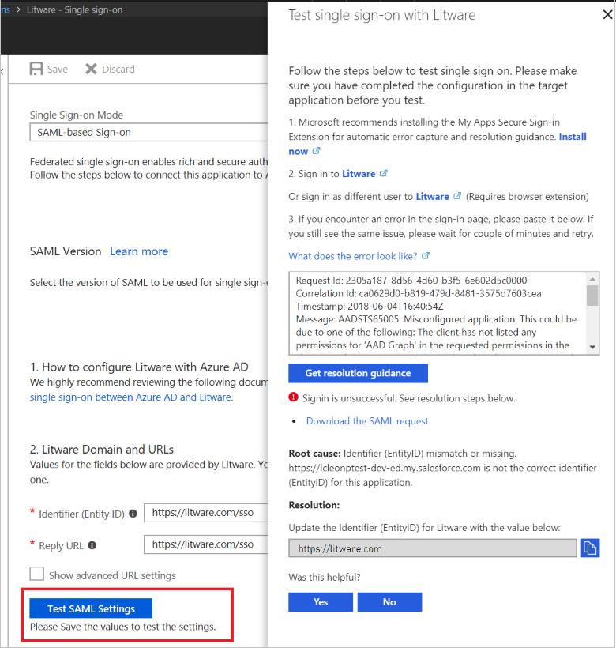
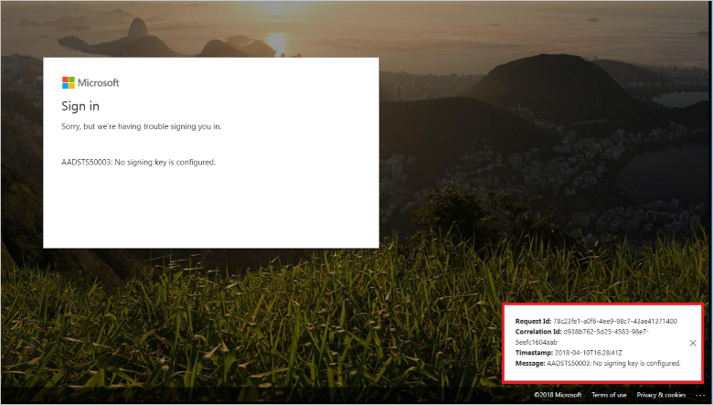

# Debug SAML-based single sign-on to applications in Azure Active Directory

Learn how to find and fix [single sign-on](../manage-apps/what-is-single-sign-on.md) issues for applications in Azure Active Directory (Azure AD) that support [Security Assertion Markup Language (SAML) 2.0](https://en.wikipedia.org/wiki/Security_Assertion_Markup_Language). 

## Before you begin
We recommend installing the [My Apps Secure Sign-in Extension](../user-help/active-directory-saas-access-panel-user-help.md#i-am-having-trouble-installing-the-my-apps-secure-sign-in-extension). This browser extension makes it easy to gather the SAML request and SAML response information that you need for resolving issues with single sign-on. In case you cannot install the extension, this article shows you how to resolve issues both with and without the extension installed.

To download and install the My Apps Secure Sign-in Extension, use one of the following links.

- [Chrome](https://go.microsoft.com/fwlink/?linkid=866367)
- [Edge](https://go.microsoft.com/fwlink/?linkid=845176)
- [Firefox](https://go.microsoft.com/fwlink/?linkid=866366)

## Test SAML-based single sign-on

To test SAML-based single sign-on between AAD and a target application:

1.	Sign in to the [Azure portal](https://portal.azure.com) as a global administrator or other administrator that is authorized to manage applications.
2.	In the left blade, click **Azure Active Directory**, and then click **Enterprise applications**. 
3.	From the list of Enterprise Applications, click the application for which you want to test single sign-on, and then from the options on the left click **Single sign-on**.
4.	To open the SAML-based single sign-on testing experience, in the **Domain and URLs** section click **Test SAML Setting**. If the Test SAML Setting button is greyed out, you need to fill out and save the required attributes first.
5.	In the **Test single sign-on** blade, use your corporate credentials to sign in to the target application. You can sign in as the current user or as a different user. If you sign in as a different user, a prompt will ask you to authenticate.

    

If you are successfully signed in, the test has passed. In this case, Azure AD issued a SAML response token to the application. The application used the SAML token to successfully sign you in.

If you have an error on the company sign-in page or the application's page, use one of the next sections to resolve the error.

## Resolve a sign-in error on your company sign-in page

When you try to sign in you might see an error on your company sign-in page. 

To debug this error, you need the error message and the SAML request. The My Apps Secure Sign-in Extension automatically gathers this information and displays resolution guidance on Azure AD. 

To resolve the sign-in error with the MyApps Secure Sign-in Extension installed:

1.	When an error occurs, the extension redirects you back to the Azure Ad **Test single sign-on** blade. 
2.	On the **Test single sign-on** blade, click **Download the SAML request**. 
3.	You should see specific resolution guidance based on the error and the values in the SAML request. Review the guidance.

To resolve the error without installing MyApps Secure Sign-in Extension:

1. Copy the error message at the bottom right corner of the page. The error message includes:
    - A CorrelationID and Timestamp. These values are important when you create a support case with Microsoft because they help the engineers to identify your problem and provide an accurate resolution to your issue.
	- A statement identifying the root cause of the problem.
2.	Go back to Azure AD and find the **Test single sign-on** blade.
3.	In the text box above **Get resolution guidance**, paste the error message.
3.	Click **Get resolution guidance** to display steps for resolving the issue. The guidance might require information from the SAML request or SAML response. If you’re not using the  MyApps Secure Sign-in Extension, you might need a tool such as [Fiddler](http://www.telerik.com/fiddler) to retrieve the SAML request and response.
4.	Verify the destination in the SAML request corresponds to the SAML Single Sign-On Service URL obtained from Azure Active Directory
5.	Verify the issuer in the SAML request is the same identifier you have configured for the application in Azure Active Directory. Azure AD uses the issuer to find an application in your directory.
6.	Verify AssertionConsumerServiceURL is where the application expects to receive the SAML token from Azure Active Directory. You can configure this value in Azure Active Directory, but it’s not mandatory if it’s part of the SAML request.

## Resolve a sign-in error on the application page

You might sign in successfully and then see an error on the application's page. This occurs when Azure AD issued a token to the application, but the application does not accept the response.   

To resolve the error:

1. If the application is in the Azure AD Gallery, verify you have followed all the steps for integrating the application with Azure AD. To find the integration instructions for your application, see the [list of SaaS application integration tutorials](../saas-apps/tutorial-list.md).
2. Retrieve the SAML response.
    - If the My Apps Secure Sign-in extension is installed, from the **Test single sign-on** blade, click **download the SAML response**.
    - If the extension is not installed, use a tool such as [Fiddler](http://www.telerik.com/fiddler) to retrieve the SAML response. 
3. Notice these elements in the SAML response token:
    - User unique identifier of NameID value and format
    - Claims issued in the token
    - Certificate used to sign the token. For information on how to review the SAML response, see [Single Sign-On SAML protocol](single-sign-on-saml-protocol.md).
4. For more information on the SAML response, see [Single Sign-on SAML protocol](single-sign-on-saml-protocol.md).
5. Now that you have reviewed the SAML response, see [Error on an application's page after signing in](../manage-apps/application-sign-in-problem-application-error.md) for guidance on resolving the problem. 
6. If you are still not able to sign in successfully, you can ask the application vendor what is missing from the SAML response.

## Next steps
Now that single sign-on is working to your application, you could [Automate user provisioning and deprovisioning to SaaS applications](../manage-apps/user-provisioning.md), or [get started with conditional access](../conditional-access/app-based-conditional-access.md).

