# Microsoft identity platform videos

Learn the basics of modern authentication, the Microsoft identity platform, and the Microsoft Authentication Libraries (MSAL).

## Microsoft identity platform for developers

In the *Identity for Developers* video series, Matthijs Hoekstra and Kyle Marsh provide a guided introduction to the Microsoft identity platform. Learn the key components and capabilities of the platform and how to use its authentication libraries to get started adding modern, secure authentication to your apps.

With content curated and honed over the many training sessions they've conducted, this series is a good place to start for any developer getting started with identity in Azure.
___

:::row:::
    :::column:::
        1 - <a href="https://www.youtube.com/watch?v=zjezqZPPOfc&list=PLLasX02E8BPBxGouWlJV-u-XZWOc2RkiX&index=1" target="_blank">Overview of the Microsoft identity platform for developers </a> (33:55)
    :::column-end:::
    :::column:::
        <a href="https://www.youtube.com/watch?v=zjezqZPPOfc" target="_blank"> 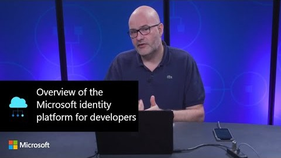 </a>
    :::column-end:::
     :::column:::
        2 - <a href="https://www.youtube.com/watch?v=Mtpx_lpfRLs&list=PLLasX02E8BPBxGouWlJV-u-XZWOc2RkiX&index=2" target="_blank">How to authenticate users of your apps with the Microsoft identity platform </a> (29:09)
    :::column-end:::
    :::column:::
        <a href="https://www.youtube.com/watch?v=Mtpx_lpfRLs" target="_blank"> 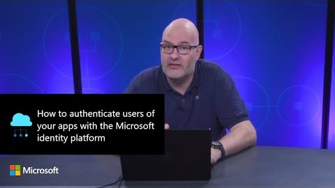 </a>
    :::column-end:::
:::row-end:::
:::row:::
    :::column:::
        3 - <a href="https://www.youtube.com/watch?v=toAWRNqqDL4&list=PLLasX02E8BPBxGouWlJV-u-XZWOc2RkiX&index=3" target="_blank">Microsoft identity platform’s permissions and consent framework </a> (45:08)
    :::column-end:::
    :::column:::
        <a href="https://www.youtube.com/watch?v=toAWRNqqDL4" target="_blank"> 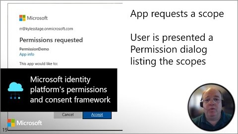 </a>
    :::column-end:::
    :::column:::
        4 - <a href="https://www.youtube.com/watch?v=IIQ7QW4bYqA&list=PLLasX02E8BPBxGouWlJV-u-XZWOc2RkiX&index=4" target="_blank">How to protect APIs using the Microsoft identity platform </a> (33:17)
    :::column-end:::
    :::column:::
        <a href="https://www.youtube.com/watch?v=IIQ7QW4bYqA" target="_blank"> 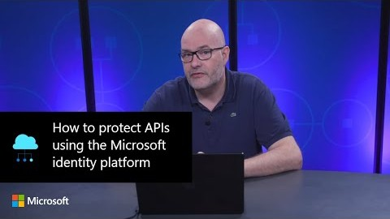 </a>
    :::column-end:::
:::row-end:::
:::row:::
    :::column:::
        5 - <a href="https://www.youtube.com/watch?v=-BK2iBDrmNo&list=PLLasX02E8BPBxGouWlJV-u-XZWOc2RkiX&index=5" target="_blank">Application roles and security groups on the Microsoft identity platform </a> (15:52)
    :::column-end:::
    :::column:::
        
    :::column-end:::
    :::column:::
        <!-- BLANK TITLE CELL -->
    :::column-end:::
    :::column:::
        <!-- BLANK VIDEO CELL -->
    :::column-end:::
:::row-end:::

<!-- IMAGES -->
[id-plat-01-img]: ./media/identity-videos/id-for-devs-01.jpg
[id-plat-02-img]: ./media/identity-videos/id-for-devs-02.jpg
[id-plat-03-img]: ./media/identity-videos/id-for-devs-03.jpg
[id-plat-04-img]: ./media/identity-videos/id-for-devs-04.jpg
[id-plat-05-img]: ./media/identity-videos/id-for-devs-05.jpg

<!-- VIDEOS -->
[id-plat-01-vid]: https://www.youtube.com/watch?v=zjezqZPPOfc&list=PLLasX02E8BPBxGouWlJV-u-XZWOc2RkiX&index=1
[id-plat-02-vid]: https://www.youtube.com/watch?v=Mtpx_lpfRLs&list=PLLasX02E8BPBxGouWlJV-u-XZWOc2RkiX&index=2
[id-plat-03-vid]: https://www.youtube.com/watch?v=toAWRNqqDL4&list=PLLasX02E8BPBxGouWlJV-u-XZWOc2RkiX&index=3
[id-plat-04-vid]: https://www.youtube.com/watch?v=IIQ7QW4bYqA&list=PLLasX02E8BPBxGouWlJV-u-XZWOc2RkiX&index=4
[id-plat-05-vid]: https://www.youtube.com/watch?v=-BK2iBDrmNo&list=PLLasX02E8BPBxGouWlJV-u-XZWOc2RkiX&index=5

## Authentication fundamentals

If you're new to concepts like identity providers, security tokens, claims, and audience, this video series can help clear up the concepts and components in modern authentication.
___

:::row:::
    :::column:::
        1 - <a href="https://www.youtube.com/watch?v=fbSVgC8nGz4&list=PLLasX02E8BPD5vC2XHS_oHaMVmaeHHPLy&index=1" target="_blank">Basics: The concepts of modern authentication </a> (4:33)
    :::column-end:::
    :::column:::
        <a href="https://www.youtube.com/watch?v=fbSVgC8nGz4" target="_blank"> 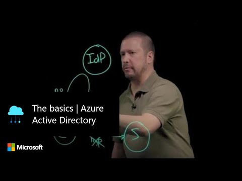 </a>
    :::column-end:::
     :::column:::
        2 - <a href="https://www.youtube.com/watch?v=tCNcG1lcCHY&list=PLLasX02E8BPD5vC2XHS_oHaMVmaeHHPLy&index=2" target="_blank">Modern authentication for web applications </a> (6:02)
    :::column-end:::
    :::column:::
        <a href="https://www.youtube.com/watch?v=tCNcG1lcCHY" target="_blank"> 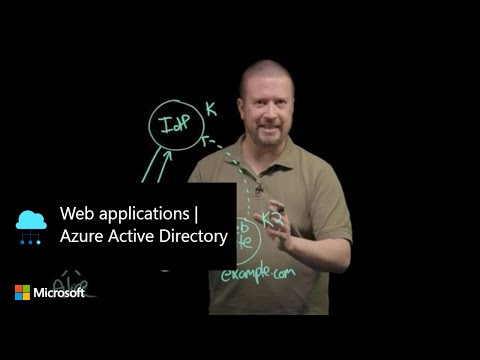 </a>
    :::column-end:::
:::row-end:::
:::row:::
    :::column:::
        3 - <a href="https://www.youtube.com/watch?v=51B-jSOBF8U&list=PLLasX02E8BPD5vC2XHS_oHaMVmaeHHPLy&index=3" target="_blank">Web single sign-on </a> (4:13)
    :::column-end:::
    :::column:::
        <a href="https://www.youtube.com/watch?v=51B-jSOBF8U" target="_blank"> 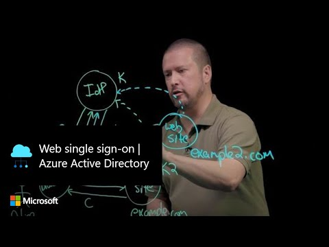 </a>
    :::column-end:::
    :::column:::
        4 - <a href="https://www.youtube.com/watch?v=CjarTgjKcX8&list=PLLasX02E8BPD5vC2XHS_oHaMVmaeHHPLy&index=4" target="_blank">Federated web authentication </a> (6:19)
    :::column-end:::
    :::column:::
        <a href="https://www.youtube.com/watch?v=CjarTgjKcX8" target="_blank"> 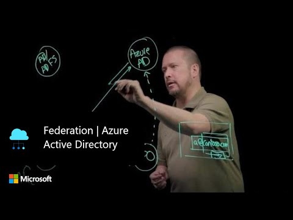 </a>
    :::column-end:::
:::row-end:::
:::row:::
    :::column:::
        5 - <a href="https://www.youtube.com/watch?v=OGMDnuDrAcQ&list=PLLasX02E8BPD5vC2XHS_oHaMVmaeHHPLy&index=5" target="_blank">Native client applications - Part 1 </a> (8:12)
    :::column-end:::
    :::column:::
        <a href="https://www.youtube.com/watch?v=OGMDnuDrAcQ" target="_blank"> 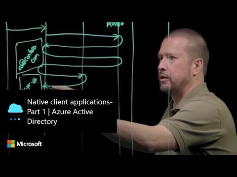 </a>
    :::column-end:::
    :::column:::
        6 - <a href="https://www.youtube.com/watch?v=2RE6IhXfmHY&list=PLLasX02E8BPD5vC2XHS_oHaMVmaeHHPLy&index=6" target="_blank">Native client applications - Part 2 </a> (5:33)
    :::column-end:::
    :::column:::
        <a href="https://www.youtube.com/watch?v=2RE6IhXfmHY" target="_blank"> 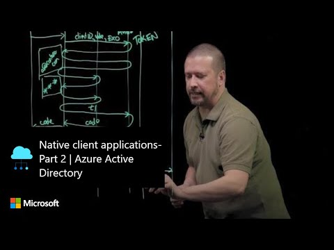 </a>
    :::column-end:::
:::row-end:::

<!-- IMAGES -->
[auth-fund-01-img]: ./media/identity-videos/aad-auth-fund-01.jpg
[auth-fund-02-img]: ./media/identity-videos/aad-auth-fund-02.jpg
[auth-fund-03-img]: ./media/identity-videos/aad-auth-fund-03.jpg
[auth-fund-04-img]: ./media/identity-videos/aad-auth-fund-04.jpg
[auth-fund-05-img]: ./media/identity-videos/aad-auth-fund-05.jpg
[auth-fund-06-img]: ./media/identity-videos/aad-auth-fund-06.jpg

<!-- VIDEOS -->
[auth-fund-01-vid]: https://www.youtube.com/watch?v=fbSVgC8nGz4&list=PLLasX02E8BPD5vC2XHS_oHaMVmaeHHPLy&index=1
[auth-fund-02-vid]: https://www.youtube.com/watch?v=tCNcG1lcCHY&list=PLLasX02E8BPD5vC2XHS_oHaMVmaeHHPLy&index=2
[auth-fund-03-vid]: https://www.youtube.com/watch?v=51B-jSOBF8U&list=PLLasX02E8BPD5vC2XHS_oHaMVmaeHHPLy&index=3
[auth-fund-04-vid]: https://www.youtube.com/watch?v=CjarTgjKcX8&list=PLLasX02E8BPD5vC2XHS_oHaMVmaeHHPLy&index=4
[auth-fund-05-vid]: https://www.youtube.com/watch?v=OGMDnuDrAcQ&list=PLLasX02E8BPD5vC2XHS_oHaMVmaeHHPLy&index=5
[auth-fund-06-vid]: https://www.youtube.com/watch?v=2RE6IhXfmHY&list=PLLasX02E8BPD5vC2XHS_oHaMVmaeHHPLy&index=6

## Microsoft identity platform basics

Learn about the components of the Microsoft identity platform, the Microsoft Authentication Libraries (MSAL), and how these components interact with Azure Active Directory. The One Dev Question videos are 1-2 minutes in length.
___

:::row:::
    :::column:::
        <a href="https://www.youtube.com/watch?v=bNlcFuIo3r8" target="_blank">Microsoft identity platform overview </a>
    :::column-end:::
    :::column:::
        <a href="https://www.youtube.com/watch?v=bNlcFuIo3r8" target="_blank"> 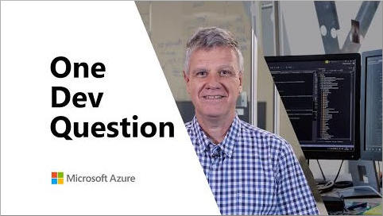 </a>
    :::column-end:::
    :::column:::
    :::column-end:::
    :::column:::
    :::column-end:::
:::row-end:::
:::row:::
    :::column:::
        <a href="https://www.youtube.com/watch?v=apbbx2n4tnU" target="_blank">Microsoft Graph and the Microsoft Authentication Library (MSAL) </a>
    :::column-end:::
    :::column:::
        <a href="https://www.youtube.com/watch?v=apbbx2n4tnU" target="_blank"> 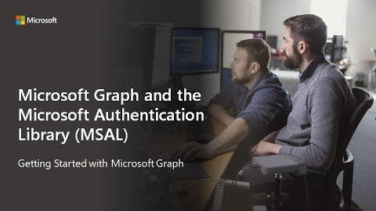 </a>
    :::column-end:::
    :::column:::
        <a href="https://www.youtube.com/watch?v=yLVEBU9Z96Q" target="_blank">What is the MSAL family of libraries? </a>
    :::column-end:::
    :::column:::
        
    :::column-end:::
:::row-end:::
:::row:::
    :::column:::
        <a href="https://www.youtube.com/watch?v=eiPHOoLmGJs" target="_blank">Scopes explained </a>
    :::column-end:::
    :::column:::
        
    :::column-end:::
    :::column:::
        <a href="https://www.youtube.com/watch?v=Zd_Uubnu0U0" target="_blank">What are brokers </a>
    :::column-end:::
    :::column:::
        
    :::column-end:::
:::row-end:::
:::row:::
    :::column:::
        <a href="https://www.youtube.com/watch?v=znSN_3JAuoU" target="_blank">What redirect URIs do </a>
    :::column-end:::
    :::column:::
        
    :::column-end:::
    :::column:::
        <a href="https://www.youtube.com/watch?v=mDhT4Zv1fZU" target="_blank">Tenants explained </a>
    :::column-end:::
    :::column:::
        
    :::column-end:::
:::row-end:::
:::row:::
    :::column:::
        <a href="https://www.youtube.com/watch?v=zDEC7A5ZS2Q" target="_blank">Role of Azure AD </a>
    :::column-end:::
    :::column:::
        
    :::column-end:::
    :::column:::
        <a href="https://www.youtube.com/watch?v=HEpq_YSmuWw" target="_blank">Role of Azure AD app objects </a>
    :::column-end:::
    :::column:::
        
    :::column-end:::
:::row-end:::
:::row:::
    :::column:::
        <a href="https://www.youtube.com/watch?v=E2OUluQQKSk" target="_blank">Organizational and personal Microsoft account differences </a>
    :::column-end:::
    :::column:::
        
    :::column-end:::
    :::column:::
        <a href="https://www.youtube.com/watch?v=ZJirt7eTVw8" target="_blank">SPA and web app differences </a>
    :::column-end:::
    :::column:::
        
    :::column-end:::
:::row-end:::

## Migrate from v1.0 to v2.0

Learn about migrating to the latest version of the Microsoft identity platform, including moving from the Active Directory Authentication Library (ADAL) to MSAL.
___

:::row:::
    :::column:::
        <a href="https://www.youtube.com/watch?v=qpdC45tZYDg" target="_blank">Why migrate from ADAL to MSAL </a>
    :::column-end:::
    :::column:::
        
    :::column-end:::
     :::column:::
        <a href="https://www.youtube.com/watch?v=xgL_z9yCnrE" target="_blank">Migrating your ADAL codebase to MSAL </a>
    :::column-end:::
    :::column:::
        
    :::column-end:::
:::row-end:::
:::row:::
    :::column:::
        <a href="https://www.youtube.com/watch?v=q-TDszj2O-4" target="_blank">Advantages of MSAL over ADAL </a>
    :::column-end:::
    :::column:::
        
    :::column-end:::
    :::column:::
        <!-- BLANK TITLE CELL -->
    :::column-end:::
    :::column:::
        <!-- BLANK VIDEO CELL -->
    :::column-end:::
:::row-end:::
