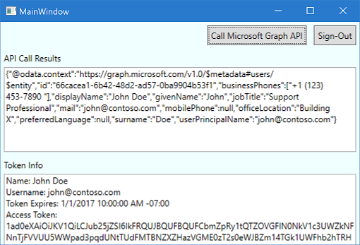

## Test your code

To run your project, in Visual Studio, select **F5**. Your application **MainWindow** is displayed, as shown here:

The first time that you run the application and select the **Call Microsoft Graph API** button, you're prompted to sign in. Use a Microsoft Entra account (work or school account) or a Microsoft account (live.com, outlook.com) to test it.

### Provide consent for application access

The first time that you sign in to your application, you're also prompted to provide consent to allow the application to access your profile and sign you in, as shown here:

### View application results

After you sign in, you should see the user profile information that's returned by the call to the Microsoft Graph API. The results are displayed in the **API Call Results** box. Basic information about the token that was acquired via the call to `AcquireTokenInteractive` or `AcquireTokenSilent` should be visible in the **Token Info** box. The results contain the following properties:

|Property  |Format  |Description |
|---------|---------|---------|
|**Username** |user@domain.com |The username that is used to identify the user.|
|**Token Expires** |DateTime |The time at which the token expires. MSAL extends the expiration date by renewing the token as necessary.|

### More information about scopes and delegated permissions

The Microsoft Graph API requires the *user.read* scope to read a user's profile. This scope is automatically added by default in every application that's registered in the Application Registration Portal. Other APIs for Microsoft Graph, as well as custom APIs for your back-end server, might require additional scopes. The Microsoft Graph API requires the *Calendars.Read* scope to list the user's calendars.

To access the user's calendars in the context of an application, add the *Calendars.Read* delegated permission to the application registration information. Then, add the *Calendars.Read* scope to the `acquireTokenSilent` call.

>[!NOTE]
>The user might be prompted for additional consents as you increase the number of scopes.

[!INCLUDE [Help and support](./error-handling-and-tips/help-support-include.md)]
