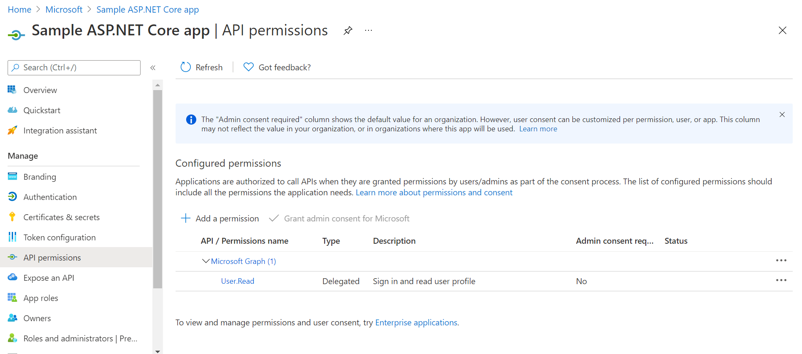
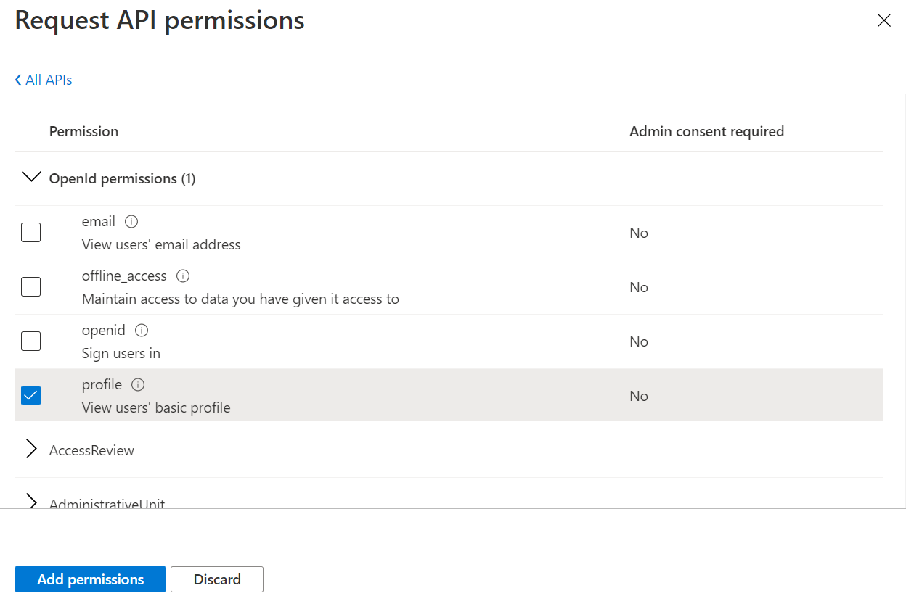

# Best practices for applying least privilege permissions for apps

The principle of least privilege is an information security concept, which enforces the idea that users should be given the minimum level of access needed to perform required tasks. This concept also extends to applications that require a set of permissions to access protected data or resources.

Least privilege adoption is more than just a good security practice. The concept helps you preserve the integrity and security of your data. It also protects the privacy of your data and reduces risks by preventing applications from having access to data any more than absolutely needed. Looked at on a broader level, the adoption of the least privilege principle is one of the ways organizations can embrace proactive security with [Zero Trust](https://www.microsoft.com/en-us/security/business/zero-trust).

This article describes a set of best practices that you can use to adopt least privileged permissions to make your applications more trustworthy and secure for end users. You'll get to understand the following aspects of least privilege:
- How consent works with permissions
- What it means to be over-privileged or least privileged
- How to approach least privilege as a developer
- Benefits of the least privilege principle

## Using consent to control permissions to resources

[Consent](../develop/application-consent-experience.md#consent-and-permissions) is becoming an important requirement in most data privacy laws across the World. Most often these laws require developers to obtain consent from end users before allowing an application to access protected data. Every time an application that runs in your user's device or a service requests some protected data, the app should ask for the user's consent for permissions before access to the protected data is granted. The end user is required to grant (or deny) consent for the requested permissions before the application can progress. As an application developer, it's best to request access permission with the least privilege.

## Behaviors of over-privileged and least privileged applications

An over-privileged application may have one of the following characteristics:
- **Unused permissions**: An application could end up with unused permissions when it fails to make API calls that utilize all the permissions granted to it. For example in [MS Graph](/graph/overview), an app might only be reading OneDrive Files (using the "*Files.Read.All*" permission) but has also been granted “*Calendar.Read.All*” permission, despite not integrating with any Calendar APIs.
- **Reducible permissions**: An app has reducible permission when the granted permission has a lesser privileged replacement that can complete the desired API call. For example, an app that is only reading User profiles, but has been granted "*User.ReadWrite.All*" might be considered over-privileged. In this case, the app should be granted "*User.Read.All*" instead, which is the least privileged permission needed to satisfy the request.

For an application to be considered as least privileged, it should have:
- **Just enough permissions**: Grant only the minimum set of permissions required by an end user of an application, service, or system to perform the tasks they've been assigned.
- **Minimum level of permission**: Use the least privileged permission to perform the required API calls to complete a desired task.

## How to approach least privilege as an organization and a developer

As a developer, enabling security starts with you. Here's how to avoid common mistakes associated with least privilege:
- **Adopt least privilege**: Encouraging developers to understand and strive to minimize their privilege sets is one of the most effective controls an organization can put in place to protect itself from misuse of privileges. Follow these steps to prevent your application from being over-privileged:
    - Fully understand the permissions required for the API calls that you need to make
    - Understand the least privileged permission for each API call that you need to make using [Graph Explorer](https://developer.microsoft.com/en-us/graph/graph-explorer)
    - Find the corresponding [permissions](/graph/permissions-reference) from least to most privileged
    - Remove any duplicate sets of permissions in cases where your app makes API calls that have overlapping permissions
    - Apply only the least privileged set of permissions to your application by choosing the least privileged permission in the permission list
- **Check and review your permissions regularly**: Cutting down excessive permissions is one of the top priorities for securing applications. Organizations often hesitate to modify existing applications as it might affect business operations, but that presents a challenge when already granted permissions are over-privileged and need to be revoked. We recommend you follow these steps to make your application stay healthy:
    - Evaluate the API calls being made from the application
    - Use [Graph Explorer](https://developer.microsoft.com/en-us/graph/graph-explorer) and the [Microsoft Graph](/graph/overview) documentation for the required and least privileged permissions
    - Audit privileges that are granted to users or applications
    - Update your application with the least privileged permission set
    - Conduct permissions review regularly to make sure all authorized permissions are still relevant

Security can be increased by the proper management of permissions, API, and role privileges. Adhering to the principle of least privilege creates a protected and traceable environment by clearly defining high-level functions and actively controlling access to important resources.

## Benefits of the least privilege principle

Least privilege isn't a blocker, but an enabler. It's important to understand the principle of least privilege to help you build trustworthy applications for your customers. Least privileged permission provides the following benefits:
- **Lower the app adoption friction**: An organization's data is protected against unauthorized access by apps and users being authenticated, identified, and authorized. Users might deny consent to a requested permission to access their data because of the app requesting excessive permissions.
- **Stop the spread**: By enforcing least privilege on permissions, attackers are unable to use excessive privileges to gain further access, making it difficult for attackers to locate more attack vectors and further compromise more resources.

## Next steps

- For more information on consent and permissions in Azure Active Directory, see [Understanding Azure AD application consent experiences](../develop/application-consent-experience.md).
- For more information on permissions and consent in Microsoft identity, see [Permissions and consent in the Microsoft identity platform](../develop/v2-permissions-and-consent.md).
- For more information on Zero Trust, see [Zero Trust Deployment Center](/security/zero-trust/)
