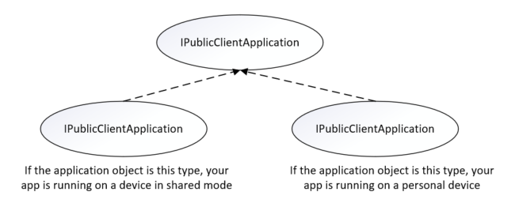
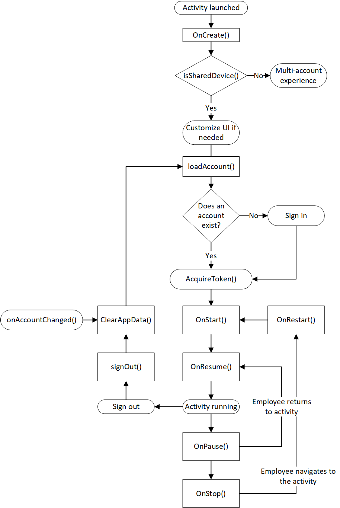

# Shared device mode for Android devices

> [!NOTE]
> This feature is in public preview.
> This preview version is provided without a service level agreement, and it's not recommended for production workloads. Certain features might not be supported or might have constrained capabilities.
> For more information, see [Supplemental Terms of Use for Microsoft Azure Previews](https://azure.microsoft.com/support/legal/preview-supplemental-terms/).

Firstline Workers such as retail associates, flight crew members, and field service workers often use a shared mobile device to do their work. That becomes problematic when they start sharing passwords or pin numbers to access customer and business data on the shared device.

Shared device mode allows you to configure an Android device so that it can be easily shared by multiple employees. Employees can sign in and access customer information quickly. When they are finished with their shift or task, they can sign out of the device and it will be immediately ready for the next employee to use.

Shared device mode also provides Microsoft identity backed management of the device.

To create a shared device mode app, developers and cloud device admins work together:

- Developers write a single-account app (multiple-account apps are not supported in shared device mode), add `"shared_device_mode_supported": true` to the app's configuration, and write code to handle things like shared device sign-out.
- Device admins prepare the device to be shared by installing the authenticator app, and setting the device to shared mode using the authenticator app. Only users who are in the [Cloud Device Administrator](../users-groups-roles/directory-assign-admin-roles.md#cloud-device-administrator-permissions) role can put a device into shared mode by using the [Authenticator app](../user-help/user-help-auth-app-overview.md). You can configure the membership of your organizational roles in the Azure portal via:
**Azure Active Directory** > **Roles and Administrators** > **Cloud Device Administrator**.

 This article focuses primarily what developers should think about.

## Single vs multiple-account applications

Applications written using the Microsoft Authentication Library SDK (MSAL) can manage a single account or multiple accounts. For details, see [single-account mode or multiple-account mode](single-multi-account.md). Microsoft identity platform features available to your app vary depending on whether the application is running in single-account mode or multiple-account mode.

**Shared device mode apps only work in single-account mode**.

> [!IMPORTANT]
> Applications that only support multiple-account mode can't run on a shared device. If an employee loads an app that doesn't support single-account mode, it won't run on the shared device.
>
> Apps written before the MSAL SDK was released run in multiple-account mode and must be updated to support single-account mode before they can run on a shared mode device.

**Supporting both single-account and multiple-accounts**

Your app can be built to support running on both personal devices and shared devices. If your app currently supports multiple accounts and you want to support shared device mode, add support for single account mode.

You may also want your app to change its behavior depending on the type of device it is running on. Use `ISingleAccountPublicClientApplication.isSharedDevice()` to determine when to run in single-account mode.

There are two different interfaces that represent the type of device your application is on. When you request an application instance from MSAL's application factory, the correct  application object is provided automatically.

The following object model illustrates the type of object you may receive and what it means in the context of a shared device:



You'll need to do a type check and cast to the appropriate interface when you get your `PublicClientApplication` object. The following code checks for multiple account mode or single account mode, and casts the application object appropriately:

```java
private IPublicClientApplication mApplication;

        // Running in personal-device mode?
        if (mApplication instanceOf IMultipleAccountPublicClientApplication) {
          IMultipleAccountPublicClientApplication multipleAccountApplication = (IMultipleAccountPublicClientApplication) mApplication;
          ...
        // Running in shared-device mode?
        } else if (mApplication instanceOf ISingleAccountPublicClientApplication) {
           ISingleAccountPublicClientApplication singleAccountApplication = (ISingleAccountPublicClientApplication) mApplication;
            ...
        }
```

The following differences apply depending on whether your app is running on a shared or personal device:

|  | Shared mode device  | Personal device |
|---------|---------|---------|
| **Accounts**     | Single account | Multiple accounts |
| **Sign-in** | Global | Global |
| **Sign-out** | Global | Each application can control if the sign-out is local to the app or for the family of applications. |
| **Supported account types** | Work accounts only | Personal and work accounts supported  |

## Why you may want to only support single-account mode

If you're writing an app that will only be used for firstline workers using a shared device, we recommend that you write your application to only support single-account mode. This includes most applications that are task focused such as medical records apps, invoice apps, and most line-of-business apps. Only supporting single-account mode simplifies development because you won't need to implement the additional features that are part of multiple-account apps.

## What happens when the device mode changes

If your application is running in multiple-account mode, and an administrator puts the device in shared device mode, all of the accounts on the device are cleared from the application and the application transitions to single-account mode.

## Shared device sign-out and the overall app lifecycle

When a user signs out, you'll need to take action to protect the privacy and data of the user. For example, if you're building a medical records app you'll want to make sure that when the user signs out previously displayed patient records are cleared. Your application must be prepared for this and check every time it enters the foreground.

When your app uses MSAL to sign out the user in an app running on device that is in shared mode, the signed-in account and cached tokens are removed from both the app and the device.

The following diagram shows the overall app lifecycle and common events that may occur while your app runs. The diagram covers from the time an activity launches, signing in and signing out an account, and how events such as pausing, resuming, and stopping the activity fit in.



## Next steps

Try the [Use shared-device mode in your Android application](tutorial-v2-shared-device-mode.md) tutorial that shows how to run a firstline worker app on a shared mode Android device.
