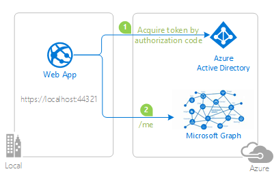
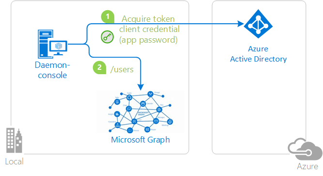
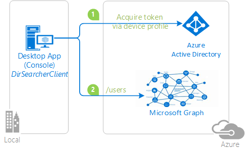
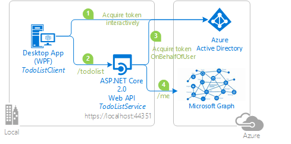
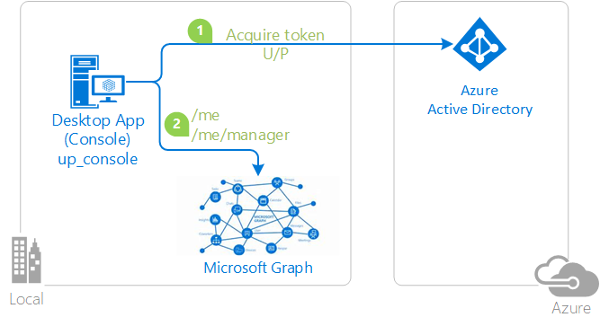
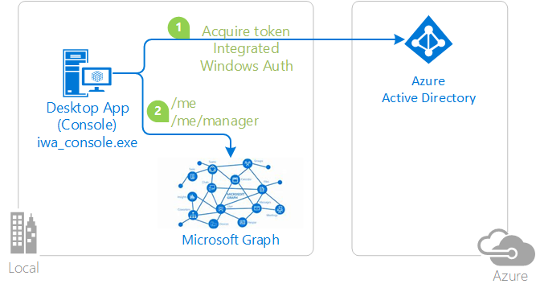

# Authentication flow support in MSAL

The Microsoft Authentication Library (MSAL) supports several authorization grants and associated token flows for use by different application types and scenarios.

| Authentication flow                                                               | Enables                                                                                                                                                                                          | Supported application types                                                                                                                                                                             |
|-----------------------------------------------------------------------------------|--------------------------------------------------------------------------------------------------------------------------------------------------------------------------------------------------|---------------------------------------------------------------------------------------------------------------------------------------------------------------------------------------------------------|
| [Authorization code](#authorization-code)                                         | User sign-in and access to web APIs on behalf of the user.                                                                                                                                       | [Desktop](scenario-desktop-overview.md)   [Mobile](scenario-mobile-overview.md)   [Single-page app (SPA)](scenario-spa-overview.md) (requires PKCE)   [Web](scenario-web-app-call-api-overview.md) |
| [Client credentials](#client-credentials)                                         | Access to web APIs by using the identity of the application itself. Typically used for server-to-server communication and automated scripts requiring no user interaction.                       | [Daemon](scenario-daemon-overview.md)                                                                                                                                                                   |
| [Device code](#device-code)                                                       | User sign-in and access to web APIs on behalf of the user on input-constrained devices like smart TVs and IoT devices. Also used by command line interface (CLI) applications.                   | [Desktop, Mobile](scenario-desktop-acquire-token-device-code-flow.md)                                                                                                                                   |
| [Implicit grant](#implicit-grant)                                                 | User sign-in and access to web APIs on behalf of the user. _The implicit grant flow is no longer recommended - use authorization code with PKCE instead._                                        | * [Single-page app (SPA)](scenario-spa-overview.md)   * [Web](scenario-web-app-call-api-overview.md)                                                                                                 |
| [On-behalf-of (OBO)](#on-behalf-of-obo)                                           | Access from an "upstream" web API to a "downstream" web API on behalf of the user. The user's identity and delegated permissions are passed through to the downstream API from the upstream API. | [Web API](scenario-web-api-call-api-overview.md)                                                                                                                                                        |
| [Username/password (ROPC)](#usernamepassword-ropc)                                | Allows an application to sign in the user by directly handling their password. _The ROPC flow is NOT recommended._                                                                                                | [Desktop, Mobile](scenario-desktop-acquire-token-username-password.md)                                                                                                                                  |
| [Integrated Windows authentication (IWA)](#integrated-windows-authentication-iwa) | Allows applications on domain or Microsoft Entra joined computers to acquire a token silently (without any UI interaction from the user).                                      | [Desktop, Mobile](scenario-desktop-acquire-token-integrated-windows-authentication.md)                                                                                                                  |

## Tokens

Your application can use one or more authentication flows. Each flow uses certain token types for authentication, authorization, and token refresh, and some also use an authorization code.

| Authentication flow or action                                                      | Requires           | ID token | Access token | Refresh token | Authorization code |
|------------------------------------------------------------------------------------|:------------------:|:--------:|:------------:|:-------------:|:------------------:|
| [Authorization code flow](v2-oauth2-auth-code-flow.md)                             |                    | x        | x            | x             | x                  |
| [Client credentials](v2-oauth2-client-creds-grant-flow.md)                         |                    |          | x (app-only) |               |                    |
| [Device code flow](v2-oauth2-device-code.md)                                       |                    | x        | x            | x             |                    |
| [Implicit flow](v2-oauth2-implicit-grant-flow.md)                                  |                    | x        | x            |               |                    |
| [On-behalf-of flow](v2-oauth2-on-behalf-of-flow.md)                                | access token       | x        | x            | x             |                    |
| [Username/password](v2-oauth-ropc.md) (ROPC)                                       | username, password | x        | x            | x             |                    |
| [Hybrid OIDC flow](v2-protocols-oidc.md#protocol-diagram-access-token-acquisition) |                    | x        |              |               | x                  |
| [Refresh token redemption](v2-oauth2-auth-code-flow.md#refresh-the-access-token)   | refresh token      | x        | x            | x             |                    |

### Interactive and non-interactive authentication

Several of these flows support both interactive and non-interactive token acquisition.

- **Interactive** - The user may be prompted for input by the authorization server. For example, to sign in, perform multi-factor authentication (MFA), or to grant consent to more resource access permissions.
- **Non-interactive** - The user may _not_ be prompted for input. Also called "silent" token acquisition, the application tries to get a token by using a method in which the authorization server _may not_ prompt the user for input.

Your MSAL-based application should first try to acquire a token silently and fall back to the interactive method only if the non-interactive attempt fails. For more information about this pattern, see [Acquire and cache tokens using the Microsoft Authentication Library (MSAL)](msal-acquire-cache-tokens.md).

## Authorization code

The [OAuth 2.0 authorization code grant](v2-oauth2-auth-code-flow.md) can be used by web apps, single-page apps (SPA), and native (mobile and desktop) apps to gain access to protected resources like web APIs.

When users sign in to web applications, the application receives an authorization code that it can redeem for an access token to call web APIs. 

In the following diagram, the application:

1. Requests an authorization code which was redeemed for an access token.
2. Uses the access token to call a web API, Microsoft Graph.

### Constraints for authorization code

- Single-page applications require *Proof Key for Code Exchange* (PKCE) when using the authorization code grant flow. PKCE is supported by MSAL.

- The OAuth 2.0 specification requires you to use an authorization code to redeem an access token only _once_.

    If you attempt to acquire access token multiple times with the same authorization code, an error similar to the following is returned by the Microsoft identity platform. Some libraries and frameworks request the authorization code for you automatically, and requesting a code manually in such cases will also result in this error.

    `AADSTS70002: Error validating credentials. AADSTS54005: OAuth2 Authorization code was already redeemed, please retry with a new valid code or use an existing refresh token.`

## Client credentials

The [OAuth 2 client credentials flow](v2-oauth2-client-creds-grant-flow.md) allows you to access web-hosted resources by using the identity of an application. This type of grant is commonly used for server-to-server interactions that must run in the background, without immediate interaction with a user. These types of applications are often referred to as daemons or service accounts.

The client credentials grant flow permits a web service (a confidential client) to use its own credentials, instead of impersonating a user, to authenticate when calling another web service. In this scenario, the client is typically a middle-tier web service, a daemon service, or a website. For a higher level of assurance, the Microsoft identity platform also allows the calling service to use a certificate (instead of a shared secret) as a credential.

### Application secrets

In the following diagram, the application:

1. Acquires a token by using application secret or password credentials.
2. Uses the token to make requests of the resource.

### Certificates

In the following diagram, the application:

1. Acquires a token by using certificate credentials.
2. Uses the token to make requests of the resource.

These client credentials need to be:

- Registered with Microsoft Entra ID.
- Passed in when constructing the confidential client application object in your code.

### Constraints for client credentials

The confidential client flow is **unsupported** on mobile platforms like Android, iOS, or UWP. Mobile applications are considered public client applications that are incapable of guaranteeing the confidentiality of their credentials.

## Device code

The [OAuth 2 device code flow](v2-oauth2-device-code.md) allows users to sign in to input-constrained devices like smart TVs, IoT devices, and printers. Interactive authentication with Microsoft Entra ID requires a web browser. Where the device or operating system doesn't provide a web browser, the device code flow allows the user use another device like a computer or mobile phone to sign in interactively.

By using the device code flow, the application obtains tokens through a two-step process designed for these devices and operating systems. Examples of such applications include those running on IoT devices and command-line interface (CLI) tools.

In the following diagram:

1. Whenever user authentication is required, the app provides a code and asks the user to use another device like an internet-connected smartphone to visit a URL (for example, `https://microsoft.com/devicelogin`). The user is then prompted to enter the code, and proceeding through a normal authentication experience including consent prompts and [multi-factor authentication](../authentication/concept-mfa-howitworks.md), if necessary.
1. Upon successful authentication, the command-line app receives the required tokens through a back channel, and uses them to perform the web API calls it needs.

### Constraints for device code

- The device code flow is available only for public client applications.
- When you initialize a public client application in MSAL, use one of these authority formats:
  - Tenant: `https://login.microsoftonline.com/{tenant}/,` where `{tenant}` is either the GUID representing the tenant ID or a domain name associated with the tenant.
  - Work and school accounts: `https://login.microsoftonline.com/organizations/`.

## Implicit grant

The implicit grant has been replaced by the [authorization code flow with PKCE](scenario-spa-overview.md) as the preferred and more secure token grant flow for client-side single page-applications (SPAs). If you're building a SPA, use the authorization code flow with PKCE instead.

Single-page web apps written in JavaScript (including frameworks like Angular, Vue.js, or React.js) are downloaded from the server and their code runs directly in the browser. Because their client-side code runs in the browser and not on a web server, they have different security characteristics than traditional server-side web applications. Prior to the availability of Proof Key for Code Exchange (PKCE) for the authorization code flow, the implicit grant flow was used by SPAs for improved responsiveness and efficiency in getting access tokens.

The [OAuth 2 implicit grant flow](v2-oauth2-implicit-grant-flow.md) allows the app to get access tokens from the Microsoft identity platform without performing a back-end server credential exchange. The implicit grant flow allows an app to sign in the user, maintain a session, and get tokens for other web APIs from within the JavaScript code downloaded and run by the user-agent (typically a web browser).

### Constraints for implicit grant

The implicit grant flow doesn't include application scenarios that use cross-platform JavaScript frameworks like Electron or React Native. Cross-platform frameworks like these require further capabilities for interaction with the native desktop and mobile platforms on which they run.

Tokens issued via the implicit flow mode have a **length limitation** because they're returned to the browser by URL (where `response_mode` is either `query` or `fragment`). Some browsers limit the length of the URL in the browser bar and fail when it's too long. Thus, these implicit flow tokens don't contain `groups` or `wids` claims.

## On-behalf-of (OBO)

The [OAuth 2 on-behalf-of authentication flow](v2-oauth2-on-behalf-of-flow.md) flow is used when an application invokes a service or web API that in turn needs to call another service or web API. The idea is to propagate the delegated user identity and permissions through the request chain. For the middle-tier service to make authenticated requests to the downstream service, it needs to secure an access token from the Microsoft identity platform *on behalf of* the user.

In the following diagram:

1. The application acquires an access token for the web API.
2. A client (web, desktop, mobile, or single-page application) calls a protected web API, adding the access token as a bearer token in the authentication header of the HTTP request. The web API authenticates the user.
3. When the client calls the web API, the web API requests another token on-behalf-of the user.
4. The protected web API uses this token to call a downstream web API on-behalf-of the user. The web API can also later request tokens for other downstream APIs (but still on behalf of the same user).

## Username/password (ROPC)

> [!WARNING]
> The resource owner password credentials (ROPC) flow is NOT recommended. ROPC requires a high degree of trust and credential exposure. _Resort to using ROPC only if a more secure flow can't be used._ For more information, see [What's the solution to the growing problem of passwords?](https://news.microsoft.com/features/whats-solution-growing-problem-passwords-says-microsoft/).

The [OAuth 2 resource owner password credentials](v2-oauth-ropc.md) (ROPC) grant allows an application to sign in the user by directly handling their password. In your desktop application, you can use the username/password flow to acquire a token silently. No UI is required when using the application.

Some application scenarios like DevOps might find ROPC useful, but you should avoid it in any application in which you provide an interactive UI for user sign-in.

In the following diagram, the application:

1. Acquires a token by sending the username and password to the identity provider.
2. Calls a web API by using the token.

To acquire a token silently on Windows domain-joined machines, we recommend [integrated Windows authentication (IWA)](#integrated-windows-authentication-iwa) instead of ROPC. For other scenarios, use the [device code flow](#device-code).

### Constraints for ROPC

The following constraints apply to the applications using the ROPC flow:

- Single sign-on is **unsupported**.
- Multi-factor authentication (MFA) is **unsupported**.
  - Check with your tenant admin before using this flow - MFA is a commonly used feature.
- Conditional Access is **unsupported**.
- ROPC works _only_ for work and school accounts.
- Personal Microsoft accounts (MSA) are **unsupported** by ROPC.
- ROPC is **supported** in .NET desktop and .NET Core applications.
- ROPC is **unsupported** in Universal Windows Platform (UWP) applications.
- ROPC in Azure AD B2C is supported _only_ for local accounts.
  - For information about ROPC in MSAL.NET and Azure AD B2C, see [Using ROPC with Azure AD B2C](./msal-net-b2c-considerations.md#resource-owner-password-credentials-ropc).

## Integrated Windows authentication (IWA)

MSAL supports integrated Windows authentication (IWA) for desktop and mobile applications that run on domain-joined or Microsoft Entra joined Windows computers. By using IWA, these applications acquire a token silently without requiring UI interaction by user.

In the following diagram, the application:

1. Acquires a token by using integrated Windows authentication.
2. Uses the token to make requests of the resource.

### Constraints for IWA

**Compatibility**

Integrated Windows authentication (IWA) is enabled for .NET desktop, .NET Core, and Windows Universal Platform apps.

IWA supports AD FS-federated users *only* - users created in Active Directory and backed by Microsoft Entra ID. Users created directly in Microsoft Entra ID without Active Directory backing (managed users) can't use this authentication flow.

**Multi-factor authentication (MFA)**

IWA's non-interactive (silent) authentication can fail if MFA is enabled in the Microsoft Entra tenant and an MFA challenge is issued by Microsoft Entra ID. If IWA fails, you should fall back to an [interactive method of authentication](#interactive-and-non-interactive-authentication) as described earlier.

Microsoft Entra ID uses AI to determine when two-factor authentication is required. Two-factor authentication is typically required when a user signs in from a different country/region, when connected to a corporate network without using a VPN, and sometimes when they _are_ connected through a VPN. Because MFA's configuration and challenge frequency may be outside of your control as the developer, your application should gracefully handle a failure of IWA's silent token acquisition.

**Authority URI restrictions**

The authority passed in when constructing the public client application must be one of:

- `https://login.microsoftonline.com/{tenant}/` - This authority indicates a single-tenant application whose sign-in audience is restricted to the users in the specified Microsoft Entra tenant. The `{tenant}` value can be the tenant ID in GUID form or the domain name associated with the tenant.
- `https://login.microsoftonline.com/organizations/` - This authority indicates a multi-tenant application whose sign-in audience is users in any Microsoft Entra tenant.

Authority values must NOT contain `/common` or `/consumers` because personal Microsoft accounts (MSA) are unsupported by IWA.

**Consent requirements**

Because IWA is a silent flow:

- The user of your application must have previously consented to use the application.

    _OR_

- The tenant admin must have previously consented to all users in the tenant to use the application.

To satisfy either requirement, one of these operations must have been completed:

- You as the application developer have selected **Grant** in the Azure portal for yourself.
- A tenant admin has selected **Grant/revoke admin consent for {tenant domain}** in the **API permissions** tab of the app registration in the Azure portal; see [Add permissions to access your web API](quickstart-configure-app-access-web-apis.md#add-permissions-to-access-your-web-api).
- You've provided a way for users to consent to the application; see [User consent](../manage-apps/user-admin-consent-overview.md#user-consent).
- You've provided a way for the tenant admin to consent for the application; see [Administrator consent](../manage-apps/user-admin-consent-overview.md#admin-consent).

For more information on consent, see [Permissions and consent](./permissions-consent-overview.md#consent).

## Next steps

Now that you've reviewed the authentication flows supported by MSAL, learn about acquiring and caching the tokens used in these flows:

[Acquire and cache tokens using the Microsoft Authentication Library (MSAL)](msal-acquire-cache-tokens.md)
