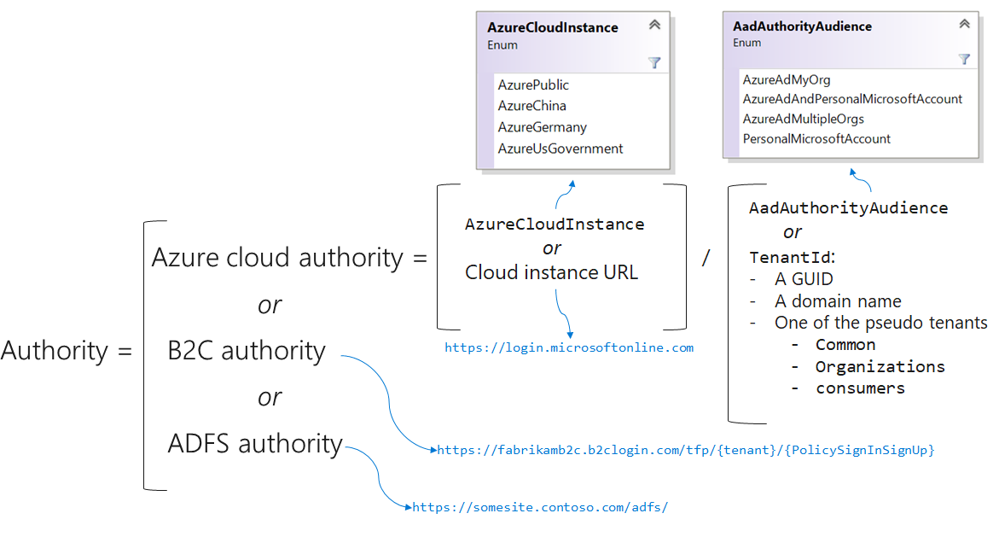
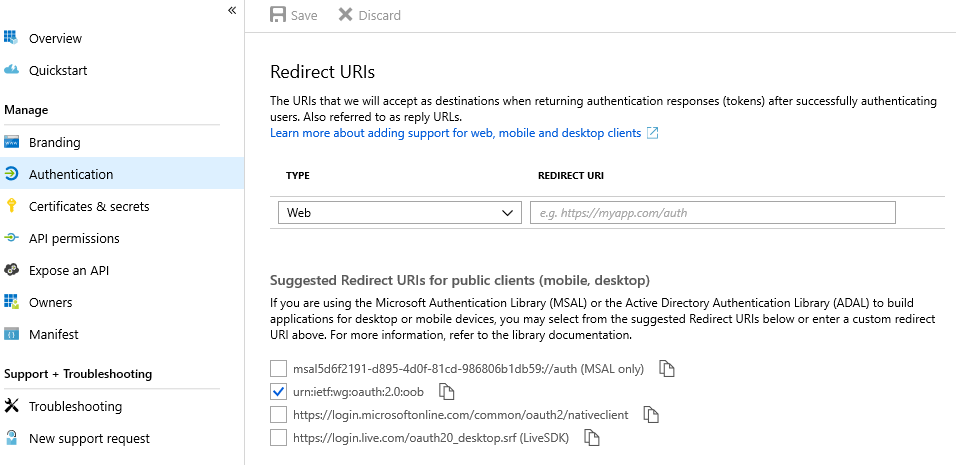

# Application configuration options

To authenticate and acquire tokens, you initialize a new public or confidential client application in your code. You can set several configuration options when you initialize the client app in the Microsoft Authentication Library (MSAL). These options fall into two groups:

- Registration options, including:
  - [Authority](#authority) (composed of the identity provider [instance](#cloud-instance) and sign-in [audience](#application-audience) for the app, and possibly the tenant ID)
  - [Client ID](#client-id)
  - [Redirect URI](#redirect-uri)
  - [Client secret](#client-secret) (for confidential client applications)
- [Logging options](#logging), including log level, control of personal data, and the name of the component using the library

## Authority

The authority is a URL that indicates a directory that MSAL can request tokens from.

Common authorities are:

| Common authority URLs                              | When to use                                                                                                                                                               |
| -------------------------------------------------- | ------------------------------------------------------------------------------------------------------------------------------------------------------------------------- |
| `https://login.microsoftonline.com/<tenant>/`      | Sign in users of a specific organization only. The `<tenant>` in the URL is the tenant ID of the Azure Active Directory (Azure AD) tenant (a GUID), or its tenant domain. |
| `https://login.microsoftonline.com/common/`        | Sign in users with work and school accounts or personal Microsoft accounts.                                                                                               |
| `https://login.microsoftonline.com/organizations/` | Sign in users with work and school accounts.                                                                                                                              |
| `https://login.microsoftonline.com/consumers/`     | Sign in users with personal Microsoft accounts (MSA) only.                                                                                                                |

The authority you specify in your code needs to be consistent with the **Supported account types** you specified for the app in **App registrations** in the Azure portal.

The authority can be:

- An Azure AD cloud authority.
- An Azure AD B2C authority. See [B2C specifics](https://github.com/AzureAD/microsoft-authentication-library-for-dotnet/wiki/AAD-B2C-specifics).
- An Active Directory Federation Services (AD FS) authority. See [AD FS support](https://aka.ms/msal-net-adfs-support).

Azure AD cloud authorities have two parts:

- The identity provider _instance_
- The sign-in _audience_ for the app

The instance and audience can be concatenated and provided as the authority URL. This diagram shows how the authority URL is composed:

## Cloud instance

The _instance_ is used to specify if your app is signing users from the Azure public cloud or from national clouds. Using MSAL in your code, you can set the Azure cloud instance by using an enumeration or by passing the URL to the [national cloud instance](authentication-national-cloud.md#azure-ad-authentication-endpoints) as the `Instance` member.

MSAL.NET will throw an explicit exception if both `Instance` and `AzureCloudInstance` are specified.

If you don't specify an instance, your app will target the Azure public cloud instance (the instance of URL `https://login.onmicrosoftonline.com`).

## Application audience

The sign-in audience depends on the business needs for your app:

- If you're a line of business (LOB) developer, you'll probably produce a single-tenant application that will be used only in your organization. In that case, specify the organization by its tenant ID (the ID of your Azure AD instance) or by a domain name associated with the Azure AD instance.
- If you're an ISV, you might want to sign in users with their work and school accounts in any organization or in some organizations (multitenant app). But you might also want to have users sign in with their personal Microsoft accounts.

### How to specify the audience in your code/configuration

Using MSAL in your code, you specify the audience by using one of the following values:

- The Azure AD authority audience enumeration
- The tenant ID, which can be:
  - A GUID (the ID of your Azure AD instance), for single-tenant applications
  - A domain name associated with your Azure AD instance (also for single-tenant applications)
- One of these placeholders as a tenant ID in place of the Azure AD authority audience enumeration:
  - `organizations` for a multitenant application
  - `consumers` to sign in users only with their personal accounts
  - `common` to sign in users with their work and school accounts or their personal Microsoft accounts

MSAL will throw a meaningful exception if you specify both the Azure AD authority audience and the tenant ID.

It is recommended to specify an audience, as many tenants, and the applications deployed in them will have guest users. If your application will have external users, the endpoints of `common` and `organization` are best avoided. If you don't specify an audience, your app will target Azure AD and personal Microsoft accounts as an audience and will behave as though `common` were specified.

### Effective audience

The effective audience for your application will be the minimum (if there's an intersection) of the audience you set in your app and the audience that's specified in the app registration. In fact, the [App registrations](https://aka.ms/appregistrations) experience lets you specify the audience (the supported account types) for the app. For more information, see [Quickstart: Register an application with the Microsoft identity platform](quickstart-register-app.md).

Currently, the only way to get an app to sign in users with only personal Microsoft accounts is to configure both of these settings:

- Set the app registration audience to `Work and school accounts and personal accounts`.
- Set the audience in your code/configuration to `AadAuthorityAudience.PersonalMicrosoftAccount` (or `TenantID` ="consumers").

## Client ID

The client ID is the unique **Application (client) ID** assigned to your app by Azure AD when the app was registered. You can find the **Application (Client) ID** in your Azure subscription by Azure AD => Enterprise applications => Application ID.

## Redirect URI

The redirect URI is the URI the identity provider will send the security tokens back to.

### Redirect URI for public client apps

If you're a public client app developer who's using MSAL:

- You'd want to use `.WithDefaultRedirectUri()` in desktop or Universal Windows Platform (UWP) applications (MSAL.NET 4.1+). The `.WithDefaultRedirectUri()` method will set the public client application's redirect URI property to the default recommended redirect URI for public client applications.

  | Platform              | Redirect URI                                                                                                                                                                                                                                           |
  | --------------------- | ------------------------------------------------------------------------------------------------------------------------------------------------------------------------------------------------------------------------------------------------------ |
  | Desktop app (.NET FW) | `https://login.microsoftonline.com/common/oauth2/nativeclient`                                                                                                                                                                                         |
  | UWP                   | value of `WebAuthenticationBroker.GetCurrentApplicationCallbackUri()`. This enables single sign-on (SSO) with the browser by setting the value to the result of WebAuthenticationBroker.GetCurrentApplicationCallbackUri(), which you need to register |
  | .NET Core             | `https://localhost` enables the user to use the system browser for interactive authentication since .NET Core doesn't have a UI for the embedded web view at the moment.                                                                               |

- You don't need to add a redirect URI if you're building a Xamarin Android and iOS application that doesn't support the broker redirect URI. It's automatically set to `msal{ClientId}://auth` for Xamarin Android and iOS.

- Configure the redirect URI in [App registrations](https://aka.ms/appregistrations):

  

You can override the redirect URI by using the `RedirectUri` property (for example, if you use brokers). Here are some examples of redirect URIs for that scenario:

- `RedirectUriOnAndroid` = "msauth-5a434691-ccb2-4fd1-b97b-b64bcfbc03fc://com.microsoft.identity.client.sample";
- `RedirectUriOnIos` = $"msauth.{Bundle.ID}://auth";

For more iOS details, see [Migrate iOS applications that use Microsoft Authenticator from ADAL.NET to MSAL.NET](msal-net-migration-ios-broker.md) and [Leveraging the broker on iOS](https://github.com/AzureAD/microsoft-authentication-library-for-dotnet/wiki/Leveraging-the-broker-on-iOS).
For more Android details, see [Brokered auth in Android](msal-android-single-sign-on.md).

### Redirect URI for confidential client apps

For web apps, the redirect URI (or reply URL) is the URI that Azure AD will use to send the token back to the application. The URI can be the URL of the web app/web API if the confidential app is one of them. The redirect URI needs to be registered in app registration. The registration is especially important when you deploy an app that you've initially tested locally. You then need to add the reply URL of the deployed app in the application registration portal.

For daemon apps, you don't need to specify a redirect URI.

## Client secret

This option specifies the client secret for the confidential client app. The client secret (app password) is provided by the application registration portal or provided to Azure AD during app registration with PowerShell AzureAD, PowerShell AzureRM, or Azure CLI.

## Logging

To help in debugging and authentication failure troubleshooting scenarios, the MSAL provides built-in logging support. Logging in each library is covered in the following articles:

:::row:::
    :::column:::
        - [Logging in MSAL.NET](msal-logging-dotnet.md)
        - [Logging in MSAL for Android](msal-logging-android.md)
        - [Logging in MSAL.js](msal-logging-js.md)
    :::column-end:::
    :::column:::
        - [Logging in MSAL for iOS/macOS](msal-logging-ios.md)
        - [Logging in MSAL for Java](msal-logging-java.md)
        - [Logging in MSAL for Python](msal-logging-python.md)
    :::column-end:::
:::row-end:::

## Next steps

Learn about [instantiating client applications by using MSAL.NET](msal-net-initializing-client-applications.md) and [instantiating client applications by using MSAL.js](msal-js-initializing-client-applications.md).
