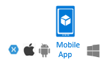

# Public client and confidential client applications
Microsoft Authentication Library (MSAL) defines two types of clients: public clients and confidential clients. The two client types are distinguished by their ability to authenticate securely with the authorization server and maintain the confidentiality of their client credentials. In contrast, Azure AD Authentication Library (ADAL) uses what's called *authentication context* (which is a connection to Azure AD).

- **Confidential client applications** are apps that run on servers (web apps, Web API apps, or even service/daemon apps). They're considered difficult to access, and for that reason capable of keeping an application secret. Confidential clients can hold configuration-time secrets. Each instance of the client has a distinct configuration (including client ID and client secret). These values are difficult for end users to extract. A web app is the most common confidential client. The client ID is exposed through the web browser, but the secret is passed only in the back channel and never directly exposed.

    Confidential client apps:  
      

- **Public client applications** are apps that run on devices or desktop computers or in a web browser. They're not trusted to safely keep application secrets, so they only access Web APIs on behalf of the user. (They support only public client flows.) Public clients can't hold configuration-time secrets, so they don't have client secrets.

    Public client apps:  
      

> [!NOTE]
> In MSAL.js, there is no separation of public and confidential client apps.  MSAL.js represents client apps as user agent-based apps, public clients in which the client code is executed in a user agent like a web browser. These clients don't store secrets because the browser context is openly accessible.

## Comparing the client types
Here are some similarities and differences between public client and confidential client apps:

- Both kinds of app maintain a user token cache and can acquire a token silently (when the token is already in the token cache). Confidential client apps also have an app token cache for tokens that are for the app itself.
- Both types of app manage user accounts and can get an account from the user token cache, get an account from its identifier, or remove an account.
- Public client apps have four ways to acquire a token (four authentication flows). Confidential client apps have three ways to acquire a token (and one way to compute the URL of the identity provider authorize endpoint). For more information, see [Acquiring tokens](msal-acquire-cache-tokens.md).

If you've used ADAL, you might notice that, unlike ADAL's authentication context, in MSAL the client ID (also called the *application ID* or *app ID*) is passed once at the construction of the application. It doesn't need to be passed again when the app acquires a token. This is true for both for public and confidential client apps. Constructors of confidential client apps are also passed client credentials: the secret they share with the identity provider.

## Next steps
Learn about:
- [Client application configuration options](msal-client-application-configuration.md)
- [Instantiating client applications by using MSAL.NET](msal-net-initializing-client-applications.md)
- [Instantiating client applications by using MSAL.js](msal-js-initializing-client-applications.md)
